# 老一套

## 1. 编译篇

### 1.1. 编译阶段做什么？链接阶段做什么？

编译过程：将预处理完的文件进行一系列词法分析、语法分析、语义分析及优化后，生成相应的汇编代码文件。

汇编过程：将汇编代码转变成机器可以执行的指令。

经过 `预处理`、`编译`、`汇编`三个过程（一起叫做**编译阶段**），C源代码文件才生了**目标文件**。

**链接阶段**：把各个模块之间的相互引用的部分都处理好，使得各个模块之间能够正确地衔接起来形成可执行文件。这个过程主要包括：**地址和空间分配、符号决议、重定位**。

### 1.2. 动态链接和静态链接的区别

静态链接：**生成可执行文件之前就完成了所有链接；可执行文件大；空间浪费（存在多个副本）；更新困难；**

动态链接：**程序执行才进行链接；可执行文件小；节约内存（共享一个副本）；牺牲少部分性能；只需更新库即可；**

动态链接出现的原因就是为了解决静态链接的两个问题：空间浪费、更新困难。

### 1.3. 目标文件中有什么？

可执行文件、目标文件、链接库，他们使用对应的格式存储：

- Windows下 PE（Portable Executable）
- Linux下 ELF（Executable Linkable Format）

以ELF格式为例，目标文件里面内容：

- ELF Header
- 代码段（.text）
- 数据段（.data）：存放**已经初始化**的全局变量和局部静态变量。
- 只读数据段（.rodata）：比如常量。
- bss段（.bss）：存放**未初始化**的全局变量和局部静态变量。
- 其他段：.init、.debug、.comment、.symtab等
- 段表（Section Header Table）：描述所有段的信息：段名、段长度、偏移、读写权限、其他属性。

## 2. 操作系统篇

### 2.1. malloc原理

glibc中实现：

- size小于 128 KB，则通过 brk() 申请内存；（free时，先缓存在 malloc 的内存池）
- size大于 128 KB，则通过 mmap() 申请内存；（free时，归还给操作系统）

为什么要这么设计？

- brk直接在堆上分配内存，调整brk指针即可，实现简单。但容易形成碎片，需要等待高地址内存释放了才能释放。借助内存池的使用可以减少缺页中断，大大降低CPU消耗。
- mmap在进程内存映射段找一段空闲的虚拟内存，第一次使用产生缺页中断，CPU消耗大。

【为什么free知道释放多大的内存？】

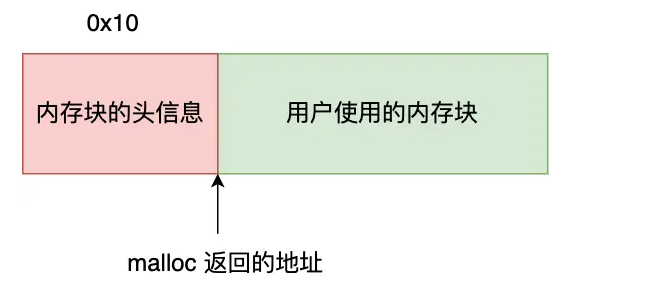

### 2.2. fork和vfork区别

- **fork()**：
	- 子进程拷贝父进程的物理页表；（**写时拷贝**（copy-on-write））
	- 父子进程执行次序不确定；
- **vfork()**：
	- 子进程与父进程共享物理页表；
	- 保证子进程先运行，在调用exec或exit后，唤醒父进程。

使用fork函数得到的子进程从父进程的**继承了整个进程的地址空间**，包括：<u>进程上下文、进程堆栈、内存信息、打开的文件描述符、信号控制设置、进程优先级、进程组号、当前工作目录、根目录、资源限制、控制终端等</u>。

子进程与父进程的区别在于：

1. **父进程设置的锁，子进程不继承**（因为如果是排它锁，被继承的话，矛盾了）
2. **各自的进程ID和父进程ID不同**
3. **子进程的未决告警被清除**；
4. **子进程的未决信号集设置为空集**。

### 2.3. I/O多路复用（select/poll/epoll）

问题：单机**理论**最大能支持多少TCP连接？

根据四元组，最大TCP连接数 = 客户端IP数(2^32) * 客户端port数(2^16)

实际情况下（比如，要支持C10K），受几个方面限制：

- **文件描述符**：ulimit可以改变数目；
- **系统内存**：每个TCP连接都有对应的数据结构，会占用一定的内存。
- **网络 I/O 模型**：单纯使用进程或线程来提高并发，系统也是扛不住的。就要考虑**I/O多路复用**技术。

#### 2.3.1. select

将已连接的 Socket 都放到一个 **文件描述符集合** ，然后调用 **select** 函数将文件描述符集合 **拷贝到内核** 里，让内核来检查是否有网络事件产生，检查的方式很粗暴，就是通过 **遍历** 文件描述符集合的方式，当检查到有事件产生后，将此 Socket 标记为可读或可写， 接着再把整个文件描述符集合 **拷贝回用户态** 里，然后用户态还需要再通过 **遍历** 的方法找到可读或可写的 Socket，然后再对其处理。

分析：

- 每调用一次select，需进行 **2 次 遍历** 文件描述符集合；
- 每调用一次select，需进行 **2 次 拷贝** 文件描述符集合；
- select 使用固定长度的 BitsMap，表示文件描述符集合，由内核中的 FD_SETSIZE 限制，** 默认最大值为 1024**。

#### 2.3.2. poll

**poll** 不再用 BitsMap 来存储所关注的文件描述符，取而代之用动态数组，以链表形式来组织，**突破了 select 的文件描述符个数限制**，当然还会受到**系统文件描述符限制**。

#### 2.3.3. epoll

```c
int epoll_fd = epoll_create1(0);

epoll_ctl(epoll_fd, EPOLL_CTL_ADD, ...);
...
epoll_ctl(epoll_fd, EPOLL_CTL_ADD, ...);

while (1) {
	epoll_wait(epoll_fd, ...);
}
```

epoll通过两个方面，很好的解决了select/poll的问题：

- epoll 在内核里**使用红黑树来跟踪进程所有待检测的文件描述符**；
	- epoll 因为在内核维护了红黑树，可以保存所有待检测的 socket ，所以只需要传入一个待检测的 socket，**减少了内核和用户空间大量的数据拷贝和内存分配**。
- epoll 使用**事件驱动**的机制，内核里维护了一个链表来记录就绪事件。
	- 当用户调用 epoll_wait() 函数时，**只会返回有事件发生的文件描述符的个数**，不需要像 select/poll 那样轮询扫描整个 socket 集合，大大提高了检测的效率。

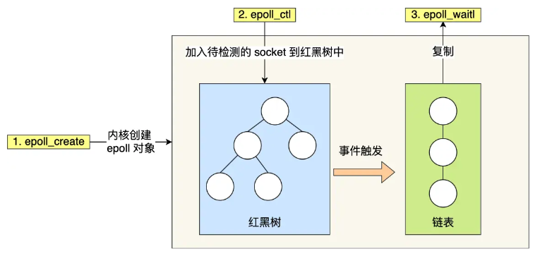

分析：

- 整个流程，**只需要拷贝一次文件描述符** 到内核。
- 每次epoll_wait() ，**只返回有事件发生的文件描述符个数**。不需要轮询所有文件描述符。
- 存在**系统文件描述符限制**。

epoll支持两种触发模式，默认是水平触发：

- **边缘触发（edge-triggered，ET）**：当被监控的 Socket 描述符上有可读事件发生时，**服务器端只会从 epoll_wait 中苏醒一次**。（不管进程有没有调用read去读）
- **水平触发（level-triggered，LT）**：当被监控的 Socket 上有可读事件发生时，**服务器端不断地从 epoll_wait 中苏醒，直到内核缓冲区数据被 read 函数读完才结束**。

### 2.4. 死锁条件和避免

死锁条件：

- **互斥条件**：指多个线程不能同时使用同一个资源；
- **持有并等待条件**：持有了A资源，还想要B资源；
- **不可剥夺条件**：使用完之前不能被其他线程获取；
- **环路等待条件**：两个线程获取资源的顺序构成了环形链；

避免死锁：

只需要破环其中一个条件就可以，比如使用**资源有序分配法**，来破坏环路等待条件。

### 2.5. 进程和线程的区别

- 进程是资源（包括内存、打开的文件等）分配的单位，线程是 CPU 调度的单位；
- 进程拥有一个完整的资源平台，而线程只独享必不可少的资源，如寄存器和栈；
- 线程同样具有就绪、阻塞、执行三种基本状态，同样具有状态之间的转换关系；
- 线程能减少并发执行的时间和空间开销；

相比进程，线程能**减少开销**，体现在：

- **线程的创建时间比进程快**，因为进程在创建的过程中，还需要资源管理信息，比如内存管理信息、文件管理信息，而线程在创建的过程中，不会涉及这些资源管理信息，而是**共享**它们；
- **线程的终止时间比进程快**，因为线程释放的资源相比进程少很多；
- **<u>同一个进程内的线程切换</u> 比 <u>进程切换</u> 快**，因为线程具有相同的地址空间（虚拟内存共享），这意味着同一个进程的线程都具有同一个页表，那么在切换的时候不需要切换页表。而对于进程之间的切换，切换的时候要把页表给切换掉，而页表的切换过程开销是比较大的；
- 由于同一进程的各线程间共享内存和文件资源，那么**线程之间的数据传递效率更高**；

### 2.6. 进程间通信有哪些方式？

- **管道**：pipe()
- **消息队列**：msgget()/msgsnd()/msgrcv()/msgctl()
	- 消息队列不适合大数据的传输。内核有限制：MSGMAX、MSGMNB。
	- 消息队列通信过程中，存在**用户态与内核态之间的数据拷贝**开销。
- **共享内存**：shmget()/shmat()/shmdt()
	- 共享内存的机制，就是**拿出一块虚拟地址空间来，映射到相同的物理内存中**。
	- 就不存在数据拷贝的开销了。但引入了新问题：同时写会冲突。可以使用**信号量**来实现进程间的互斥与同步。
- **信号**：signal()/kill()
	- IPC中唯一的异步通信机制。
	- 信号处理：执行默认操作；捕捉信号；忽略信号。
- **socket**：socket()
	- 类型SOCK_STREAM/SOCK_DGRAM；

### 2.7. 页面置换算法

**交换机制**：当物理内存接近满的时候，操作系统为了使整个系统仍然可用，会将一部分不常使用的页面移到磁盘上，为更经常使用的页面腾出空间。

**页面置换算法**的功能是，**当出现缺页异常，需调入新页面而内存已满时，选择被置换的物理页面**。

出现过哪些页面置换算法：

- **FIFO**：维护一个队列，每次直接清理队列头的页面。几乎无性能开销，但是效果不好。
- **Second Chance FIFO**：维护一个循环队列，每次清理访问标志位为0的页面，每次访问后将标志位置为1，这样只要周期内页面有访问，就会免遭清理，除非所有的页都为1。由于使用循环队列，内存操作较多，故一般使用下面一个算法。
- **时钟算法**：指针和环形链表/队列实现SCFIFO，消除了内存操作，也是较为常用的算法，效果较好，比较NRU有较大改善。
	- 把所有的页面都保存在一个类似钟面的「环形链表」中，一个表针指向最老的页面。
- **LRU（最近最久未使用）算法**：在每次访问内存时都必须要更新「整个链表」。在链表中找到一个页面，删除它，然后把它移动到表头是一个非常费时的操作。开销比较大。
- **LFU（最不常用）算法**：使用的频度Freq由系统时钟中断处理程序统计，效果较好，但是有一定的性能开销，且没有实现“最近”。
	- 要增加一个计数器来实现，这个硬件成本是比较高的。
	- LFU 算法只考虑了频率问题，没考虑时间的问题。
- **老化算法**：在LFU基础上加入频度老化，实现了“最近”，越久的使用次数权重越低。

Linux内核现在使用的页面置换算法是**两级的软件LRU**，也就是分为active和inactive类型的两个链表，并实现软件LRU算法。

两级LRU存在的问题：

- 算法CPU开销太大，而且经常做出错误的决策。
- Active/Inactive这两种分类，是一个相当粗的粒度。经常会看到页表在两个表中来回移动。

Linux 6.2引入了多级LRU：

- 借鉴了老化算法的思路，按照页面的生成（分配）时间将LRU表分为若干Generation。
- 在LRU页面扫面的时候，使用增量的方式扫描，根据周期内访问过的页面对页表进行扫描，除非这段时间内访问的内存分布非常稀疏，通常页表相对于倒排页表有更好的局部性，进而可以提升CPU的缓存命中率。

### 2.8. 零拷贝技术

【磁盘高速缓存】PageCache 的优点主要是两个：

- **缓存最近被访问的数据**；
- **预读功能**；

#### 2.8.1. DMA

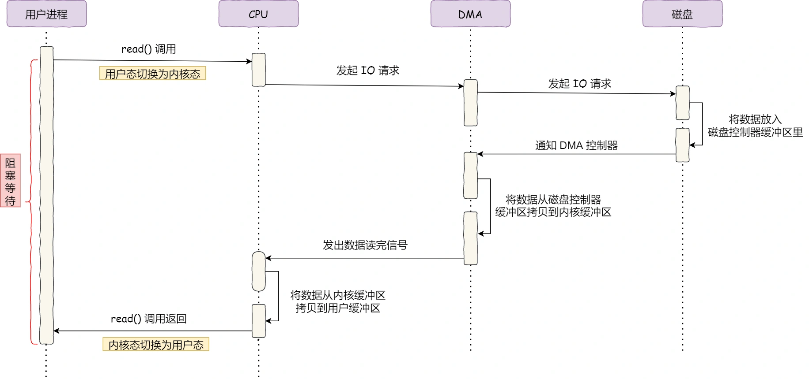

#### 2.8.2. read + write

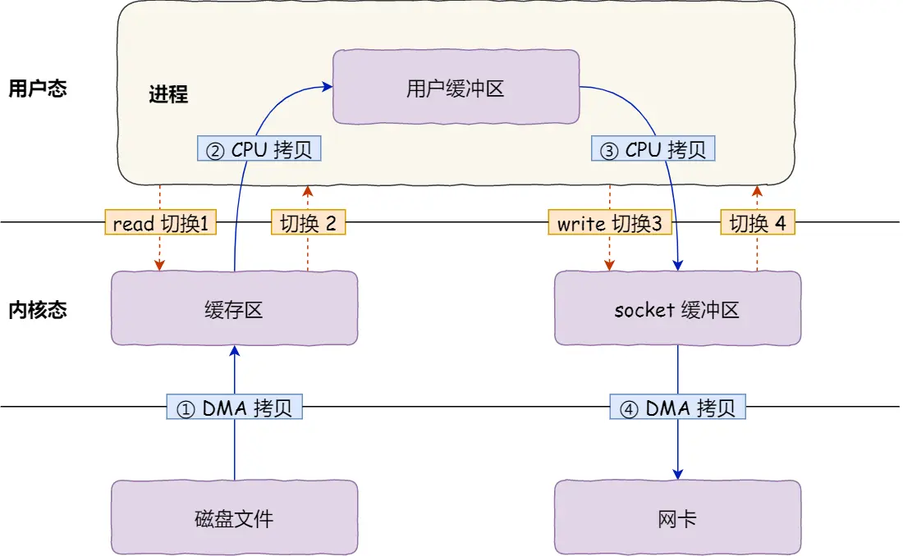

发生了：

- **4 次用户态与内核态的上下文切换**：两次系统调用；
- **4 次数据拷贝**：2次CPU拷贝，2次DMA拷贝；

#### 2.8.3. mmap + write

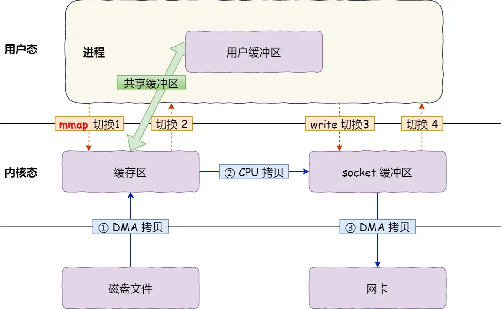

- **4 次用户态与内核态的上下文切换**
- **3 次数据拷贝**

#### 2.8.4. sendfile

```c
ssize_t sendfile(int out_fd, int in_fd, off_t *offset, size_t count);
```

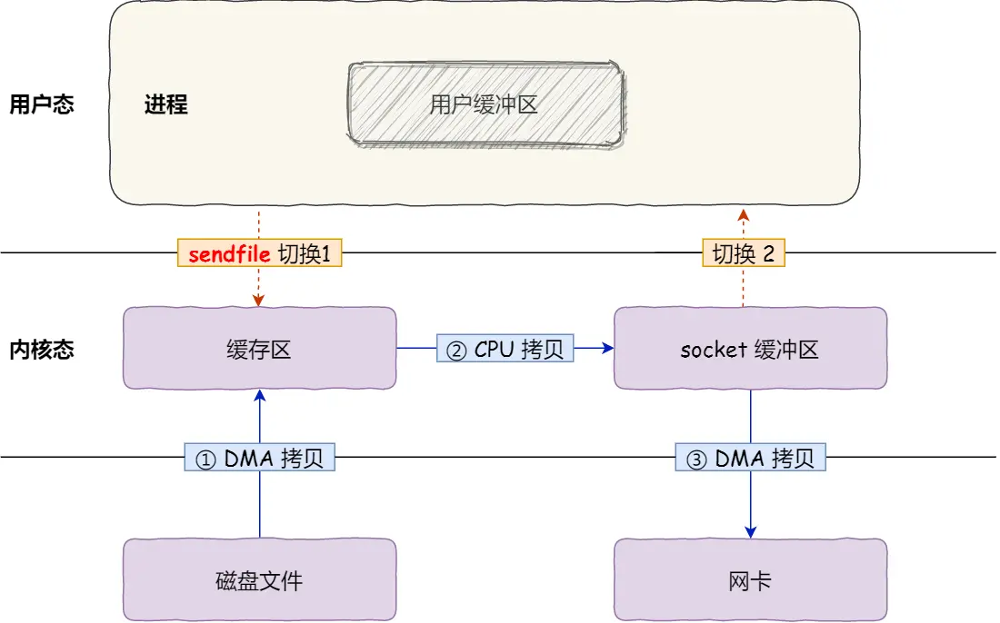

- **2 次用户态与内核态的上下文切换**
- **3 次数据拷贝**

#### 2.8.5. 什么是真正的零拷贝？

`sendfile() + 网卡 SG-DMA（The Scatter-Gather Direct Memory Access）技术。`

```bash
$ ethtool -k eth0 | grep scatter-gather
scatter-gather: on
```

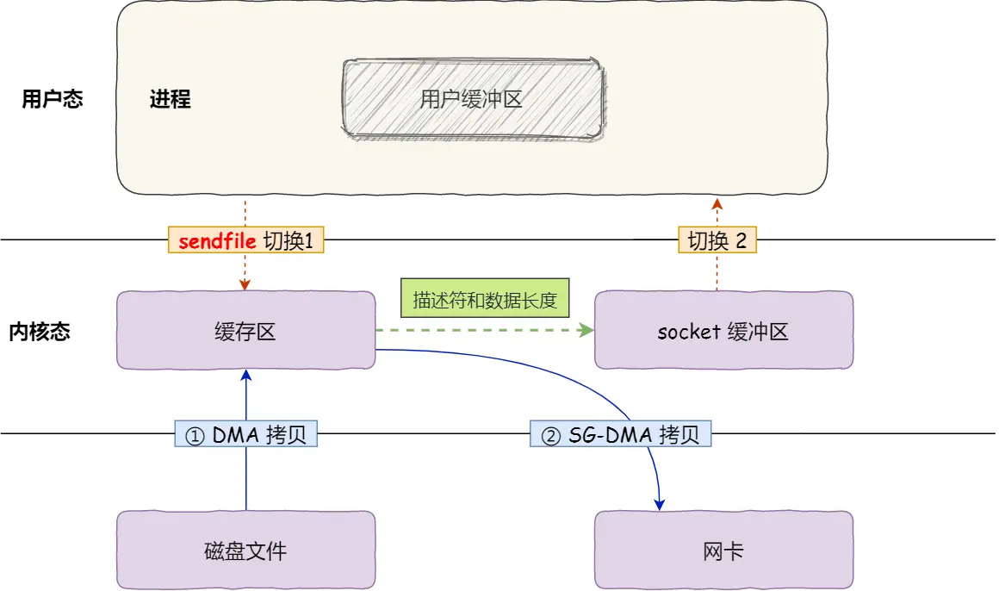

- **2 次用户态与内核态的上下文切换**
- **2 次数据拷贝**：无需CPU参与。

这就是所谓的**零拷贝（Zero-copy）技术**，全程没有通过 CPU 来搬运数据，所有的数据都是通过 DMA 来进行传输的。

#### 2.8.6. kafka

kafka中文件传输，调用了Java NIO库中的 `transferTo` 方法，最后就会使用到 `sendfile()` 系统调用。

#### 2.8.7. 大文件应该怎么传输？

- **传输大文件的时候，使用「异步 I/O + 直接 I/O」**；
	- 异步I/O表示无阻塞；
	- 直接I/O表示绕过PageCache；
- **传输小文件的时候，则使用「零拷贝技术」**；

比如在nginx中，可以配置如下：

当文件大小大于 directio 值后，使用「异步 I/O + 直接 I/O」，否则使用「零拷贝技术」。

```nginx
location /video/ { 
    sendfile on;
    aio on;
    directio 1024m;
}
```

## 3. 网络篇

### 3.1. TCP

参考：https://xiaolincoding.com/network/3_tcp/tcp_interview.html

#### 3.1.1. 三次握手

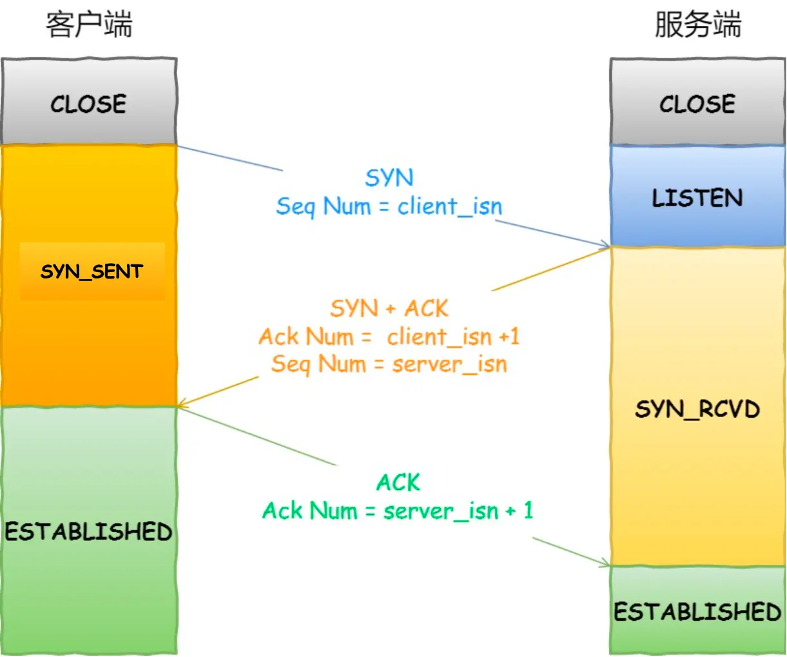

##### 3.1.1.1. 为什么是三次？

- 防止旧的重复连接初始化造成混乱；
- 确保双方的初始序列号能被可靠的同步；
- 避免资源浪费；

##### 3.1.1.2. MTU 和 MSS

- MTU：一个网络包的最大长度，以太网中一般为 1500 字节；
- MSS：除去 IP 和 TCP 头部之后，一个网络包所能容纳的 TCP 数据的最大长度；

**那么当如果一个 IP 分片丢失，整个 IP 报文的所有分片都得重传。为了达到最佳的传输效能 TCP 协议在建立连接的时候通常要协商双方的 MSS 值，当 TCP 层发现数据超过 MSS 时，则就先会进行分片，当然由它形成的 IP 包的长度也就不会大于 MTU ，自然也就不用 IP 分片了。**

##### 3.1.1.3. 第一次握手（SYN）丢失了，会发生什么？

当客户端在 **1 秒** 后没收到服务端的 SYN-ACK 报文后，客户端就会重发 SYN 报文。客户端的 SYN 报文最大重传次数由 **`tcp_syn_retries`** 内核参数控制。默认值是5。重传后等待时间是上一次的 2 倍。`1s -> 2s -> 4s -> 8s -> 16s -> 32s`

##### 3.1.1.4. 第二次握手（SYN+ACK）丢失了，会发生什么？

- 客户端重传 SYN 报文；
- 服务端重传 SYN-ACK 报文；最大重传次数由 **`tcp_synack_retries`** 内核参数决定。（逻辑控制跟上面类似。）

##### 3.1.1.5. 第三次握手（ACK）丢失了，会发生什么？

此时，客户端状态已经进入到 ESTABLISH 状态。

- 服务端重传 SYN-ACK 报文；

##### 3.1.1.6. SYN 攻击

在 TCP 三次握手的时候，Linux 内核会维护两个队列，它们都有最大长度限制，超过限制时，默认情况都会丢弃报文。

两个队列分别是：

- **半连接队列**，也称 SYN 队列；
- **全连接队列**，也称 accept 队列；

**SYN 攻击方式**最直接的表现就会把 TCP 半连接队列打满，这样当 TCP 半连接队列满了，后续再在收到 SYN 报文就会丢弃，导致客户端无法和服务端建立连接。

**避免 SYN 攻击方式**，可以有以下四种方法：

- 调大 netdev_max_backlog；
- **增大 TCP 半连接队列**；
- **开启 tcp_syncookies**：SYN 队列满时，也能保证正常的连接成功建立。
- 减少 SYN+ACK 重传次数；

#### 3.1.2. 四次挥手

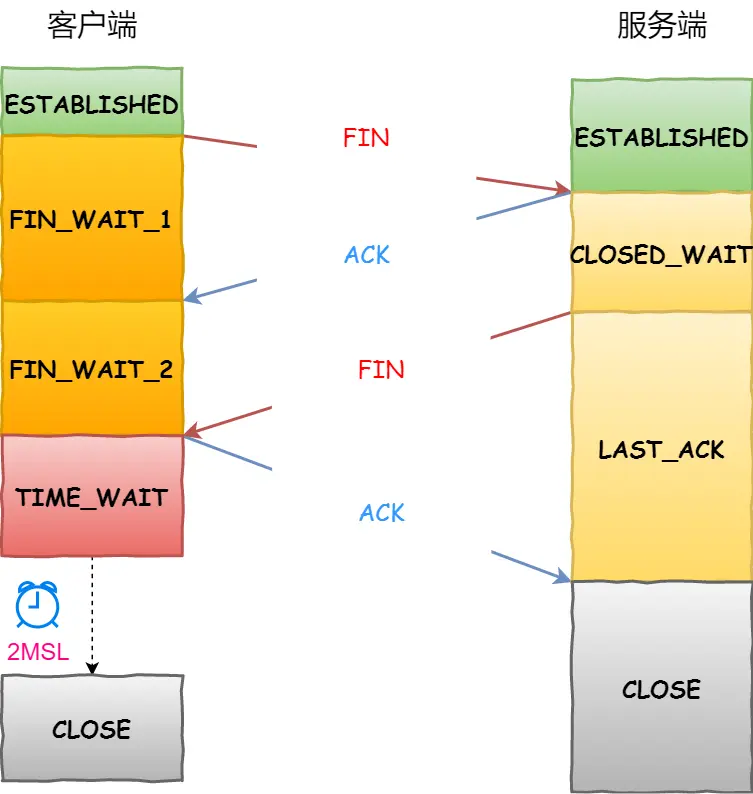

##### 3.1.2.1. 为什么是四次？

其实我们抓包时，经常看到三次挥手，服务端的FIN+ACK一起发回来。

**服务器收到客户端的 FIN 报文时，内核会马上回一个 ACK 应答报文，但是服务端应用程序可能还有数据要发送，所以并不能马上发送 FIN 报文，而是将发送 FIN 报文的控制权交给服务端应用程序。**

- 如果服务端应用程序有数据要发送的话，就发完数据后，才调用关闭连接的函数；
- 如果服务端应用程序没有数据要发送的话，可以直接调用关闭连接的函数，

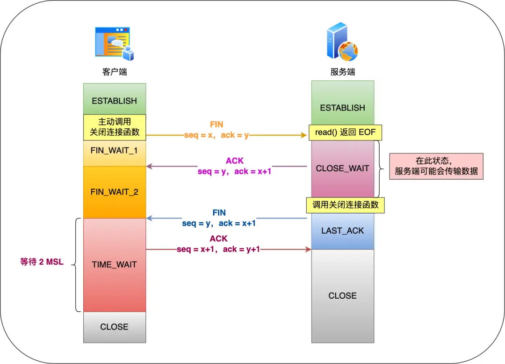

结论：**如果「没有数据要发送」，同时「没有开启 TCP_QUICKACK」，那么服务端的FIN和ACK就会合并传输，这样就出现了三次挥手。**

##### 3.1.2.2. 第一次挥手（FIN）丢失了，会发生什么？

客户端此时位于 FIN_WAIT_1 状态，重传 FIN 报文，重传次数由 `tcp_orphan_retries` 参数控制。次数用完，则进入 CLOSE 状态。

##### 3.1.2.3. 第二次挥手（ACK）丢失了，会发生什么？

客户端此时位于 FIN_WAIT_1 状态，重传 FIN 报文，重传次数由 `tcp_orphan_retries` 参数控制。次数用完，则进入 CLOSE 状态。

##### 3.1.2.4. 第三次挥手（FIN）丢失了，会发生什么？

客户端此时位于 FIN_WAIT_2 状态，服务端此时位于 LAST_ACK 状态；

服务端就会重传 FIN 报文，重传次数由 `tcp_orphan_retries` 参数控制。次数用完，则进入 CLOSE 状态。

客户端由于 FIN_WAIT_2 状态有超时限制，超时后也会进入 CLOSE 状态。

##### 3.1.2.5. 第四次挥手（ACK）丢失了，会发生什么？

客户端此时位于 TIME_WAIT 状态，服务端此时位于 LAST_ACK 状态；

服务端就会重传 FIN 报文，重传次数由 `tcp_orphan_retries` 参数控制。次数用完，则进入 CLOSE 状态。

客户端进入位于 TIME_WAIT 状态后，会开启时长为 2MSL 的定时器，如果途中再次收到第三次挥手（FIN 报文）后，就会重置定时器，当等待 2MSL 时长后，客户端就会进入 CLOSE 状态。

##### 3.1.2.6. 为什么 TIME_WAIT 等待的时间是 2MSL？

MSL 是 Maximum Segment Lifetime，报文最大生存时间。一个 MSL 默认是 30 秒。

考虑第四次挥手（ACK）丢了，服务端会重传 FIN ，这一去一回是 2MSL ，这样允许报文丢失一次。

##### 3.1.2.7. 为什么需要 TIME_WAIT 状态？

- 确保两个方向上的数据包都在网络中消失，不会对后续的连接（相同四元组）产生影响。
- 等待足够的时间以确保最后的 ACK 能让 被动关闭方 接收，从而帮助其正常关闭。

##### 3.1.2.8. TIME_WAIT 过多

危害：占用文件描述符，占用端口，占用内存等；

如何优化？

- 打开 net.ipv4.tcp_tw_reuse 和 net.ipv4.tcp_timestamps 选项；
- net.ipv4.tcp_max_tw_buckets
- 程序中使用 SO_LINGER ，应用强制使用 RST 关闭。（不建议使用）

#### 3.1.3. socket 编程

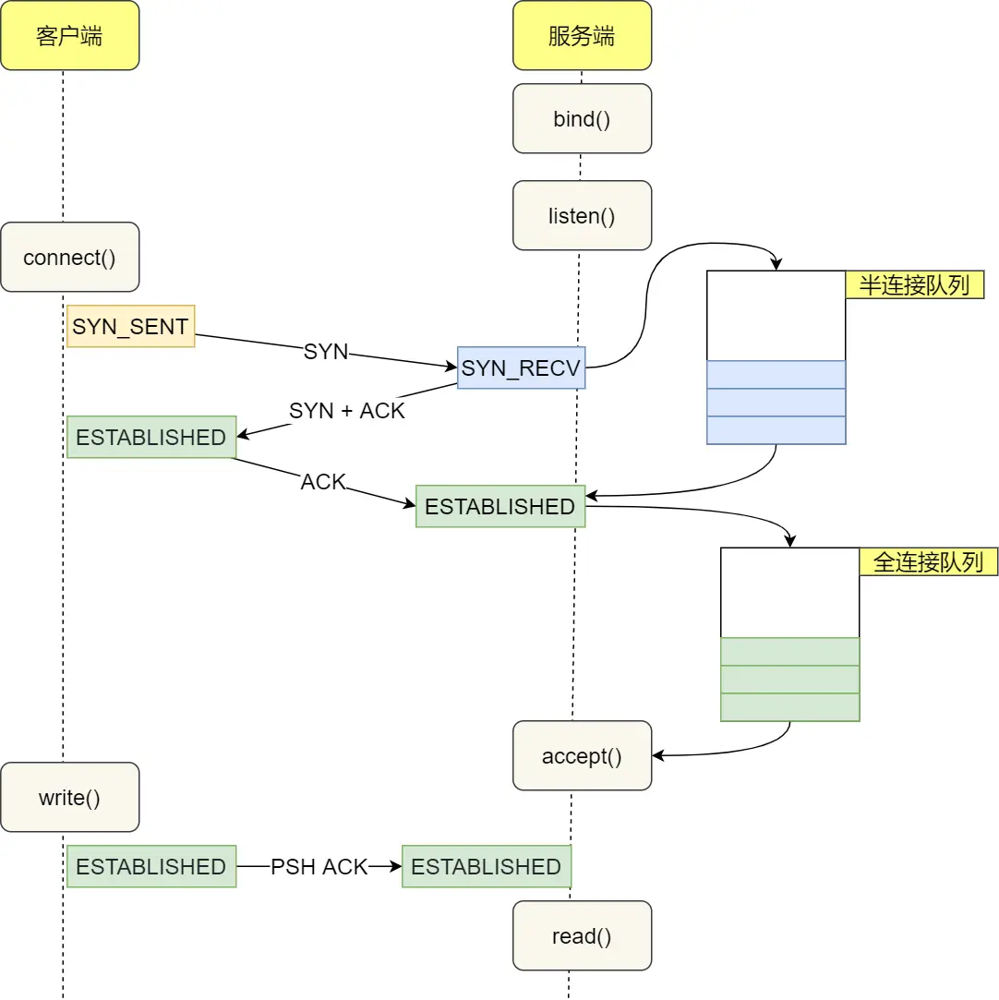

##### 3.1.3.1. 没有accept，能建立TCP连接吗？

**可以。**

连接是内核建立的，**accept 只是负责从 TCP 全连接队列取出一个已经建立连接的 socket。**

##### 3.1.3.2. 没有listen，能建立TCP连接吗？

**可以。**

**首先，如果服务端没有listen，内核找不到监听端口的socket，会发送reset包。**

**但，TCP客户端，可以自己连自己。**

#### 3.1.4. TCP 粘包

TCP 是面向字节流的协议。**当两个消息的某个部分内容被分到同一个 TCP 报文时**，就是我们常说的 TCP 粘包问题，这时接收方不知道消息的边界的话，是无法读出有效的消息。

如何解决：

- 特殊字符作为边界。比如HTTP中的\r\n
- 自定义消息结构。比如由包头和数据组成。

#### 3.1.5. TCP keepalive 和 HTTP keepalive

- TCP keepalive：内核实现，用来保活；
- HTTP keepalive：应用层实现，用来连接复用；

#### 3.1.6. TCP Seq 和 Ack 变化？

- 序列号 = 上一次发送的序列号 + len（数据长度）。特殊情况，如果上一次发送的报文是 SYN 报文或者 FIN 报文，则改为 上一次发送的序列号 + 1。
- 确认号 = 上一次收到的报文中的序列号 + len（数据长度）。特殊情况，如果收到的是 SYN 报文或者 FIN 报文，则改为上一次收到的报文中的序列号 + 1。

#### 3.1.7. TCP 服务端不调用 listen，客户端发起连接会如何？

服务端会回 RST 报文。

TCP收包处理时，会先查找socket，由于没有调用listen，会找不到socket，然后发送 RST 包。

tcp listen 做了什么工作：

- 设置 sock 的状态为 TCP_LISTEN；
- 检查port是否被占用；
- 将sock加入全局hash表；

#### 3.1.8. 重传机制

- **超时重传**。（两种情况：数据包丢失；ACK应答丢失。）（超时重传时间 RTO 略大于 RTT，由linux动态计算。）（连续超时重传，会使超时时间翻倍。）
- **快速重传**。（当收到三个相同的 ACK 报文时，会在定时器过期之前，重传丢失的报文段。）（存在的问题：重传丢失的一个？还是重传开始丢失后的所有报文？）
- **SACK（选择性确认）**。（ TCP 头部「选项」字段里加一个 SACK，它可以将已收到的数据的信息发送给「发送方」，这样发送方就可以知道哪些数据收到了，哪些数据没收到，知道了这些信息，就可以只重传丢失的数据。）（内核选项：net.ipv4.tcp_sack）
- **D-SACK（Duplicate SACK）**。（数据包不一定真的丢失了，可能只是网络延时。重传后，又收到了先前认为丢失的包。D-SACK把重复数据的信息发送给「发送方」，使得发送方知道是被网络延迟了。）（内核选项：net.ipv4.tcp_dsack）

#### 3.1.9. 滑动窗口

- 为什么需要？（TCP一问一答的方式，效率太低。）
- 窗口大小就是指无需等待确认应答，而可以继续发送数据的最大值。
- 窗口大小由哪一方决定？（接收方的窗口大小）

#### 3.1.10. 流量控制

- TCP 提供一种机制可以让「发送方」根据「接收方」的实际接收能力控制发送的数据量，这就是所谓的流量控制。
- 如果窗口大小为 0 时，就会阻止发送方给接收方传递数据，直到窗口变为非 0 为止，这就是**窗口关闭**。
- TCP 是如何解决窗口关闭时，潜在的死锁现象呢？（TCP 为每个连接设有一个持续定时器，只要 TCP 连接一方收到对方的零窗口通知，就启动持续计时器。如果持续计时器超时，就会发送窗口探测 ( Window probe ) 报文，而对方在确认这个探测报文时，给出自己现在的接收窗口大小。）
- 窗口探测的次数一般为 3 次，每次大约 30-60 秒（不同的实现可能会不一样）。如果 3 次过后接收窗口还是 0 的话，有的 TCP 实现就会发 RST 报文来中断连接。
- 接收方得满足「不通告小窗口给发送方」+ 发送方开启 Nagle 算法，才能避免糊涂窗口综合症。

#### 3.1.11. 拥塞控制

拥塞控制，控制的目的就是避免「发送方」的数据填满整个网络。

- **拥塞窗口 cwnd **是「发送方」维护的一个的状态变量，它会根据网络的拥塞程度动态变化的。
- 其实只要「发送方」没有在规定时间内接收到 ACK 应答报文，也就是发生了超时重传，就会认为网络出现了拥塞。

拥塞控制主要是四个算法：

- **慢启动**。当发送方每收到一个 ACK，拥塞窗口 cwnd 的大小就会加 1。**指数增长**。条件：**`cwnd < ssthresh`**。
- **拥塞避免**。每当收到一个 ACK 时，cwnd 增加 1/cwnd。**线性增长**。条件：**`cwnd >= ssthresh`**。（ssthresh通常为65535）。
- **拥塞发生**。当发送**超时重传**时，则就会使用拥塞发生算法。**ssthresh 设为 cwnd/2；cwnd 重置为 1 **。
- **快速恢复**。当发送**快速重传**时，则就会使用快速恢复算法。**cwnd = cwnd/2；ssthresh = cwnd；**。

### 3.2. UDP

#### 3.2.1. UDP 可以调用 connect 函数吗？

可以。udp 的 connect 函数工作：

- 根据sockaddr参数内容，查路由表，确定源IP地址；
- 记录源IP，源port，目的IP，目的Port到 sock 结构中；
- 设置 sock 的状态为 TCP_ESTABLISHED；

#### 3.2.2. UDP 可以调用 listen 函数吗？

会返回：-EOPNOTSUPP

```c
int sock_no_listen(struct socket *sock, int backlog)
{
	return -EOPNOTSUPP;
}

#define	EOPNOTSUPP	95	/* Operation not supported on transport endpoint */
```

## 4. 内核篇

### 4.1. linux启动做了哪些事情

可以分为三个阶段：

- **1. BIOS引导**
	- BIOS是如何启动的，CPU硬件逻辑设计为在加电瞬间强行将CS值置为0XF000，IP为0XFFF0，这样CS:IP就指向0XFFFF0这个位置，这个位置正是BIOS程序的入口地址。
	- BIOS的第一步动作就是进行**上电自检（POST）**。POST的工作是检查硬件设备。随着BIOS程序的执行，屏幕上会显示显卡的信息，内存的信息等。
	- BIOS的第二步动作：**BIOS在内存中建立中断向量表和中断服务程序**。
	- BIOS的**runtime服务** 搜索**可引导启动的设备**，**寻找MBR**。一个软驱，一台光驱，一个硬盘上的分区，网络上的设备甚至一个usb 闪存盘都可以作为一个启动设备。linux通常是从硬盘启动的。硬盘上的MBR（主启动记录）包含有基本的boot loader。
- **2. GRUB引导**
	- 位于**MBR中的主boot loader**是一个512字节的镜像，包含了bootload程序代码，和一个小的分区表。主boot loader的工作是**寻找并加载次boot loader（内核加载程序）**。
	- 在次boot loader存在与内存中后，就可以对文件系统进行查询了，同时将默认的内核镜像以及初始化内存盘镜像也被加载到内存中。
- **3. 内核引导**
	- 解压bzImage，从head.S的start汇编例程开始执行。
	- 进入保护模式，设置中断描述符表和全局描述符表，创建内存分页机制。
	- start_kernel启动内核，设备驱动程序的加载，创建init进程。

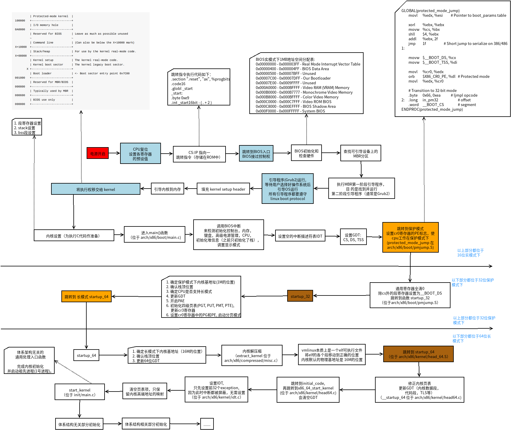

【initrd（bootloader initialized RAM disk）】：

一部分驱动程序直接被编译进内核镜像中，另一部分驱动程序则是以模块的形式放在initrd(ramdisk)中。早期内核版本，boot loader 会将存储介质中的 initrd 文件加载到内存，内核便去执行initrd中的init脚本，这时内核将控制权交给了init文件处理，其中init脚本也主要是加载各种存储介质相关的设备驱动程序。当所需的驱动程序加载完后，会创建一个根设备，然后将根文件系统rootfs以只读的方式挂载。这一步结束后，释放未使用的内存，转换到真正的根文件系统上面去，同时运行/sbin/init程序。

### 4.2. 内核分配内存函数和区别

【页为单位】

如果想要 **以页为单位的连续物理页**，使用 **`alloc_pages()`**。

【对象为单位】

slub分配器：**`kmem_cache_alloc()`**

【字节为单位】
通常**以字节为单位**的分配：

- **`kmalloc()`** 确保页在**物理地址上是连续的**（虚拟地址自然也是连续的）。用于申请较小的，连续的物理内存。
	- CONFIG_SLUB情况下：kmalloc在启动的时候会预先创建一些不同大小的slab，会寻找大小刚好合适的slab来分配内存。如果过大，也会使用alloc_pages()来分配内存。
- **`vmalloc()`** 分配的内存虚拟地址是连续的，而**物理地址则无须连续**。用于申请较大的内存，虚拟内存是连续的。分配的内存在VMALLOC_START~VMALLOC_END之间。
	- 从VMALLOC_START~VMALLOC_END，查找空闲的虚拟地址空间，根据size，调用alloc_page()依次分配单个页面，然后映射到找到的连续虚拟地址空间。

### 4.3. 内核同步机制

- **原子操作**：atomic_set、atomic64_set、set_bit（原子位）
- **自旋锁**：持有自旋锁不允许睡眠。
	- spin_lock：获取自旋锁；
	- spin_lock_irq：禁止本地中断，并获取锁；
	- spin_lock_irqsave：保存本地中断状态，禁止本地中断，并获取锁；
	- spin_lock_bh：禁止下半部执行（软中断），并获取锁；
- **读写锁**：读锁被持有时，读者可以继续占用锁，写者要等待所有读者释放锁才能占用。
- **信号量**：一种**睡眠锁**。如果信号量不可用，它将把调用进程置成TASK_INTERRUPTIBLE状态，进入睡眠。
	- 又分：计数信号量、互斥信号量、读写信号量；
- **完成变量**：代替信号量的一种简单方法。
	- wait_for_completion：等待指定的完成变量接收信号；
	- complete：发信号唤醒任何等待的任务；
	- 使用案例：子进程执行或退出时，vfork()系统调用使用完成变量唤醒父进程。
- **~~BKL大内核锁~~**：被移除了。
- **顺序锁**：seq锁，写优先于读，使用案例：**jiffies**。
- **内存屏障**：memory barrier。解决处理器和编译器重排序问题。
	- rmb()、wmb()、barrier()
- **RCU锁**：Read-Copy-Update

优先级：**`中断 > 软中断 > 进程上下文`**；

所以：中断可以抢占软中断，软中断可以抢占进程上下文。

### 4.4. 抢占、中断、锁

调度分两种：抢占式调度、非抢占式调度。**Linux使用的是抢占式调度**。

【**抢占**】分两种：

- **用户抢占**：指内核返回用户空间而做出的抢占。比如：从系统调用返回；从中断返回。
- **内核抢占**：指在内核代码的执行过程中发生的抢占。下面可能发生内核抢占：
	- 中断处理结束并返回内核空间之前；
	- preempt_count从非零变成零；
	- 内核代码显示调用schedule()；
	- 任务在内核中阻塞，触发schedule()；

【**中断**】

内核需要管理硬件，但处理器速度比硬件快很多个级别，不能让处理器等待硬件响应，所以需要一种方式使得**硬件能够通知内核**，让内核响应硬件的请求。

两种方式：

- 轮询：定期检查硬件，开销太大。
- **中断**：<u>让硬件有需要时，给内核发送信号。</u>

【**锁**】

内核抢占发生的条件：**任务不能持有锁**。

通过控制preempt_count，为 0 表示允许抢占，不为 0 表示禁止抢占。

```c
// 关闭抢占
#define preempt_disable() \
do { \
	preempt_count_inc(); \
	barrier(); \
} while (0)
```

### 4.5. 进程上下文和中断上下文

**进程上下文**是一种内核所处的操作模式，此时内核代表进程执行。（例如：执行系统调用或运行内核线程）。进程可以睡眠，也可以调用程序。

一般程序在用户空间执行。当一个程序执行了系统调用或者触发了某个异常，它就陷入了内核空间。此时，我们称**内核“代表进程执行”并处于进程上下文**。

**中断上下文**没有后备进程，不可以睡眠（否则又怎能再对它重新调用呢？）。且具有较严格的时间限制。

### 4.6. 中断栈

中断处理程序（上半部，top half）拥有了自己的栈，每个处理器一个，大小为一页。这个栈就称为**中断栈**。

### 4.7. 为什么需要下半部（bottom half）？

简单说：又想中断处理程序运行的快，又想中断处理程序完成的工作量多。只能把一些工作放到以后去做。

**上半部分简单快速，执行的时候禁止一些或全部中断。下半部分稍后执行，而且执行期间可以响应所有的中断。**

下半部有哪些实现：

- **软中断**
- **tasklet**：基于软中断实现；
- **工作队列**：基于内核线程实现；

### 4.8. 系统调用

用户空间程序无法直接执行内核代码。以**某种方式通知**（这种方式是**软中断**）内核，需要执行一个系统调用，希望系统切换到内核态，这样内核就可以代表应用程序在内核空间执行系统调用。

**陷入内核时，把参数从用户空间传给内核，参数放在寄存器里。返回值也通过寄存器传递。**

**内核在执行系统调用时，处于进程上下文。**

**在进程上下文中，内核可以休眠，可以被抢占。**

### 4.9. 发生异常时，CPU会做什么？

发生异常时，CPU需要先记录当前程序的上下文，然后再去处理异常，异常处理完成后返回到原先的程序当中。

#### 4.9.1. 异常

【异常定义】：

- **异常**：由于 内部或者外部的一些事件 , 导致 处理器停下正在处理的工作, 转而去处理这些发生的事；
- **处理器状态**：当遇到异常的时候，**先将处理器状态保存起来**, 以便执行完异常处理程序后, 可以恢复处理器状态, 继续执行异常出现点下面的代码；
- **异常出现**：在**一个时间点 可以出现 多个异常**；
- **异常向量**：当异常发生的时候, 程序被强行**从一个固定的内存地址执行, 每个种类的异常都有对应的一固定内存地址**, 这个内存地址就是异常向量 ；

【异常类型】：

ARM架构下支持 7 种异常：

- **Reset**：处理器在工作时, 突然 **按下重启键, 就会触发该异常**;
- **Undefined instructions**：处理器**无法识别指令**的异常；
- **Software interrupt (SWI)**：**软中断**, 软件中需要去打断处理器工作, 可以使用软中断来执行；
- **Prefetch Abort (instruction fetch memory abort)**：**预取指令失败**, ARM 在执行指令的过程中, 要先去预取指令准备执行, 如果预取指令失败, 就会产生该异常；
- **Data Abort (data access memory abort)**：读取数据失败；
- **IRQ (interrupt)**：**普通中断**；
- **FIQ (fast interrupt)**：**快速中断**，比IRQ响应快；

【异常处理】：

异常发生时, ARM 处理器会跳转到对应该异常的 **固定地址** 去执行异常处理程序。这个 固定的地址 就是**异常向量**。

**每个异常类型对应两个异常向量**, 默认是 Normal address。

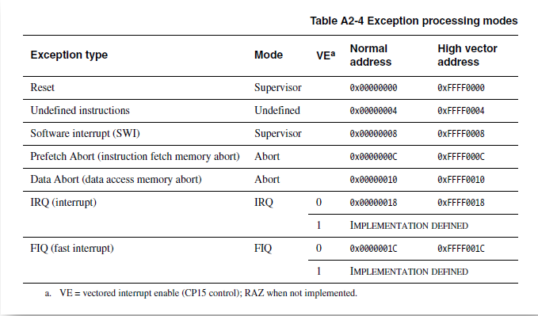

## 5. 文件系统篇

## 6. 命令篇

### 6.1. 查看进程缺页中断信息

```bash
ps -o majflt,minflt -p <pid>
```

### 6.2. ss

```bash
$ ss -lnt
State      Recv-Q     Send-Q           Local Address:Port            Peer Address:Port     Process                  
LISTEN     3          33                     0.0.0.0:1234                 0.0.0.0:*

# Send-Q：表示TCP全连接队列的最大长度。
# Recv-Q：表示当前已完成三次握手并等待服务端 accept() 的 TCP 连接；

$ ss -nt
State     Recv-Q     Send-Q           Local Address:Port            Peer Address:Port      Process                
ESTAB     78         0                    127.0.0.1:1234               127.0.0.1:45288               
ESTAB     78         0                    127.0.0.1:1234               127.0.0.1:45274                 
ESTAB     78         0                    127.0.0.1:1234               127.0.0.1:45300

# Send-Q：已发送但未收到确认的字节数；
# Recv-Q：已收到但未被应用进程读取的字节数；
```

TCP全连接队列最大长度由 `min(somaxconn, backlog)` 控制：

- /proc/sys/net/core/somaxconn
- int listen(int sockfd, int backlog); 中的backlog

TCP半连接队列长度由三个参数控制，计算比较复杂：

- int listen(int sockfd, int backlog); 中的backlog
- /proc/sys/net/core/somaxconn
- /proc/sys/net/ipv4/tcp_max_syn_backlog

## 参考

https://blog.csdn.net/shulianghan/article/details/80163777

https://blog.csdn.net/chen_geng/article/details/51718747

https://developer.aliyun.com/article/47675

https://blog.eastonman.com/blog/2021/04/linux-multi-lru/

https://lwn.net/Articles/851184/
