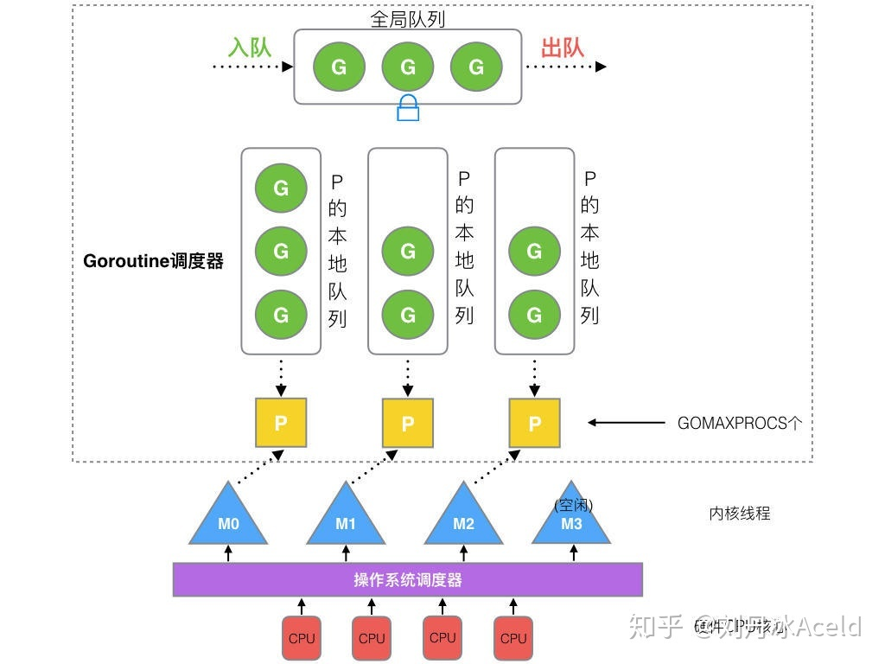

# Golang

### 1. struct 能比较吗？

在Golang中，struct类型是`可比较`类型，**只要结构体中的所有字段都是可比较的类型。**

可比较类型包括`布尔型`、`数字型`、`字符型`、`指针`、`数组`和`结构体`类型，只要它们的底层类型都是可比较的。

**`切片 slice`、`映射 map` 和 `函数 func` 类型不是可比较类型，**

### 2. waitgroup 使用注意事项

- 任务开始前，将计数器加1 `wg.Add(1)`；
- 任务完成后，将计数器减1 `wg.Done()`；
- 如果任务出错，也需要调用`wg.Done()`确保计数器减少，否则`wg.Wait()`将一直等待；
- `wg.Add()` 一定要在 `wg.Wait()` 前执行；

### 3. GPM调度器（GMP）

GPM代表了三个角色，分别是 `Goroutine` 、`Processor`、 `Machine`。

- G：goroutine协程
- P：processor处理器，负责M与G的连接。
- M：操作系统thread线程

#### 3.1. 模型

1. **P有本地队列**：G优先加入到P的本地队列；如果满了，则会把本地队列的一半G移动到全局队列。
2. **P最多有GOMAXPROCS个**：所有P都在程序启动时创建好。
3. **M运行G**：M先获取P，从P的本地队列获取G；如果队列为空，M尝试从全局队列拿一批G放到P的本地队列，或者从其他P的本地队列偷一半放到自己P的本地队列。

【M何时创建？】：**找不到空闲的M时**。一个M阻塞，P就会创建或切换另一个M。

数量限制：

- G：没限制，受内存影响；
- M：默认10000，可通过 `debug.SetMaxThreads` 调整；
- P：最多有GOMAXPROCS个；

#### 3.2. 调度器设计策略

- **复用线程**：避免频繁创建、销毁线程
	- work stealing机制：M没有可运行的G时，从其他P的队列偷取G，而不是销毁线程。
	- hand off机制：M因为G进行系统调用阻塞时，就释放绑定的P，把P转移给其他空闲的M执行。
- **并行**：最多有GOMAXPROCS个线程分布在多个CPU上同时运行。
- **抢占**：在coroutine中要等待一个协程主动让出CPU才执行下一个协程，在Go中，一个goroutine最多占用CPU 10ms，防止其他goroutine被饿死。
- **全局队列**：当M从其他P偷不到G时，它可以从全局G队列获取G。

#### 3.2. go func() 调度流程

### 4. GC

### 5. map并发

### 6. 并发机制

### 7. 性能分析工具 pprof

### 8. 服务不重启热部署

### 9. 切片slice实现

### 参考：

https://zhuanlan.zhihu.com/p/323271088

