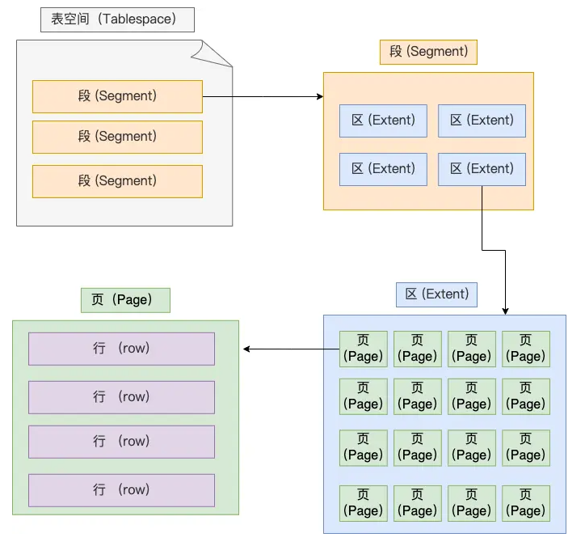
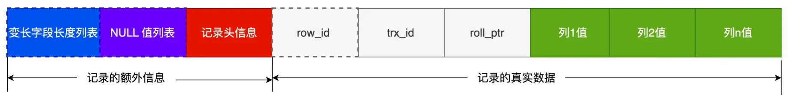
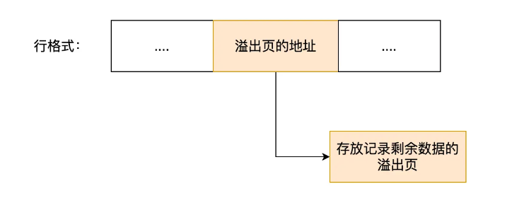
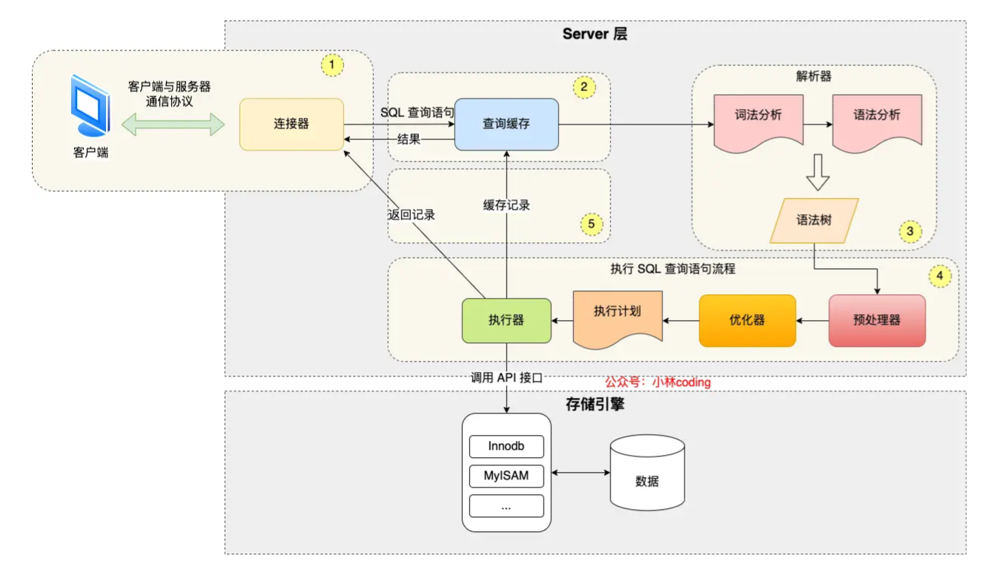

# Mysql

## 1. 快问快答

### 1.1. MySQL 和 PostgreSQL 的区别，如何技术选型？

### 1.2. MySQL的几种常用存储引擎

```mysql
mysql> show engines;
+--------------------+---------+----------------------------------------------------------------+--------------+------+------------+
| Engine             | Support | Comment                                                        | Transactions | XA   | Savepoints |
+--------------------+---------+----------------------------------------------------------------+--------------+------+------------+
| ARCHIVE            | YES     | Archive storage engine                                         | NO           | NO   | NO         |
| BLACKHOLE          | YES     | /dev/null storage engine (anything you write to it disappears) | NO           | NO   | NO         |
| MRG_MYISAM         | YES     | Collection of identical MyISAM tables                          | NO           | NO   | NO         |
| FEDERATED          | NO      | Federated MySQL storage engine                                 | NULL         | NULL | NULL       |
| MyISAM             | YES     | MyISAM storage engine                                          | NO           | NO   | NO         |
| PERFORMANCE_SCHEMA | YES     | Performance Schema                                             | NO           | NO   | NO         |
| InnoDB             | DEFAULT | Supports transactions, row-level locking, and foreign keys     | YES          | YES  | YES        |
| MEMORY             | YES     | Hash based, stored in memory, useful for temporary tables      | NO           | NO   | NO         |
| CSV                | YES     | CSV storage engine                                             | NO           | NO   | NO         |
+--------------------+---------+----------------------------------------------------------------+--------------+------+------------+
```

### 1.3. MyISAM 和 InnoDB 的对比

### 1.4. MyISAM 和 InnoDB 如何选择？

### 1.5. 什么是索引？为什么要用索引？

索引的定义：帮助存储引擎快速获取数据的一种数据结构，形象的说就是索引是数据的目录。

为了提高查询速度。

### 1.6. 索引的缺点

- 需要占用物理空间，数量越大，占用空间越大；
- 创建索引和维护索引要耗费时间，这种时间随着数据量的增加而增大；
- 会降低表的增删改的效率，因为每次增删改索引，B+ 树为了维护索引有序性，都需要进行动态维护。

### 1.7. 什么时候需要索引？

- 字段有唯一限制，比如商品编码
- 经常用于 `WHERE` 查询条件的字段，能够提高整个表的查询速度。
- 经常用于 `GROUP BY` 和 `ORDER BY` 的字段，这样在查询的时候就不需要再去做一次排序了。

### 1.8. 什么时候不需要索引？

- 不需要快速定位的字段
- 存在大量重复数据的字段，比如性别
- 表数据太少的时候
- 经常更新的字段，比如用户余额

### 1.9. MySQL的索引类型

- 按「数据结构」分类：**B+tree索引、Hash索引、Full-text索引**。
- 按「物理存储」分类：**聚簇索引（主键索引）、二级索引（辅助索引）**。
- 按「字段特性」分类：**主键索引、唯一索引、普通索引、前缀索引**。
- 按「字段个数」分类：**单列索引、联合索引**。

## 2. 基础

### 2.1. MySQL 字符集 和 字符序

- **字符集（character set）**：定义了字符以及字符的编码。
- **字符序（collation）**：定义了字符的比较规则。

MySQL提供了不同级别的设置，包括server级、database级、table级、column级，可以提供非常精准的设置。

- 一个字符集对应至少一种字符序（一般是1对多）。
- 两个不同的字符集不能有相同的字符序。
- 每个字符集都有默认的字符序。

```mysql
# 查看支持的字符集
# 方式一：
mysql> SHOW CHARACTER SET;
# 方式二：
mysql> use information_schema;
mysql> select * from CHARACTER_SETS;

# 查看支持的字符序
# 方式一：
mysql> SHOW COLLATION;
# 方式二：
mysql> use information_schema;
mysql> SELECT * FROM COLLATIONS;

# 查看server的字符集、字符序
mysql> SHOW VARIABLES LIKE "character_set_server";
mysql> SHOW VARIABLES LIKE "collation_server";
# 设置方式：启动服务时可以指定；配置文件也可以指定；运行可以修改；

# 创建database，并指定字符集、字符序
create database test1 CHARACTER SET utf8mb3 COLLATE utf8mb3_general_ci;

# 创建table，并指定字符集、字符序
CREATE TABLE IF NOT EXISTS `test1_tb` ( `name` VARCHAR(65532) NULL ) ENGINE=InnoDB DEFAULT CHARACTER SET = ascii ROW_FORMAT = COMPACT;

# 类型为CHAR、VARCHAR、TEXT的列，可以指定字符集/字符序
ALTER TABLE test_table ADD COLUMN char_column VARCHAR(25) CHARACTER SET utf8;
```

### 2.2. MySQL 的数据存放在哪个文件？

```bash
# 目录/var/lib/mysql/下，每个database有一个目录，目录下有table相关文件
[root@fedora test1]# ls
test1_tb.ibd
# 将存储的表数据、索引等信息单独存储在一个独占表文件「 表名字.ibd 」。
```

### 2.3. 表空间文件的结构是怎么样的？

表空间由段（segment）、区（extent）、页（page）、行（row）组成。



- 行（row）：表中的记录都是按行（row）进行存放的，每行记录根据不同的行格式，有不同的存储结构。
- 页（page）：**InnoDB 的数据是按「页」为单位来读写的**。当需要读一条记录的时候，并不是将这个行记录从磁盘读出来，而是以页为单位，将其整体读入内存。默认每个页的大小为 **16KB**。页的类型有很多，常见的有**数据页**、undo **日志页**、**溢出页**等等
- 区（extent）：B+ 树中每一层都是通过双向链表连接起来的。如果是以页为单位来分配存储空间，那么链表中相邻的两个页之间的物理位置并不是连续的，可能离得非常远，那么磁盘查询时就会有大量的随机I/O，随机 I/O 是非常慢的。**在表中数据量大的时候，为某个索引分配空间的时候就不再按照页为单位分配了，而是按照区（extent）为单位分配。每个区的大小为 1MB，对于 16KB 的页来说，连续的 64 个页会被划为一个区，这样就使得链表中相邻的页的物理位置也相邻，就能使用顺序 I/O 了**。
- 段（segment）：段一般分为数据段（B+树叶子节点的区集合）、索引段（B+树非叶子节点的区集合）和回滚段等。

### 2.4. InnoDB 行格式有哪些？

行格式（row_format），就是一条记录的存储结构。

- Redundant：非紧凑的行格式，已废弃；
- Compact：紧凑的行格式；
- Dynamic：**默认的行格式**，基于 Compact 改进；
- Compressed：基于 Compact 改进；

### 2.5. Compact 行格式

Compact 行格式：



- <u>**变长字段长度列表**</u>：这些变长字段的 **真实数据占用的字节数** 会按照列的顺序**逆序存放**；
	- 「 为什么逆序 」？使得位置靠前的记录的真实数据和数据对应的字段长度信息可以同时在一个 CPU Cache Line 中，这样就可以**提高 CPU Cache 的命中率**。
	- 「 表的行格式一定有这个列表吗？ 」当数据表没有变长字段的时候，行格式就不会有 变长字段长度列表 了。
	- 变长字段长度列表 里**不需要保存值为 NULL 的变长字段的长度**。
	- 「 比如字段varchar(n)，变长字段长度如何计算？ 」n 小于等于255，就用 1 字节表示变长字段长度；n 大于 255，就用 2 字节表示变长字段长度；
- <u>**NULL 值列表**</u>：如果存在允许 NULL 值的列，则**每个列对应一个二进制位（bit）**，二进制位按照列的顺序**逆序排列**。NULL 值列表必须用整数个字节的位表示（1字节8位），如果使用的二进制位个数不足整数个字节，则在字节的高位补 0。当一条记录有 9 个字段值都是 NULL，那么就会创建 2 字节空间的 NULL 值列表。
	- 「 表的行格式一定有这个列表吗？ 」当数据表的字段都定义成 NOT NULL 的时候，这时候表里的行格式就不会有 NULL 值列表了。
- <u>**记录头信息**</u>：占用 5 个字节。
	- delete_mask：标识此条数据是否被删除。
	- next_record：下一条记录的位置。指向的是下一条记录的「记录头信息」和「真实数据」之间的位置，这样的好处是向左读就是记录头信息，向右读就是真实数据，比较方便。
	- record_type：表示当前记录的类型，0表示普通记录，1表示B+树非叶子节点记录，2表示最小记录，3表示最大记录。

三个隐藏字段：

- <u>**row_id**</u>：row_id不是必需的，占用 6 个字节。如果既没有指定主键，又没有唯一约束，那么 InnoDB 就会为记录添加 row_id 隐藏字段。
- <u>**trx_id**</u>：事务id，表示这个数据是由哪个事务生成的。 trx_id是必需的，占用 6 个字节。
- <u>**roll_pointer**</u>：这条记录上一个版本的指针。roll_pointer 是必需的，占用 7 个字节。

### 2.6. varchar(n) 中 n 最大取值为多少？

**MySQL 规定除了 TEXT、BLOBs 这种大对象类型之外，其他所有的列（不包括隐藏列和记录头信息）占用的字节长度<u>「 加起来 」</u>不能超过 65535 个字节。**

varchar(n) 字段类型的 n 代表的是**最多存储的字符数量**，并不是字节大小哦。

假设条件：

- 字符集选择ascii （一个字符占用一个字节）
- 表字段只有一个name，类型为varchar，允许为NULL

结果：`65535 - 变长长度列表（占用2字节）- NULL值列表（占用1字节）= 65532`，所以 n 的最大值为 65532。（总之，需要根据表结构定义具体分析）

### 2.8. 行溢出后，MySQL 是怎么处理的？

在一般情况下，InnoDB 的数据都是存放在 「数据页」中。**但是当发生行溢出时，溢出的数据会存放到「溢出页」中。**

Compact 行格式在发生行溢出后的处理：（当发生行溢出时，在记录的真实数据处只会保存该列的一部分数据，而把剩余的数据放在「溢出页」中，然后真实数据处用 20 字节存储指向溢出页的地址，从而可以找到剩余数据所在的页。）


Compressed 和 Dynamic 行格式在发生行溢出后的处理：



### 2.9. 执行一条 select 语句的过程



- 客户端和server建立TCP连接，**连接器**验证用户名和密码；
- ~~查询缓存：查询语句如果命中查询缓存则直接返回，否则继续往下执行。MySQL 8.0 已删除该模块；~~
- **解析器** 做 词法分析 和 语法分析，构建语法树，方便后续模块读取表名、字段、语句类型；
- 执行SQL阶段：
	- **预处理器**：检查 SQL 查询语句中的表或者字段是否存在；将 select * 中的 * 符号，扩展为表上的所有列；
	- **优化器**：负责将 SQL 查询语句的执行方案确定下来；选择查询成本最小的执行计划；（比如使用哪个索引）
	- **执行器**：在执行的过程中，执行器就会和存储引擎交互了，交互是以记录为单位的。从存储引擎读取记录，返回给客户端。
		- 主键索引查询：比如：`where id = 1`，使用主键索引，访问类型为 const；
		- 全表扫描：比如：`where name = 'jack'`，没有用到索引，访问类型为 ALL；
		- 索引下推：比如：`where age > 20 and reward = 10`，age和reward为联合索引，使用索引下推；

## 3. 索引

### 3.1. 创建表时，InnoDB 存储引擎如何选择主键索引的？

- 如果有主键，默认会使用 **主键** 作为聚簇索引的索引键（key）；
- 如果没有主键，就选择第一个 **不包含 NULL 值的唯一列** 作为聚簇索引的索引键（key）；
- 在上面两个都没有的情况下，InnoDB 将自动生成一个 **隐式自增 id 列** 作为聚簇索引的索引键（key）；

其它索引都属于辅助索引（Secondary Index），也被称为二级索引或非聚簇索引。创建的主键索引和二级索引默认使用的是 B+Tree 索引。

### 3.2 主键索引的 B+Tree 和二级索引的 B+Tree 区别

- 主键索引的 B+Tree：**叶子节点**才存放**数据（完整的用户记录）**，**非叶子节点**只存放**索引**，而且每个节点里的数据是**按主键顺序存放的**。
- 二级索引的 B+Tree：**叶子节点**存放的是**主键值**，而不是实际数据。

### 3.3 什么是回表？

根据二级索引查找记录时，只能查到 **主键值**，还需要根据主键值，通过主键索引查询到对应叶子节点，才能得到完整记录。这个过程叫「**回表**」，也就是说要**查两个 B+Tree 才能查到数据**。

### 3.4 为什么 MySQL InnoDB 选择 B+tree 作为索引的数据结构？

- B+Tree vs B Tree：B+Tree 只在叶子节点存储数据，而 B 树 的非叶子节点也要存储数据；B+Tree 叶子节点采用的是双链表连接。所以，B+Tree在相同的磁盘 I/O 次数下，**能查询更多的节点**，且可以做到**基于范围的顺序查找**。
- B+Tree vs 二叉树：对于有 N 个叶子节点的 B+Tree，其**搜索复杂度为O(logdN)**，其中 d 表示节点允许的最大子节点个数为 d 个。（**实际中 d 大于 100的，千万级别数据，树高只有3~4层，磁盘I/O次数也只有3~4次。**）。二叉树搜索复杂度为 O(logN)，检索到目标数据所需的磁盘I/O次数要多的多。
- B+Tree vs Hash：Hash的搜索复杂度为 O(1)，但**不适合做范围查询**。

### 3.5 主键索引、唯一索引、普通索引、前缀索引

- 主键索引：一张表最多只有一个主键索引，索引列的值不允许有空值。（`PRIMARY KEY (index_column_1) USING BTREE`）
- 唯一索引：一张表可以有多个唯一索引，索引列的值必须唯一，但是允许有空值。（`CREATE UNIQUE INDEX index_name ：ON table_name(index_column_1,index_column_2,...);`）
- 普通索引：既不要求字段为主键，也不要求字段为 UNIQUE。（`CREATE INDEX index_name ON table_name(index_column_1,index_column_2,...);`）
- 前缀索引：指对字符类型（char、varchar、binary、varbinary）字段的前几个字符建立的索引。（`CREATE INDEX index_name ON table_name(column_name(length));`）

### 3.6 联合索引（复合索引）

通过将多个字段组合成一个索引，该索引就被称为**联合索引**。使用联合索引时，存在**最左匹配原则**，也就是**按照最左优先的方式进行索引的匹配**。

举例：创建了一个 `(a, b, c)` 联合索引，查询时使用 `where b=2 and c=3` 无法匹配上联合索引。

这很好理解，这个联合索引，是先按 a 排序，在 a 相同的情况再按 b 排序，在 b 相同的情况再按 c 排序。

单独只看 b，其实是无序的。

另外，有一个特殊情况，**联合索引的最左匹配原则，在遇到范围查询（如 >、<）的时候，就会停止匹配，也就是范围查询的字段可以用到联合索引，但是在范围查询字段的后面的字段无法用到联合索引。注意，对于 >=、<=、BETWEEN、like 前缀匹配的范围查询，并不会停止匹配，因为在 = 的情况下，还可以继续使用联合索引。**

#### 3.6.1 索引下推

看例子，对于联合索引（a, b），执行 `select * from table where a > 1 and b = 2;` ，可以知道，a 字段可以用联合索引，b 字段无法使用联合索引。

那么，对于 b 字段的判断，是在联合索引里判断？还是回主键索引去判断呢？

- 在 MySQL 5.6 之前，需要回表，在主键索引中找到行，再对于 b 字段的值。
-  MySQL 5.6 引入的**索引下推优化**（index condition pushdown)，**可以在联合索引遍历过程中，对联合索引中包含的字段先做判断，直接过滤掉不满足条件的记录，减少回表次数。**

#### 3.6.2 索引区分度

建立联合索引时的字段顺序，对索引效率也有很大影响。**建立联合索引时，要把区分度大的字段排在前面，这样区分度大的字段越有可能被更多的 SQL 使用到。**

区分度就是某个字段 column **不同值的个数**「除以」**表的总行数**。

### 3.7 索引优化


## 4. 事务
