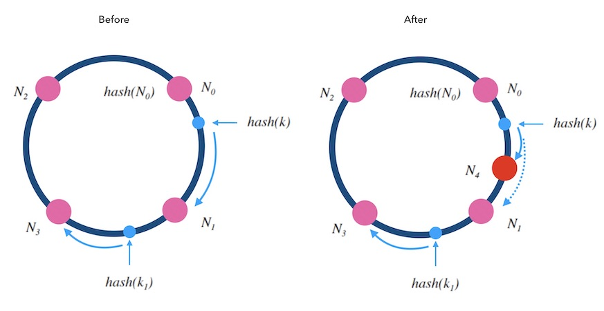
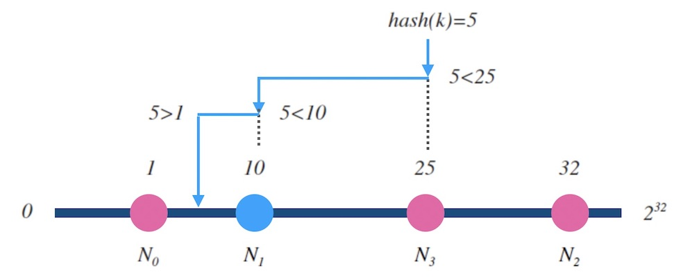

# Consistent Hash

## 1. 概述

传统的哈希表设计中，添加或者删除一个槽位，会造成全量的重新映射， 一致性哈希则追求的是增量式重新映射。多用于分布式系统中的**扩容缩容**问题、 分布式哈希表的设计等等。

寻找一种算法：把随机到来的 **key** ，一致地映射到 **n** 个槽中。且，映射尽量平均

一致性哈希算法应当有两个性质：

- **映射均匀**：随机的 key ，映射到后端的概率尽量相等；
- **映射一致性**：
	- 1.相同的 key 和 n ，一定会有相同的输出；
	- 2.当槽数目 n 增减时，映射结果和之前不一致的数量要尽量少。

## 2. 哈希环算法

1. 设 hash(key) 是映射到区间[0, 2^32]上的一个哈希函数。把区间首尾相连，形成一个顺时针增长的哈希环。
2. 将所有节点N0，N1，...，的标号0，1，...，n-1 依次作为 key，进行hash(key)计算，把结果分别标记在环上。
3. 对于关于 k 的映射，求 z = hash(k)，标记在环上：
	1. 如果 z 正好落在槽位上，返回这个槽位的标号；
	2. 否则，顺时针寻找最近的槽位，返回槽位标号。

### 2.1. 添加节点

新增的节点 N4 ，拦截了原本到下一节点 N1 的部分映射，其他节点不受影响。所以，只需把 N1 的数据迁移到 N4 上才可以正常服务。

### 2.2. 删除节点

被删除的节点 N1 的映射会转交给下一节点 N3 ，其他节点不受影响。所以，只需把 N1 的数据迁移到 N3 上才可以正常服务。

### 2.3. 总结

1. 哈希环做到了在 扩缩容 前后的**增量式的重新映射**，避免了全量的重新映射。
2. 添加或删除结点，只会影响一个槽位的映射量，就是 1 / n ，因此，哈希环做到了**最小化重新映射**（minimum disruption）。
3. 时间复杂度：O(logn)
4. 空间复杂度：O(n)

复杂度分析：节点标号哈希映射到区间[0, 2^32]上后，形成一个有序表，可以做**二分查找**。

### 2.4. 带权重的哈希环

对节点添加权重，可以通过构造很多指向真实节点的**影子节点**（虚拟节点）。权重越大，影子节点越多，被选中的概率就大。

比如：N0，N1，N2，N3 的权重比是 1:2:3:2。

实际应用中，即使节点是平权的，也会采用影子节点。比如采用一个节点对应 40 个影子节点。**节点越多，映射的分布越均匀，采用影子节点可以减少真实节点之间的负载差异。**

影子节点带来的好处：

- 提高了映射结果的均匀性；
- 实现了加权映射；

坏处：增加了内存消耗和查找时间。时间复杂度变为O(log40n)，空间复杂度变为O(40n)。

#### 2.4.1. 容灾

1. 扩容：新节点需要同步下一节点的数据后才能正常服务；
2. 缩容：需要先备份数据到下一节点后才能正常服务；
3. 故障：节点突然故障被移除，数据丢失。

**热**扩缩容：（不停服进行增删节点）

- **数据备份（双写）**：数据写到某个节点时，同时写一份备份到顺时针的邻居节点。
- **请求中继（代理）**：新节点刚加入后，数据没有同步完成时，对读取不到的数据，可以把请求中继到顺时针方向的邻居节点。

**相邻节点同时故障**：可以备份两次，每个写请求都将备份同步到顺时针方向的最近的两个节点上。

**同时添加正好在环上相邻的节点**：请求中继两次，一个节点上查不到数据，就中继给下一个节点，最多两次中继。

## 3. 跳跃一致性算法

## 4. Maglev一致性哈希

