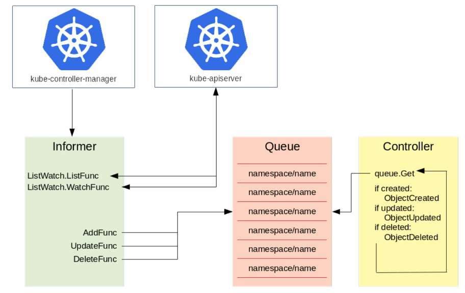

# Custom Resources Definition

## 创建 CRD

```yaml
apiVersion: apiextensions.k8s.io/v1
kind: CustomResourceDefinition
metadata:
  # '<名称的复数形式>.<组名>'
  name: crontabs.stable.example.com
spec:
  # 组名称
  group: stable.example.com
  versions:
    - name: v1
      # served 标志来独立启用或禁止
      served: true
      # 其中一个且只有一个版本必需被标记为存储版本
      storage: true
      schema:
        openAPIV3Schema:
          type: object
          properties:
            spec:
              type: object
              properties:
                cronSpec:
                  type: string
                  pattern: '^(\d+|\*)(/\d+)?(\s+(\d+|\*)(/\d+)?){4}$'
                image:
                  type: string
                replicas:
                  type: integer
                  minimum: 1
                  maximum: 10
                  default: 1
      subresources:
        status: {}
  names:
    # kind
    kind: CronTab
    # 名称的复数形式，用于 URL：/apis/<组>/<版本>/<名称的复数形式>
    plural: crontabs
    # 名称的单数形式，作为命令行使用时和显示时的别名
    singular: crontab
    # 允许你在命令行使用较短的字符串来匹配资源
    shortNames:
    - ct
  # 可以是 Namespaced 或 Cluster
  scope: Namespaced
```

```
kubectl create -f crd.yaml
```

## 创建 CR （CRD的具体实例）

```yaml
apiVersion: stable.example.com/v1
kind: CronTab
metadata:
  name: my-cron-object
spec:
  cronSpec: "* * * * */5"
  image: my-cron-image
```

```
kubectl create -f crd-object.yaml
```

## 查看
```
kubectl get crontab
kubectl get ct -o yaml
```

## 控制器

只定义一个 `CRD` 其实没什么作用，它只会被 `API Server` 简单地计入到 `etcd` 中。
如何依据这个 `CRD` 定义的资源和 Schema 来做一些复杂的操作，则是由 `Controller`（控制器）来实现的。

`CRD-controller` 也就是 `CRD` 控制器，能够实现用户自行编写，并且解析 `CRD` 并把它变成用户期望的状态。 



这里以`kube-controller-manager`为例。

左侧是一个` Informer`，它的机制就是通过去 watch `kube-apiserver`，而 `kube-apiserver` 会去监督所有`etcd` 中资源的创建、更新与删除。`Informer` 主要有两个方法：一个是 ListFunc；一个是 WatchFunc。

- ListFunc 就是像 "kuberctl get pods" 这类操作，把当前所有的资源都列出来；
- WatchFunc 会和 apiserver 建立一个长链接，一旦有一个新的对象提交上去之后，apiserver 就会反向推送回来，告诉 Informer 有一个新的对象创建或者更新等操作。

Informer 接收到了对象的需求之后，就会调用对应的函数（比如图中的三个函数 AddFunc, UpdateFunc 以及 DeleteFunc），并将其按照 key 值的格式放到一个队列中去，key 值的命名规则就是 "namespace/name"，name 就是对应的资源的名字。Controller 从队列中拿到一个对象之后，就会去做相应的操作。

