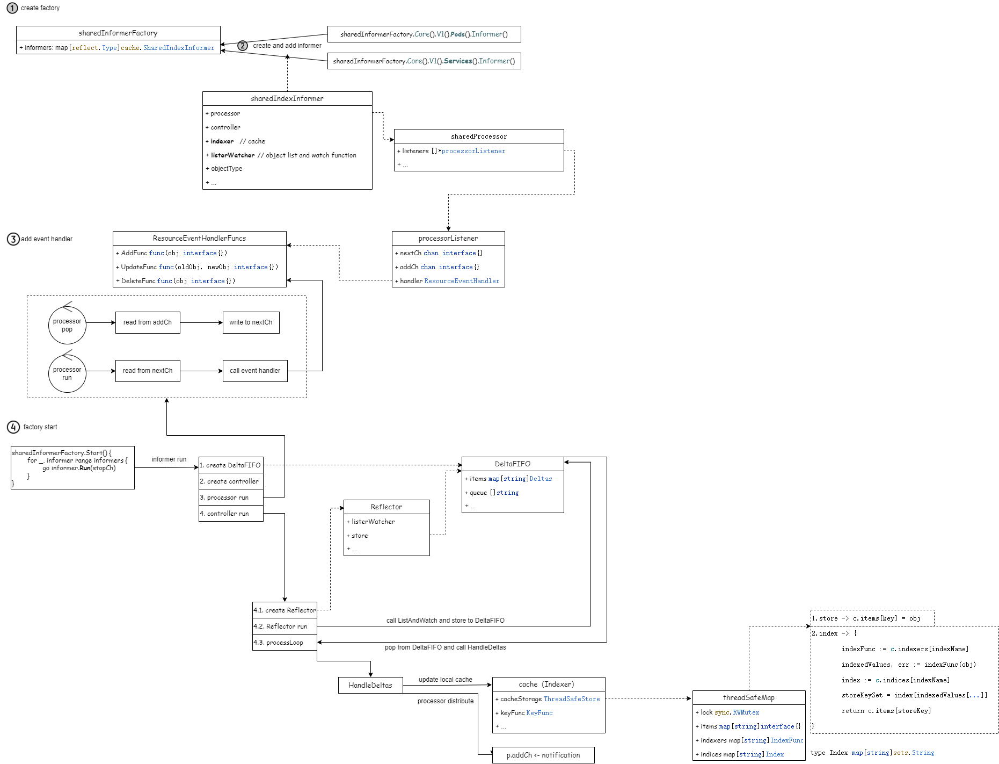

# Informer

## 1. 背景

1. 在 Kubernetes 中，Controller 的作用是什么？

	<u>**观察对象的期望状态和实际状态，然后做出操作来使得实际状态更接近期望状态。**</u>

2. 控制器如何检索对象的信息呢？

	<u>**控制器向 API Server 发送请求。**</u>开发中通常使用一些脚手架，其中的 **controller-runtime** 组件非常简单，帮我们实现了这些功能，但它掩盖了 **client-go** 的底层工作细节。

由于检索信息而进行的轮询会降低 API Server 的性能，client-go 提供了 **Informer** 来解决这个问题。

Informer 的主要功能：

- **通过 ListAndWatch 将数据缓存到本地；**
- **根据事件类型，触发 ResourceEventHandler；**

## 2. 工作原理

图中，Custom Controller是需要开发者自行实现的。（黄色部分）

client-go 组件：

- **Reflector**：用于ListAndWatch 指定的 Kubernetes 资源；
- **DeltaFIFO**：用于存储相关资源事件的FIFO队列；
- **Informer**：从 DeltaFIFO 中弹出对象；
- **Indexer**：提供存储、索引功能；

Reflector 包会和 apiServer 建立长连接，并使用 ListAndWatch 方法获取并监听某一个资源的变化。List 方法将会获取某个资源的所有实例，Watch 方法则监听资源对象的创建、更新以及删除事件，然后将事件放入到DeltaFIFO Queue中；

Informer会不断的从 DeltaFIFO 中 pop 增量事件，并根据事件的类型来决定新增、更新或者是删除本地缓存；接着Informer 根据事件类型来触发事先注册好的 Event Handler触发回调函数。

## 3. 实现分析

## 参考

https://github.com/kubernetes/sample-controller/blob/master/docs/controller-client-go.md
