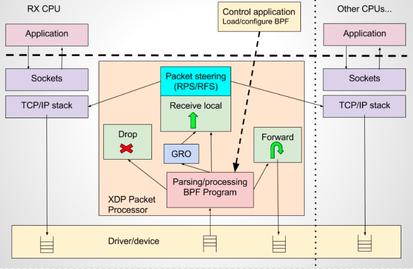
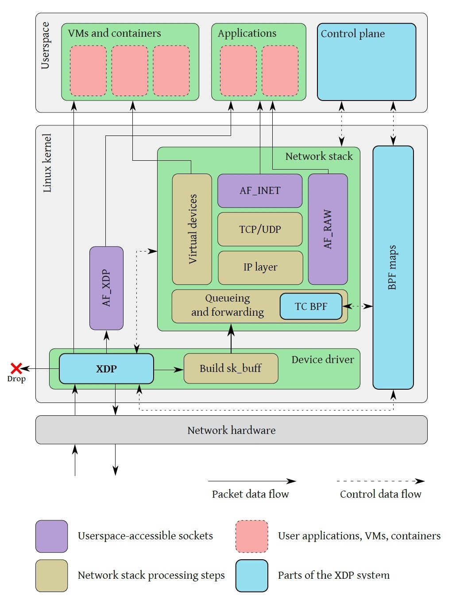
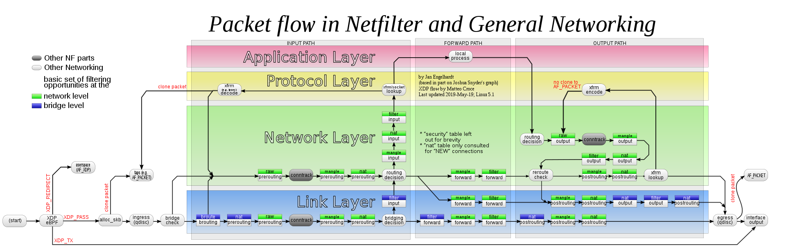

# eXpress Data Path

XDP（eXpress Data Path）为Linux内核提供了高性能、可编程的网络数据路径。由于网络包在还未进入网络协议栈之前就处理，它给Linux网络带来了巨大的性能提升。

XDP主要的特性包括：
- 基于eBPF
- 在网络协议栈前处理
- 无锁设计
- 批量I/O操作
- 轮询式
- 直接队列访问
- 不需要分配skbuff
- 支持网络卸载
- DDIO
- XDP程序快速执行并结束，没有循环
- Packeting steering

## 工作模式
XDP支持3种工作模式，默认使用native模式：
- `Native XDP`：在native模式下，XDP BPF程序运行在网络驱动的早期接收路径上（RX队列），因此，使用该模式时需要网卡驱动程序支持。
- `Offloaded XDP`：在Offloaded模式下，XDP BFP程序直接在NIC（Network Interface Controller）中处理数据包，而不使用主机CPU，相比native模式，性能更高。
- `Generic XDP`：Generic模式主要提供给开发人员测试使用，对于网卡或驱动无法支持native或offloaded模式的情况，内核提供了通用的generic模式，运行在协议栈中，不需要对驱动做任何修改。生产环境中建议使用native或offloaded模式。

## 包处理流程

基于内核的eBPF程序处理包，每个RX队列分配一个CPU，且以每个网络包一个Page（packet-page）的方式避免分配skbuff。







## 内核源码

只有部分网卡驱动支持了XDP，比如Inter e1000不支持，Broadcom bnxt支持。
找到内核代码路径：`drivers/net/ethernet/broadcom/bnxt/`

```c
// 初始化阶段指定poll回调（bnxt_poll）
static void bnxt_init_napi(struct bnxt *bp)
{
	struct bnxt_napi *bnapi;

	bnapi = bp->bnapi[0];
	netif_napi_add(bp->dev, &bnapi->napi, bnxt_poll, 64);
}

// poll回调
static int bnxt_poll(struct napi_struct *napi, int budget)
{
	...
	work_done += bnxt_poll_work(bp, cpr, budget - work_done);
	...
}

static int __bnxt_poll_work(struct bnxt *bp, struct bnxt_cp_ring_info *cpr, int budget)
{
	while (1) {
		...
		rc = bnxt_rx_pkt(bp, cpr, &raw_cons, &event);
		...
	}
	
	if (event & BNXT_REDIRECT_EVENT)
		xdp_do_flush_map();
}

// 收包处理
static int bnxt_rx_pkt(struct bnxt *bp, struct bnxt_cp_ring_info *cpr, u32 *raw_cons, u8 *event)
{
	// xdp处理
	if (bnxt_rx_xdp(bp, rxr, cons, data, &data_ptr, &len, event)) {
		rc = 1;
		goto next_rx;
	}
	
	// 分配skb
	
	// 传递数据包到协议栈
	bnxt_deliver_skb(bp, bnapi, skb);

next_rx:
	...
}

/* returns the following:
 * true    - packet consumed by XDP and new buffer is allocated.
 * false   - packet should be passed to the stack.
 */
bool bnxt_rx_xdp(struct bnxt *bp, struct bnxt_rx_ring_info *rxr, u16 cons, struct page *page, u8 **data_ptr, unsigned int *len, u8 *event)
{
	struct bpf_prog *xdp_prog = READ_ONCE(rxr->xdp_prog);
	struct xdp_buff xdp;
	u32 act;
	
	// 执行bpf程序
	act = bpf_prog_run_xdp(xdp_prog, &xdp);
	
	switch (act) {
	// 将数据包传递到协议栈处理
	case XDP_PASS:
		return false;

	// 转发数据包，将接收到的数据包发送回数据包到达的同一网卡
	case XDP_TX:
		...
		*event = BNXT_TX_EVENT;
		__bnxt_xmit_xdp(bp, txr, mapping + offset, *len,
				NEXT_RX(rxr->rx_prod));
		bnxt_reuse_rx_data(rxr, cons, page);
		return true;

	// 重定向数据包，将数据包送到另一块网卡或传入到BPF的cpumap中
	case XDP_REDIRECT:
		...
		if (xdp_do_redirect(bp->dev, &xdp, xdp_prog)) {
			trace_xdp_exception(bp->dev, xdp_prog, act);
			page_pool_recycle_direct(rxr->page_pool, page);
			return true;
		}

		*event |= BNXT_REDIRECT_EVENT;
		break;

	// eBPF程序发生错误，并导致数据包被丢弃
	case XDP_ABORTED:
		trace_xdp_exception(bp->dev, xdp_prog, act);
		fallthrough;

	// 丢弃数据包
	case XDP_DROP:
		bnxt_reuse_rx_data(rxr, cons, page);
		break;
	}
	return true;
}
```

## 4层负载均衡的例子
完整代码参考：https://github.com/Netronome/bpf-samples/blob/master/l4lb/l4lb_xdp.c

```c
static __always_inline int process_packet(struct xdp_md *ctx, __u64 off)
{
	struct pkt_meta pkt = {};
	struct dest_info *tnl;
	...
	// 解析数据包元数据
	pkt.src = iph->saddr;
	pkt.dst = iph->daddr;
	/* obtain port numbers for UDP and TCP traffic */
	if (protocol == IPPROTO_TCP) {
		if (!parse_tcp(data, off, data_end, &pkt))
			return XDP_DROP;
	} else if (protocol == IPPROTO_UDP) {
		if (!parse_udp(data, off, data_end, &pkt))
			return XDP_DROP;
	} else {
		return XDP_PASS;
	}
	
	// 根据元数据计算hash值，并使用hash值选择server
	tnl = hash_get_dest(&pkt);
	
	// 修改数据包
	...
	iph_tnl.daddr = tnl->daddr;
	iph_tnl.saddr = tnl->saddr;
	...
	*iph = iph_tnl;
	...
	
	// 转发
	return XDP_TX;
}
```