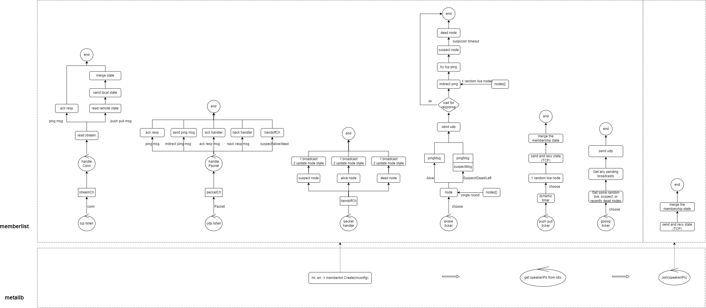

# MemberList

memberlist 是HashiCorp公司出品的go语言开发库，使用基于Gossip协议管理集群成员和成员失败检测。

基于Membership协议，可伸缩最终一致性感染成员组协议。原理通过一个有效的点对点随机探测机制进行监控协议成员的故障检测、更新传播。

## 测试代码

偷个懒，单机测试，进程代表一个member，使用mlname+mlport来区分。

```go
package main

import (
	"flag"
	"fmt"
	"log"
	"os/exec"
	"strings"
	"time"

	"github.com/hashicorp/memberlist"
)

func event2String(e memberlist.NodeEventType) string {
	return []string{"NodeJoin", "NodeLeave", "NodeUpdate"}[e]
}

func main() {
	var mlport int
	var mlname string
	flag.IntVar(&mlport, "mlport", 5555, "memberlist listen port")
	flag.StringVar(&mlname, "mlname", string(rune(mlport)), "memberlist name")
	flag.Parse()

	mconfig := memberlist.DefaultLANConfig()
	mconfig.Name = mlname
	mconfig.BindAddr = "127.0.0.1"
	mconfig.BindPort = mlport
	mconfig.AdvertisePort = mlport

	mlEventCh := make(chan memberlist.NodeEvent, 1024)
	mconfig.Events = &memberlist.ChannelEventDelegate{Ch: mlEventCh}

	ml, err := memberlist.Create(mconfig)
	if err != nil {
		log.Fatalln("failed to create memberlist")
	}

	// memberDiscovery
	go func() {
		// find member from kubernetes cluster
		ticker := time.NewTicker(10 * time.Second)
		for {
			select {
			case <-ticker.C:
				// get members which in group
				members := make(map[string]struct{})
				for _, node := range ml.Members() {
					host := fmt.Sprintf("%s:%d", node.Addr.String(), node.Port)
					members[host] = struct{}{}
				}

				// get members which not in group
				var newMembers []string
				cmd := "netstat -apn | grep memlist | grep LISTEN | awk '{print $4}'"
				output, _ := exec.Command("bash", "-c", cmd).CombinedOutput()
				for _, addr := range strings.Split(string(output), "\n") {
					if len(addr) > 0 {
						if _, isMember := members[addr]; !isMember {
							newMembers = append(newMembers, addr)
						}
					}
				}

				if len(newMembers) > 0 {
					fmt.Printf("find new members: %v\n", len(newMembers))
					// join group
					success, err := ml.Join(newMembers)
					if err != nil || success != len(newMembers) {
						fmt.Errorf("error: %v\n", err)
					} else {
						fmt.Printf("memberlist join succesfully: %v\n", success)
					}
				}
			}
		}
	}()

	ticker := time.NewTicker(30 * time.Second)
	for {
		select {
		case e := <-mlEventCh:
			fmt.Printf("Event: addr (%v), name (%v), event (%v)\n", e.Node.Addr, e.Node.Name, event2String(e.Event))
		case <-ticker.C:
			for _, member := range ml.Members() {
				fmt.Printf("Member: %v\n", *member)
			}
		}
	}

	ml.Shutdown()
}
```

## 实现原理

主要流程：

- tcp listen：处理tcp消息（ping、push/pull）；
- udp listen：处理udp消息（ping、indirect ping、ack/nack、state msg）；
- packet handler：节点状态需要广播时，生成广播消息并入队；
- probe：发ping来探测节点状态，并维护状态（走udp）；
- pushpull：发送本端节点状态，接收远端节点状态，并合并状态（走tcp）；
- gossip：发送udp广播消息；（从队列中获取广播消息，并发送）
- join：新节点加入，会走pushpull流程；


