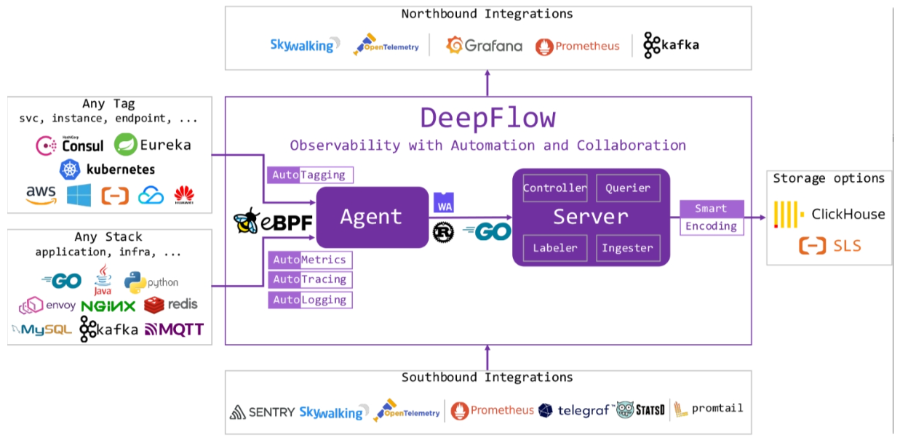
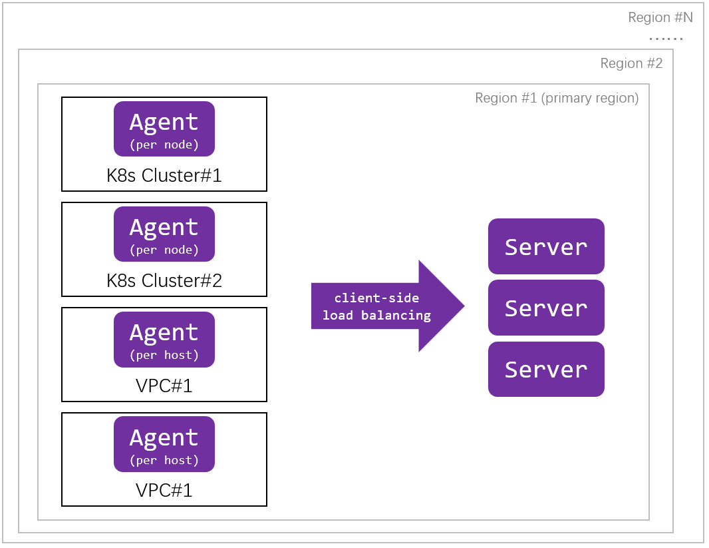
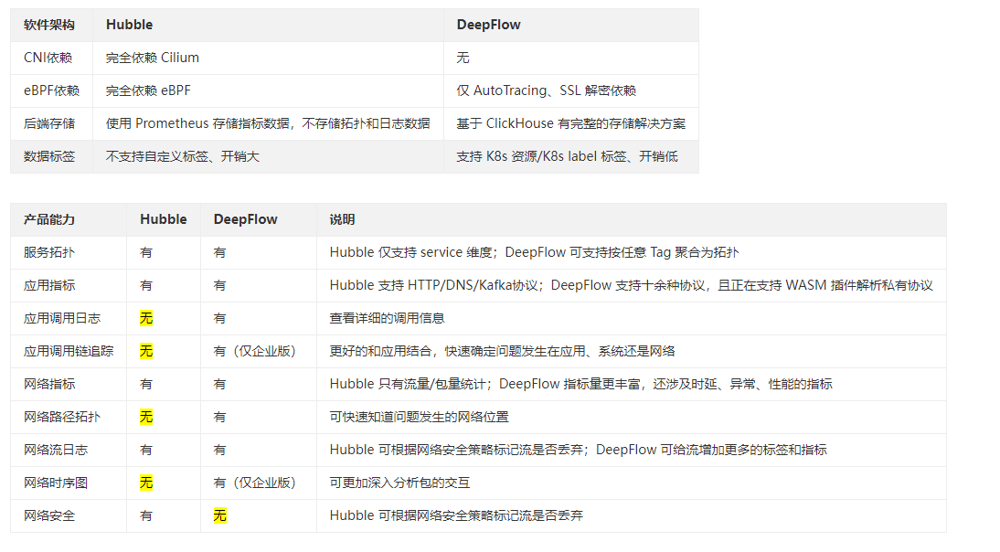

# DeepFlow

## Kubernetes 网络可观测性 应具备能力

- 全景展示：拓扑
- 指标数据：应用指标/网络指标
- 日志数据：应用调用日志/网络流日志/网络时序图
- 追踪数据：应用调用链追踪/网络路径追踪

## 如何工作？

- **Agent**：负责该服务器上所有应用进程的 AutoMetrics 和 AutoTracing 数据采集。使用 Rust 实现 Agent，拥有极致处理性能的同时保证内存安全；
	- 采集数据：eBPF数据、集成的观测数据（其他开源的Agent/SDK观测数据）、标签数据；
	- 部署环境：进程形态（采集服务器所有进程数据）、DaemonSet（采集Node中所有Pod数据）、Sidecar形态（运行与Serverless Pod中，采集Pod中所有Container数据）
- **Server**：提供 Agent 管理、数据标签注入、数据写入、数据查询服务。使用 Golang 实现 Server，重写了 Golang 的 map、pool 基础库；
	- Controller：管理 Agent、均衡调度 Agent 与 Server 的通信关系、同步采集器发现的 Tag 数据。
	- Labeler：向观测数据中注入统一的属性标签。
	- Ingester：观测数据存储，插件化机制支持替换分析数据库。
	- Querier：观测数据查询，提供统一的 SQL 接口查询所有类型的观测数据。

## 多集群、多区域环境

## Hubble vs DeepFlow

## 主要特性

- **AutoMetrics**：使用 AF_PACKET、eBPF 技术实现的自动采集，性能指标RED（Request、Error、Delay）；
- **AutoTagging**：自动为所有观测数据注入统一的属性标签，消除数据孤岛问题，并释放数据的下钻切分能力；
- **AutoTracing**：使用eBPF自动追踪任意微服务、基础设施服务的分布式调用链，与 OpenTelemetry 的数据集成；
- **SmartEncoding**：利用分布式的编码技术，将属性标签编码为整形值，在标签注入阶段直接注入整形标签，在生产环境中的实际运行数据表明 SmartEncoding 可将标签存储性能提升一个数量级；
- **可编程**：目前支持了对 HTTP、HTTPS、Dubbo、gRPC、ProtobufRPC、SOFARPC、MySQL、PostgreSQL、Redis、Kafka、MQTT、DNS协议的解析。基于 WASM技术提供了可编程接口；
- **开放接口**：向上为所有观测数据提供统一的标准 SQL 查询能力；

## 社区版 vs 企业版

https://deepflow.io/docs/zh/about/editions/

## 参考

https://deepflow.io/blog/025-network_observability_of_k8s/

https://deepflow.io/docs/zh/about/overview/
