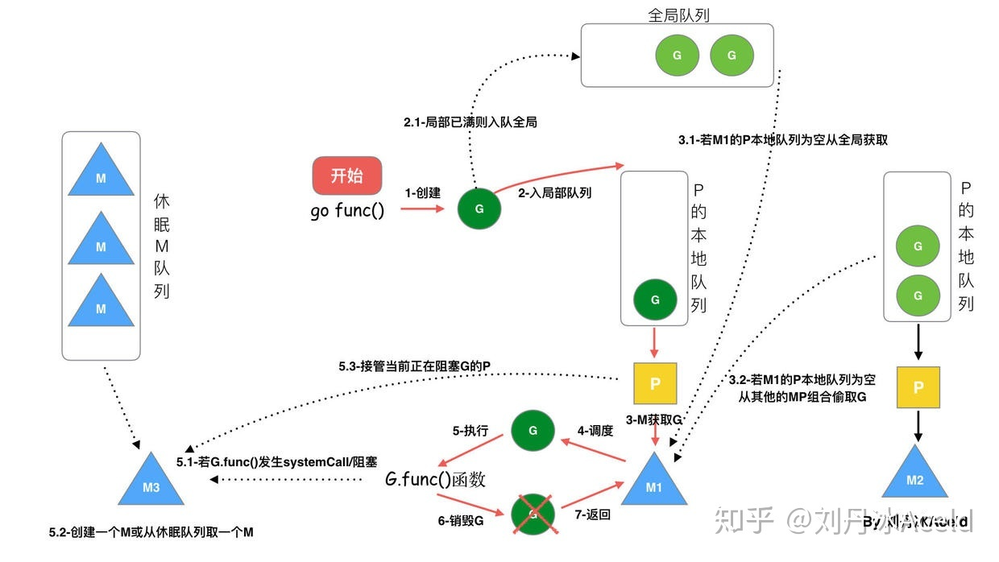
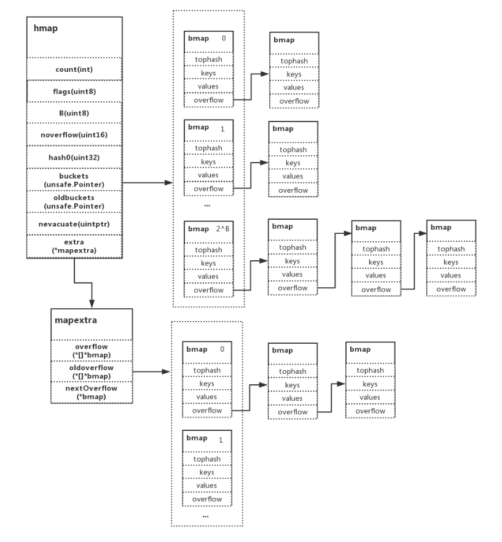
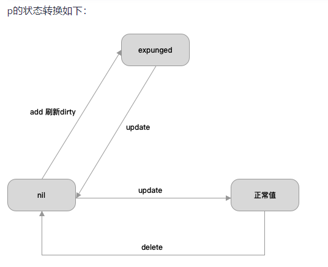

# Golang

### 1. struct 能比较吗？

在Golang中，struct类型是`可比较`类型，**只要结构体中的所有字段都是可比较的类型。**

可比较类型包括`布尔型`、`数字型`、`字符型`、`指针`、`数组`和`结构体`类型，只要它们的底层类型都是可比较的。

**`切片 slice`、`映射 map` 和 `函数 func` 类型不是可比较类型，**

### 2. waitgroup 使用注意事项

- 任务开始前，将计数器加1 `wg.Add(1)`；
- 任务完成后，将计数器减1 `wg.Done()`；
- 如果任务出错，也需要调用`wg.Done()`确保计数器减少，否则`wg.Wait()`将一直等待；
- `wg.Add()` 一定要在 `wg.Wait()` 前执行；

### 3. GPM调度器（GMP）

GPM代表了三个角色，分别是 `Goroutine` 、`Processor`、 `Machine`。

- G：goroutine协程
- P：processor处理器，负责M与G的连接。
- M：操作系统thread线程

#### 3.1. 模型


1. **P有本地队列**：G优先加入到P的本地队列；如果满了，则会把本地队列的一半G移动到全局队列。
2. **P最多有GOMAXPROCS个**：所有P都在程序启动时创建好。
3. **M运行G**：M先获取P，从P的本地队列获取G；如果队列为空，M尝试从全局队列拿一批G放到P的本地队列，或者从其他P的本地队列偷一半放到自己P的本地队列。

【M何时创建？】：**找不到空闲的M时**。一个M阻塞，P就会创建或切换另一个M。

数量限制：

- G：没限制，受内存影响；
- M：默认10000，可通过 `debug.SetMaxThreads` 调整；
- P：最多有GOMAXPROCS个；

#### 3.2. 调度器设计策略

- **复用线程**：避免频繁创建、销毁线程
	- work stealing机制：M没有可运行的G时，从其他P的队列偷取G，而不是销毁线程。
	- hand off机制：M因为G进行系统调用阻塞时，就释放绑定的P，把P转移给其他空闲的M执行。
- **并行**：最多有GOMAXPROCS个线程分布在多个CPU上同时运行。
- **抢占**：在coroutine中要等待一个协程主动让出CPU才执行下一个协程，在Go中，一个goroutine最多占用CPU 10ms，防止其他goroutine被饿死。
- **全局队列**：当M从其他P偷不到G时，它可以从全局G队列获取G。

#### 3.2. go func() 调度流程



### 4. GC

### 5. map并发

当使用两个以上的goroutine对map进行读写，会得到panic信息：concurrent map read and map write。

那go是如何检测到并发读写的呢？从源码中可以看到，写的时候设置了`hashWriting`的标志位，读的时候会检查该标志位。（写的时候也检查）
```go
// read
func mapaccess2(t *maptype, h *hmap, key unsafe.Pointer) (unsafe.Pointer, bool) {
	...
	if h.flags&hashWriting != 0 {
		throw("concurrent map read and map write")
	}
	...
}

// write
func mapassign(t *maptype, h *hmap, key unsafe.Pointer) unsafe.Pointer {
	...
	if h.flags&hashWriting != 0 {
		throw("concurrent map writes")
	}
	hash := t.hasher(key, uintptr(h.hash0))

	// Set hashWriting after calling t.hasher, since t.hasher may panic,
	// in which case we have not actually done a write.
	h.flags ^= hashWriting
	...
}
```

#### 5.1. map实现



- hmap维护buckets，当buckets满了，会发生扩容。（extra）
- bmap就是一个bucket，最多存储8个键值对。当发生hash冲突时，会溢出到下一个bmap。（overflow）
- keys和values存储按照`K/K/K/K/V/V/V/V`的形式，方便字节对齐，节省内存。

#### 5.2. sync.Map

两个问题：

- 如何实现？
- 如何解决并发提升性能？

如果采用传统的大锁方案，其锁的竞争十分激烈。sync.Map利用空间换时间、读写分离，采用冗余的数据结构，来减少时间的消耗。

sync.Map中的冗余数据结构是：`read` 和 `dirty`，二者都存放 key-entry，entry指向用户数据value。只要修改了entry，对read和dirty都是可见的。

**dirty为nil时，read代表所有数据；dirty不为nil时，dirty代表所有数据。**




总结：

- 通过**读写分离，冗余数据结构，空间换时间**的思想，来减少耗时。
- **read优先**：操作read比较快，（原子操作）。
- **双检查机制**：read不符合要求时，操作dirty前需要上锁，期间可能发生了变化，read突然又符合要求了。
- **延迟删除**：delete时，优先操作read，只是把value赋值为nil。后面提升dirty为read时，才会统一删除。


### 6. atomic.Value


```go
type Value struct {
	v interface{}
}

type ifaceWords struct {
	typ  unsafe.Pointer
	data unsafe.Pointer
}

func (v *Value) Store(val interface{}) {
	vp := (*ifaceWords)(unsafe.Pointer(v))
	vlp := (*ifaceWords)(unsafe.Pointer(&val))
	
	for {
		typ := LoadPointer(&vp.typ)
		if typ == nil {
			// 首次存储，如果为nil，说明没人正在写，设置typ
			if !CompareAndSwapPointer(&vp.typ, nil, unsafe.Pointer(^uintptr(0))) {
				continue
			}
			StorePointer(&vp.data, vlp.data)
			StorePointer(&vp.typ, vlp.typ)
			return
		}
		// 说明有人正在首次存储
		if uintptr(typ) == ^uintptr(0) {
			continue
		}
		if typ != vlp.typ {
			panic("sync/atomic: store of inconsistently typed value into Value")
		}
		// 写数据
		StorePointer(&vp.data, vlp.data)
		return
	}
}
```

### 7. slice

- array长度是固定的；slice可以自动扩容

```go
type slice struct {
	array unsafe.Pointer // 指向array的指针
	len   int            // 当前元素个数
	cap   int            // 容量
}
```


【注意事项】：

```go
//切片操作
a := []int{1,2,3,4,5,6,7,8}

b := a[0:5] //这个时候 b 和 a 共用的同一个array

b = append(b, i) // b 未发生扩容，还是共用array

b[0] = 99 // a,b都可见

b = append(b, []int{0,0,0,0}...) // b 发生了扩容

b[0] = 999 // 只有b被修改了
```

【slice可以申请最大容量是多少？】：

- 首先，超过int大小的直接panic；
- 其次，计算所需内存（`size * cap`）时，如果 mem > maxAlloc，直接panic；
- 内存够，就能申请。否则 out of memory。

```go
func makeslice64(et *_type, len64, cap64 int64) unsafe.Pointer {
	len := int(len64)
	if int64(len) != len64 {
		panicmakeslicelen()
	}

	cap := int(cap64)
	if int64(cap) != cap64 {
		panicmakeslicecap()
	}

	return makeslice(et, len, cap)
}
```

### 8. 性能分析工具

#### 8.1. pprof

- runtime/pprof：采集程序运行数据；
- net/http/pprof：采集 http server 运行数据；

可以做什么：

- CPU Profiling：CPU分析
- Memory Profiling：内存分析
- Block Profiling：阻塞分析
- Mutex Profiling：互斥锁分析

#### 8.2. trace

捕获各种执行中的事件：

- goroutine的创建、阻塞
- syscall的进入、退出、阻塞
- GC事件
- heap的大小变化

#### 8.3. GODEBUG

适合用来调试GPM、GC

### 9. 服务不重启热部署

- gin
- endless

### 参考：

https://zhuanlan.zhihu.com/p/323271088
https://zhuanlan.zhihu.com/p/230888784
https://www.cnblogs.com/luozhiyun/p/15038401.html
