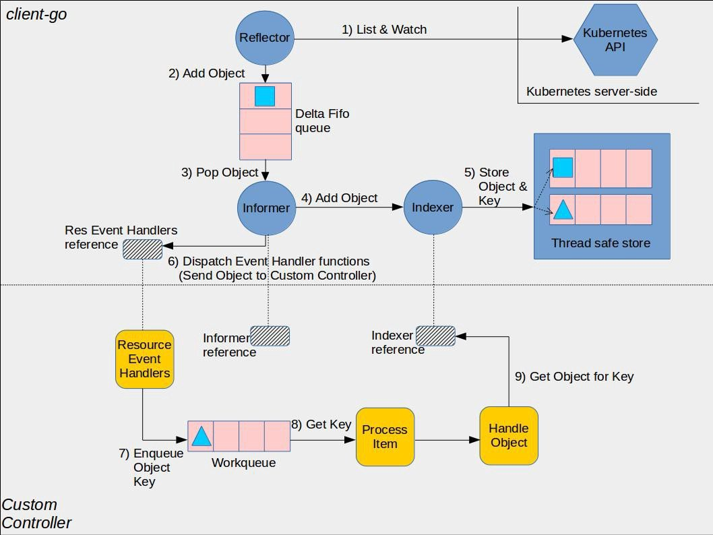

# Kubernetes

## 1. k8s组件及其作用

## 2. 如何监听 Pod 状态变化？

## 3. 节点不可用时，如何把pod驱逐到其他节点？

## 4. 命令式 API 和 声明式 API

**k8s采用 声明式 API。**

- 命令式API：比如创建一个Pod；
	- 没有响应怎么办？反复重试；需要记录当前的操作--复杂；
	- 并发访问怎么办？需加锁--复杂，低效；
	- 最后不一致怎么办？需要有巡检逻辑--额外工作；
- **声明式API**：比如副本数保持在3个；
	- 天然记录了状态；
	- 幂等操作；
	- 正常操作就是巡检；
	- 可合并多个变更；

## 5. 控制器模式

