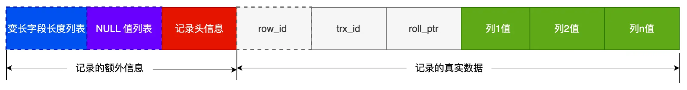
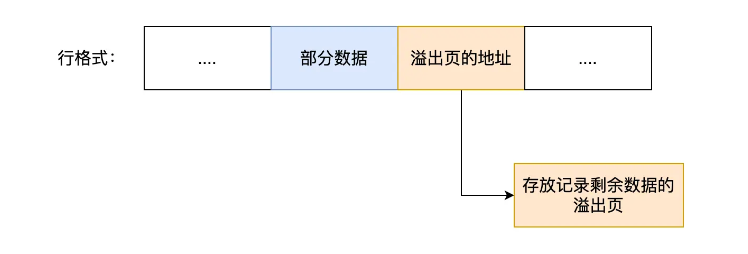
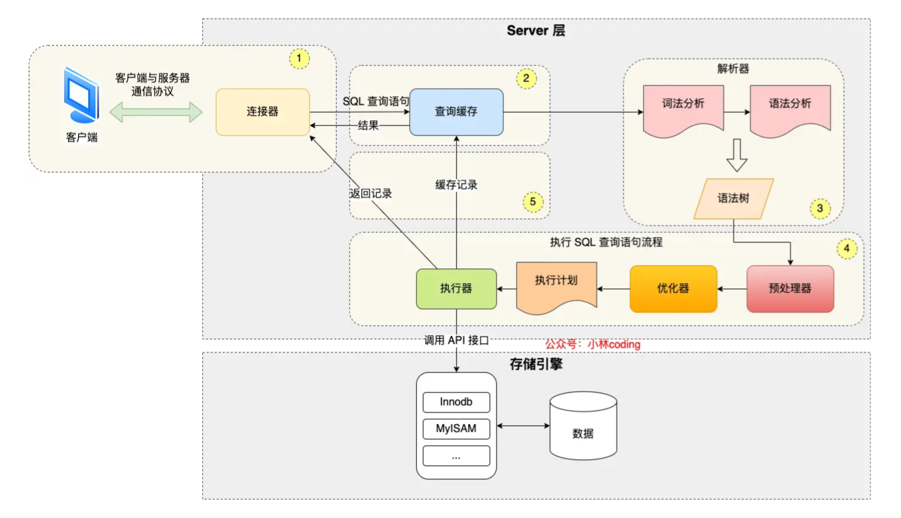

# Mysql

## 1. 快问快答

### 1.1. MySQL 和 PostgreSQL 的区别，如何技术选型？

### 1.2. MySQL的几种常用存储引擎

```mysql
mysql> show engines;
+--------------------+---------+----------------------------------------------------------------+--------------+------+------------+
| Engine             | Support | Comment                                                        | Transactions | XA   | Savepoints |
+--------------------+---------+----------------------------------------------------------------+--------------+------+------------+
| ARCHIVE            | YES     | Archive storage engine                                         | NO           | NO   | NO         |
| BLACKHOLE          | YES     | /dev/null storage engine (anything you write to it disappears) | NO           | NO   | NO         |
| MRG_MYISAM         | YES     | Collection of identical MyISAM tables                          | NO           | NO   | NO         |
| FEDERATED          | NO      | Federated MySQL storage engine                                 | NULL         | NULL | NULL       |
| MyISAM             | YES     | MyISAM storage engine                                          | NO           | NO   | NO         |
| PERFORMANCE_SCHEMA | YES     | Performance Schema                                             | NO           | NO   | NO         |
| InnoDB             | DEFAULT | Supports transactions, row-level locking, and foreign keys     | YES          | YES  | YES        |
| MEMORY             | YES     | Hash based, stored in memory, useful for temporary tables      | NO           | NO   | NO         |
| CSV                | YES     | CSV storage engine                                             | NO           | NO   | NO         |
+--------------------+---------+----------------------------------------------------------------+--------------+------+------------+
```

### 1.3. MyISAM 和 InnoDB 的对比

### 1.4. MyISAM 和 InnoDB 如何选择？

### 1.5. MySQL的索引类型

- MYISAM 和 InnoDB 存储引擎只支持 **`BTREE索引`**；
- MEMORY 和 HEAP 存储引擎可以支持 **`HASH 和 BTREE索引`**;

### 1.6. BTREE 和 HASH 的区别？

### 1.7. 为什么要用索引？

## 2. 基础

### 2.1. MySQL 字符集 和 字符序

- **字符集（character set）**：定义了字符以及字符的编码。
- **字符序（collation）**：定义了字符的比较规则。

MySQL提供了不同级别的设置，包括server级、database级、table级、column级，可以提供非常精准的设置。

- 一个字符集对应至少一种字符序（一般是1对多）。
- 两个不同的字符集不能有相同的字符序。
- 每个字符集都有默认的字符序。

```mysql
# 查看支持的字符集
# 方式一：
mysql> SHOW CHARACTER SET;
# 方式二：
mysql> use information_schema;
mysql> select * from CHARACTER_SETS;

# 查看支持的字符序
# 方式一：
mysql> SHOW COLLATION;
# 方式二：
mysql> use information_schema;
mysql> SELECT * FROM COLLATIONS;

# 查看server的字符集、字符序
mysql> SHOW VARIABLES LIKE "character_set_server";
mysql> SHOW VARIABLES LIKE "collation_server";
# 设置方式：启动服务时可以指定；配置文件也可以指定；运行可以修改；

# 创建database，并指定字符集、字符序
create database test1 CHARACTER SET utf8mb3 COLLATE utf8mb3_general_ci;

# 创建table，并指定字符集、字符序
CREATE TABLE IF NOT EXISTS `test1_tb` ( `name` VARCHAR(65532) NULL ) ENGINE=InnoDB DEFAULT CHARACTER SET = ascii ROW_FORMAT = COMPACT;

# 类型为CHAR、VARCHAR、TEXT的列，可以指定字符集/字符序
ALTER TABLE test_table ADD COLUMN char_column VARCHAR(25) CHARACTER SET utf8;
```

### 2.2. MySQL 的数据存放在哪个文件？

```bash
# 目录/var/lib/mysql/下，每个database有一个目录，目录下有table相关文件
[root@fedora test1]# ls
test1_tb.ibd
# 将存储的表数据、索引等信息单独存储在一个独占表文件「 表名字.ibd 」。
```

### 2.3. 表空间文件的结构是怎么样的？

表空间由段（segment）、区（extent）、页（page）、行（row）组成。


- 行（row）：表中的记录都是按行（row）进行存放的，每行记录根据不同的行格式，有不同的存储结构。
- 页（page）：**InnoDB 的数据是按「页」为单位来读写的**。当需要读一条记录的时候，并不是将这个行记录从磁盘读出来，而是以页为单位，将其整体读入内存。默认每个页的大小为 **16KB**。页的类型有很多，常见的有**数据页**、undo **日志页**、**溢出页**等等
- 区（extent）：B+ 树中每一层都是通过双向链表连接起来的。如果是以页为单位来分配存储空间，那么链表中相邻的两个页之间的物理位置并不是连续的，可能离得非常远，那么磁盘查询时就会有大量的随机I/O，随机 I/O 是非常慢的。**在表中数据量大的时候，为某个索引分配空间的时候就不再按照页为单位分配了，而是按照区（extent）为单位分配。每个区的大小为 1MB，对于 16KB 的页来说，连续的 64 个页会被划为一个区，这样就使得链表中相邻的页的物理位置也相邻，就能使用顺序 I/O 了**。
- 段（segment）：段一般分为数据段（B+树叶子节点的区集合）、索引段（B+树非叶子节点的区集合）和回滚段等。

### 2.4. InnoDB 行格式有哪些？

行格式（row_format），就是一条记录的存储结构。

- Redundant：非紧凑的行格式，已废弃；
- Compact：紧凑的行格式；
- Dynamic：**默认的行格式**，基于 Compact 改进；
- Compressed：基于 Compact 改进；

### 2.5. Compact 行格式

Compact 行格式：



- <u>**变长字段长度列表**</u>：这些变长字段的 **真实数据占用的字节数** 会按照列的顺序**逆序存放**；
	- 「 为什么逆序 」？使得位置靠前的记录的真实数据和数据对应的字段长度信息可以同时在一个 CPU Cache Line 中，这样就可以**提高 CPU Cache 的命中率**。
	- 「 表的行格式一定有这个列表吗？ 」当数据表没有变长字段的时候，行格式就不会有 变长字段长度列表 了。
	- 变长字段长度列表 里**不需要保存值为 NULL 的变长字段的长度**。
	- 「 比如字段varchar(n)，变长字段长度如何计算？ 」n 小于等于255，就用 1 字节表示变长字段长度；n 大于 255，就用 2 字节表示变长字段长度；
- <u>**NULL 值列表**</u>：如果存在允许 NULL 值的列，则**每个列对应一个二进制位（bit）**，二进制位按照列的顺序**逆序排列**。NULL 值列表必须用整数个字节的位表示（1字节8位），如果使用的二进制位个数不足整数个字节，则在字节的高位补 0。当一条记录有 9 个字段值都是 NULL，那么就会创建 2 字节空间的 NULL 值列表。
	- 「 表的行格式一定有这个列表吗？ 」当数据表的字段都定义成 NOT NULL 的时候，这时候表里的行格式就不会有 NULL 值列表了。
- <u>**记录头信息**</u>：占用 5 个字节。
	- delete_mask：标识此条数据是否被删除。
	- next_record：下一条记录的位置。指向的是下一条记录的「记录头信息」和「真实数据」之间的位置，这样的好处是向左读就是记录头信息，向右读就是真实数据，比较方便。
	- record_type：表示当前记录的类型，0表示普通记录，1表示B+树非叶子节点记录，2表示最小记录，3表示最大记录。

三个隐藏字段：

- <u>**row_id**</u>：row_id不是必需的，占用 6 个字节。如果既没有指定主键，又没有唯一约束，那么 InnoDB 就会为记录添加 row_id 隐藏字段。
- <u>**trx_id**</u>：事务id，表示这个数据是由哪个事务生成的。 trx_id是必需的，占用 6 个字节。
- <u>**roll_pointer**</u>：这条记录上一个版本的指针。roll_pointer 是必需的，占用 7 个字节。

### 2.6. varchar(n) 中 n 最大取值为多少？

**MySQL 规定除了 TEXT、BLOBs 这种大对象类型之外，其他所有的列（不包括隐藏列和记录头信息）占用的字节长度<u>「 加起来 」</u>不能超过 65535 个字节。**

varchar(n) 字段类型的 n 代表的是**最多存储的字符数量**，并不是字节大小哦。

假设条件：

- 字符集选择ascii （一个字符占用一个字节）
- 表字段只有一个name，类型为varchar，允许为NULL

结果：`65535 - 变长长度列表（占用2字节）- NULL值列表（占用1字节）= 65532`，所以 n 的最大值为 65532。（总之，需要根据表结构定义具体分析）

### 2.8. 行溢出后，MySQL 是怎么处理的？

在一般情况下，InnoDB 的数据都是存放在 「数据页」中。**但是当发生行溢出时，溢出的数据会存放到「溢出页」中。**

Compact 行格式在发生行溢出后的处理：（当发生行溢出时，在记录的真实数据处只会保存该列的一部分数据，而把剩余的数据放在「溢出页」中，然后真实数据处用 20 字节存储指向溢出页的地址，从而可以找到剩余数据所在的页。）



Compressed 和 Dynamic 行格式在发生行溢出后的处理：


### 2.1. 执行一条 select 语句的过程



- 客户端和server建立TCP连接，**连接器**验证用户名和密码；
- ~~查询缓存：查询语句如果命中查询缓存则直接返回，否则继续往下执行。MySQL 8.0 已删除该模块；~~
- **解析器** 做 词法分析 和 语法分析，构建语法树，方便后续模块读取表名、字段、语句类型；
- 执行SQL阶段：
	- **预处理器**：检查 SQL 查询语句中的表或者字段是否存在；将 select * 中的 * 符号，扩展为表上的所有列；
	- **优化器**：负责将 SQL 查询语句的执行方案确定下来；选择查询成本最小的执行计划；（比如使用哪个索引）
	- **执行器**：在执行的过程中，执行器就会和存储引擎交互了，交互是以记录为单位的。从存储引擎读取记录，返回给客户端。
		- 主键索引查询：比如：`where id = 1`，使用主键索引，访问类型为 const；
		- 全表扫描：比如：`where name = 'jack'`，没有用到索引，访问类型为 ALL；
		- 索引下推：比如：`where age > 20 and reward = 10`，age和reward为联合索引，使用索引下推；

## 3. 索引

## 4. 事务
