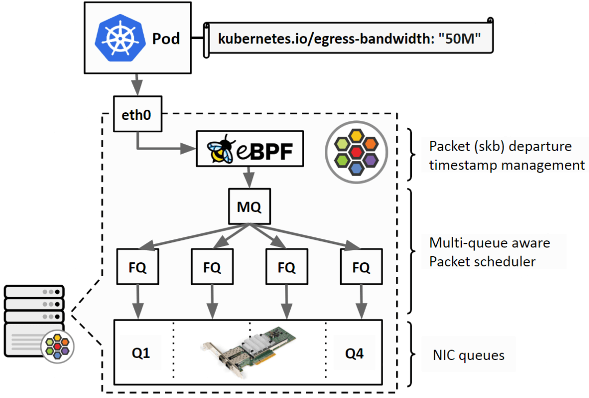
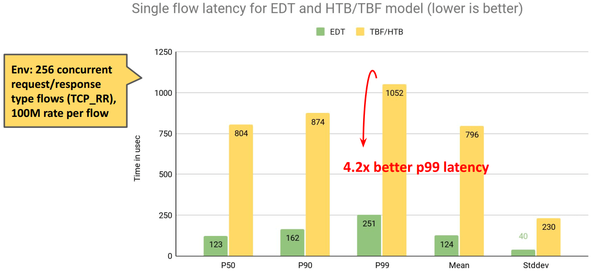
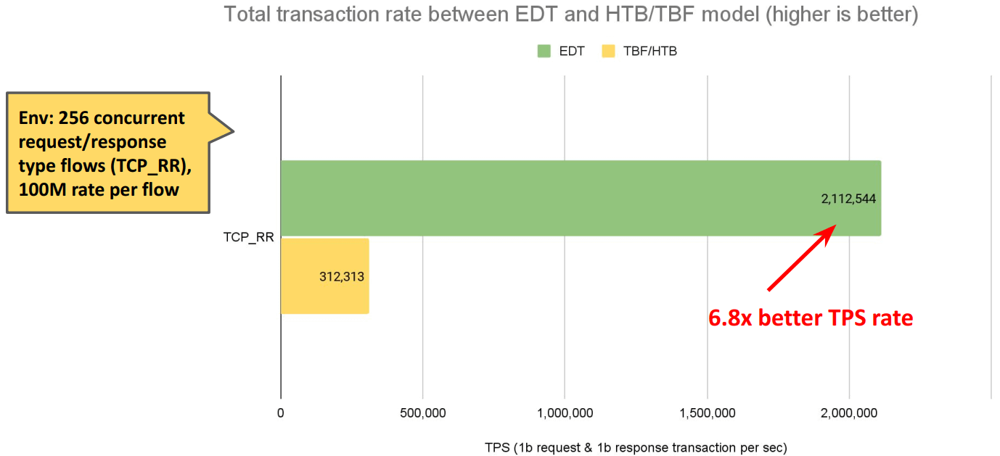

# Bandwidth Manager

## 1. 传统限速方案

通过CNI给容器设置 TBF qdisc，甚至为了支持 ingress shaping 使用 ifb 设备。

存在问题：

- 效率不高，多队列需要竞争锁；
- ifb 占用资源，效果不好；
- 可扩展性差；

## 2. cilium 限速工作原理

1. cilium 在物理设备 egress 方向上挂 `to-netdev` 程序，根据用户定义的限速带宽，为每个包设置一个departure time；
2. 在物理设备上设置 FQ qdisc，FQ qdisc 会根据这个时间戳对包进行调度。保证不会早于这个时间戳将包发送出去。

``` shell
$ tc filter show dev eth0 egress
$ tc qdisc show dev eth0
```



## 3. 源码

```c
// bpf_lxc.c [from-container]
edt_set_aggregate(ctx, LXC_ID); // 将 endpoint id 记录到数据包中

// bpf_host.c [to-netdev]
{
    aggregate.id = edt_get_aggregate(ctx); // 读取 endpoint id
    info = map_lookup_elem(&THROTTLE_MAP, &aggregate); // 根据 endpoint id 从 cilium_throttle map 中查询带宽。
    // 比如Pod中设置：kubernetes.io/egress-bandwidth: "10M"
    // 10 Mbits/s = 10 * 1000 * 1000 / 8 = 1250000 B/s

	t = ctx->tstamp;
	if (t < now)
		t = now;
    delay = ((__u64)ctx_wire_len(ctx)) * NSEC_PER_SEC / info->bps; // 计算当前数据包需要延迟的纳秒数
    t_next = READ_ONCE(info->t_last) + delay; // 计算数据包离开时间
    if (t_next < t) {
    	WRITE_ONCE(info->t_last, t);
    	return CTX_ACT_OK;
    }
    // horizon 是 FQ 的一个配置项，表示一个时间长度。默认是 10s。如果一个包的时间戳离现在太远，就直接将这个包丢弃。
    if (t_next - now >= info->t_horizon_drop)
        return CTX_ACT_DROP;
    WRITE_ONCE(info->t_last, t_next);
    ctx->tstamp = t_next; // 记录时间戳到数据包中
    return CTX_ACT_OK;
}
```

## 4. 性能对比

延迟：



TPS：



## 5. BBR 支持

主机内的问题解决了，公网带宽管理怎么做呢？BBR

要求：内核v5.18以上。

原因：旧版内核，**跨 netns时，skb->tstamp被重置了**。5.18后解决了。

## 参考

[cilium: Bandwidth Manager](https://docs.cilium.io/en/stable/network/kubernetes/bandwidth-manager/)

[net_sched: sch_fq: add horizon attribute](https://github.com/torvalds/linux/commit/39d010504e6b)