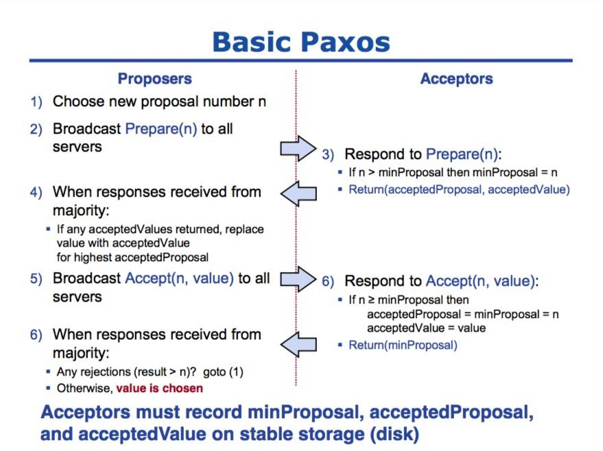

# Paxos

它能够让分布式网络中的节点在出现错误时仍然保持一致。

- Basic Paxos
- Multi Paxos
- Cheap Paxos

使用 Paxos 作为共识算法的分布式系统中，节点都会有三种身份，分别是 Proposer、Acceptor 和 Learner。

### 1. Basic Paxos

在整个共识算法运行的过程中，Proposer 负责提出提案并向 Acceptor 分别发出两次 RPC 请求，Prepare 和 Accept；Acceptor 会根据其持有的信息 minProposal、acceptedProposal 和 acceptedValue 选择接受或者拒绝当前的提案，当某一个提案被过半数的 Acceptor 接受之后，我们就认为当前提案被整个集群接受了。

