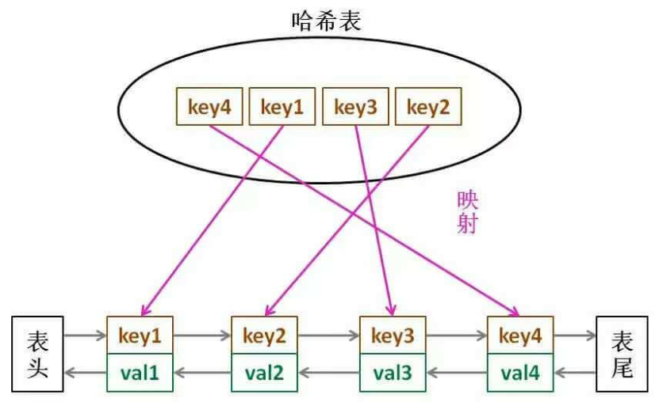

# 设计 LRU 缓存

LRU（Least Recently Used）

算法设计：

- put 和 get 方法的时间复杂度为 O(1)；
- 借助`哈希表`，来快速查询缓存中的KV（Key--LinkNode）；
- 借助`双向链表`，将最近使用的元素放在头部；

**为什么采用双向链表？**（访问元素后，需要将节点调整到链表头；这样就需要先从链表删除节点，然后插入链表头部。）（双向链表才能做到O(1)时间删除节点）

**为什么链表节点还需要存储 Key？**（缓存有固定容量，就是说当容量满时，需要从链表尾部删除节点；这时候就需要知道删除节点的Key，才能同时删掉哈希表中的KV）

