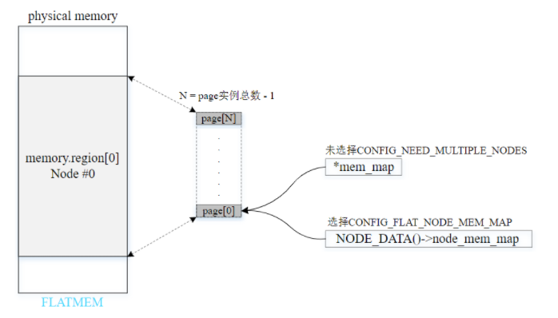
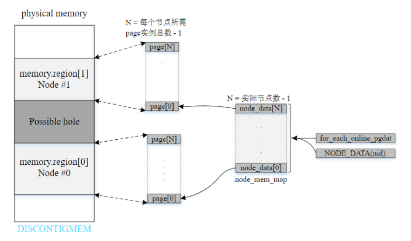

# 物理内存模型

## 1. 内存架构

### 1.1. UMA（Uniform Memory Access）

一致性内存访问


### 1.2. NUMA（Uniform Memory Access）

非一致性内存访问


## 2. 内存模型

### 2.1. FLATMEM

平坦内存模型：

- 内存连续且不存在空隙
- 多用于UMA系统



### 2.2. DISCONTIGMEM

不连续内存模型：

- 多个内存节点不连续且存在空隙
- 已废弃



### 2.3. SPARSMEM

稀疏内存模型：

- 多个内存区域不连续且存在空隙
- 支持内存热插拔（hot-plug）
- x86或ARM64采用 `SPARSMEM_VMEMMAP` 变种，性能更优，跟FLATMEM相当
- 以section为单位管理 online 和 hot-plug 内存

稀疏内存模型以`固定大小的单元`（`内存段section`）（大小为MB~GB不等）统一管理分散的内存，易于内存管理。结构体`struct mem_section`管理一个section，并通过section_mem_map成员指向一个页帧描述符数组（page数组），数组元素数量为PAGES_PER_SECTION。

两种方法管理不同数量的section：

- CONFIG_SPARSEMEM_STATIC：通常用于大多数32位系统，编译时就确定section数量。
- CONFIG_SPARSEMEM_EXTREME：通常用于大多数64位系统和section较多的情况。如果内存中存在较大的空隙，使用两级section管理数组能够减少内存的浪费。初始化时创建第一级管理数组，只有在必要时才创建第二级管理数组。

```bash
struct mem_section {
	/*
	 * This is, logically, a pointer to an array of struct
	 * pages.  However, it is stored with some other magic.
	 * (see sparse.c::sparse_init_one_section())
	 *
	 * Additionally during early boot we encode node id of
	 * the location of the section here to guide allocation.
	 * (see sparse.c::memory_present())
	 *
	 * Making it a UL at least makes someone do a cast
	 * before using it wrong.
	 */
	unsigned long section_mem_map;
	...
}

#ifdef CONFIG_SPARSEMEM_EXTREME
struct mem_section **mem_section;
#else
struct mem_section mem_section[NR_SECTION_ROOTS][SECTIONS_PER_ROOT]
	____cacheline_internodealigned_in_smp;
#endif
EXPORT_SYMBOL(mem_section);
```

启用CONFIG_SPARSEMEM_EXTREME的例子：


## 3. 参考

https://www.kernel.org/doc/html/v5.3/vm/memory-model.html