# 内存管理

## 1. 内存管理的发展

### 1.1. 早期内存管理

早期的内存管理，大家都运行在物理内存上，内核和进程运行在一个空间中。
内存分配算法有：首次适应算法（FirstFit）、最佳适应算法（BestFit）、最差适应算法（WorstFit）

存在的问题：

- 内核和进程之间没有隔离，进程可以随意访问内核数据。
- 内核和进程没有权限的区分，进程可以随意做敏感操作。
- 当时物理内存非常少，能同时运行的进程少

### 1.2. 分段内存管理

在分段内存中，软件把物理内存分成一个一个的段，每个段都有段基址和段限长，还有段类型和段权限。

`段基址和段限长`确定一个段的范围，防止内存访问越界。
`段类型`分为代码段和数据段。代码段是只读和可执行的；数据段分为只读数据段和读写数据段。
`段权限`分为有特权（内核权限）和无特权（用户权限）。

分段内存管理解决的问题：

- 内核和进程的隔离实现了。
- CPU特权实现了，进程无法再执行敏感指令了。
- 内存访问安全性提高了，一定程度上遏制了越界访问。

存在的问题：

- **物理内存非常少**（当时是让进程自己解决，编写程序时要想好让关联不大的模块占用相同的物理地址，然后动态加载待运行的模块）

### 1.3. 分页内存管理

也叫**虚拟内存管理**。

**<u>【Q：什么是虚拟内存？解决了什么问题？】</u>**

在虚拟内存中，CPU访问任何内存都是通过虚拟内存地址访问的，但实际上最终访问内存还是用物理内存地址。所以在CPU中存在一个MMU，负责把虚拟地址转化为物理地址，然后再去访问内存。

MMU把虚拟地址转化为物理地址，需要使用页表，页表是由内核负责创建和维护的。

【实现了 进程之间的隔离】

一套页表用来表达一个虚拟内存空间，不同的进程可以用不同的页表集，页表集可以不停的切换，哪个进程正在运行就切换到哪个进程的页表集。所以**一个进程就只能访问自己的虚拟内存空间，而访问不了别人的虚拟内存空间。**

【实现了 内核和进程之间的隔离】

一个虚拟内存空间分为两部分：内核空间和用户空间。
内核空间只有一个，用户空间有N个，所有的虚拟内存空间都共享同一个内核空间。内核运行在内核空间，进程运行在用户空间，内核空间有特权，用户空间无特权，用户空间不能随意访问内核空间。

【实现了 权限管理】

CPU运行内核空间代码时，会把自己设置为特权模式，可以执行所有指令。CPU运行用户空间代码时，把自己设置为用户模式，只能执行普通指令。

【解决了 物理内存不足】

系统刚启动时运行在物理内存上的，内核也被全部加载到物理内存。然后内核建立页表体系并开启分页机制，内核的物理内存和虚拟内存就建立映射了，整个系统就运行在虚拟内存上了。

内核会记录进程的虚拟内存分配情况，但是并不会马上分配物理内存建立页表映射，而是让进程先运行着。
进程运行的时候，CPU通过MMU访问虚拟内存时，MMU会用页表去解析虚拟内存，如果找到了对应的物理地址就直接访问，如果页表项是空的，就会触发**缺页异常**，在缺页异常中会去分配物理内存并建立页表映射。然后重新执行指令，CPU通过MMU访问到物理内存。
当物理内存不足时，内核还会把一部分物理内存解除映射，把其内容放到外存中，等其再次需要的时候再加载回来。这样一个进程运行的时候并不需要立马加载其全部内容到物理内存，进程只需要少量的物理内存就能顺利地运行，于是系统运行进程的吞吐量就大大提高了。

### 1.4. 内存管理的目标

- 进程之间的隔离
- 内核与进程之间的隔离
- 减少物理内存并发使用的数量
- 减少内存碎片。（包括外部碎片和内部碎片）
	- 外部碎片：指还在内存分配器中的碎片，由于比较分散，无法满足大块连续内存分配。
	- 内部碎片：指你申请了5个字节，分配器给你分配了8个字节的内存。这3个字节是内部碎片。
- 内存分配接口要灵活多样。（既能满足大块连续内存分配，又能满足小块零碎内存分配）
- 内存分配效率要高。
- 提供物理内存的利用率。（及时回收物理内存，内存压缩）

### 1.4. 内存管理体系

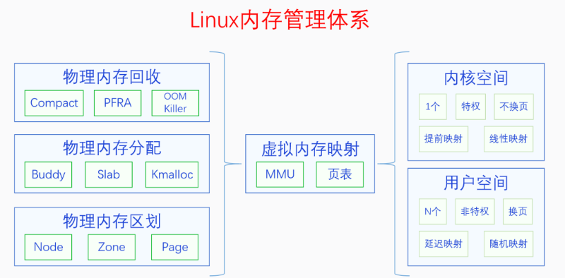

虚拟内存空间分为两部分：内核空间和用户空间。

|      |内核空间|用户空间|
| ---- | ---- | ---- |
| 个数  | 1个  | N个  |
|页表映射|在内核启动的早期建立|在程序运行过程中通过缺页异常逐步建立|
|映射方式|线性映射|随机映射（用户空间页表是运行时动态创建的）|
|是否换页|不换页|会换页|

换页是内存回收中的操作。内核页表建立好之后就不会取消了，用户页表可能会因为内存回收而取消。

## 2. 物理内存区划

三级区划：`Node -> Zone -> Page`

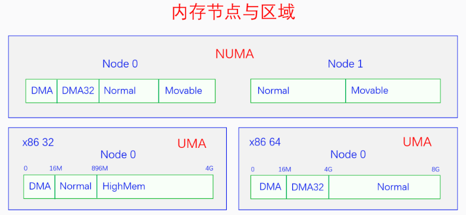

### 2.1. 节点

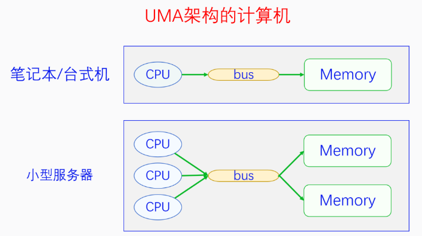


**<u>【Q：物理内存为什么划分节点？】</u>**

当一个系统中的CPU、内存越来越多的时候，内存总线就会成为一个系统的瓶颈。于是可以把一部分CPU和一部分内存直连在一起，构成一个节点，不同节点之前CPU访问内存采用间接方式。节点内的内存访问速度就会很快，节点之间的内存访问虽然慢，但可以尽量减少节点之间的内存访问，这样系统总的内存访问速度就会很快。

Linux代码中对UMA和NUMA是统一处理的，把UMA看成一个只有一个节点的NUMA。控制内核编译选项CONFIG_NUMA来定义支持情况。

```c
// 节点描述符
typedef struct pglist_data {
} pg_data_t;

// 对于UMA，定义唯一的一个节点
#ifndef CONFIG_NUMA
struct pglist_data __refdata contig_page_data;
EXPORT_SYMBOL(contig_page_data);
#endif
static inline struct pglist_data *NODE_DATA(int nid)
{
 return &contig_page_data;
}

// 对于NUMA，定义节点指针数组
struct pglist_data *node_data[MAX_NUMNODES] __read_mostly;
EXPORT_SYMBOL(node_data);
#define NODE_DATA(nid)  (node_data[nid])
```

### 2.2. 区域

**<u>【Q：内存节点为什么划分区域？】</u>**

主要是因为各种软硬件的限制。Linux目前最多有6个区域，并不是每个区域都必然存在。

- **`ZONE_DMA`**：由CONFIG_ZONE_DMA决定是否存在。早期ISA总线上的DMA控制器只有24根地址总线，只能访问16M物理内存。为了兼容老设备，专门开辟前16M物理内存作为一个区域。
- **`ZONE_DMA32`**：由CONFIG_ZONE_DMA32决定是否存在。后来DMA控制器有32根地址总线，可以访问4G物理内存了。但32位系统上最多只支持4G物理内存，所以没必要专门划分一个区域。但64位系统的时候，CPU支持48位~52位，需专门划分一个区域给32位的DMA控制器使用。
- **`ZONE_NORMAL`**：常规内存，必然存在。
- **`ZONE_HIGHMEM`**：高端内存，由CONFIG_HIGHMEM决定是否存在。只有在32位系统上有，因为32位系统内核空间只有1G，这1G虚拟空间中有128M用于其他用途，所以只有896M的虚拟内存空间用于直接映射物理内存。而32位系统支持的物理内存有4G，大于896M的物理内存无法直接映射到内核空间，所以把他们划分为高端内存。64位系统不需要高端内存区域。
- **`ZONE_MOVABLE`**：可移动内存，必然存在，用于可热插拔的内存。
- **`ZONE_DEVICE`**：设备内存，由CONFIG_ZONE_DEVICE决定是否存在。用于放置持久内存（掉电后内容不消失）

```c
typedef struct pglist_data {
	struct zone node_zones[MAX_NR_ZONES];
} pg_data_t;

// 区域描述符
struct zone {
	const char		*name;
};
```

### 2.3. 页面

**<u>【Q：内存区域为什么划分页面？】</u>**

内存页面不是因为硬件限制才有的，主要是出于逻辑原因才有的。页面是分页内存机制和底层内存分配的最小单元。

如果没有页面，直接以字节为单位管理太麻烦。页面太大或太小都不好，还需要是2的整数次幂，4K就非常合适。为什么选4K？最早Intel的选择，后面大部分CPU跟着选4K作为页面大小了。

```c
struct page {
	unsigned long flags;	// 页状态
	atomic_t _refcount;		// 引用计数
	void *virtual;			// 虚拟地址 Kernel virtual address (NULL if not kmapped, ie. highmem) 
} _struct_page_alignment;
```

## 3. 物理内存分配

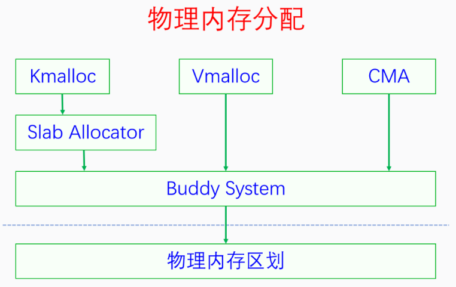

### 3.1. 伙伴系统

伙伴系统管理的内存并不是全部的物理内存，而是内核在完成初步的初始化之后的`未使用内存`。内核在刚启动的时候，使用`memblock`来做早期内存分配。当基础初始化完成后，就会把所有剩余可用的物理内存交给伙伴系统来管理。

伙伴系统不是管理一个个页帧的，而是把页帧组成页块来管理。页块由2^n个页帧组成，n叫阶，n的范围是[0, 10]。
**`页帧对齐`**：首页帧的页帧号(pfn)必须能够除尽2^n。（比如3阶页块的首页帧必须除8能够除尽）

```c
// 区域描述符
struct zone {
	struct free_area	free_area[MAX_ORDER];
};

// 伙伴系统的管理数据
struct free_area {
	struct list_head	free_list[MIGRATE_TYPES];
	unsigned long		nr_free;
};
```

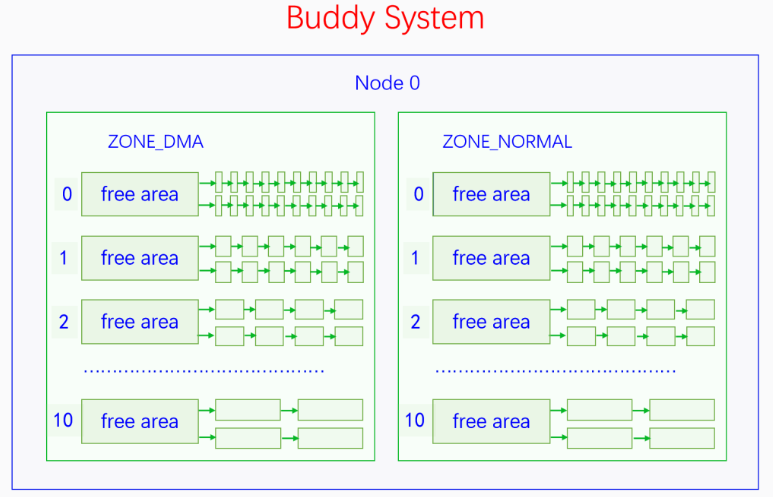

**<u>【Q：伙伴系统的算法逻辑？】</u>**

伙伴系统对外提供的接口只能分配某一阶的页块，并不能随意分配若干个页帧。当分配n阶页块时，伙伴系统会优先查找n阶页块的链表，如果不为空的话就拿出来一个分配。如果为空的就去找n+1阶页块的链表，如果不为空的话，就拿出来一个，并分成两个n阶页块，其中一个加入n阶页块的链表中，另一个分配出去。重复此逻辑，直到找到10阶页块的链表。

如果10阶页块的链表也是空的话，那就去找后备迁移类型的页块去分配，此时从最高阶的页块链表往低阶页块的链表开始查找，直到查到为止。如果后备页块也分配不到内存，那么就会进行内存回收。

用户用完内存还给伙伴系统的时候，需要先进行合并（取当前页块的前面或后面的free且同阶页块进行合并），直到无法合并为止，然后将其插入到对应的页块链表中。合并的时候需要满足`页帧对齐`的要求。

```c
// 分配 1 << order 个连续的物理页，返回指向首页的指针
struct page *alloc_pages(gfp_t gfp, unsigned int order);
void __free_pages(struct page *page, unsigned int order);
```

参数`gfp`：分为两类标记，一类指定分配区域，一类指定分配行为。

**<u>【Q：是不是指定了哪个区域就只能在哪个区域分配内存呢？】</u>**

每个区域都有后备区域，当区域内存不足时，就会从后备区域中分配内存。

```c
// 节点描述符
typedef struct pglist_data {
	// 后备区域
	struct zonelist node_zonelists[MAX_ZONELISTS];
} pg_data_t;

enum {
	ZONELIST_FALLBACK,	/* zonelist with fallback */
#ifdef CONFIG_NUMA
	/*
	 * The NUMA zonelists are doubled because we need zonelists that
	 * restrict the allocations to a single node for __GFP_THISNODE.
	 */
	ZONELIST_NOFALLBACK,	/* zonelist without fallback (__GFP_THISNODE) */
#endif
	MAX_ZONELISTS
};
```

在UMA上，后备区域只有一个链表，就是本节点内的后备区域。
在NUMA上，后备区域有两个链表，包括本节点、其他节点的后备区域。

```c
enum zone_type {
#ifdef CONFIG_ZONE_DMA
	ZONE_DMA,
#endif
#ifdef CONFIG_ZONE_DMA32
	ZONE_DMA32,
#endif
	ZONE_NORMAL,
#ifdef CONFIG_HIGHMEM
	ZONE_HIGHMEM,
#endif
	ZONE_MOVABLE,
#ifdef CONFIG_ZONE_DEVICE
	ZONE_DEVICE,
#endif
	__MAX_NR_ZONES
};
```
对于本节点的后备区域，按照区域类型的ID排列的（降序）。前面的区域内存不足时，可以从后面的区域分配内存，反过来则不行。
对于其他节点的后备区域，除了上诉规则，还会考虑是按照`节点优先`排列还是按照`区域类型优先`排列。

### 3.2. Slab 分配器

`slob`：针对嵌入式系统优化
`slub`：针对内存比较多的系统优化

由于现在计算机内存都比较大，除了嵌入式系统外，内核默认使用**`slub`**。


```c
struct kmem_cache *kmem_cache_create(const char *name, unsigned int size,
	unsigned int align, slab_flags_t flags, void (*ctor)(void *));
void kmem_cache_destroy(struct kmem_cache *);
void *kmem_cache_alloc(struct kmem_cache *, gfp_t flags);
void kmem_cache_free(struct kmem_cache *, void *);
```

slab从伙伴系统中申请一个order为0的页，然后把这一页分成很多小的object。当我们使用时，从slab中获取一个object，用完了归还给slab即可。


```c
// 高速缓存描述符，用于管理slab缓存
struct kmem_cache {
	// 对于每个CPU，相当于一个本地内存缓存池，当分配内存时，优先从本地CPU分配内存以保证cache命中率。
	struct kmem_cache_cpu __percpu *cpu_slab;

	unsigned int size;	/* The size of an object including metadata */
	unsigned int object_size;/* The size of an object without metadata */
	const char *name;	/* Name (only for display!) */
	
	// 系统有个slab_caches链表，所有slab都会挂入此链表
	struct list_head list;	/* List of slab caches */
	
	// NUMA系统中，每个node都有一个kmem_cache_node，相当于共享内存缓存池
	struct kmem_cache_node *node[MAX_NUMNODES];
};

// 描述本地内存缓存池
struct kmem_cache_cpu {
	void **freelist;	/* Pointer to next available object */
	unsigned long tid;	/* Globally unique transaction id */
	
	// slab 内存的page指针
	struct page *page;	/* The slab from which we are allocating */
#ifdef CONFIG_SLUB_CPU_PARTIAL
	// 本地slab partial链表，是一些部分分配了object的slab
	struct page *partial;	/* Partially allocated frozen slabs */
#endif
};

// 描述共享内存池
struct kmem_cache_node {
	spinlock_t list_lock;
#ifdef CONFIG_SLUB
	// slab 节点中slab的数量
	unsigned long nr_partial;
	// partial链表
	struct list_head partial;
#endif
};
```

高速缓存被划分为slab，slab由一个或多个连续物理页组成。一般情况下，slab由一页组成。

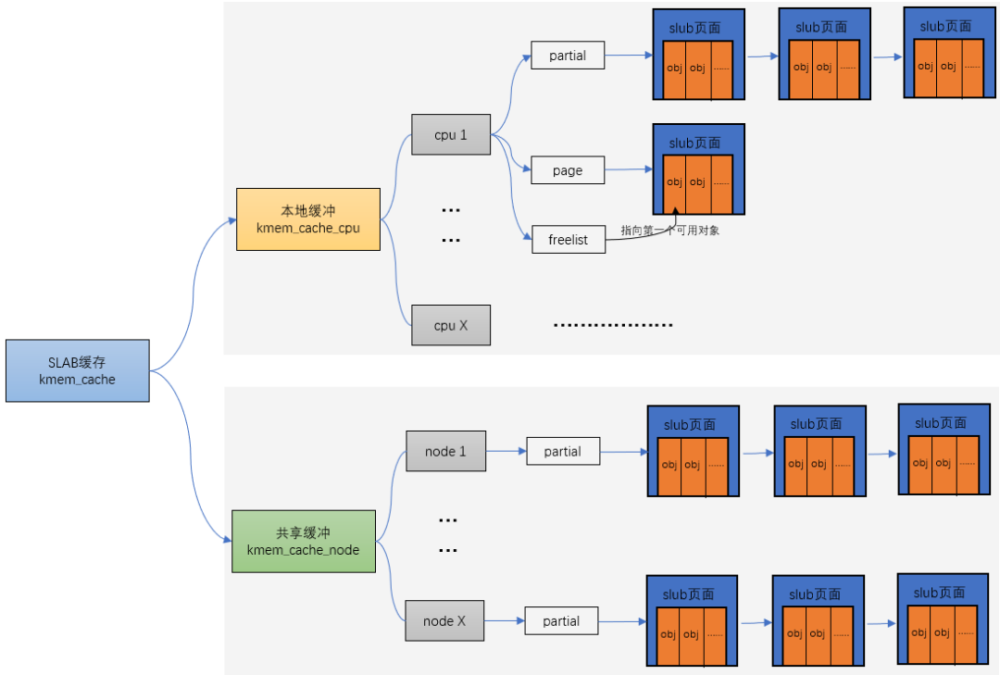

```c
kmem_cache_create
	create_cache
		kmem_cache_zalloc // 1. 分配kmem_cache结构
			kmem_cache_alloc
				slab_alloc
					slab_alloc_node
		__kmem_cache_create // 2. 初始化kmem_cache结构
			kmem_cache_open
		list_add // 3. 将创建的kmem_cache添加到全局链表slab_caches中，构成slab缓存池
```

```c
kmem_cache_alloc
    slab_alloc
        slab_alloc_node
            if (!object) // 如果kmem_cache_cpu里的freelist没有可用的object
                __slab_alloc
                    ___slab_alloc
                      slub_percpu_partial  // 2.接着去 kmem_cache_cpu->partital链表中分配，如果此链表为null
                      new_slab_objects
                          get_partial  // 3.接着去 kmem_cache_node->partital链表分配，如果此链表为null
                          new_slab  // 4.这就需要重新分配一个slab了。
                              allocate_slab 
            else
                get_freepointer_safe  // 1.先从 kmem_cache_cpu->freelist中分配，
```

### 3.3. kmalloc

kmalloc底层用的是slab机制，kmalloc在启动的时候会预先创建一些不同大小的slab，用户请求分配任意大小的内存，kmalloc都会寻找大小刚好合适的slab来分配内存。

```c
void *kmalloc(size_t size, gfp_t flags);
void kfree(const void *);
```

系统启动时，会调用create_kmalloc_caches，来创建不同大小的kmem_cache，并存储在kmalloc_caches中。

```c
/*
 * kmalloc_info[] is to make slub_debug=,kmalloc-xx option work at boot time.
 * kmalloc_index() supports up to 2^25=32MB, so the final entry of the table is
 * kmalloc-32M.
 */
const struct kmalloc_info_struct kmalloc_info[] __initconst = {
	INIT_KMALLOC_INFO(0, 0),
	INIT_KMALLOC_INFO(96, 96),
	INIT_KMALLOC_INFO(192, 192),
	INIT_KMALLOC_INFO(8, 8),
	INIT_KMALLOC_INFO(16, 16),
	INIT_KMALLOC_INFO(32, 32),
	INIT_KMALLOC_INFO(64, 64),
	INIT_KMALLOC_INFO(128, 128),
	INIT_KMALLOC_INFO(256, 256),
	INIT_KMALLOC_INFO(512, 512),
	INIT_KMALLOC_INFO(1024, 1k),
	INIT_KMALLOC_INFO(2048, 2k),
	INIT_KMALLOC_INFO(4096, 4k),
	INIT_KMALLOC_INFO(8192, 8k),
	INIT_KMALLOC_INFO(16384, 16k),
	INIT_KMALLOC_INFO(32768, 32k),
	INIT_KMALLOC_INFO(65536, 64k),
	INIT_KMALLOC_INFO(131072, 128k),
	INIT_KMALLOC_INFO(262144, 256k),
	INIT_KMALLOC_INFO(524288, 512k),
	INIT_KMALLOC_INFO(1048576, 1M),
	INIT_KMALLOC_INFO(2097152, 2M),
	INIT_KMALLOC_INFO(4194304, 4M),
	INIT_KMALLOC_INFO(8388608, 8M),
	INIT_KMALLOC_INFO(16777216, 16M),
	INIT_KMALLOC_INFO(33554432, 32M)
};
```

**<u>【Q：kmalloc最大可以分配多少内存？】</u>**

不同系统配置，支持情况不同。直接看代码。

```c
kmalloc
	// slab 实现
	__kmalloc
		__do_kmalloc
			// 最大申请内存 4M
			if (unlikely(size > KMALLOC_MAX_CACHE_SIZE))
				return NULL;

	// slub 实现
	__kmalloc
		// 如果大于 8K，直接使用alloc_pages申请内存。
		// 这里可以看到这里已经不属于slub管理器了，直接使用了伙伴系统。
		if (unlikely(size > KMALLOC_MAX_CACHE_SIZE))
			return kmalloc_large(size, flags);
				kmalloc_order
					alloc_pages

	// slob 实现
	__kmalloc
		__do_kmalloc_node
			slob_new_pages
				alloc_pages
```

### 3.4. vmalloc

```c
void *vmalloc(unsigned long size);
void vfree(const void *addr);
```

kmalloc：分配的内存，虚拟地址和物理地址都是连续的。
vmalloc：分配的内存，虚拟地址是连续的，物理地址不一定是连续的。

vmalloc最小分配一个page，并且分配到的页面不保证是连续的，vmalloc内部调用alloc_page多次分配单个页面。
vmalloc的区域就是在VMALLOC_START - VMALLOC_END之间。

```c
// 管理虚拟地址和物理页之间的映射关系
struct vm_struct {
	struct vm_struct	*next;			// 指向下一个vm_struct
	void			*addr;				// 当前vmalloc区域虚拟地址的起始地址
	unsigned long		size;			// 当前vmalloc区域虚拟地址的大小
	struct page		**pages;			// vmalloc分配获取的物理页并不是连续的，vm_struct管理的所有物理页构成一个数组，pages是指向这个数组的指针
	unsigned int		nr_pages;		// vmalloc映射的page数目
	const void		*caller;			// 调用vmalloc函数的函数的地址
};

// 描述一段虚拟地址的区域，可以将vm_struct构成一个链表，维护多段映射。
struct vmap_area {
	unsigned long va_start;		// vmalloc申请虚拟地址返回的起始地址
	unsigned long va_end;		// vmalloc申请虚拟地址返回的结束地址

	struct rb_node rb_node;         /* address sorted rbtree */
	struct list_head list;          /* address sorted list */

	/*
	 * The following two variables can be packed, because
	 * a vmap_area object can be either:
	 *    1) in "free" tree (root is vmap_area_root)
	 *    2) or "busy" tree (root is free_vmap_area_root)
	 */
	union {
		unsigned long subtree_max_size; /* in "free" tree */
		struct vm_struct *vm;           /* in "busy" tree */
	};
};
```

vmalloc步骤：
1. 从VMALLOC_START到VMALLOC_END查找空闲的虚拟地址空间
2. 根据分配的size,调用alloc_page依次分配单个页面
3. 把分配的页面，映射到第一步中找到的连续虚拟地址

```c
vmalloc
	__vmalloc_node_range(VMALLOC_START, VMALLOC_END)
		__get_vm_area_node
			kzalloc_node	// 从slab分配vm_struct结构
			alloc_vmap_area	
				kmem_cache_alloc_node	// 分配vmap_area结构
				__alloc_vmap_area		// 在虚拟地址范围内找到空的映射空间
				insert_vmap_area(&vmap_area_root, &vmap_area_list); // 插入全局红黑树和全局链表
			setup_vmalloc_vm	// 绑定vm_struct和vmap_area
		__vmalloc_area_node
			alloc_page			// 分配页面
			vmap_pages_range	// 建立页表映射关系（pgd -> p4d -> pud -> pmd -> pte）
				vmap_range_noflush
					vmap_p4d_range
						vmap_pud_range
							vmap_pmd_range
								vmap_pte_range
```

### 3.5. CMA

CMA（Contiguous Memory Allocator，连续内存分配）是Linux内存管理系统的扩展。

【工作原理】：预留一段的内存给驱动使用，但当驱动不用的时候，memory allocator（buddy system）可以分配给用户进程用作匿名内存或者页缓存。而当驱动需要使用时，就将进程占用的内存通过回收或者迁移的方式将之前占用的预留内存腾出来， 供驱动使用。

## 4. 物理内存回收

回收时机可以分为 `同步回收` 和 `异步回收` ，

- `同步回收`：是指在分配内存的时候发现无法分配到内存就进行回收，
- `异步回收`：是指有专门的线程定期进行检测，如果发现内存不足就进行回收。

内存回收的类型有两种：

- `内存规整`：就是内存碎片整理，它不会增加可用内存的总量，但是会增加连续可用内存的量
- `页帧回收`：把物理页帧的内容写入到外存中去，然后解除其与虚拟内存的映射，这样可用物理内存的量就增加了

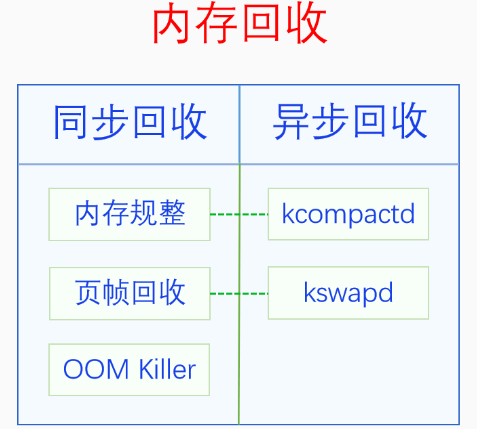

## 5. 物理内存压缩


## 6. 虚拟内存访问


CPU把虚拟内存地址发送给MMU，MMU把虚拟内存地址转换为物理内存地址，然后再用物理内存地址通过MC(内存控制器)访问内存。

### 6.1. MMU

Linux内核最多支持五级页表，在五级页表体系中，每一级页表分别叫做PGD、P4D、PUD、PMD、PTE。
MMU是通过遍历页表把虚拟地址转换为物理地址的。

### 6.2. 缺页异常

MMU在解析虚拟内存时如果发现了读写错误或者权限错误或者页表项无效，就会触发缺页异常让内核来处理。

```c
__handle_mm_fault
	pgd = pgd_offset(mm, address);				// 查找页全局目录，获取地址对应的表项
	p4d = p4d_alloc(mm, pgd, address);			// 查找页四级目录表项，没有则创建
	vmf.pud = pud_alloc(mm, p4d, address);		// 查找页上级目录表项，没有则创建
	vmf.pmd = pmd_alloc(mm, vmf.pud, address);	// 查找页中级目录表项，没有则创建
	handle_pte_fault(&vmf);						// 处理PTE页表项
		// 匿名页 do_anonymous_page
		// 文件页 do_fault
		// 页表项存在，但页不在内存中 do_swap_page
		// 页在内存中，但没有写权限，写时复制 do_wp_page
```


#### 6.2.1. do_anonymous_page

匿名页缺页异常，对于匿名映射，**映射完成之后，只是获得了一块虚拟内存，并没有分配物理内存**，当第一次访问的时候：

1. 如果是读访问，会将虚拟页映射到 `零页` ，以减少不必要的内存分配
2. 如果是写访问，用alloc_zeroed_user_highpage_movable分配新的物理页，并用0填充，然后映射到虚拟页上去
3. 如果是先读后写访问，则会发生两次缺页异常：第一次是匿名页缺页异常的读的处理（虚拟页到 `零页` 的映射），第二次是写时复制缺页异常处理。

`零页`：一个特殊的物理页，值全部为0
```c
unsigned long empty_zero_page[PAGE_SIZE / sizeof(unsigned long)];
```

```c
do_anonymous_page
	// 读访问
	pte_mkspecial		// 设置页表项的值映射到 0页
	set_pte_at			// 设置页表项
	update_mmu_cache	// 更新cpu的tlb页表缓存
	// 读访问 结束
	
	// 写访问
	alloc_zeroed_user_highpage_movable	// 分配一个高端可迁移的被0填充的物理页
	mk_pte					// 生成页表项
	pte_mkwrite				// 如果有 写 权限，设置flag为脏且读写
	page_add_new_anon_rmap	// 建立物理页到虚拟页的反向映射
	lru_cache_add_inactive_or_unevictable	// 把物理页添加到lru链表中
```

#### 6.2.2. do_fault

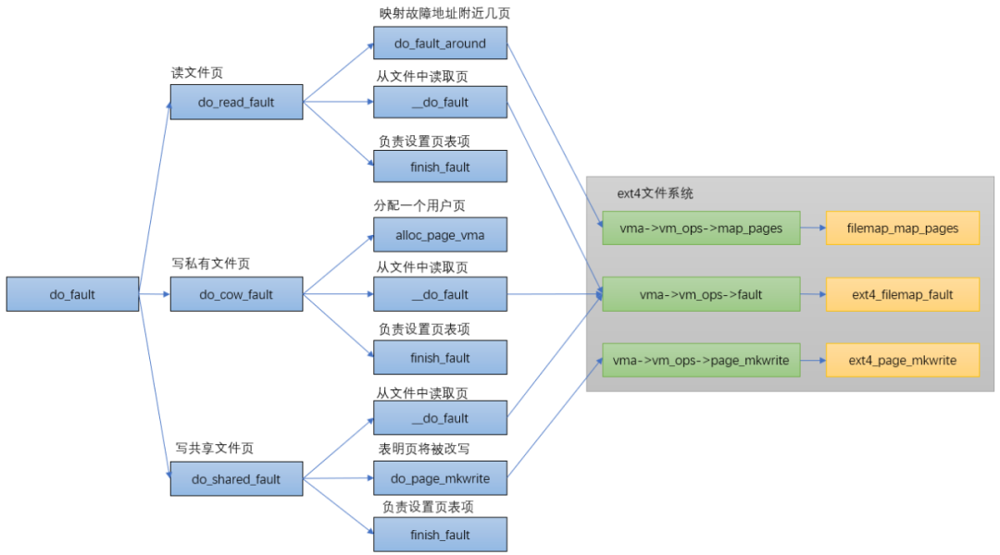

#### 6.2.3. do_swap_page


#### 6.2.4. do_wp_page

页面在内存中，只是PTE只有读权限，而又要写内存的时候就会触发do_wp_page。

do_wp_page函数用于处理 写时复制（copy on write），主要是**分配新的物理页，拷贝原来页的内容到新页，然后修改页表项内容指向新页并修改为可写(vma具备可写属性)。**

```c
do_wp_page
	wp_page_copy	// 复制物理页，将虚拟页映射到物理页
		alloc_page_vma
		cow_user_page
		maybe_mkwrite
		page_add_new_anon_rmap
		lru_cache_add_inactive_or_unevictable
```

## 7. 进程内存管理

一个进程的虚拟地址空间主要右两个数据结构来描述：`mm_struct`、`vm_area_struct`

```c
// 进程描述符
struct task_struct {
	struct mm_struct		*mm;
};
```

```c
// 描述一个进程的整个虚拟地址空间
struct mm_struct {
	struct vm_area_struct *mmap;	// VMA链表 /* list of VMAs */
	struct rb_root mm_rb;			// 红黑树
	unsigned long mmap_base;	/* base of mmap area */
	int map_count;					// VMA的个数 /* number of VMAs */
	
	// 代码段、数据段
	unsigned long start_code, end_code, start_data, end_data;
	// start_brk 堆的起始地址
	// brk 当前堆的结束地址（堆大小会根据申请/释放进行扩展和收缩）
	// start_stack 栈的起始地址
	unsigned long start_brk, brk, start_stack;
	// 参数段、环境变量段
	unsigned long arg_start, arg_end, env_start, env_end;
};
```

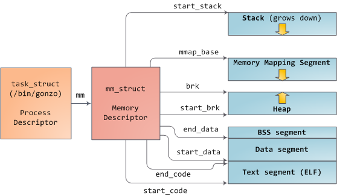

```c
// 描述虚拟地址空间的一个区间（称为VMA）
struct vm_area_struct {
	/* The first cache line has the info for VMA tree walking. */
	// 第一个缓存行

	// 区间的开始和结束地址
	unsigned long vm_start;
	unsigned long vm_end;
	
	/* linked list of VM areas per task, sorted by address */
	// VMA链表，按地址排序
	struct vm_area_struct *vm_next, *vm_prev;

	/* Second cache line starts here. */
	// 第二个缓存行

	struct mm_struct *vm_mm;	/* The address space we belong to. */
	pgprot_t vm_page_prot;		/* Access permissions of this VMA. */
} __randomize_layout;
```

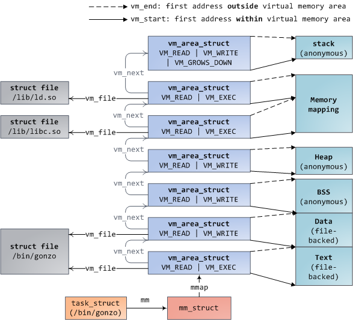


链表是为了插入/删除方便，而红黑树是为了查找方便。

**<u>【Q：为什么栈和堆的生长方向不一样？】</u>**

历史原因：
首先，在没有MMU的时代，为了最大利用内存空间，堆和栈被设计为从两端相向生长。
人们习惯于把低元素放在低地址，高元素放在高地址，所以堆向上生长比较符合习惯。
而栈只有push和pop操作，对方向不敏感，所以就把堆放在了低端，栈放在了高端。
MMU出来之后就无所谓了，也没必要改。

### 7.1. malloc

在linux标准libc库，`malloc`函数的实现会根据分配内存的size来决定使用哪个分配函数，

- 当size小于等于128KB时，调用 `brk` 分配；
- 当size大于128KB时，调用 `mmap` 分配内存。

size可由 `M_MMAP_THRESHOLD` 选项调节。

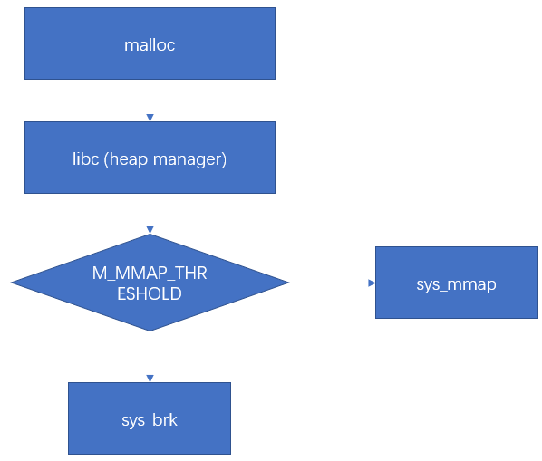

- sys_brk分配过过程主要是调整brk位置
- sys_mmap分配过程中主要是在堆和栈中间(memory mapping segment)找一段空闲的虚拟内存

#### 7.1.1. brk

堆内存是由低地址向高地址方向增长。分配内存时，将heap段的最高地址指针mm->brk往高地址扩展。释放内存时，把mm->brk向低地址收缩。

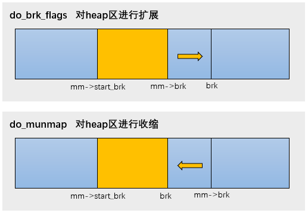

完成这段申请后，只是开辟了一段区域，通常还不会立马分配物理内存，物理内存的分配会发生在访问时出现缺页异常后再处理。

#### 7.1.2. mmap

- 私有匿名映射：通常用于内存分配，堆，栈
- 共享匿名映射：通常用于进程间共享内存，在内存文件系统中创建/dev/zero设备
- 私有文件映射：通常用于加载动态库，代码段，数据段
- 共享文件映射：通常用于文件读写和进程间通信

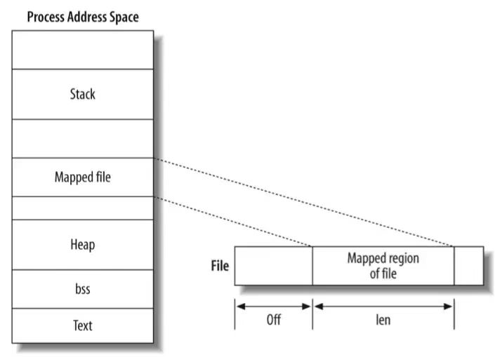