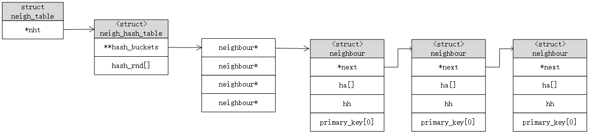

# 邻居子系统

给一个 L3 地址，找到对应的 L2 地址，称为 “L3地址的解析”。这个过程是由 `邻居协议` 完成的。

- IPv4 中使用 ARP （Address Resolution Protocol，地址解析协议）
- IPv6 中使用 NDP （Neighbor Discovery Protocol，邻居发现协议）

## 1. 概念

### 1.1. 什么是邻居

连接在同一个LAN上，且拥有相同的 L3 网络配置，那么就互为邻居。

### 1.2. 为什么需要邻居协议？

L3 是逻辑地址，它可以被随意改变。某些情况下，L3 地址到L2 地址的映射关系会发生变化。比如 动态配置（DHCP）、替换主机NIC（L2 变化）、L3 地址的移动（高可用）。

### 1.3. 什么情况下不需要邻居协议？

有时候 L3 地址到 L2 地址的映射不需要任何协议就能完成：

- 点对点介质连接
- 多播地址（可参考函数arp_mc_map、ip_eth_mc_map中的实现）
- 广播地址（FF:FF:FF:FF:FF:FF）

多播 IP -> MAC 规则：（比如 239.1.1.1 ->  01:00:5E:01:01:01）

- 最高 24 位指定由IANA分配的静态地址 01:00:5E
- 低 24 位的最高位设为 0
- 剩余的低 23 位直接复制相应IP地址的低 23 位

### 1.4. 请求和应答

请求（Neighbor Solicitation）：可以单播、多播、广播。
应答（Neighbor Advertisement）：通常为单播。特殊情况，可广播。

### 1.5. 通用邻居协议需要做哪些事情？

1. 缓存，存储 L3 -> L2 映射；
2. 缓存支持 add、del、update、get 等函数，查找必须要快；
3. 缓存的映射项提供一种老化机制；
4. 缓存满时且正好创建新的映射项，提供选择替换策略；
5. 为每个邻居提供一个请求队列。请求封包需要放入缓冲区，直到发出请求，并收到应答。

### 1.6. 邻居协议代理

并不是所有的 Solicitation 请求都会被代理服务器处理。代理服务器只有在满足下列条件才会应答：

- 请求的地址和代理服务器收到请求的接口上的配置的地址不属于同一个子网。否则目的主机和代理同时应答，发出方不知道应当选择哪一个。
- 必须启用代理功能。

基于设备：该设备接收的所有游戏请求都会被处理。

基于目的地址：代理可以对选定IP地址的请求做出应答。

### 1.7. NUD 状态转换

NUD：Network Unreachability Detection 网络不可到达性探测

- NUD_NONE：新创建的邻居项，还没有状态可用。
- NUD_INCOMPLETE：请求已经被发出，但还没有收到应答。这个状态下，不使用任何硬件地址。
- NUD_REACHABLE：邻居的地址已被缓存，并且知道该邻居是可到达的。
- NUD_FAILED：请求失败，将邻居标记为不可到达。
- NUD_STALE：缓存中包含一个邻居的地址，但该地址已经有一端时间没有进行确认了。当下一次有封包要到达这个邻居时，需要启动可到达性确认过程。
- NUD_DELAY：表示一种优化方式，减少 Solicitation 请求发送的次数。当发送封包到一个邻居，且其缓存项处于 NUD_STALE 状态时，就进入 NUD_DELAY 状态。该状态有时间窗口，这期间内内核不发出请求，作为一个优化方式。时间窗口内得到确认，缓存项状态就转为NUD_REACHABLE；得不到确认，就进入 NUD_PROBE 状态。
- NUD_PROBE：进入 NUD_PROBE 状态后，就开始进入 Solicitation 请求逻辑。

下面两个状态一旦被指定永远不会改变：

- NUD_PERMANENT：邻居的 L2 地址是静态配置（比如 ip neigh 命令下发），不需要邻居协议进行地址解析。
- NUD_NOARP：用于标记不要任何协议进行 L3 到 L2 地址映射的邻居。

### 1.7. 可到达性确认

两种方式：

- 来自单播的  Solicitation 应答。（处理广播应答时，缓存项状态会转移到 NUD_STALE ）
- 外部认证。（L4 调用dst_confirm_neigh函数，回调confirm_neigh函数指针，这其中只更新了neighbour->confirmed的时间戳；当邻居进入 NUD_DELAY 状态时，定时器负责将邻居状态更新为 NUD_REACHABLE 状态。）

所以一个邻居进入 NUD_REACHABLE 有以下方式：

 - 收到一个 Solicitation 应答
 - L4 认证
 - 人工配置

## 2. 基础结构

### 2.1. 数据结构

`neighbour` 存储邻居的有关信息。它与一个 L3 地址相关。

```c
struct neighbour {
	struct neighbour __rcu	*next;
	struct neigh_table	*tbl;
	struct neigh_parms	*parms;
	unsigned long		confirmed;
	unsigned long		updated;
	rwlock_t		lock;
	refcount_t		refcnt;
	unsigned int		arp_queue_len_bytes;
	struct sk_buff_head	arp_queue;
	struct timer_list	timer;
	unsigned long		used;
	atomic_t		probes;
	__u8			flags;
	__u8			nud_state; // NUD状态
	__u8			type;
	__u8			dead;
	u8			protocol;
	seqlock_t		ha_lock;
	unsigned char		ha[ALIGN(MAX_ADDR_LEN, sizeof(unsigned long))] __aligned(8); // L2 地址
	struct hh_cache		hh;
	int			(*output)(struct neighbour *, struct sk_buff *);
	const struct neigh_ops	*ops;
	struct list_head	gc_list;
	struct rcu_head		rcu;
	struct net_device	*dev;     // 访问该邻居经过的设备
	u8			primary_key[0];   // L3 地址
} __randomize_layout;
```

`neigh_table` 描述一种邻居协议的参数和所用函数。每个邻居协议（ARP、ND、DECnet）都有该结构的一个实例。所有实例都插入到一个静态变量 `neigh_tables` 指向的全局表中。

```c
struct neigh_table {
	int			family; // 地址族，AF_INET、AF_INET6、AF_DECnet
	unsigned int		entry_size;
	unsigned int		key_len;
	__be16			protocol;
	__u32			(*hash)(const void *pkey,
					const struct net_device *dev,
					__u32 *hash_rnd);
	bool			(*key_eq)(const struct neighbour *, const void *pkey);
	int			(*constructor)(struct neighbour *);
	int			(*pconstructor)(struct pneigh_entry *);
	void			(*pdestructor)(struct pneigh_entry *);
	void			(*proxy_redo)(struct sk_buff *skb);
	int			(*is_multicast)(const void *pkey);
	bool			(*allow_add)(const struct net_device *dev,
					     struct netlink_ext_ack *extack);
	char			*id;
	struct neigh_parms	parms;
	struct list_head	parms_list;
	int			gc_interval;
	int			gc_thresh1;
	int			gc_thresh2;
	int			gc_thresh3;
	unsigned long		last_flush;
	struct delayed_work	gc_work;
	struct timer_list 	proxy_timer;
	struct sk_buff_head	proxy_queue;
	atomic_t		entries;
	atomic_t		gc_entries;
	struct list_head	gc_list;
	rwlock_t		lock;
	unsigned long		last_rand;
	struct neigh_statistics	__percpu *stats;
	struct neigh_hash_table __rcu *nht;
	struct pneigh_entry	**phash_buckets;
};

enum {
	NEIGH_ARP_TABLE = 0,
	NEIGH_ND_TABLE = 1,
	NEIGH_DN_TABLE = 2,
	NEIGH_NR_TABLES,
	NEIGH_LINK_TABLE = NEIGH_NR_TABLES /* Pseudo table for neigh_xmit */
};

static struct neigh_table *neigh_tables[NEIGH_NR_TABLES] __read_mostly;
```

`neigh_parms` 对每个设备上邻居协议行为进行调整的一组参数。一个 net_device 结构可以关联多个 neigh_parms 结构。

```c
struct neigh_parms {
	possible_net_t net;
	struct net_device *dev;
	struct list_head list;
	int	(*neigh_setup)(struct neighbour *);
	struct neigh_table *tbl;

	void	*sysctl_table;

	int dead;
	refcount_t refcnt;
	struct rcu_head rcu_head;

	int	reachable_time;
	int	data[NEIGH_VAR_DATA_MAX];
	DECLARE_BITMAP(data_state, NEIGH_VAR_DATA_MAX);
};
```

`neigh_ops` 一组函数，用来表示 L3 协议和 dev_queue_xmit 之间的接口。这些虚拟函数可以根据它们使用的上下文环境来改变。

```c
struct neigh_ops {
	int			family;
	void			(*solicit)(struct neighbour *, struct sk_buff *);
	void			(*error_report)(struct neighbour *, struct sk_buff *);
	int			(*output)(struct neighbour *, struct sk_buff *);
	int			(*connected_output)(struct neighbour *, struct sk_buff *);
};
```

`hh_cache` 缓存链路层头部信息，用于加快传输速度。一次将一个缓存的头部信息复制到发送缓存区中比按位填充头部信息要快的多。

```c
struct hh_cache {
	unsigned int	hh_len;
	seqlock_t	hh_lock;

	/* cached hardware header; allow for machine alignment needs.        */
#define HH_DATA_MOD	16
#define HH_DATA_OFF(__len) \
	(HH_DATA_MOD - (((__len - 1) & (HH_DATA_MOD - 1)) + 1))
#define HH_DATA_ALIGN(__len) \
	(((__len)+(HH_DATA_MOD-1))&~(HH_DATA_MOD - 1))
	unsigned long	hh_data[HH_DATA_ALIGN(LL_MAX_HEADER) / sizeof(long)];
};
```

`rtable` 表示 IPv4 路由缓存结构。每个 rtable 实例对应一个不同的 IP 地址。

当主机需要路由一个封包时，首先会查询自己的路由缓存中的目的主机信息，在缓存不命中时，接着才会查询路由表。每次查询路由表时，都会将结果保存在路由缓存中。

```c
struct rtable {
	struct dst_entry	dst;

	int			rt_genid;
	unsigned int		rt_flags;
	__u16			rt_type;
	__u8			rt_is_input;
	__u8			rt_uses_gateway;

	int			rt_iif;

	u8			rt_gw_family;
	/* Info on neighbour */
	union {
		__be32		rt_gw4;		// 网关地址
		struct in6_addr	rt_gw6;
	};

	/* Miscellaneous cached information */
	u32			rt_mtu_locked:1,
				rt_pmtu:31;

	struct list_head	rt_uncached;
	struct uncached_list	*rt_uncached_list;
};

struct dst_entry {
	struct net_device       *dev;
	struct  dst_ops	        *ops;
	...
};
```

【补充数据结构关系图】

### 2.2. 通用接口 neigh_ops

虚拟函数的灵活性使得不同 L3 协议可以使用不同的邻居协议。当创建一个邻居时，其 neighbour->ops 字段被初始化为适当的 neigh_ops 结构，这种设定关系在邻居生存周期内是不会改变的。但 neigh->output 在邻居生存周期内可以多次改变为不同的函数。

某些特殊情况，是不需要进行 L3 地址到 L2 地址的映射。这样可以绕过邻居子系统，以加快传输速度。

每个协议都提供了不同的 neigh_ops 实例：

- xxx_generic_ops：通用表，用于处理那些需要对 L2 地址进行解析的邻居。
- xxx_hh_ops：设备驱动程序提供它自己的一组函数来处理 L2 帧头，能够加快缓存帧头的使用。
- xxx_direct_ops：当设备不需要对  L3 地址到 L2 地址的映射。

```c
// net/ipv4/arp.c
static const struct neigh_ops arp_generic_ops;
static const struct neigh_ops arp_hh_ops;
static const struct neigh_ops arp_direct_ops;

// net/ipv6/ndisc.c
static const struct neigh_ops ndisc_generic_ops;
static const struct neigh_ops ndisc_hh_ops;
static const struct neigh_ops ndisc_direct_ops;

// net/decnet/dn_neigh.c
static const struct neigh_ops dn_neigh_ops;
```

邻居进入到 NUD_REACHABLE 状态，就会调用 neigh_connect。

邻居从 NUD_REACHABLE 状态 转移到 NUD_STALE 或 NUD_DELAY 态，或者初始化到 非 NUD_CONNECTED 状态，内核就会调用 neigh_suspect 执行可达性确认。
```c
/* Neighbour state is suspicious;
   disable fast path.

   Called with write_locked neigh.
 */
static void neigh_suspect(struct neighbour *neigh)
{
	neigh_dbg(2, "neigh %p is suspected\n", neigh);

	neigh->output = neigh->ops->output;
}

/* Neighbour state is OK;
   enable fast path.

   Called with write_locked neigh.
 */
static void neigh_connect(struct neighbour *neigh)
{
	neigh_dbg(2, "neigh %p is connected\n", neigh);

	neigh->output = neigh->ops->connected_output;
}
```

neigh->output 可能会使用的函数：

- neigh_direct_output：直接调用 dev_queue_xmit。
- neigh_connected_output：填充 L2 帧头，然后调用 dev_queue_xmit。
- neigh_resolve_output：在数据传输前将 L3 地址解析为 L2 地址。然后填充 L2 帧头，调用 dev_queue_xmit。
- neigh_blackhole：调用kfree_skb，丢弃任何封包。比如删除邻居时。

### 2.3. neigh_update

### 2.4. 缓存

邻居层实现了两种缓存：

- 邻居映射：经常需要根据 L3 查找对应的 L2，缓存L3 到 L2 的映射。
- L2 帧头：缓存 L2 帧头，可以缩短 封包时间。L2 封包时直接拷贝整个帧头，否则要填充L2头部的每个字段。



查找邻居代码：
```c
static inline struct neighbour *___neigh_lookup_noref(
	struct neigh_table *tbl,
	bool (*key_eq)(const struct neighbour *n, const void *pkey),
	__u32 (*hash)(const void *pkey,
		      const struct net_device *dev,
		      __u32 *hash_rnd),
	const void *pkey,
	struct net_device *dev)
{
	struct neigh_hash_table *nht = rcu_dereference_bh(tbl->nht);
	struct neighbour *n;
	u32 hash_val;

	hash_val = hash(pkey, dev, nht->hash_rnd) >> (32 - nht->hash_shift);
	for (n = rcu_dereference_bh(nht->hash_buckets[hash_val]);
	     n != NULL;
	     n = rcu_dereference_bh(n->next)) {
		if (n->dev == dev && key_eq(n, pkey))
			return n;
	}

	return NULL;
}
```

L2 帧头缓存：
```c
struct neighbour {
	struct hh_cache		hh;	// L2 帧头缓存
};

struct hh_cache {
	unsigned int	hh_len;
	seqlock_t	hh_lock;
	unsigned long	hh_data[HH_DATA_ALIGN(LL_MAX_HEADER) / sizeof(long)];
};
```

从一台主机发往另一台主机的所有封包的L2 帧头都是相同的。（大部分协议是一样的，复杂的L2协议可能不一致）。由出口设备的`设备驱动程序`支持。

L2 帧头缓存和在L3路由子系统缓存有紧密联系。

```c
struct rtable {
	struct dst_entry	dst;
	...
	/* Info on neighbour */
	union {
		__be32		rt_gw4;		// 存放了网关地址
		struct in6_addr	rt_gw6;
	};
};

static int ip_finish_output2(struct net *net, struct sock *sk, struct sk_buff *skb)
{
	...
	// 根据网关地址查找neighbour结构
	neigh = ip_neigh_for_gw(rt, skb, &is_v6gw);
	if (!IS_ERR(neigh)) {
		...
		/* if crossing protocols, can not use the cached header */
		res = neigh_output(neigh, skb, is_v6gw);
		return res;
	}
	...
}

static inline int neigh_output(struct neighbour *n, struct sk_buff *skb,
			       bool skip_cache)
{
	const struct hh_cache *hh = &n->hh;

	if ((n->nud_state & NUD_CONNECTED) && hh->hh_len && !skip_cache)
		// 如果邻居可达，且有缓存L2帧头，则进行拷贝L2帧头到skb中，之后直接发送
		return neigh_hh_output(hh, skb);
	else
		return n->output(n, skb);
}
```

设备驱动程序提供了一组函数，来缓存L2 帧头。
```c
struct header_ops {
	int	(*create) (struct sk_buff *skb, struct net_device *dev,
			   unsigned short type, const void *daddr,
			   const void *saddr, unsigned int len);
	int	(*parse)(const struct sk_buff *skb, unsigned char *haddr);
	int	(*cache)(const struct neighbour *neigh, struct hh_cache *hh, __be16 type);
	void	(*cache_update)(struct hh_cache *hh,
				const struct net_device *dev,
				const unsigned char *haddr);
	bool	(*validate)(const char *ll_header, unsigned int len);
	__be16	(*parse_protocol)(const struct sk_buff *skb);
};

const struct header_ops eth_header_ops ____cacheline_aligned = {
	.create		= eth_header,	// 按字段填充 L2 帧头
	.parse		= eth_header_parse,	// 从数据包中获取 L2 地址
	.cache		= eth_header_cache, // 缓存 L2 帧头
	.cache_update	= eth_header_cache_update, // 更新 L2 帧头缓存
	.parse_protocol	= eth_header_parse_protocol, // 从数据包L2头部获取协议
};

void ether_setup(struct net_device *dev)
{
	dev->header_ops		= &eth_header_ops;
	...
}
```

### 2.5. 定时器

- 邻居状态转移定时器（neighbour->timer）:
	- 从 NUD_REACHABLE 状态到 NUD_DELAY 或 NUD_STALE 状态
	- 从 NUD_DELAY状态到 NUD_PROBE 或 NUD_REACHABLE 状态

```c
neigh_alloc会初始化timer的回调函数
	timer_setup(&n->timer, neigh_timer_handler, 0);
```

- 失败的 Solicitation 请求的定时器：
	一段时间内没有收到应答，就再发送一个新的 Solicitation 请求。发送的次数记录在 neighbour->probes 中，最大次数在 neigh_parms->data 中。当最后一次发送尝试失败后，邻居状态转移到 NUD_FAILED 状态，之后会由垃圾回收定时器来清除邻居。

- 垃圾回收工作队列（neigh_table->gc_work）：

```c
void neigh_table_init(int index, struct neigh_table *tbl)
{
	INIT_DEFERRABLE_WORK(&tbl->gc_work, neigh_periodic_work);
	queue_delayed_work(system_power_efficient_wq, &tbl->gc_work,
			tbl->parms.reachable_time);
}
```

- Proxy 定时器 （neigh_table->proxy_timer）：推迟处理 Solicitation 请求。

### 2.6. 邻居的引用计数

邻居结构中存在一个引用计数器：neighbour->refcnt

```c
static inline void neigh_release(struct neighbour *neigh)
{
	if (refcount_dec_and_test(&neigh->refcnt))
		neigh_destroy(neigh);
}

static inline struct neighbour * neigh_clone(struct neighbour *neigh)
{
	if (neigh)
		refcount_inc(&neigh->refcnt);
	return neigh;
}

#define neigh_hold(n)	refcount_inc(&(n)->refcnt)
```

- 路由表引用
- 每次邻居定时器启动时，都会调用 neigh_hold 使引用加1

```c
static void neigh_add_timer(struct neighbour *n, unsigned long when)
{
	neigh_hold(n);
	if (unlikely(mod_timer(&n->timer, when))) {
		printk("NEIGH: BUG, double timer add, state is %x\n",
		       n->nud_state);
		dump_stack();
	}
}
```

### 2.7. 创建邻居

- 传输请求时 L2 地址未知（发出 Solicitation 请求）
- 收到 Solicitation 请求
- 手工添加

### 2.7. 删除邻居

- 企图向不可达的主机发送封包，邻居结构转移到 NUD_FAILED 状态，之后进行异步删除。
- 与邻居结构关联的主机的 L2 地址发送变化，L3 地址没有变化。邻居结构转移到 NUD_FAILED 状态，然后重新创建一个新的邻居结构。
- 邻居存在时间太长，内核需要回收内存，垃圾回收将其删除。

```c
static inline void neigh_release(struct neighbour *neigh)
{
	if (refcount_dec_and_test(&neigh->refcnt))
		neigh_destroy(neigh);
}

void neigh_destroy(struct neighbour *neigh)
{
	// 停止定时器
	if (neigh_del_timer(neigh))
		pr_warn("Impossible event\n");
	
	// 清空出口队列
	__skb_queue_purge(&neigh->arp_queue);
	
	// 回调协议自身提供的清理邻居项的方法
	if (dev->netdev_ops->ndo_neigh_destroy)
		dev->netdev_ops->ndo_neigh_destroy(dev, neigh);
		
	// 释放内存
	kfree_rcu(neigh, rcu);
}
```

### 2.8. 垃圾回收

- 同步清理：分配新的邻居结构时，当邻居数量超过阈值，则执行强制GC。

```c
static struct neighbour *neigh_alloc(struct neigh_table *tbl, struct net_device *dev, bool exempt_from_gc)
{
	entries = atomic_inc_return(&tbl->gc_entries) - 1;
	if (entries >= tbl->gc_thresh3 ||
	    (entries >= tbl->gc_thresh2 &&
	     time_after(now, tbl->last_flush + 5 * HZ))) {
		// 会清除引用计数为1，且非NUD_PERMANENT态
		neigh_forced_gc(tbl);
	...
}
```

- 异步清理：周期性执行，删除某段时间内没有用过的邻居结构。

```c
static void neigh_periodic_work(struct work_struct *work)
{
	for (i = 0 ; i < (1 << nht->hash_shift); i++) {
		np = &nht->hash_buckets[i];

		while ((n = rcu_dereference_protected(*np,
				lockdep_is_held(&tbl->lock))) != NULL) {
			...
			if (refcount_read(&n->refcnt) == 1 &&
			    (state == NUD_FAILED ||
			     time_after(jiffies, n->used + NEIGH_VAR(n->parms, GC_STALETIME)))) {
				*np = n->next;
				neigh_mark_dead(n);
				neigh_cleanup_and_release(n);
				continue;
			}
			...
		}
	}
}
```

### 2.9. 担任代理

前面说过可以配置两种代理：

- 按设备代理
- 按目的地代理

相关数据结构：

```c
struct neigh_table {
	// 处理出队请求的函数回调
	void			(*proxy_redo)(struct sk_buff *skb);
	struct timer_list 	proxy_timer;	// 用于执行延迟处理请求的定时器
	struct sk_buff_head	proxy_queue;	// Solicitation 请求队列
	struct pneigh_entry	**phash_buckets;	// 按目的地代理时，需要保存被代理的地址（L3地址）
};

// neigh_parms
enum {
	...
	NEIGH_VAR_PROXY_QLEN,	// 队列的最大长度
	...
	NEIGH_VAR_PROXY_DELAY,	// 启动定时器的可配置延迟
	...
};
```

### 2.10. 协议初始化和清理

```c
// ARP: arp_init
// ND: ndisc_init、ndisc_cleanup
// DECnet: dn_neigh_init、dn_neigh_cleanup
// CLIP：atm_clip_init、atm_clip_exit
```

不考虑CLIP，另外三个协议都需要调用 neigh_table_init 初始化 neigh_table 结构，主要完成以下工作：

- 分配 neigh_statistics 结构来收集协议的统计信息。
- /proc/net/stat/下建立文件，用于转储统计信息。
- 分配两个 hash 表：hash_buckets（邻居缓存）、phash_buckets（代理的地址数据库）。
- 启 垃圾回收任务 gc_work。
- 初始化代理定时器 proxy_timer 和 代理队列 proxy_queue。
- 添加 neigh_table 结构到全局列表 neigh_tables 中。

### 2.11. 事件

跟邻居子系统有联系的其他子系统：

- 路由 （路由缓存和邻居的L2缓存）
- 流量均衡（TEQL）
- IPsec
- Netfilter（比如Netfilter提供跟ARP相关的钩子点：NF_ARP_IN、NF_ARP_OUT、NF_ARP_FORWARD。同样在IPv6中，跟ND也有类似钩子点。）

邻居层产生的事件：

- 邻居进入NUD_FAILED状态，会执行neigh->ops->error_report(neigh, skb) 报告不可达。
- `__neigh_notify`发送netlink消息

邻居层接收的事件：

- neigh_ifdown
- neigh_changeaddr

### 2.11. 排队

ip_finish_output2 中发包时，如果目的地L2地址还未被解析，这个时候数据包需要放到邻居的队列中等待地址解析。

```c
ip_finish_output2
	// 根据网关地址查找neighbour结构，查找不到会立即创建新的neighbour结构
	neigh = ip_neigh_for_gw(rt, skb, &is_v6gw);
	res = neigh_output(neigh, skb, is_v6gw);

neigh_output
	// 调用解析：neigh_resolve_output
	neigh_resolve_output
		neigh_event_send
			// 将数据包入队等待解析
			__skb_queue_tail(&neigh->arp_queue, skb);
			// 发送 Solicitation 请求
			neigh->ops->solicit(neigh, skb);

arp_process
	// 邻居状态变为 NUD_REACHABLE，更新邻居
	neigh_update
		// 将数据包出队
		skb = __skb_dequeue(&neigh->arp_queue)
		// 会回调neigh_connected_output（填充L2头，调用xmit发包）
		n1->output(n1, skb);
```

## 3. ARP

### 3.1. 报文


### 3.2. 无端ARP

当发送方的ARPOP_REQUEST消息，是为了通知接收方一些信息，而不是请求信息。这种封包称为`无端ARP`。有以下情况：

- L2 地址发生变化
- 重复地址探测（DHCP服务器在将一个地址授权给客户端前，通常会发出请求检测地址是否重复；ifup命令启动网络接口时，会用arping来检测重复地址；Linux内核本身不会生成任何无端ARP。）
- 虚拟IP（故障转移）

### 3.3. 多个网络接口应答

Linux 通常认为一个IP地址属于一个主机，而不是属于一个接口。

假设在同一个LAN中，如果一个主机上有两块NIC，并且另外一台主机向其中一个地址发送ARP请求。这两个接口上都会收到请求，并且这两个接口都会做出应答。因此，发出请求的主机会收到两个应答，这会引起`ARP flux`问题。

一些/proc选项：

- ARP_ANNOUNCE：当产生 Solicitation 请求的主机有多个IP地址，这个选项控制哪个地址应被放到请求的ARP头中。
- ARP_IGNORE：这个选项控制判断是否处理ARP_REQUEST封包的条件。
- ARP_FILTER：比如上面主机上收到两个请求，通过路由表过滤，只应答一个请求。

### 3.4. ARP收发包

发包：arp_solicit

收包：arp_rcv
