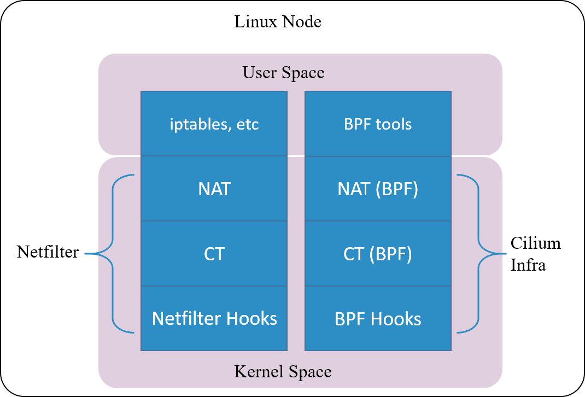
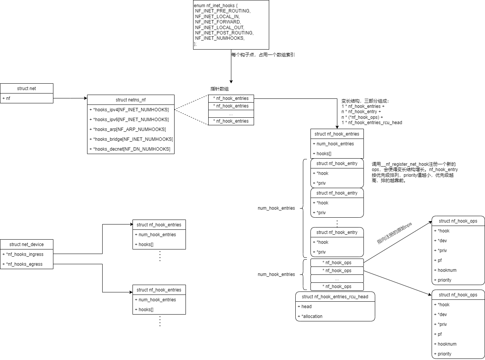
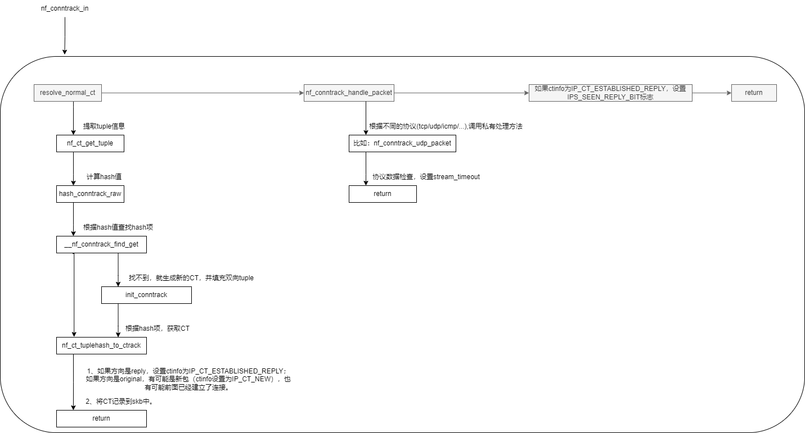
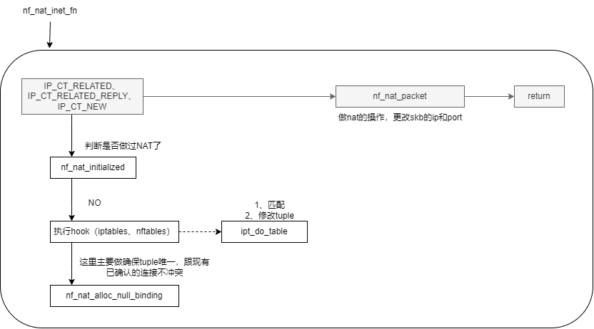
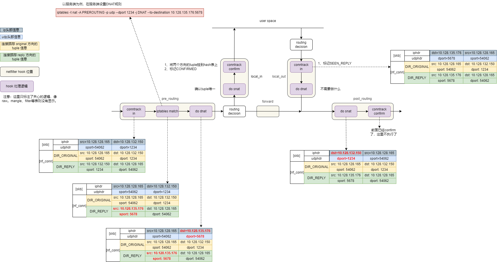

# netfilter

注：一些基础概念（比如常用的5个Hook点）这里就不赘述了。

## 1. netfilter hooks


对于每个 **地址族**（Address Families），内核在数据包处理路径的特定阶段放置了一些钩子（Hooks）。

新版内核增加了 **Netdev 地址族**，处理设备入口和出口路径的数据包，允许过滤任何 **以太网** 类型的数据包。它可以用于早期过滤（filtering）和监管（policing）。

- **ingress**：调用时机，在 **tc ingress** 之后，**三层协议处理程序**之前；调用函数（nf_hook_ingress）；
- **egress**：调用时机，在**三层协议处理程序**之后， **tc egress** 之前；调用函数（nf_hook_egress）；

## 2. 连接跟踪（Connection Tracking，conntrack，CT）

关键词：

- **元组**（tuple）：用来区分数据流（flow），并跟踪一条连接；
	- 比如从数据包中提取五元组信息（源IP地址，目的IP地址，源端口，目的端口，协议号）。
- 连接跟踪中的 **连接**（connection）：要跟 “TCP是有连接的”，“UDP是无连接的” 区分；
	- TCP、UDP、ICMP 都是有连接跟踪记录的。
	- 但不是所有协议都会被连接跟踪。
-  **连接跟踪表**（connection table）：hash table实现，用于连接插入，查找等，key 为tuple信息；
-  GC：连接跟踪过期回收；
-  **Zone**：多租户环境下，无法只用 tuple 来区分 CT ，所以引入 Zone 的概念。不同租户使用不同的 zone id ，从而保证租户之间的隔离。

```bash
# 将 eth1 网口收到数据包打上 zone 1 的标记
$ iptables -t raw -A PREROUTING -i eth1 -j CT --zone 1
```

CT 模块只是完成连接信息的采集和录入功能，并不会修改或丢弃数据包，后者是其 他模块（例如 NAT）基于 Netfilter hook 完成的。

由于netfilter数据包路径过长，`Cilium` 实现一套独立的 CT 和 NAT 机制。即使**卸载 Netfilter 模块**，也不影响其对 Kubernetes Service 功能的支持。



## 3. iptables


## 4. 主要的数据结构

### 4.1. 钩子 nf_hook_ops



```bash
# 打印ipv4已经注册的钩子
<4>[11225.949841] ==== PRE_ROUTING ====
<4>[11225.949842]         ipv4_conntrack_defrag+0x0/0x120 [nf_defrag_ipv4]
<4>[11225.949847]         ipv4_conntrack_in+0x0/0x20 [nf_conntrack]
<4>[11225.949859]         nft_do_chain_inet+0x0/0xe0 [nf_tables]
<4>[11225.949872]         nf_nat_ipv4_pre_routing+0x0/0xc0 [nf_nat]
<4>[11225.949877]         nft_do_chain_inet+0x0/0xe0 [nf_tables]
<4>[11225.949886] 
<4>[11225.949886] ==== LOCAL_IN ====
<4>[11225.949887]         nft_do_chain_inet+0x0/0xe0 [nf_tables]
<4>[11225.949895]         nf_nat_ipv4_local_in+0x0/0x120 [nf_nat]
<4>[11225.949900]         nf_confirm+0x0/0x2b0 [nf_conntrack]
<4>[11225.949908] 
<4>[11225.949908] ==== FORWARD ====
<4>[11225.949909]         selinux_ip_forward+0x0/0x1f0
<4>[11225.949921]         nft_do_chain_inet+0x0/0xe0 [nf_tables]
<4>[11225.949930] 
<4>[11225.949930] ==== LOCAL_OUT ====
<4>[11225.949931]         ipv4_conntrack_defrag+0x0/0x120 [nf_defrag_ipv4]
<4>[11225.949934]         selinux_ip_output+0x0/0x70
<4>[11225.949936]         ipv4_conntrack_local+0x0/0x90 [nf_conntrack]
<4>[11225.949944]         nf_nat_ipv4_local_fn+0x0/0x120 [nf_nat]
<4>[11225.949949]         nft_do_chain_inet+0x0/0xe0 [nf_tables]
<4>[11225.949957] 
<4>[11225.949958] ==== POST_ROUTING ====
<4>[11225.949958]         nf_nat_ipv4_out+0x0/0x100 [nf_nat]
<4>[11225.949962]         selinux_ip_postroute+0x0/0x400
<4>[11225.949964]         nf_confirm+0x0/0x2b0 [nf_conntrack]
```

### 4.2. 元组 nf_conntrack_tuple

nf_conntrack_tuple.h中注释说到

	We divide the structure along "manipulatable" and "non-manipulatable" lines, for the benefit of the NAT code.


从以上定义可知，**CT 模块目前只支持以下六种协议：TCP、UDP、ICMP、DCCP、SCTP、GRE。**

比如，ICMP使用以下信息来填充tuple：源IP、目的IP、icmp头部字段（type、code、id）

### 4.3. 连接跟踪表的表项 nf_conntrack_tuple_hash

每一个表项存储一个tuple，哈希值（key）是根据tuple信息计算得到。

```c
struct nf_conntrack_tuple_hash {
	struct hlist_nulls_node hnnode;
	struct nf_conntrack_tuple tuple;
};

static u32 hash_conntrack_raw(const struct nf_conntrack_tuple *tuple,
			      unsigned int zoneid,
			      const struct net *net)
{
	u64 a, b, c, d;

	get_random_once(&nf_conntrack_hash_rnd, sizeof(nf_conntrack_hash_rnd));

	/* The direction must be ignored, handle usable tuplehash members manually */
	a = (u64)tuple->src.u3.all[0] << 32 | tuple->src.u3.all[3];
	b = (u64)tuple->dst.u3.all[0] << 32 | tuple->dst.u3.all[3];

	c = (__force u64)tuple->src.u.all << 32 | (__force u64)tuple->dst.u.all << 16;
	c |= tuple->dst.protonum;

	d = (u64)zoneid << 32 | net_hash_mix(net);

	/* IPv4: u3.all[1,2,3] == 0 */
	c ^= (u64)tuple->src.u3.all[1] << 32 | tuple->src.u3.all[2];
	d += (u64)tuple->dst.u3.all[1] << 32 | tuple->dst.u3.all[2];

	// 计算hash值使用的元素：
	// 源IP
	// 目的IP
	// 协议号
	// 协议自身特有属性，比如UDP的src/dst port，ICMP的type/code/id
	// Zone id
	// net->hash_mix，初始化网络命名空间时提供的随机数
	// nf_conntrack_hash_rnd 随机数
	return (u32)siphash_4u64(a, b, c, d, &nf_conntrack_hash_rnd);
}
```

### 4.4. 连接跟踪信息结构 nf_conn


## 5. ipv4_conntrack_defrag

保证进入 CT 的包都是完整的数据包，而非分片包。

```c
ipv4_conntrack_defrag
  | ip_is_fragment
     | ip_defrag
     | return NF_STOLEN; // 分片包进入队列重组，就被偷走了。
```

## 6. nf_conntrack_in

**连接跟踪入口**

从4.1可以得知，
```c
PRE_ROUTING: nf_confirm -> nf_conntrack_confirm

LOCAL_OUT: nf_confirm -> nf_conntrack_confirm
```

**为什么是这两个 hook 点呢？**因为它们都是**新连接的第一个包最先达到**的地方

- PRE_ROUTING： 是外部主动和本机建连时包最先到达的地方；
- LOCAL_OUT： 是本机主动和外部建连时包最先到达的地方；

```c
nf_conntrack_in
  | resolve_normal_ct
      | init_conntrack // 初始化连接跟踪，包含两个方向的tuple，ctinfo设置为IP_CT_NEW状态
  | nf_conntrack_handle_packet // 不同的协议分别处理：检查、设置协议私有数据
```



## 7. nf_conntrack_confirm

**连接跟踪确认**

从4.1可以得知，
```c
LOCAL_IN: ipv4_conntrack_in -> nf_conntrack_in

POST_ROUTING: ipv4_conntrack_local -> nf_conntrack_in
```
**为什么是这两个 hook 点呢？**因为如果新连接的第一个包没有被丢弃，那这 **是它们离开 netfilter 之前的最后 hook 点**：

- LOCAL_IN： 外部主动和本机建连的包，如果在中间处理中没有被丢弃，LOCAL_IN 是其被送到应用之前的最后 hook 点；
- POST_ROUTING： 本机主动和外部建连的包，如果在中间处理中没有被丢弃，POST_ROUTING 是其离开主机时的最后 hook 点；


从上图可知，就能知道confirm为什么要放到最后处理：
- 关闭/开启软中断、对hash槽加解锁，在短连接、高并发场景十分损耗性能。

## 8. nf_nat_inet_fn

- SNAT hook 挂在两个位置：LOCAL_IN、POST_ROUTING
- DNAT hook 挂在两个位置：PRE_ROUTING、LOCAL_OUT

```c
// 四个hook的主要处理函数都是：nf_nat_inet_fn
[ PRE_ROUTING  ]：nf_nat_ipv4_pre_routing -> nf_nat_inet_fn
[ LOCAL_IN     ]：nf_nat_ipv4_local_in -> nf_nat_inet_fn
[ LOCAL_OUT    ]：nf_nat_ipv4_local_fn -> nf_nat_inet_fn
[ POST_ROUTING ]：nf_nat_ipv4_out -> nf_nat_inet_fn
```



## 9. 实验（udp+dnat）

在服务端配置DNAT规则，并在`服务端`分析netfilter处理流程，以及连接跟踪的变化。

```bash
客户端 10.128.128.165 发送UDP包到 服务端 10.128.132.150:1234，服务端收到包后DNAT到本机10.128.135.176:5678
```




## 10. perf 跟踪函数堆栈

```bash
# 方便测试
# 如果开启了网卡多队列，则设置 enp0s8 当前使用 1 个队列
# 网卡多队列需要驱动支持
$ ethtool -L enp0s8 combined 1
# 将网卡中断绑定到 CPU0
$ echo 0 > /proc/irq/$(cat /proc/interrupts | awk -F ':' '/enp0s8/ {gsub(/ /,""); print $1}')/smp_affinity_list

# perf ftrace
$ perf ftrace -C0 -G '__netif_receive_skb_list_core' -g 'smp_*'
```

```bash
0)   0.664 us    |    __netif_receive_skb_core.constprop.0();
 0)               |    ip_list_rcv() {
 0)   0.304 us    |      ip_rcv_core();
 0)               |      ip_sublist_rcv() {
 0)   0.134 us    |        __rcu_read_lock();
 0)               |        nf_hook_slow_list() {
 0)               |          nf_hook_slow() {
 0)   0.139 us    |            ipv4_conntrack_defrag [nf_defrag_ipv4]();
 0)               |            ipv4_conntrack_in [nf_conntrack]() {
 0)               |              nf_conntrack_in [nf_conntrack]() {
 0)   0.154 us    |                get_l4proto [nf_conntrack]();
 0)               |                nf_conntrack_icmpv4_error [nf_conntrack]() {
 0)               |                  nf_ip_checksum() {
 0)               |                    __skb_checksum_complete() {
 0)               |                      __skb_checksum() {
 0)   0.143 us    |                        csum_partial();
 0)   0.508 us    |                      }
 0)   0.895 us    |                    }
 0)   1.225 us    |                  }
 0)   1.578 us    |                }
 0)               |                nf_ct_get_tuple [nf_conntrack]() {
 0)   0.141 us    |                  icmp_pkt_to_tuple [nf_conntrack]();
 0)   0.539 us    |                }
 0)   0.347 us    |                hash_conntrack_raw [nf_conntrack]();
 0)               |                __nf_conntrack_find_get [nf_conntrack]() {
 0)   0.134 us    |                  __rcu_read_lock();
 0)   0.151 us    |                  __rcu_read_unlock();
 0)   0.908 us    |                }
 0)               |                init_conntrack.constprop.0 [nf_conntrack]() {
 0)               |                  nf_ct_invert_tuple [nf_conntrack]() {
 0)   0.197 us    |                    nf_conntrack_invert_icmp_tuple [nf_conntrack]();
 0)   0.471 us    |                  }
 0)               |                  __nf_conntrack_alloc [nf_conntrack]() {
 0)   0.139 us    |                    __rcu_read_lock();
 0)   0.128 us    |                    __rcu_read_unlock();
 0)               |                    kmem_cache_alloc() {
 0)   0.139 us    |                      should_failslab();
 0)   1.162 us    |                    }
 0)   2.573 us    |                  }
 0)   0.153 us    |                  nf_ct_ecache_ext_add [nf_conntrack]();
 0)   0.139 us    |                  __rcu_read_lock();
 0)   0.129 us    |                  __rcu_read_unlock();
 0)   4.388 us    |                }
 0)               |                nf_conntrack_icmp_packet [nf_conntrack]() {
 0)               |                  __nf_ct_refresh_acct [nf_conntrack]() {
 0)   0.139 us    |                    nf_ct_acct_add [nf_conntrack]();
 0)   0.402 us    |                  }
 0)   0.734 us    |                }
 0) + 10.332 us   |              }
 0) + 10.660 us   |            }
 0)               |            nft_do_chain_inet [nf_tables]() {
 0)               |              nft_do_chain [nf_tables]() {
 0)   0.154 us    |                nft_immediate_eval [nf_tables]();
 0)   0.196 us    |                nft_meta_get_eval [nf_tables]();
 0)   0.143 us    |                nft_immediate_eval [nf_tables]();
 0)   0.143 us    |                nft_immediate_eval [nf_tables]();
 0)   0.149 us    |                nft_immediate_eval [nf_tables]();
 0)   0.133 us    |                nft_immediate_eval [nf_tables]();
 0)   0.135 us    |                nft_immediate_eval [nf_tables]();
 0)   0.134 us    |                nft_immediate_eval [nf_tables]();
 0)   0.134 us    |                nft_immediate_eval [nf_tables]();
 0)   0.133 us    |                nft_immediate_eval [nf_tables]();
 0)   0.136 us    |                nft_immediate_eval [nf_tables]();
 0)   0.135 us    |                nft_immediate_eval [nf_tables]();
 0)   0.136 us    |                nft_immediate_eval [nf_tables]();
 0)   0.136 us    |                nft_immediate_eval [nf_tables]();
 0)   0.135 us    |                nft_immediate_eval [nf_tables]();
 0)   0.136 us    |                nft_immediate_eval [nf_tables]();
 0)   8.586 us    |              }
 0)   9.044 us    |            }
 0)               |            nf_nat_ipv4_pre_routing [nf_nat]() {
 0)               |              nf_nat_inet_fn [nf_nat]() {
 0)               |                nft_nat_do_chain [nft_chain_nat]() {
 0)               |                  nft_do_chain [nf_tables]() {
 0)   0.137 us    |                    nft_immediate_eval [nf_tables]();
 0)   0.161 us    |                    nft_meta_get_eval [nf_tables]();
 0)   0.136 us    |                    nft_immediate_eval [nf_tables]();
 0)   0.133 us    |                    nft_immediate_eval [nf_tables]();
 0)   0.138 us    |                    nft_immediate_eval [nf_tables]();
 0)   0.134 us    |                    nft_immediate_eval [nf_tables]();
 0)   0.137 us    |                    nft_immediate_eval [nf_tables]();
 0)   0.135 us    |                    nft_immediate_eval [nf_tables]();
 0)   0.135 us    |                    nft_immediate_eval [nf_tables]();
 0)   0.133 us    |                    nft_immediate_eval [nf_tables]();
 0)   0.134 us    |                    nft_immediate_eval [nf_tables]();
 0)   0.134 us    |                    nft_immediate_eval [nf_tables]();
 0)   0.134 us    |                    nft_immediate_eval [nf_tables]();
 0)   0.134 us    |                    nft_immediate_eval [nf_tables]();
 0)   0.134 us    |                    nft_immediate_eval [nf_tables]();
 0)   0.200 us    |                    nft_immediate_eval [nf_tables]();
 0)   6.108 us    |                  }
 0)   6.381 us    |                }
 0)               |                __nf_nat_alloc_null_binding [nf_nat]() {
 0)               |                  nf_nat_setup_info [nf_nat]() {
 0)               |                    nf_ct_invert_tuple [nf_conntrack]() {
 0)   0.128 us    |                      nf_conntrack_invert_icmp_tuple [nf_conntrack]();
 0)   0.388 us    |                    }
 0)               |                    nf_ct_invert_tuple [nf_conntrack]() {
 0)   0.138 us    |                      nf_conntrack_invert_icmp_tuple [nf_conntrack]();
 0)   0.399 us    |                    }
 0)               |                    nf_conntrack_tuple_taken [nf_conntrack]() {
 0)   0.143 us    |                      __rcu_read_lock();
 0)   0.164 us    |                      hash_conntrack_raw [nf_conntrack]();
 0)   0.131 us    |                      __rcu_read_unlock();
 0)   1.073 us    |                    }
 0)   2.539 us    |                  }
 0)   2.877 us    |                }
 0) + 10.226 us   |              }
 0) + 10.647 us   |            }
 0)               |            nft_do_chain_inet [nf_tables]() {
 0)               |              nft_do_chain [nf_tables]() {
 0)   0.159 us    |                nft_meta_get_eval [nf_tables]();
 0)   0.142 us    |                nft_meta_get_eval [nf_tables]();
 0)   0.964 us    |              }
 0)   1.218 us    |            }
 0) + 33.608 us   |          }
 0) + 33.982 us   |        }
 0)   0.129 us    |        __rcu_read_unlock();
 0)               |        ip_rcv_finish_core.constprop.0() {
 0)               |          ip_route_input_noref() {
 0)   0.136 us    |            __rcu_read_lock();
 0)               |            ip_route_input_slow() {
 0)               |              make_kuid() {
 0)   0.306 us    |                map_id_range_down();
 0)   0.630 us    |              }
 0)   0.137 us    |              __rcu_read_lock();
 0)               |              fib_table_lookup() {
 0)   0.515 us    |                fib_lookup_good_nhc();
 0)   2.229 us    |              }
 0)   0.132 us    |              __rcu_read_unlock();
 0)               |              fib_validate_source() {
 0)               |                __fib_validate_source() {
 0)   0.131 us    |                  l3mdev_master_ifindex_rcu();
 0)               |                  make_kuid() {
 0)   0.134 us    |                    map_id_range_down();
 0)   0.390 us    |                  }
 0)   0.135 us    |                  __rcu_read_lock();
 0)               |                  fib_table_lookup() {
 0)   0.144 us    |                    fib_lookup_good_nhc();
 0)   0.512 us    |                  }
 0)   0.132 us    |                  __rcu_read_unlock();
 0)   0.144 us    |                  fib_info_nh_uses_dev();
 0)   2.537 us    |                }
 0)   2.874 us    |              }
 0)   8.436 us    |            }
 0)   0.130 us    |            __rcu_read_unlock();
 0)   9.285 us    |          }
 0)   9.647 us    |        }
 0)               |        ip_sublist_rcv_finish() {
 0)               |          ip_local_deliver() {
 0)   0.136 us    |            __rcu_read_lock();
 0)               |            nf_hook_slow() {
 0)               |              nft_do_chain_inet [nf_tables]() {
 0)               |                nft_do_chain [nf_tables]() {
 0)   0.153 us    |                  nft_ct_get_eval [nft_ct]();
 0)               |                  nft_lookup_eval [nf_tables]() {
 0)               |                    nft_set_do_lookup [nf_tables]() {
 0)   0.372 us    |                      nft_hash_lookup_fast [nf_tables]();
 0)   0.894 us    |                    }
 0)   0.152 us    |                    nft_set_catchall_lookup [nf_tables]();
 0)   1.594 us    |                  }
 0)   0.168 us    |                  nft_ct_get_eval [nft_ct]();
 0)   0.168 us    |                  nft_meta_get_eval [nf_tables]();
 0)   0.144 us    |                  nft_immediate_eval [nf_tables]();
 0)   0.158 us    |                  nft_meta_get_eval [nf_tables]();
 0)   0.144 us    |                  nft_immediate_eval [nf_tables]();
 0)   0.138 us    |                  nft_immediate_eval [nf_tables]();
 0)   0.202 us    |                  nft_immediate_eval [nf_tables]();
 0)   0.136 us    |                  nft_immediate_eval [nf_tables]();
 0)   0.151 us    |                  nft_immediate_eval [nf_tables]();
 0)   0.136 us    |                  nft_immediate_eval [nf_tables]();
 0)   0.134 us    |                  nft_immediate_eval [nf_tables]();
 0)   0.138 us    |                  nft_meta_get_eval [nf_tables]();
 0)   0.144 us    |                  nft_meta_get_eval [nf_tables]();
 0)   0.128 us    |                  nft_meta_get_eval [nf_tables]();
 0)   0.129 us    |                  nft_meta_get_eval [nf_tables]();
 0)   0.142 us    |                  nft_immediate_eval [nf_tables]();
 0)   0.137 us    |                  nft_immediate_eval [nf_tables]();
 0)   0.137 us    |                  nft_immediate_eval [nf_tables]();
 0)   0.137 us    |                  nft_immediate_eval [nf_tables]();
 0)   0.137 us    |                  nft_immediate_eval [nf_tables]();
 0)   0.140 us    |                  nft_meta_get_eval [nf_tables]();
 0)   0.132 us    |                  nft_meta_get_eval [nf_tables]();
 0)   0.134 us    |                  nft_meta_get_eval [nf_tables]();
 0)   0.136 us    |                  nft_immediate_eval [nf_tables]();
 0)   0.136 us    |                  nft_immediate_eval [nf_tables]();
 0)   0.150 us    |                  nft_meta_get_eval [nf_tables]();
 0)               |                  nft_lookup_eval [nf_tables]() {
 0)               |                    nft_set_do_lookup [nf_tables]() {
 0)   0.185 us    |                      nft_bitmap_lookup [nf_tables]();
 0)   0.700 us    |                    }
 0)   0.973 us    |                  } /* nft_lookup_eval [nf_tables] */
 0)   0.150 us    |                  nft_immediate_eval [nf_tables]();
 0) + 13.273 us   |                }
 0) + 13.523 us   |              }
 0)               |              nf_nat_ipv4_local_in [nf_nat]() {
 0)               |                nf_nat_inet_fn [nf_nat]() {
 0)               |                  __nf_nat_alloc_null_binding [nf_nat]() {
 0)               |                    nf_nat_setup_info [nf_nat]() {
 0)               |                      nf_ct_invert_tuple [nf_conntrack]() {
 0)   0.129 us    |                        nf_conntrack_invert_icmp_tuple [nf_conntrack]();
 0)   0.397 us    |                      }
 0)   0.165 us    |                      in_range [nf_nat]();
 0)               |                      nf_ct_invert_tuple [nf_conntrack]() {
 0)   0.130 us    |                        nf_conntrack_invert_icmp_tuple [nf_conntrack]();
 0)   0.388 us    |                      }
 0)               |                      nf_conntrack_tuple_taken [nf_conntrack]() {
 0)   0.129 us    |                        __rcu_read_lock();
 0)   0.153 us    |                        hash_conntrack_raw [nf_conntrack]();
 0)   0.131 us    |                        __rcu_read_unlock();
 0)   0.914 us    |                      }
 0)   0.474 us    |                      hash_by_src [nf_nat]();
 0)               |                      _raw_spin_lock_bh() {
 0)   0.133 us    |                        preempt_count_add();
 0)   0.402 us    |                      }
 0)               |                      _raw_spin_unlock_bh() {
 0)               |                        __local_bh_enable_ip() {
 0)   0.138 us    |                          preempt_count_sub();
 0)   0.415 us    |                        }
 0)   0.684 us    |                      }
 0)   4.755 us    |                    }
 0)   5.027 us    |                  }
 0)   5.376 us    |                }
 0)   5.642 us    |              }
 0)               |              nf_confirm [nf_conntrack]() {
 0)               |                __nf_conntrack_confirm [nf_conntrack]() {
 0)   0.131 us    |                  preempt_count_add();
 0)   0.161 us    |                  hash_conntrack_raw [nf_conntrack]();
 0)               |                  nf_conntrack_double_lock.constprop.0 [nf_conntrack]() {
 0)               |                    _raw_spin_lock() {
 0)   0.129 us    |                      preempt_count_add();
 0)   0.759 us    |                    }
 0)               |                    _raw_spin_lock() {
 0)   0.129 us    |                      preempt_count_add();
 0)   0.446 us    |                    }
 0)   1.604 us    |                  }
 0)   0.380 us    |                  get_random_u8();
 0)   0.137 us    |                  __nf_conntrack_insert_prepare [nf_conntrack]();
 0)   0.149 us    |                  __nf_conntrack_hash_insert [nf_conntrack]();
 0)               |                  _raw_spin_unlock() {
 0)   0.137 us    |                    preempt_count_sub();
 0)   0.387 us    |                  }
 0)               |                  _raw_spin_unlock() {
 0)   0.127 us    |                    preempt_count_sub();
 0)   0.385 us    |                  }
 0)               |                  __local_bh_enable_ip() {
 0)   0.128 us    |                    preempt_count_sub();
 0)   0.385 us    |                  }
 0)   5.119 us    |                }
 0)   5.464 us    |              }
 0) + 25.313 us   |            }
 0)   0.137 us    |            __rcu_read_unlock();
 0)               |            ip_local_deliver_finish() {
 0)   0.146 us    |              __rcu_read_lock();
 0)               |              ip_protocol_deliver_rcu() {
 0)               |                raw_local_deliver() {
 0)   0.130 us    |                  __rcu_read_lock();
 0)   0.141 us    |                  __rcu_read_unlock();
 0)   0.730 us    |                }
 0)               |                icmp_rcv() {
 0)               |                  icmp_echo() {
 0)               |                    icmp_echo.part.0() {
 0)               |                      icmp_reply() {
 0)   0.143 us    |                        __ip_options_echo();
 0)   0.141 us    |                        preempt_count_add();
 0)               |                        _raw_spin_trylock() {
 0)   0.130 us    |                          preempt_count_add();
 0)   0.471 us    |                        }
 0)   0.138 us    |                        fib_compute_spec_dst();
 0)               |                        make_kuid() {
 0)   0.136 us    |                          map_id_range_down();
 0)   0.391 us    |                        }
 0)   0.135 us    |                        __rcu_read_lock();
 0)   0.129 us    |                        l3mdev_master_ifindex_rcu();
 0)   0.130 us    |                        __rcu_read_unlock();
 0)               |                        security_skb_classify_flow() {
 0)               |                          selinux_xfrm_decode_session() {
 0)   0.144 us    |                            selinux_xfrm_skb_sid_ingress();
 0)   0.451 us    |                          }
 0)   0.135 us    |                          bpf_lsm_xfrm_decode_session();
 0)   1.509 us    |                        }
 0)               |                        ip_route_output_flow() {
 0)   0.135 us    |                          __rcu_read_lock();
 0)               |                          ip_route_output_key_hash_rcu() {
 0)               |                            __ip_dev_find() {
 0)   0.135 us    |                              __rcu_read_lock();
 0)   0.126 us    |                              __rcu_read_unlock();
 0)   0.938 us    |                            }
 0)   0.134 us    |                            __rcu_read_lock();
 0)               |                            fib_table_lookup() {
 0)   0.142 us    |                              fib_lookup_good_nhc();
 0)   0.435 us    |                            }
 0)   0.130 us    |                            __rcu_read_unlock();
 0)   0.148 us    |                            fib_select_path();
 0)   0.145 us    |                            find_exception();
 0)   3.419 us    |                          }
 0)   0.128 us    |                          __rcu_read_unlock();
 0)               |                          xfrm_lookup_route() {
 0)   0.329 us    |                            xfrm_lookup_with_ifid();
 0)   0.664 us    |                          }
 0)   5.116 us    |                        }
 0)   0.151 us    |                        icmpv4_xrlim_allow();
 0)               |                        icmp_push_reply() {
 0)               |                          ip_append_data() {
 0)               |                            ip_setup_cork() {
 0)   0.284 us    |                              ipv4_mtu();
 0)   0.633 us    |                            }
 0)               |                            __ip_append_data() {
 0)               |                              sock_alloc_send_pskb() {
 0)               |                                alloc_skb_with_frags() {
 0)               |                                  __alloc_skb() {
 0)               |                                    kmem_cache_alloc_node() {
 0)   0.126 us    |                                      should_failslab();
 0)   0.904 us    |                                    }
 0)               |                                    kmalloc_size_roundup() {
 0)   0.201 us    |                                      kmalloc_slab();
 0)   0.600 us    |                                    }
 0)               |                                    __kmalloc_node_track_caller() {
 0)   0.130 us    |                                      kmalloc_slab();
 0)               |                                      __kmem_cache_alloc_node() {
 0)   0.128 us    |                                        should_failslab();
 0)   0.609 us    |                                      }
 0)   1.199 us    |                                    }
 0)   0.132 us    |                                    __build_skb_around();
 0)   3.710 us    |                                  }
 0)   4.000 us    |                                }
 0)   0.155 us    |                                skb_set_owner_w();
 0)   4.672 us    |                              }
 0)   0.131 us    |                              skb_put();
 0)               |                              icmp_glue_bits() {
 0)               |                                skb_copy_and_csum_bits() {
 0)   0.259 us    |                                  csum_partial_copy_nocheck();
 0)   0.547 us    |                                }
 0)   0.930 us    |                              }
 0)   6.777 us    |                            }
 0)   7.943 us    |                          }
 0)   0.153 us    |                          csum_partial_copy_nocheck();
 0)               |                          ip_push_pending_frames() {
 0)               |                            __ip_make_skb() {
 0)   0.148 us    |                              ipv4_mtu();
 0)               |                              __ip_select_ident() {
 0)               |                                __get_random_u32_below() {
 0)   0.181 us    |                                  get_random_u32();
 0)   0.554 us    |                                }
 0)   1.139 us    |                              }
 0)   0.207 us    |                              icmp_out_count();
 0)   0.141 us    |                              kfree();
 0)   0.135 us    |                              dst_release();
 0)   2.757 us    |                            }
 0)               |                            __ip_local_out() {
 0)   0.136 us    |                              ip_send_check();
 0)   0.137 us    |                              __rcu_read_lock();
 0)               |                              nf_hook_slow() {
 0)   0.147 us    |                                ipv4_conntrack_defrag [nf_defrag_ipv4]();
 0)               |                                selinux_ip_output() {
 0)   0.493 us    |                                  netlbl_enabled();
 0)   0.833 us    |                                }
 0)               |                                ipv4_conntrack_local [nf_conntrack]() {
 0)               |                                  nf_conntrack_in [nf_conntrack]() {
 0)   0.134 us    |                                    get_l4proto [nf_conntrack]();
 0)   0.152 us    |                                    nf_conntrack_icmpv4_error [nf_conntrack]();
 0)               |                                    nf_ct_get_tuple [nf_conntrack]() {
 0)   0.131 us    |                                      icmp_pkt_to_tuple [nf_conntrack]();
 0)   0.386 us    |                                    }
 0)   0.160 us    |                                    hash_conntrack_raw [nf_conntrack]();
 0)               |                                    __nf_conntrack_find_get [nf_conntrack]() {
 0)   0.129 us    |                                      __rcu_read_lock();
 0)   0.129 us    |                                      __rcu_read_unlock();
 0)   0.731 us    |                                    }
 0)               |                                    nf_conntrack_icmp_packet [nf_conntrack]() {
 0)               |                                      __nf_ct_refresh_acct [nf_conntrack]() {
 0)   9.340 us    |                                        nf_ct_acct_add [nf_conntrack]();
 0)   9.764 us    |                                      }
 0) + 11.211 us   |                                    }
 0) + 13.864 us   |                                  }
 0) + 14.184 us   |                                }
 0)               |                                nf_nat_ipv4_local_fn [nf_nat]() {
 0)   0.262 us    |                                  nf_nat_inet_fn [nf_nat]();
 0)   0.897 us    |                                }
 0)               |                                nft_do_chain_inet [nf_tables]() {
 0)               |                                  nft_do_chain [nf_tables]() {
 0)   0.193 us    |                                    nft_ct_get_eval [nft_ct]();
 0)               |                                    nft_lookup_eval [nf_tables]() {
 0)               |                                      nft_set_do_lookup [nf_tables]() {
 0)   0.315 us    |                                        nft_hash_lookup_fast [nf_tables]();
 0)   1.286 us    |                                      }
 0)   1.617 us    |                                    }
 0)   0.190 us    |                                    nft_immediate_eval [nf_tables]();
 0)   3.103 us    |                                  }
 0)   3.468 us    |                                }
 0) + 20.908 us   |                              }
 0)   0.171 us    |                              __rcu_read_unlock();
 0) + 22.213 us   |                            }
 0)               |                            ip_output() {
 0)   0.164 us    |                              __rcu_read_lock();
 0)               |                              nf_hook_slow() {
 0)               |                                nf_nat_ipv4_out [nf_nat]() {
 0)   0.249 us    |                                  nf_nat_inet_fn [nf_nat]();
 0)   0.568 us    |                                }
 0)               |                                selinux_ip_postroute() {
 0)   0.196 us    |                                  netlbl_enabled();
 0)   2.101 us    |                                }
 0)   0.277 us    |                                nf_confirm [nf_conntrack]();
 0)   3.921 us    |                              }
 0)   0.169 us    |                              __rcu_read_unlock();
 0)               |                              ip_finish_output() {
 0)               |                                __ip_finish_output() {
 0)               |                                  ip_finish_output2() {
 0)   0.167 us    |                                    preempt_count_add();
 0)               |                                    __dev_queue_xmit() {
 0)   0.134 us    |                                      preempt_count_add();
 0)   0.138 us    |                                      dst_release();
 0)   0.160 us    |                                      netdev_core_pick_tx();
 0)               |                                      _raw_spin_lock() {
 0)   0.129 us    |                                        preempt_count_add();
 0)   0.383 us    |                                      }
 0)               |                                      sch_direct_xmit() {
 0)               |                                        _raw_spin_unlock() {
 0)   0.138 us    |                                          preempt_count_sub();
 0)   0.416 us    |                                        }
 0)               |                                        validate_xmit_skb_list() {
 0)               |                                          validate_xmit_skb() {
 0)               |                                            netif_skb_features() {
 0)   0.142 us    |                                              skb_network_protocol();
 0)   0.839 us    |                                            }
 0)   0.144 us    |                                            validate_xmit_xfrm();
 0)   1.517 us    |                                          }
 0)   1.785 us    |                                        }
 0)               |                                        _raw_spin_lock() {
 0)   0.130 us    |                                          preempt_count_add();
 0)   0.514 us    |                                        }
 0)               |                                        dev_hard_start_xmit() {
 0)               |                                          e1000_xmit_frame [e1000]() {
 0)   0.133 us    |                                            e1000_maybe_stop_tx [e1000]();
 0)   0.154 us    |                                            is_vmalloc_addr();
 0)               |                                            dma_map_page_attrs() {
 0)   0.129 us    |                                              is_swiotlb_active();
 0)               |                                              swiotlb_map() {
 0)               |                                                swiotlb_tbl_map_single() {
 0)               |                                                  _raw_spin_lock_irqsave() {
 0)   0.135 us    |                                                    preempt_count_add();
 0)   0.550 us    |                                                  }
 0)               |                                                  _raw_spin_unlock_irqrestore() {
 0)   0.136 us    |                                                    preempt_count_sub();
 0)   0.411 us    |                                                  }
 0)   0.391 us    |                                                  swiotlb_bounce();
 0)   2.369 us    |                                                }
 0)   2.704 us    |                                              }
 0)   3.553 us    |                                            }
 0)   0.147 us    |                                            skb_clone_tx_timestamp();
 0)   0.129 us    |                                            e1000_maybe_stop_tx [e1000]();
 0) + 12.445 us   |                                          }
 0) + 12.900 us   |                                        }
 0)               |                                        _raw_spin_unlock() {
 0)   0.135 us    |                                          preempt_count_sub();
 0)   0.440 us    |                                        }
 0)               |                                        _raw_spin_lock() {
 0)   0.131 us    |                                          preempt_count_add();
 0)   0.385 us    |                                        }
 0) + 17.376 us   |                                      }
 0)               |                                      __qdisc_run() {
 0)   0.148 us    |                                        fq_codel_dequeue();
 0)   0.703 us    |                                      }
 0)               |                                      _raw_spin_unlock() {
 0)   0.127 us    |                                        preempt_count_sub();
 0)   0.378 us    |                                      }
 0)               |                                      __local_bh_enable_ip() {
 0)   0.129 us    |                                        preempt_count_sub();
 0)   0.393 us    |                                      }
 0) + 21.557 us   |                                    }
 0)               |                                    __local_bh_enable_ip() {
 0)   0.129 us    |                                      preempt_count_sub();
 0)   0.389 us    |                                    }
 0) + 23.346 us   |                                  }
 0) + 23.899 us   |                                }
 0) + 24.289 us   |                              }
 0) + 29.468 us   |                            }
 0) + 55.295 us   |                          }
 0) + 64.037 us   |                        }
 0)   0.130 us    |                        dst_release();
 0)               |                        _raw_spin_unlock() {
 0)   0.125 us    |                          preempt_count_sub();
 0)   0.385 us    |                        }
 0)               |                        __local_bh_enable_ip() {
 0)   0.128 us    |                          preempt_count_sub();
 0)   0.387 us    |                        }
 0) + 75.989 us   |                      }
 0) + 76.256 us   |                    }
 0) + 76.570 us   |                  }
 0)               |                  consume_skb() {
 0)   0.154 us    |                    skb_release_head_state();
 0)               |                    skb_release_data() {
 0)               |                      skb_free_head() {
 0)   0.204 us    |                        page_frag_free();
 0)   0.549 us    |                      }
 0)   0.966 us    |                    }
 0)               |                    kfree_skbmem() {
 0)               |                      kmem_cache_free() {
 0)   0.263 us    |                        __slab_free();
 0)   1.281 us    |                      }
 0)   1.563 us    |                    }
 0)   3.364 us    |                  }
 0) + 80.580 us   |                }
 0) + 82.442 us   |              }
 0)   0.131 us    |              __rcu_read_unlock();
 0) + 83.239 us   |            }
 0) ! 109.575 us  |          }
 0) ! 109.916 us  |        }
 0) ! 154.893 us  |      }
 0) ! 155.721 us  |    }
 0) ! 232.338 us  |  }
```

