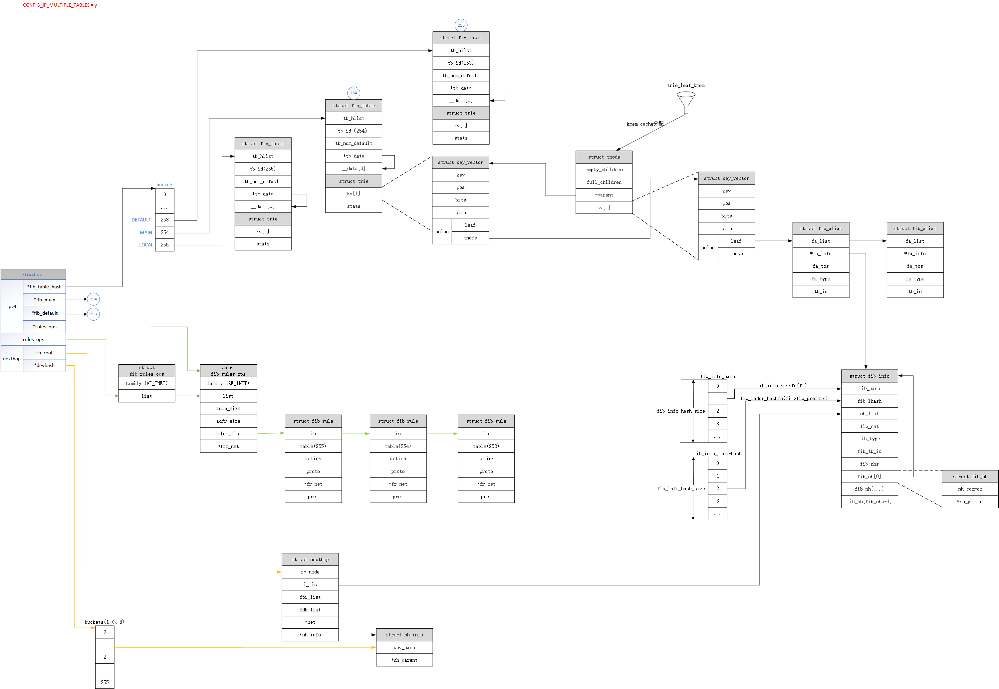

# 路由子系统

## 1. 概念

- 互联网服务提供商（ISP）：提供访问互联网的公司或组织。

- 不可路由地址：10.0.0.0/8、172.16.0.0/16~172.31.0.0/16、192.168.0.0/16、127.0.0.0/8

- Scope：在linux中，路由的scope表示到目的网络的距离；IP的scope表示该IP距离本地主机有多远。

```c
enum rt_scope_t {
	RT_SCOPE_UNIVERSE=0,	// 下一跳网关的路由项
/* User defined values  */
	RT_SCOPE_SITE=200,		// 只在IPv6中使用
	RT_SCOPE_LINK=253,		// 目的地为本地网络地址的路由项；子网广播地址的路由项
	RT_SCOPE_HOST=254,		// 本地接口的路由项
	RT_SCOPE_NOWHERE=255	// 非法的scope，没有目的地的路由项
};
```

- 默认网关：当目的地没有确定的路由时使用的路由。

- 定向广播（Directed Broadcasts）：定向广播的目的地是远端子网的广播地址。由于无法区分恶意还是善意，Linux路由子系统不允许丢弃任何定向广播，管理员可以使用过滤系统来做处理。

- 主地址和辅助地址：每个接口上可以配置多个主地址和多个辅助地址。对于一个特定的子网掩码，只能有一个主地址。

> 1. 主地址可以降低CPU开销
> 2. 当删除一个主地址时，所有关联的辅助地址也被删除。但通过配置/proc选项（net.ipv4.conf.eth0.promote_secondaries），使得在当前主地址被删除时可以将辅助地址提升为主地址。
> 3. 当主机为本地生成的流量选择IP地址时，只考虑主地址。

- 路由表

默认情况下，Linux使用两张路由表：
1. 一张表用于本地地址。从该表查找成功表明封包要交给主机自己。
2. 一张表用于所有其他的路由。可以手工配置或由路由协议动态插入。

路由类型：

```c
enum {
	RTN_UNSPEC,
	RTN_UNICAST,		/* Gateway or direct route	*/
	RTN_LOCAL,			/* Accept locally		*/
	RTN_BROADCAST,		/* Accept locally as broadcast, send as broadcast */
	RTN_ANYCAST,		/* Accept locally as broadcast, but send as unicast */
	RTN_MULTICAST,		/* Multicast route		*/
	RTN_BLACKHOLE,		/* Drop				*/
	RTN_UNREACHABLE,	/* Destination is unreachable   */
	RTN_PROHIBIT,		/* Administratively prohibited	*/
	RTN_THROW,			/* Not in this table		*/
	RTN_NAT,			/* Translate this address	*/
	RTN_XRESOLVE,		/* Use external resolver	*/
	__RTN_MAX
};
```

路由缓存：Linux 内核3.5版本以前同时使用了路由缓存和路由表。

1. 路由缓存查找：从一张简单hash表中寻找完全匹配项。
2. 路由表查找：基于最长前缀匹配（Longest Prefix Match，LPM）算法。

缓存垃圾回收：

1. 同步回收：缓存数量达到阈值；内存紧张。
2. 异步回收：定时器实现。过期应当被删除；没有过期但内存紧张。

**内核3.6版本以后移除了路由缓存，不再缓存路由项，只缓存下一跳。**

封包接收和发送都需要路由表。一般一个封包仅需要进行一次查找，但有些情况（IP-over-IP）可能要多做一次路由查找。

## 2. 高级路由

### 2.1. 策略路由

如果内核支持策略路由，那么可以有255张不同的，相互独立的路由表。

策略路由的主要思想：除了根据目的IP地址配置路由，允许用户还可以根据其他多个参数来配置路由。比如：入口设备、源IP地址等。

方式：单路由表、多路由表

查找步骤：`根据策略选择路由表 -> 从表中查找路由`

常用策略：

- 源IP地址 （也可同目的IP地址做组合）
- 入口设备
- TOS（划分流量类型，比如：大批量数据、交互式）
- Fwmark（根据防火墙分类来定义策略路由规则）

### 2.2. 多路径路由

多路径：指管理员可以为一条路由的目的地指定多个下一跳。

```bash
$ ip route add default scope global nexthop via 100.100.100.1 weight 1 nexthop via 200.200.200.1 weight 2
```

选择下一跳：使用加权循环算法

给定一条多路径路由，流量分配方式：

- 基于流 （根据源IP和目的IP的组合）
- 基于连接（五元组）
- 基于封包

### 2.3. 分类

流量控制子系统中的一个分类器，可以基于realm来将路由分类。Realm是可以在策略和路由上指定的数字标签。

Netfilter子系统可以在钩子上放置标签，这些标签可以给路由子系统或流量控制子系统使用。

### 2.3. ICMP重定向

三种方式将路由插入到内核路由表：

- 用户命令静态配置（ip route、route）
- 路由协议（BGP、RGP、OSPF）
- 由于配置不理想而由内核接收和处理的ICMP重定向消息

ICMP REDIRECT 消息，用于向封包源地址主机通知使用的路由不是最理想路由。

当配置为不同子网的主机连接到同一个LAN时，IP路由文档称之为`共享介质`（shared media）。

#### 2.3.1. 发送 ICMP REDIRECT 消息

```c
static int __mkroute_input(...)
{
	...
	// 入口设备 == 出口设备 && 出口设备允许发送重定向
	if (out_dev == in_dev && err && IN_DEV_TX_REDIRECTS(out_dev) &&
	    skb->protocol == htons(ETH_P_IP)) {
		__be32 gw;

		gw = nhc->nhc_gw_family == AF_INET ? nhc->nhc_gw.ipv4 : 0;
		// 出口设备配置为共享介质 || 新网关和发送方位于同一子网
		if (IN_DEV_SHARED_MEDIA(out_dev) || inet_addr_onlink(out_dev, saddr, gw))
			// 给数据包打重定向标记
			IPCB(skb)->flags |= IPSKB_DOREDIRECT;
	}
	...
}

int ip_forward(struct sk_buff *skb)
{
	...
	/*
	 *	We now generate an ICMP HOST REDIRECT giving the route
	 *	we calculated.
	 */
	if (IPCB(skb)->flags & IPSKB_DOREDIRECT && !opt->srr &&
	    !skb_sec_path(skb))
		ip_rt_send_redirect(skb);
	...
}
```

#### 2.3.2. 接收 ICMP REDIRECT 消息

```c
// icmp_rcv -> icmp_redirect -> icmp_err -> ipv4_redirect -> __ip_do_redirect

static void __ip_do_redirect(struct rtable *rt, struct sk_buff *skb, struct flowi4 *fl4, bool kill_route)
{
	// 设备允许接收重定向消息
	if (!IN_DEV_RX_REDIRECTS(in_dev))
		goto reject_redirect;
	
	// 设备配置为共享介质
	if (!IN_DEV_SHARED_MEDIA(in_dev)) {
		if (!inet_addr_onlink(in_dev, new_gw, old_gw))
			goto reject_redirect;
		// 检查安全重定向配置，新网关是默认网关
		if (IN_DEV_SEC_REDIRECTS(in_dev) && ip_fib_check_default(new_gw, dev))
			goto reject_redirect;
	} else {
		// 新网关是已知的远端单播主机地址
		if (inet_addr_type(net, new_gw) != RTN_UNICAST)
			goto reject_redirect;
	}
	...
	// 更新arp、fib表
}
```

- ICMP REDIRECT 消息中宣告的新网关应当和当前网关不同
- 新网关的IP地址不能是多播、无效、保留地址
- 接收设备必须配置为允许接收重定向消息

## 3. 实现



### 3.1. 主要数据结构

```c
struct rtable;		// 路由表项，
struct dst_entry;
struct dst_ops;
struct fib_table;	// 路由表。比如MAIN表、LOCAL表，不要跟路由表缓存（ip_dst_cache）混淆
struct fib_info;	// 路由条目
struct fib_alias;   // 优化，可共享fib_info结构，区分一些参数不同的路由
struct fib_rule;	// 策略路由规则
struct nexthop;
struct flowi4;      // 定义了在路由表中查找的键，包含了目标地址，源地址，TOS等
struct fib_result;	// 路由表查找结果
struct in_ifaddr;
struct in_device;
```
#### 3.1.1. rtable

```c
// rtable 缓存的路由表项
struct rtable {
	struct dst_entry	dst;

	int			rt_genid;
	unsigned int		rt_flags;
	__u16			rt_type;	// 路由类型
	__u8			rt_is_input; // 入口路由时为1，出口路由时为0
	__u8			rt_uses_gateway; // 下一跳是网关时为1，下一跳为直达路由时为0

	int			rt_iif;		// 入口设备标识符

	u8			rt_gw_family;
	/* Info on neighbour */
	union {
		__be32		rt_gw4;	// 下一跳网关
		struct in6_addr	rt_gw6;
	};
	...
	struct list_head	rt_uncached;
	struct uncached_list	*rt_uncached_list;
};

// dst_entry 缓存路由项中协议无关的信息
struct dst_entry {
	struct net_device       *dev;	// 出口设备
	struct  dst_ops	        *ops;	// 操作dst_entry结构的虚拟函数表
	unsigned long           expires; // 过期时间戳
	
	// 处理入口封包和处理出口封包的函数
	int			(*input)(struct sk_buff *);
	int			(*output)(struct net *net, struct sock *sk, struct sk_buff *skb);
	...
};
```

#### 3.1.2. fib_table

```c
struct fib_table {
	struct hlist_node	tb_hlist; // 会链到net->ipv4.fib_table_hash槽里
	u32			tb_id; // 表标识符
	int			tb_num_default; // 表中默认路由的数目
	struct rcu_head		rcu;
	unsigned long 		*tb_data; // 占位符
	unsigned long		__data[]; // 占位符，后面跟路由条目（trie）
};
```

#### 3.1.3. fib_result

```c
struct fib_result {
	__be32			prefix;
	unsigned char		prefixlen; // 前缀长度，代表网络掩码
	unsigned char		nh_sel; // 下一跳的个数。仅使用一个下一跳时为0；在多路径路由中，可以有多个下一跳
	unsigned char		type; // 来自fib_alias->fa_type
	unsigned char		scope;// 来自fib_alias->fa_scope
	u32			tclassid;
	struct fib_nh_common	*nhc;
	struct fib_info		*fi; // 指向一个fib_info对象，代表一个路由条目
	struct fib_table	*table; // 指向当前查找的fib表
	struct hlist_head	*fa_head; // 指向一个fib_alias列表
};
```

#### 3.1.4. fib_info

```c
struct fib_info {
	struct hlist_node	fib_hash; // 链到哈希表fib_info_hash
	struct hlist_node	fib_lhash; // 链到哈希表fib_info_laddrhash 
	struct list_head	nh_list; // 链到链表nexthop->fi_list上
	struct net		*fib_net;	// 所属命名空间
	int			fib_treeref;	// 引用计数器，表示引用持有者fib_alias的数量
	refcount_t		fib_clntref; // 引用计数器
	unsigned int		fib_flags;
	unsigned char		fib_dead; // 标志是否可以释放fib_info，
	unsigned char		fib_protocol; // 路由协议
	unsigned char		fib_scope; // 目标地址的范围
	unsigned char		fib_type; // 路由类型
	__be32			fib_prefsrc; // 某些情况下，希望为查找键提供特定的源地址
	u32			fib_tb_id; // 表id
	u32			fib_priority; // 路由优先级。优先级的值越高，优先级越低。
	struct dst_metrics	*fib_metrics; // 指标
#define fib_mtu fib_metrics->metrics[RTAX_MTU-1]
#define fib_window fib_metrics->metrics[RTAX_WINDOW-1]
#define fib_rtt fib_metrics->metrics[RTAX_RTT-1]
#define fib_advmss fib_metrics->metrics[RTAX_ADVMSS-1]
	int			fib_nhs; // 下一跳的个数
	bool			fib_nh_is_v6;
	bool			nh_updated;
	struct nexthop		*nh;
	struct rcu_head		rcu;
	struct fib_nh		fib_nh[]; // 下一跳（可能有多个）
};
```

#### 3.1.5. fib_alias

有时会创建到`同一目标地址`或`同一子网`的多个路由条目，这些路由条目仅在它们的 TOS 值上有所不同。不是为每个路由创建一个 fib_info ，而是创建一个 fib_alias 对象。fib_alias较小，可减少内存消耗。

```bash
$ ip route add 192.168.1.10 via 192.168.2.1 tos 0x2
$ ip route add 192.168.1.10 via 192.168.2.1 tos 0x4
$ ip route add 192.168.1.10 via 192.168.2.1 tos 0x6
```

fib_alias 对象存储到同一子网但具有不同参数的路由。一个fib_info对象，可以被多个fib_alias共享。

```c
struct fib_alias {
	struct hlist_node	fa_list;
	struct fib_info		*fa_info; // 指向fib_info结构
	u8			fa_tos; // 路由的服务类型位
	u8			fa_type; // 路由类型
	u8			fa_state;
	u8			fa_slen;
	u32			tb_id; // 路由表id
	s16			fa_default;
	u8			offload:1,
				trap:1,
				offload_failed:1,
				unused:5;
	struct rcu_head		rcu;
};
```

#### 3.1.6. fib_prop

```c
struct fib_prop {
	int	error; // 错误
	u8	scope; // 范围
};

// 每一种路由类型fib_type都有一个fib_prop实例。
// fib_prop中包含了该路由的错误和范围
const struct fib_prop fib_props[RTN_MAX + 1] = {
	...
	[RTN_UNREACHABLE] = {
		.error	= -EHOSTUNREACH,
		.scope	= RT_SCOPE_UNIVERSE,
	},
	[RTN_PROHIBIT] = {
		.error	= -EACCES,
		.scope	= RT_SCOPE_UNIVERSE,
	},
	...
};
```

比如当 fib_type 为 RTN_PROHIBIT 时，将发送 “数据包过滤” （ICMP_PKT_FILTERED）消息。

```bash
# 当数据包从 192.168.2.103 发送到 192.168.1.17 时，查完入口路由返回错误时，由ip_error()方法处理。根据返回的EACCES错误，将会发送ICMP_PKT_FILTERED消息。
$ ip route add prohibit 192.168.1.17 from 192.168.2.103
```

#### 3.1.7. fib_nh

对于每个下一跳，内核使用fib_nh存储额外跟踪的信息。

```c
struct fib_nh {
	struct fib_nh_common	nh_common;
	struct hlist_node	nh_hash;
	struct fib_info		*nh_parent; // 指向fib_info结构
#ifdef CONFIG_IP_ROUTE_CLASSID
	__u32			nh_tclassid;
#endif
	__be32			nh_saddr;
	int			nh_saddr_genid;
#define fib_nh_family		nh_common.nhc_family
#define fib_nh_dev		nh_common.nhc_dev // 出口网络设备
#define fib_nh_oif		nh_common.nhc_oif // 出口设备标识符
#define fib_nh_flags		nh_common.nhc_flags
#define fib_nh_lws		nh_common.nhc_lwtstate
#define fib_nh_scope		nh_common.nhc_scope
#define fib_nh_gw_family	nh_common.nhc_gw_family
#define fib_nh_gw4		nh_common.nhc_gw.ipv4 // 下一跳网关的IP地址
#define fib_nh_gw6		nh_common.nhc_gw.ipv6
#define fib_nh_weight		nh_common.nhc_weight
#define fib_nh_upper_bound	nh_common.nhc_upper_bound
};
```

```c
struct fib_nh_common {
	struct net_device	*nhc_dev;
	int			nhc_oif;
	unsigned char		nhc_scope;
	u8			nhc_family;
	u8			nhc_gw_family;
	unsigned char		nhc_flags;
	struct lwtunnel_state	*nhc_lwtstate;

	union {
		__be32          ipv4;
		struct in6_addr ipv6;
	} nhc_gw;

	int			nhc_weight;
	atomic_t		nhc_upper_bound;

	/* v4 specific, but allows fib6_nh with v4 routes */
	struct rtable __rcu * __percpu *nhc_pcpu_rth_output;
	struct rtable __rcu     *nhc_rth_input;
	struct fnhe_hash_bucket	__rcu *nhc_exceptions;
};
```

#### 3.1.8. fib_nh_exception

下一跳异常：用来处理路由条目不是由于用户空间操作而更改的情况，而是由于ICMP重定向消息或路径MTU发现的结果。

```c
struct fib_nh_exception {
	struct fib_nh_exception __rcu	*fnhe_next;
	int				fnhe_genid;
	__be32				fnhe_daddr; // 散列键
	u32				fnhe_pmtu;
	bool				fnhe_mtu_locked;
	__be32				fnhe_gw;
	unsigned long			fnhe_expires;
	struct rtable __rcu		*fnhe_rth_input;
	struct rtable __rcu		*fnhe_rth_output;
	unsigned long			fnhe_stamp;
	struct rcu_head			rcu;
};

struct fnhe_hash_bucket {
	struct fib_nh_exception __rcu	*chain;
};
```

`__ip_do_redirect` 和 `__ip_rt_update_pmtu` 中调用 `update_or_create_fnhe` 来设置异常。

#### 3.1.9. dst_ops

```c
struct dst_ops {
	unsigned short		family;

	// 检查一个废弃的dst_entry是否还有用
	struct dst_entry *	(*check)(struct dst_entry *, __u32 cookie);
	// 删除dst_entry前的一些清理工作
	void			(*destroy)(struct dst_entry *);
	// 当一个设备被关闭或注销时，每一个受影响的dst_entry都要调用该函数一次。
	void			(*ifdown)(struct dst_entry *,
					  struct net_device *dev, int how);
	// 向DST通知dst_entry实例出现问题
	struct dst_entry *	(*negative_advice)(struct dst_entry *);
	// 由于目的地不可达而出现封包传输问题
	void			(*link_failure)(struct sk_buff *);
	// 更新缓存路由项的pmtu
	void			(*update_pmtu)(struct dst_entry *dst, struct sock *sk,
					       struct sk_buff *skb, u32 mtu,
					       bool confirm_neigh);
	// icmp 重定向
	void			(*redirect)(struct dst_entry *dst, struct sock *sk,
					    struct sk_buff *skb);
	int			(*local_out)(struct net *net, struct sock *sk, struct sk_buff *skb);
	struct neighbour *	(*neigh_lookup)(const struct dst_entry *dst,
						struct sk_buff *skb,
						const void *daddr);
	// 上层协议用来进行邻居可达性确认
	void			(*confirm_neigh)(const struct dst_entry *dst,
						 const void *daddr);

	// 缓存池
	struct kmem_cache	*kmem_cachep;

	struct percpu_counter	pcpuc_entries ____cacheline_aligned_in_smp;
};
```

### 3.2. 路由子系统初始化

#### 3.2.1. 路由初始化

```c
int __init ip_rt_init(void)
{
	// 为rtable分配池（使用kmem_cache）
	ipv4_dst_ops.kmem_cachep = kmem_cache_create("ip_dst_cache", sizeof(struct rtable), 0, SLAB_HWCACHE_ALIGN|SLAB_PANIC, NULL);
	
	devinet_init();
	ip_fib_init();

	// 添加文件/proc/net/rt_cahe、/proc/net/stat/rt_cahe
	ip_rt_proc_init();
	...
}

void __init devinet_init(void)
{
	// 注册netdevice事件通知的回调函数，比如网卡UP、DOWN事件
	register_netdevice_notifier(&ip_netdev_notifier);
	
	// 注册netlink命令的处理函数，比如增删地址
	rtnl_register(PF_INET, RTM_NEWADDR, inet_rtm_newaddr, NULL, 0);
	rtnl_register(PF_INET, RTM_DELADDR, inet_rtm_deladdr, NULL, 0);
	rtnl_register(PF_INET, RTM_GETADDR, NULL, inet_dump_ifaddr, 0);
	rtnl_register(PF_INET, RTM_GETNETCONF, inet_netconf_get_devconf,
		      inet_netconf_dump_devconf, 0);
}

void __init ip_fib_init(void)
{
	// FIB的字典树实现初始化，申请了两个kmem_cache：ip_fib_alias、ip_fib_trie
	fib_trie_init();

	// pernet初始化：fib_net_init
	register_pernet_subsys(&fib_net_ops);

	// 注册netdevice事件通知的回调函数，比如网卡UP、DOWN事件
	register_netdevice_notifier(&fib_netdev_notifier);
	register_inetaddr_notifier(&fib_inetaddr_notifier);

	// 注册netlink命令的处理函数，比如增删路由（ip route）
	rtnl_register(PF_INET, RTM_NEWROUTE, inet_rtm_newroute, NULL, 0);
	rtnl_register(PF_INET, RTM_DELROUTE, inet_rtm_delroute, NULL, 0);
	rtnl_register(PF_INET, RTM_GETROUTE, NULL, inet_dump_fib, 0);
}

static int __net_init fib_net_init(struct net *net)
{
	error = ip_fib_net_init(net);
	...

	// /proc/net/fib_trie、/proc/net/fib_triestat、/proc/net/route
	error = fib_proc_init(net);
}

static int __net_init ip_fib_net_init(struct net *net)
{
	// 存放网络命名空间下所有路由表
	net->ipv4.fib_table_hash = kzalloc(size, GFP_KERNEL);
	
	// 是否支持策略路由，由内核选项CONFIG_IP_MULTIPLE_TABLES控制
	// 不支持策略路由：创建MAIN、LOCAL等路由表（fib_table）
	// 支持策略路由：创建MAIN、LOCAL、DEFAULT等规则（fib_rule）
	err = fib4_rules_init(net);
}
```

#### 3.2.2. 规则初始化

```c
static struct pernet_operations fib_rules_net_ops = {
	.init = fib_rules_net_init,
	.exit = fib_rules_net_exit,
};

static int __init fib_rules_init(void)
{
	int err;
	// 注册netlink命令的处理函数，比如增删规则（ip rule）
	rtnl_register(PF_UNSPEC, RTM_NEWRULE, fib_nl_newrule, NULL, 0);
	rtnl_register(PF_UNSPEC, RTM_DELRULE, fib_nl_delrule, NULL, 0);
	rtnl_register(PF_UNSPEC, RTM_GETRULE, NULL, fib_nl_dumprule, 0);

	err = register_pernet_subsys(&fib_rules_net_ops);

	err = register_netdevice_notifier(&fib_rules_notifier);
	...
}

subsys_initcall(fib_rules_init);
```

#### 3.2.3. 下一跳初始化

```c
static struct pernet_operations nexthop_net_ops = {
	.init = nexthop_net_init,
	.exit = nexthop_net_exit,
};

static int __init nexthop_init(void)
{
	register_pernet_subsys(&nexthop_net_ops);

	register_netdevice_notifier(&nh_netdev_notifier);

	rtnl_register(PF_UNSPEC, RTM_NEWNEXTHOP, rtm_new_nexthop, NULL, 0);
	rtnl_register(PF_UNSPEC, RTM_DELNEXTHOP, rtm_del_nexthop, NULL, 0);
	rtnl_register(PF_UNSPEC, RTM_GETNEXTHOP, rtm_get_nexthop,
		      rtm_dump_nexthop, 0);

	// 注册netlink命令的处理函数，比如增删下一跳（ip nexthop）
	rtnl_register(PF_INET, RTM_NEWNEXTHOP, rtm_new_nexthop, NULL, 0);
	rtnl_register(PF_INET, RTM_GETNEXTHOP, NULL, rtm_dump_nexthop, 0);

	rtnl_register(PF_INET6, RTM_NEWNEXTHOP, rtm_new_nexthop, NULL, 0);
	rtnl_register(PF_INET6, RTM_GETNEXTHOP, NULL, rtm_dump_nexthop, 0);

	rtnl_register(PF_UNSPEC, RTM_GETNEXTHOPBUCKET, rtm_get_nexthop_bucket,
		      rtm_dump_nexthop_bucket, 0);

	return 0;
}

subsys_initcall(nexthop_init);
```

### 3.3. 路由查找

路由子系统提供了两种查找函数：

- ip_route_input：用于入口流量的路由查找。
- ip_route_output：用于出口流量的路由查找。

他们最终都会调用`fib_lookup`来查找路由表，

```c
static inline int fib_lookup(struct net *net, const struct flowi4 *flp,
			     struct fib_result *res, unsigned int flags)
{
	tb = fib_get_table(net, RT_TABLE_MAIN);
	if (tb)
		// 根据表中的trie结构，使用最长前缀匹配获取到叶子节点，把结构存到res中
		err = fib_table_lookup(tb, flp, res, flags | FIB_LOOKUP_NOREF);
}
```

#### 3.3.1. 过期

```c
static inline bool rt_is_expired(const struct rtable *rth)
{
	return rth->rt_genid != rt_genid_ipv4(dev_net(rth->dst.dev));
}

void rt_cache_flush(struct net *net)
{
	// atomic_inc(&net->ipv4.rt_genid);
	rt_genid_bump_ipv4(net);
}
```

触发刷新的事件：

- 设备启动或关闭
- 向设备添加或删除一个IP地址
- 全局转发状态或设备的转发状态发生变化
- 一条路由被删除
- 通过/proc接口请求进行管理性刷新

