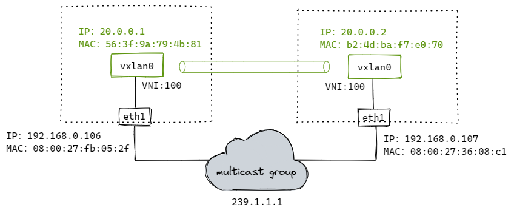
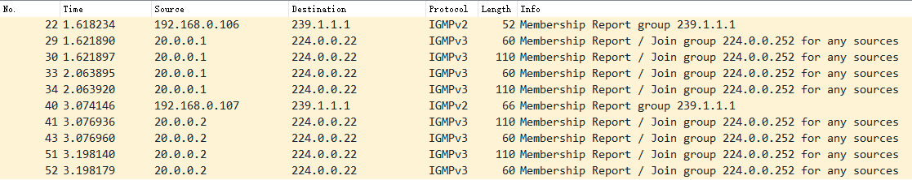
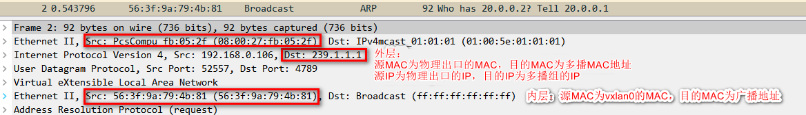
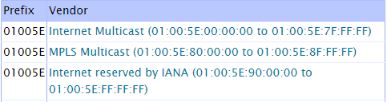
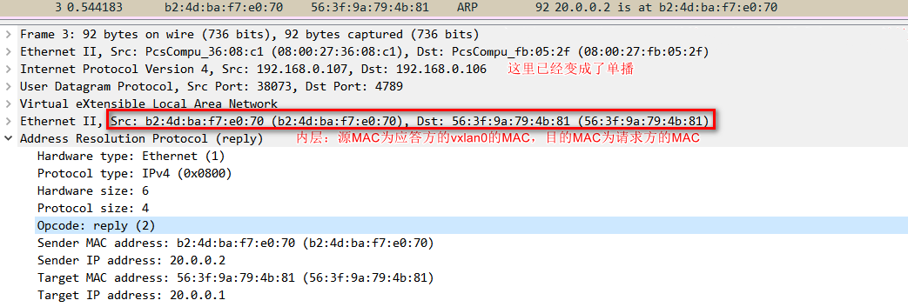
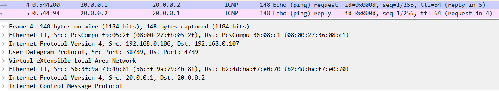
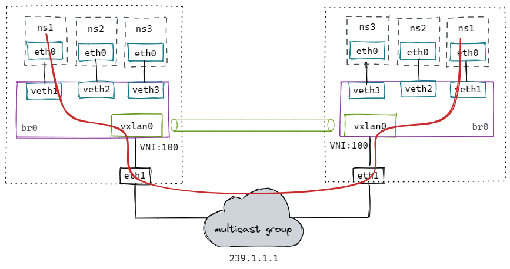
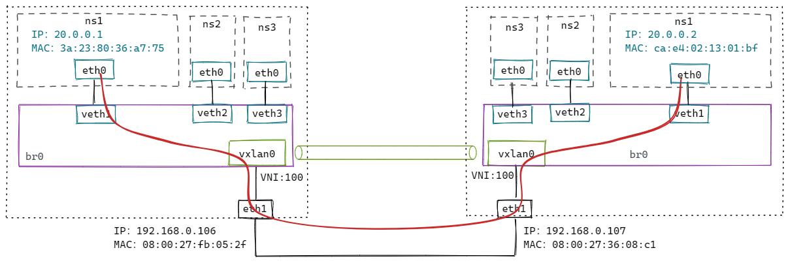
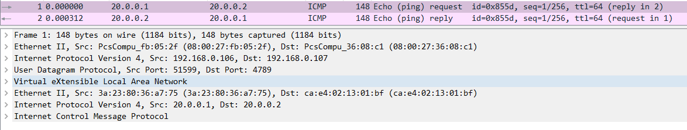

# VXLAN

## 1. 多播模式下的VXLAN



```bash
# 添加vxlan设备（设备名称为vxlan0，VNI为100，多播组为239.1.1.1，vtep通信的设备为eth1 [同local参数]）
# 注意：这里'dstport 0'，表示使用内核默认端口8472（非标准）；通常使用IANA分配的端口'dstport 4789'；方便wireshark解析，这里使用4789
$ ip link add vxlan0 type vxlan id 100 dstport 4789 group 239.1.1.1 dev eth1

# 分配IP地址并开启
$ ip addr add 20.0.0.1/24 dev vxlan0
$ ip link set vxlan0 up
```

配置到这里，VTEP通过IGMP加入同一个多播网络。



```bash
$ ping 20.0.0.2
```
流程如下：

1. ping 20.0.0.2，先查路由表，报文会从 vxlan0 发出去。

```bash
$ ip r
20.0.0.0/24 dev vxlan0 proto kernel scope link src 20.0.0.1
```

2. 内核发现 20.0.0.2 和 vxlan0 处于同一个2层网络，需要知道对方的MAC地址，因此会发送ARP请求报文查询。



  > 多播MAC地址表
  > 
  > 

3. 多播组中的所有主机都会收到这个报文，内核发现是vxlan报文，会根据VNI发送给对应的vtep。

4. vtep去掉vxlan头部，取出内层的ARP请求报文。同时 vtep 会记录 `<源 MAC 地址 - vtep 所在主机 IP 地址>` 信息到 fdb 表中。

5. 如果发现ARP不是发给自己的，直接丢弃；如果是发给自己的，则生成ARP应答报文。



6. ARP应答报文直接单播给请求方，解包后添加ARP缓存到内核。并把学习到目的vtep的主机地址添加到fdb表中。

```bash
$ ip a
20.0.0.2 dev vxlan0 lladdr b2:4d:ba:f7:e0:70 STALE

$ bridge fdb
b2:4d:ba:f7:e0:70 dev vxlan0 dst 192.168.0.107 self
```

7. vetp已经知道所有信息，接下来ICMP报文直接单播发送。



## 2. 容器网络下的VXLAN（使用多播）



创建脚本：
```bash
#!/bin/bash

CONTAINER_ADDR=${1}

# Usage: ./vxlan.sh [container ip]
#   example: ./vxlan.sh 20.0.0.1

# clean
ip link del veth1 2> /dev/null || true
ip netns del ns1 2> /dev/null || true
ip link del vxlan0 2> /dev/null || true
ip link del br0 2> /dev/null || true

# add vxlan
ip link add vxlan0 type vxlan id 100 dstport 4789 group 239.1.1.1 dev eth1

# add bridge
ip link add br0 type bridge
ip link set vxlan0 master br0
ip link set vxlan0 up
ip link set br0 up

# add namespace and veth pair
ip netns add ns1
ip link add veth1 type veth peer name veth1-peer
ip link set dev veth1 master br0
ip link set dev veth1 up
ip link set dev veth1-peer netns ns1
ip netns exec ns1 ip link set veth1-peer name eth0
ip netns exec ns1 ip link set lo up
ip netns exec ns1 ip addr add $CONTAINER_ADDR/24 dev eth0
ip netns exec ns1 ip link set eth0 up
```
测试：
```bash
ip netns exec ns1 ping 20.0.0.2
```

流程跟上面类似，只不过封包前多走了网桥。数据流如红线所示。

方案缺点：

- 不是所有底层网络都支持多播；
- 多播会导致大量的无用报文在网络中出现。

很多云计算的网络都会通过自动化的方式来构建vxlan网络（学习VETP和MAC信息）。

## 3. 容器网络下的VXLAN（手动维护）



修改上面脚本：
```bash
# nolearning 参数告诉 vtep 不要通过收到的报文来学习 fdb 表项的内容，我们会自动维护这个表。
# proxy 参数告诉 vtep 承担 ARP 代理的功能。如果收到 ARP 请求，并且自己知道结果就直接作出应答。
$ ip link add vxlan0 type vxlan id 100 dstport 4789 dev eth1 nolearning proxy
```

106 主机上执行：

```bash
# 添加fdb表
$ bridge fdb append 00:00:00:00:00:00 dev vxlan0 dst 192.168.0.107
$ bridge fdb append ca:e4:02:13:01:bf dev vxlan0 dst 192.168.0.107

# 添加arp表
$ ip neigh add 20.0.0.2 lladdr ca:e4:02:13:01:bf dev vxlan0
```

107 主机上执行：
```bash
# 添加fdb表
$ bridge fdb append 00:00:00:00:00:00 dev vxlan0 dst 192.168.0.106
$ bridge fdb append 3a:23:80:36:a7:75 dev vxlan0 dst 192.168.0.106

# 添加arp表
$ ip neigh add 20.0.0.1 lladdr 3a:23:80:36:a7:75 dev vxlan0
```

测试：
```bash
ip netns exec ns1 ping 20.0.0.2
```



## 4. 容器网络下的VXLAN（动态更新）

手动维护要想正常工作，必须为所有通信容器提前添加好arp和fdb表，但并不是所有容器都会互相通信，添加的部分表项可能是用不到的。

Linux提供了一种方法，内核发现需要的 arp 或者 fdb 表项不存在，会发送事件给订阅的应用程序，这样应用程序拿到这些信息再更新表项，做更精确的控制。

```bash
# l2miss 通过 MAC 地址找不到 VTEP 地址时，就发送通知事件
# l3miss 通过 IP 地址找不到 MAC 地址时，就发送通知事件
$ ip link add vxlan0 type vxlan id 100 dstport 4789 dev eth1 nolearning proxy l2miss l3miss
```

执行 `ip netns exec ns1 ping 20.0.0.2`
```bash
# 使用ip monitor监听事件
$ ip monitor all dev vxlan0
[NEIGH]miss 20.0.0.2  STALE     # 先发生 l3 miss
```

需要添加arp记录：
```bash
$ ip neigh replace 20.0.0.2 lladdr ca:e4:02:13:01:bf dev vxlan0 nud reachable

# 添加后，出现l2miss事件
$ ip monitor all dev vxlan0
[NEIGH]miss lladdr ca:e4:02:13:01:bf STALE     # 再发生 l2 miss
```

需要添加fdb记录：
```bash
$ bridge fdb add ca:e4:02:13:01:bf dst 192.168.0.107 dev vxlan0
```

然后在另外一台设备上执行类似操作，即可ping通。
```bash
$ ip neigh replace 20.0.0.1 lladdr 2a:5c:14:0b:e7:10 dev vxlan0 nud reachable
$ bridge fdb add 2a:5c:14:0b:e7:10 dst 192.168.0.106 dev vxlan0
```

## 5. VXLAN模式下的flannel是如何维护表项的

## 6. VXLAN内核源码分析
