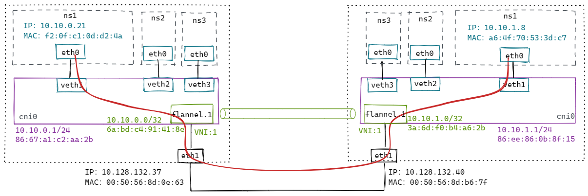
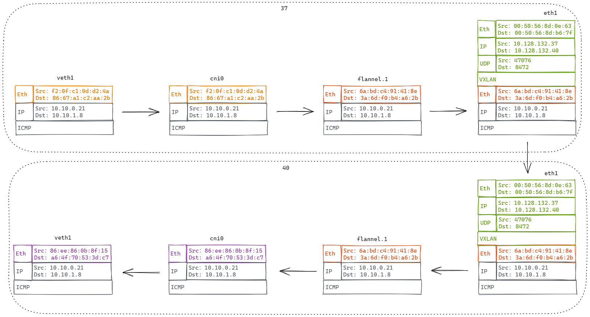

# VXLAN

## 1. 多播模式下的VXLAN


```bash
# 添加vxlan设备（设备名称为vxlan0，VNI为100，多播组为239.1.1.1，用于vtep通信的网卡设备为eth1 [同local参数]）
# 注意：这里'dstport 0'，表示使用内核默认端口8472（非标准）；通常使用IANA分配的端口'dstport 4789'；方便wireshark解析，这里使用4789
$ ip link add vxlan0 type vxlan id 100 dstport 4789 group 239.1.1.1 dev eth1

# 分配IP地址并开启
$ ip addr add 20.0.0.1/24 dev vxlan0
$ ip link set vxlan0 up
```

配置到这里，VTEP通过IGMP加入同一个多播网络。


```bash
$ ping 20.0.0.2
```
流程如下：

1、ping 20.0.0.2，先查路由表，报文会从 vxlan0 发出去。

```bash
$ ip r
20.0.0.0/24 dev vxlan0 proto kernel scope link src 20.0.0.1
```

2、内核发现 20.0.0.2 和 vxlan0 处于同一个2层网络，需要知道对方的MAC地址，因此会发送ARP请求报文查询。


  > 多播MAC地址表
  > 
  > 

3、多播组中的所有主机都会收到这个报文，内核发现是vxlan报文，会根据VNI发送给对应的vtep。

4、vtep去掉vxlan头部，取出内层的ARP请求报文。同时 vtep 会记录 `<源 MAC 地址 - vtep 所在主机 IP 地址>` 信息到 fdb 表中。

5、如果发现ARP不是发给自己的，直接丢弃；如果是发给自己的，则生成ARP应答报文。


6、ARP应答报文直接单播给请求方，解包后添加ARP缓存到内核。并把学习到目的vtep的主机地址添加到fdb表中。

```bash
$ ip a
20.0.0.2 dev vxlan0 lladdr b2:4d:ba:f7:e0:70 STALE

$ bridge fdb
b2:4d:ba:f7:e0:70 dev vxlan0 dst 192.168.0.107 self
```

7.、vetp已经知道所有信息，接下来ICMP报文直接单播发送。


## 2. 容器网络下的VXLAN（使用多播）


创建脚本：
```bash
#!/bin/bash

CONTAINER_ADDR=${1}

# Usage: ./vxlan.sh [container ip]
#   example: ./vxlan.sh 20.0.0.1

# clean
ip link del veth1 2> /dev/null || true
ip netns del ns1 2> /dev/null || true
ip link del vxlan0 2> /dev/null || true
ip link del br0 2> /dev/null || true

# add vxlan
ip link add vxlan0 type vxlan id 100 dstport 4789 group 239.1.1.1 dev eth1

# add bridge
ip link add br0 type bridge
ip link set vxlan0 master br0
ip link set vxlan0 up
ip link set br0 up

# add namespace and veth pair
ip netns add ns1
ip link add veth1 type veth peer name veth1-peer
ip link set dev veth1 master br0
ip link set dev veth1 up
ip link set dev veth1-peer netns ns1
ip netns exec ns1 ip link set veth1-peer name eth0
ip netns exec ns1 ip link set lo up
ip netns exec ns1 ip addr add $CONTAINER_ADDR/24 dev eth0
ip netns exec ns1 ip link set eth0 up
```
测试：
```bash
ip netns exec ns1 ping 20.0.0.2
```

流程跟上面类似，只不过封包前多走了网桥。数据流如红线所示。

方案缺点：

- 不是所有底层网络都支持多播；
- 多播会导致大量的无用报文在网络中出现。

很多云计算的网络都会通过自动化的方式来构建vxlan网络（学习VETP和MAC信息）。

## 3. 容器网络下的VXLAN（手动维护）


修改上面脚本：
```bash
# nolearning 参数告诉 vtep 不要通过收到的报文来学习 fdb 表项的内容，我们会自动维护这个表。
# proxy 参数告诉 vtep 承担 ARP 代理的功能。如果收到 ARP 请求，并且自己知道结果就直接作出应答。
$ ip link add vxlan0 type vxlan id 100 dstport 4789 dev eth1 nolearning proxy
```

106 主机上执行：

```bash
# 添加fdb表
$ bridge fdb append 00:00:00:00:00:00 dev vxlan0 dst 192.168.0.107
$ bridge fdb append ca:e4:02:13:01:bf dev vxlan0 dst 192.168.0.107

# 添加arp表
$ ip neigh add 20.0.0.2 lladdr ca:e4:02:13:01:bf dev vxlan0
```

107 主机上执行：
```bash
# 添加fdb表
$ bridge fdb append 00:00:00:00:00:00 dev vxlan0 dst 192.168.0.106
$ bridge fdb append 3a:23:80:36:a7:75 dev vxlan0 dst 192.168.0.106

# 添加arp表
$ ip neigh add 20.0.0.1 lladdr 3a:23:80:36:a7:75 dev vxlan0
```

测试：
```bash
ip netns exec ns1 ping 20.0.0.2
```


## 4. 容器网络下的VXLAN（动态更新）

手动维护要想正常工作，必须为所有通信容器提前添加好arp和fdb表，但并不是所有容器都会互相通信，添加的部分表项可能是用不到的。

Linux提供了一种方法，内核发现需要的 arp 或者 fdb 表项不存在，会发送事件给订阅的应用程序，这样应用程序拿到这些信息再更新表项，做更精确的控制。

```bash
# l2miss 通过 MAC 地址找不到 VTEP 地址时，就发送通知事件
# l3miss 通过 IP 地址找不到 MAC 地址时，就发送通知事件
$ ip link add vxlan0 type vxlan id 100 dstport 4789 dev eth1 nolearning proxy l2miss l3miss
```

执行 `ip netns exec ns1 ping 20.0.0.2`
```bash
# 使用ip monitor监听事件
$ ip monitor all dev vxlan0
[NEIGH]miss 20.0.0.2  STALE     # 先发生 l3 miss
```

需要添加arp记录：
```bash
$ ip neigh replace 20.0.0.2 lladdr ca:e4:02:13:01:bf dev vxlan0 nud reachable

# 添加后，出现l2miss事件
$ ip monitor all dev vxlan0
[NEIGH]miss lladdr ca:e4:02:13:01:bf STALE     # 再发生 l2 miss
```

需要添加fdb记录：
```bash
$ bridge fdb add ca:e4:02:13:01:bf dst 192.168.0.107 dev vxlan0
```

然后在另外一台设备上执行类似操作，即可ping通。
```bash
$ ip neigh replace 20.0.0.1 lladdr 2a:5c:14:0b:e7:10 dev vxlan0 nud reachable
$ bridge fdb add 2a:5c:14:0b:e7:10 dst 192.168.0.106 dev vxlan0
```

## 5. VXLAN模式下的flannel是如何维护表项的

首先从代码注释中得知，flannel的vxlan实现经历了三个版本：（使用L2miss和L3miss） -> （去掉L3miss） -> （去掉L2miss）。

每增加一个远程节点，只需要针对它配置：一条路由、一条arp表项、一条fdb表项。

```c
// The first versions of vxlan for flannel registered the flannel daemon as a handler for both "L2" and "L3" misses

// The second version of flannel vxlan removed the need for the L3MISS callout. When a new remote host is found (either during startup or when it's created), flannel simply adds the required entries so that no further lookup/callout is required.

// The latest version of the vxlan backend  removes the need for the L2MISS too, which means that the flannel deamon is not listening for any netlink messages anymore. This improves reliability (no problems with timeouts if flannel crashes or restarts) and simplifies upgrades.

// How it works:
// Create the vxlan device but don't register for any L2MISS or L3MISS messages
// Then, as each remote host is discovered (either on startup or when they are added), do the following
// 1) Create routing table entry for the remote subnet. It goes via the vxlan device but also specifies a next hop (of the remote flannel host).
// 2) Create a static ARP entry for the remote flannel host IP address (and the VTEP MAC)
// 3) Create an FDB entry with the VTEP MAC and the public IP of the remote flannel daemon.
//
// In this scheme the scaling of table entries is linear to the number of remote hosts - 1 route, 1 arp entry and 1 FDB entry per host
```

默认情况下，flannel.1配置了：`dstport 8472`，`nolearning`。

环境搭建如下：



针对 `37` 这个节点，flannel添加了如下配置：
```bash
$ ip n
# arp记录 [IP地址 -> MAC地址]
10.10.1.0 dev flannel.1 lladdr 3a:6d:f0:b4:a6:2b PERMANENT

$ bridge fdb
# fdb记录 [MAC地址 -> VETP所在主机的IP]
3a:6d:f0:b4:a6:2b dev flannel.1 dst 10.128.132.40 self permanent

$ ip r
# 路由
10.10.1.0/24 via 10.10.1.0 dev flannel.1 onlink
```

从 `10.10.0.21` ping `10.10.1.8`，数据包流程如下：



## 6. VXLAN内核源码分析

### 6.1. 发包

```c
static netdev_tx_t vxlan_xmit(struct sk_buff *skb, struct net_device *dev)
{
	...
	if (vxlan->cfg.flags & VXLAN_F_PROXY) {  // 如果开启了ARP代理
		if (ntohs(eth->h_proto) == ETH_P_ARP)	// 数据包是arp包
			return arp_reduce(dev, skb, vni);	// arp表查得到，就回复arp应答包；查不到且开启了l3miss，就发送l3miss通知。
	}
	
	// 查fdb表
	f = vxlan_find_mac(vxlan, eth->h_dest, vni);
	if (f == NULL) {
		f = vxlan_find_mac(vxlan, all_zeros_mac, vni);
		if (f == NULL) {
			if ((vxlan->cfg.flags & VXLAN_F_L2MISS) &&
			    !is_multicast_ether_addr(eth->h_dest))
			    // 查不到就发送l2miss通知
				vxlan_fdb_miss(vxlan, eth->h_dest);
			...
			return NETDEV_TX_OK;
	...
	
	vxlan_xmit_one(skb, dev, vni, fdst, did_rsc);
}

static void vxlan_xmit_one(struct sk_buff *skb, struct net_device *dev,
			   __be32 default_vni, struct vxlan_rdst *rdst,
			   bool did_rsc)
{
	...
	// 根据skb，哈希出udp头的源端口
	src_port = udp_flow_src_port(dev_net(dev), skb, vxlan->cfg.port_min,
				     vxlan->cfg.port_max, true);
	vxlan_build_skb		// 封vxlan头
	udp_tunnel_xmit_skb  // 封udp头
		iptunnel_xmit	// 封IP头
			ip_local_out // 走 local_out 出去
}
```

### 6.2. 收包

```c
static int udp_queue_rcv_one_skb(struct sock *sk, struct sk_buff *skb)
{
	// 判断是封包
	if (static_branch_unlikely(&udp_encap_needed_key) && up->encap_type) {
		int (*encap_rcv)(struct sock *sk, struct sk_buff *skb);
		encap_rcv = READ_ONCE(up->encap_rcv);
		if (encap_rcv) {
			// 回调vxlan_sock注册的收包回调：vxlan_rcv
			ret = encap_rcv(sk, skb);
		}
	}
}

static int vxlan_rcv(struct sock *sk, struct sk_buff *skb)
{
	// 获取vxlan头中的VNI
	vni = vxlan_vni(vxlan_hdr(skb)->vx_vni);
	// 根据VNI找vxlan设备
	vxlan = vxlan_vs_find_vni(vs, skb->dev->ifindex, vni);
	if (!vxlan)
		goto drop;
	
	// 重新设置下数据包的网卡设备
	skb->dev = vxlan->dev;
	
	gro_cells_receive(&vxlan->gro_cells, skb);
		// 把数据包入队
		__skb_queue_tail(&cell->napi_skbs, skb);
}
```
