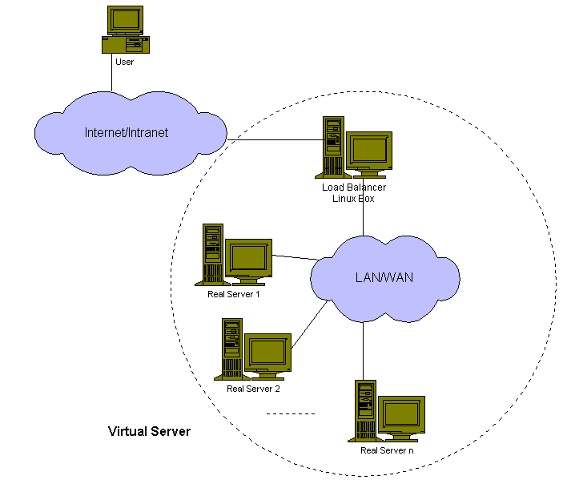

# LVS
## LVS-理论知识

- LVS: Introduction

    构建服务器集群的方法：

    - 基于 DNS 的负载均衡集群

    DNS 负载均衡可能是构建网络服务集群最简单的方法。它使用域名系统通过将域名解析为服务器的不同 IP 地址来将请求分发到不同的服务器。当 DNS 请求来到 DNS 服务器解析域名时，DNS 服务器根据调度策略（如轮询方式）给出其中一个服务器 IP 地址，然后来自使用相同本地缓存名称服务器的客户端的后续请求在名称解析的指定生存时间 (TTL) 内发送到同一服务器。

    但是，由于客户端的缓存特性和分层的DNS系统，很容易导致服务器之间的动态负载不平衡，因此服务器不容易处理其峰值负载。域名映射的TTL值在DNS服务器上不能很好的选择，值小DNS流量大，DNS服务器会成为瓶颈，大值动态负载不平衡会更严重。甚至TTL值设置为零，调度粒度是每台主机，不同用户的访问模式可能会导致动态负载不平衡，因为有些人可能会从站点中拉出很多页面，而有些人可能只是浏览了几页就走离开。而且，它不是那么可靠，当一个服务器节点出现故障时，将名称映射到IP地址的客户端会发现服务器宕机了，

    - 基于调度器的负载均衡集群

    Dispatcher，也称为负载均衡器，可用于在集群中的服务器之间分配负载，使服务器的并行服务可以作为单个IP地址上的虚拟服务出现，最终用户交互就像一个服务器一样不知道集群中的所有服务器。与基于 DNS 的负载平衡相比，调度程序可以以细粒度（例如每个连接）调度请求，以便在服务器之间实现更好的负载平衡。当一台或多台服务器出现故障时，可以掩盖故障。服务器管理变得容易，管理员可以随时让一台或多台服务器进出服务，不会中断对最终用户的服务。

    负载均衡可以在两个层次上完成，应用级和 IP 级。例如，[Reverse-proxy](http://www.engelschall.com/pw/wt/loadbalance/) 和[pWEB](http://www.nsrc.nus.sg/STAFF/edward/)是一种应用级负载均衡方法，用于构建可扩展的 Web 服务器。它们将 HTTP 请求转发到集群中的不同 Web 服务器，返回结果，然后将其返回给客户端。由于在应用层处理HTTP请求和回复的开销很大，我相信当服务器节点数量增加到5个或更多时，应用层负载均衡器将成为一个新的瓶颈，这取决于每个节点的吞吐量服务器。

    **Best Solution for HA and Network Loadbalancing**:

    - HAproxy
    - Distributor
    - Crossroads
    - Pen
    - Balance/BalanceNG
    - Pound

- LVS: What is an LVS? Can I use an LVS?

    Linux 虚拟服务器 (LVS) 是一组服务器，对于外部客户端来说似乎是一台服务器。单一的服务器在此称为“虚拟服务器”。真实的服务器受控制器（或负载均衡器）的控制，该控制器运行在 内核打了ip_vs代码补丁的Linux 上。LVS的核心就是ip_vs代码，用户空间代码（ipvsadm）用于管理 LVS（为服务设置规则，处理故障转移）。

    当客户端向 LVS 提供的服务（例如 httpd）请求新连接时，控制器 将为客户端选择一个 realserver。从那时起，来自客户端的所有数据包都将通过控制器到达特定的 realserver。客户端和 realserver之间的关联将仅在 tcp 连接（或 udp 交换）的生命周期内持续。对于下一次 tcp 连接，控制器将选择一个新的 realserver（可能与第一个 realserver 相同，也可能不同）。因此，连接到 LVS 的 Web 浏览器为由多个点击（图像、html 页面）组成的网页提供服务，可以从单独的 realserver获得每个点击。

    

    **为什么需要使用LVS？**

    - 更高的吞吐（higher throughput）。通过在 LVS 中添加 realserver 来增加吞吐量。
    - 冗余（redundancy）。单个机器可以从 LVS 中切换出来，升级并重新上线，而不会中断对客户端的服务。
    - 适应性（adaptability）。服务器的数量可以根据吞吐量的变化而变化。

    **LVS转发包的三种方式**：

    - LVS-NAT。基于网络地址转换（NAT）
    - LVS-DR。直接路由（direct routing）模式，通过修改MAC地址。
    - LVS-Tun。基于IP隧道的模式

- LVS-NAT：

    

    当用户访问服务器集群提供的服务时，发往虚拟IP地址（负载均衡器的外部IP地址）的请求包到达负载均衡器。负载平衡器检查数据包的目标地址和端口号。如果根据虚拟服务器规则表匹配到一个虚拟服务器服务，则通过调度算法从集群中选择一个真实服务器，并将该连接加入到记录建立连接的哈希表中。然后，将数据包的目的地址和端口重写为所选服务器的地址和端口，并将数据包转发到服务器。当传入的数据包属于此连接并且可以在哈希表中找到所选服务器时，数据包将被重写并转发到所选服务器。当回复数据包返回时，负载均衡器将数据包的源地址和端口重写为虚拟服务的源地址和端口。连接终止或超时后，连接记录将在哈希表中删除。

- LVS-DR:

    

    当用户访问服务器集群提供的虚拟服务时，发往虚拟IP地址（虚拟服务器的IP地址）的数据包到达。负载均衡器 (LinuxDirector) 检查数据包的目标地址和端口。如果它们匹配到虚拟服务，则通过调度算法从集群中选择一个真实服务器，并将连接添加到记录连接的哈希表中。然后，负载均衡器直接将其转发到所选服务器。当传入的数据包属于此连接并且可以在哈希表中找到所选服务器时，数据包将再次直接路由到服务器。当服务器收到转发的数据包时，服务器发现该数据包是针对其别名接口上的地址或针对本地套接字的，所以它处理请求并最终将结果直接返回给用户。连接终止或超时后，连接记录将从哈希表中删除。

    

    负载均衡器只是将数据帧的 MAC 地址更改为所选服务器的 MAC 地址，然后在 LAN 上重新传输它。这就是负载平衡器和每个服务器必须通过 LAN 的单个不间断网段直接相互连接的原因。

- LVS-TUN：

    

    当用户访问服务器集群提供的虚拟服务时，一个发往虚拟IP地址（虚拟服务器的IP地址）的数据包到达。负载平衡器检查数据包的目标地址和端口。如果它们与虚拟服务匹配，则根据连接调度算法从集群中选择一个真实服务器，并将该连接添加到记录连接的哈希表中。然后，负载平衡器将数据包封装在 IP 数据报中，并将其转发到选定的服务器。当传入数据包属于此连接并且可以在哈希表中找到所选服务器时，数据包将再次封装并转发到该服务器。当服务器收到封装的数据包时，解封装数据包并处理请求，最后根据自己的路由表将结果直接返回给用户。连接终止或超时后，连接记录将从哈希表中删除。工作流程如下图所示。

    

    注意真实服务器可以在任何网络中拥有任何真实IP地址，它们可以在地理上分布，但必须支持IP封装协议。它们的隧道设备都配置好了，使系统能够对接收到的封装报文进行正确的解封装，并且<Virtual IP Address>必须配置在非arp设备或非arp设备的任何别名上，否则系统可以配置为将 <Virtual IP Address> 的数据包重定向到本地套接字。

- 架构

    

    三层架构包括：

    - **负载均衡器（Load Balancer）**

        是整个集群系统的前端机器，在一组服务器之间平衡来自客户端的请求，让客户端认为所有的服务都来自一个单一的IP地址。

    - **服务器集群（Server Cluster）**

        这是一组运行实际网络服务的服务器，如 Web、Mail、FTP、DNS 和Media服务。

    - **共享存储（Shared Storage）**

        为服务器提供共享存储空间，便于服务器拥有相同的内容，提供相同的服务。

- 高可用

    

    现在负载均衡器可能成为整个系统的单一故障点。为了防止整个系统因为负载均衡器故障而停止服务，我们需要设置负载均衡器的一个备份（或多个备份）。两个心跳守护进程分别在主服务器和备份服务器上运行，它们定期通过串行线路和/或网络接口相互心跳消息，例如“我还活着”。当备份的心跳守护进程在指定时间内无法听到来自主的心跳消息时，它将接管虚拟IP地址提供负载均衡服务。当出现故障的负载均衡器恢复工作时，有两种解决方案，一种是自动成为备用负载均衡器，另一种是主动负载均衡器释放VIP地址，

    主负载平衡器具有连接状态，即连接转发到哪个服务器。如果备用负载均衡器在没有这些连接信息的情况下接管，则客户端必须再次发送其请求以访问服务。为了使负载均衡器故障转移对客户端应用程序透明，我们在 IPVS 中实现连接同步，主 IPVS 负载均衡器通过 UDP 多播将连接信息同步到备用负载均衡器。当备份负载均衡器在主负载均衡器发生故障后接管时，备份负载均衡器将拥有大多数连接的状态，这样几乎所有连接都可以通过备份负载均衡器继续访问服务。

    **构建高可用的LVS系统的方法**：

    - Piranha
    - Keepalived
    - UltraMonkey
    - heartbeat + mon + coda
    - heartbeat + ldirectord

- 调度算法
    - **Round-Robin Scheduling（RR，轮询）**

    > 循环调度算法将每个传入请求发送到其列表中的下一个服务器。因此，在三服务器集群（服务器 A、B 和 C）中，请求 1 将前往服务器 A，请求 2 将前往服务器 B，请求 3 将前往服务器 C，请求 4 将前往服务器 A，从而完成服务器的循环或“循环”。无论每个服务器经历的传入连接数或响应时间如何，它都将所有真实服务器视为平等。与传统的循环 DNS 相比，虚拟服务器提供了一些优势。轮询 DNS 将单个域解析为不同的 IP 地址，调度粒度是基于主机的，DNS 查询的缓存阻碍了基本算法，这些因素导致了真实服务器之间的显着动态负载不平衡。

    - **Weighted Round-Robin Scheduling（WRR，加权轮询）**

    > 加权循环调度旨在更好地处理具有不同处理能力的服务器。可以为每个服务器分配一个权重，一个表示处理能力的整数值。权重高的服务器比权重小的服务器先接收新连接，权重高的服务器比权重小的服务器获得更多的连接，权重相等的服务器获得的连接数相等。例如，真实服务器 A、B 和 C 的权重分别为 4、3、2，一个好的调度序列将是一个调度周期内的 AABABCABC（mod sum(Wi)）。在实现加权轮询调度时，修改Virtual Server的规则后，会根据服务器权重生成调度序列。

    > 实际上，轮询调度是加权轮询调度的一个特例，其中所有的权重都相等。

    - **Least-Connection Scheduling（LC，最少链接）**

    > 最少连接调度算法将网络连接定向到已建立连接数最少的服务器。这是**动态调度**算法之一；因为它需要动态计算每个服务器的实时连接数。对于管理一组性能相似的服务器的虚拟服务器，当请求负载变化很大时，最少连接调度有利于平滑分布。虚拟服务器会将请求定向到活动连接最少的真实服务器。

    > 乍一看，即使有各种处理能力的服务器，最少连接调度似乎也能很好地执行，因为速度越快的服务器将获得更多的网络连接。实际上，由于 TCP 的 TIME_WAIT 状态，它不能很好地执行。TCP 的 TIME_WAIT 通常是 2 分钟，在这 2 分钟内，一个繁忙的网站经常会收到数千个连接，例如服务器 A 的功能是服务器 B 的两倍，服务器 A 正在处理数千个请求并将它们保存在TCP 的 TIME_WAIT 状态，但服务器 B 正在爬行以完成其数千个连接。因此，最少连接调度无法在具有各种处理能力的服务器之间很好地平衡负载。

    - **Weighted Least-Connection Scheduling（WLC，加权最少链接）**

    > 加权最少连接调度是最少连接调度的超集，可以为每台真实服务器分配一个性能权重。具有较高权重值的服务器在任何时候都会收到较大比例的实时连接。虚拟服务器管理员可以为每台真实服务器分配一个权重，并为每台服务器调度网络连接，其中每台服务器当前活动连接数的百分比与其权重成比例。默认权重为 1。

    - **Locality-Based Least-Connection Scheduling（LBLC，基于局部性的最少链接）**

    > 基于位置的最少连接调度算法用于目的IP负载均衡。它通常用于缓存集群。如果服务器处于活动状态且负载不足，则此算法通常会将发往 IP 地址的数据包定向到其服务器。如果服务器过载（其活动连接数大于其权重）并且在其一半负载中存在服务器，则将加权最少连接服务器分配给该 IP 地址。

    - Locality-Based Least-Connection with Replication Scheduling（LBLCR，带复制的基于局部性最少链接）

    > 具有复制调度算法的基于位置的最小连接也是用于目标 IP 负载平衡。它通常用于缓存集群。它与 LBLC 调度的区别如下：负载均衡器维护从一个目标到一组可以为该目标提供服务的服务器节点的映射。对目标的请求被分配给目标服务器集中最少连接的节点。如果服务器集中的所有节点都过载了，它会选择集群中连接最少的节点并将其添加到目标的服务器集中。如果服务器集在指定时间内没有被修改，则将负载最大的节点从服务器集中移除，以避免高度复制。

    - **Destination Hashing Scheduling（DH，目标地址散列）**

    > 目标散列调度算法通过按目标 IP 地址查找静态分配的散列表来将网络连接分配给服务器。

    - **Source Hashing Scheduling（SH，源地址散列）**

    > 源散列调度算法通过根据源 IP 地址查找静态分配的散列表来将网络连接分配给服务器。

    - **Shortest Expected Delay Scheduling（SED，最短预期延迟）**

    > 最短预期延迟调度算法将网络连接分配给预期延迟最短的服务器。如果作业发送到第 i 个服务器，则该作业将经历的预期延迟为 (Ci + 1) / Ui，其中 Ci 为第 i 个服务器上的连接数，Ui 为第 i 个服务器的固定服务速率（权重）

    - **Never Queue Scheduling（NQ，从不排队调度）**

    > 从不排队调度算法采用二速模型。当有空闲服务器可用时，作业将发送到空闲服务器，而不是等待快速服务器。当没有空闲服务器可用时，作业将被发送到最小化其预期延迟的服务器（最短预期延迟调度算法）。

- LVS-TUN 和 LVS-DR的ARP 问题
- LVS 中的持久化处理
- 针对 DoS 攻击的 LVS 防御策略
- IPVS 连接同步

## LVS-HOWTO

http://www.austintek.com/LVS/LVS-HOWTO/HOWTO/
