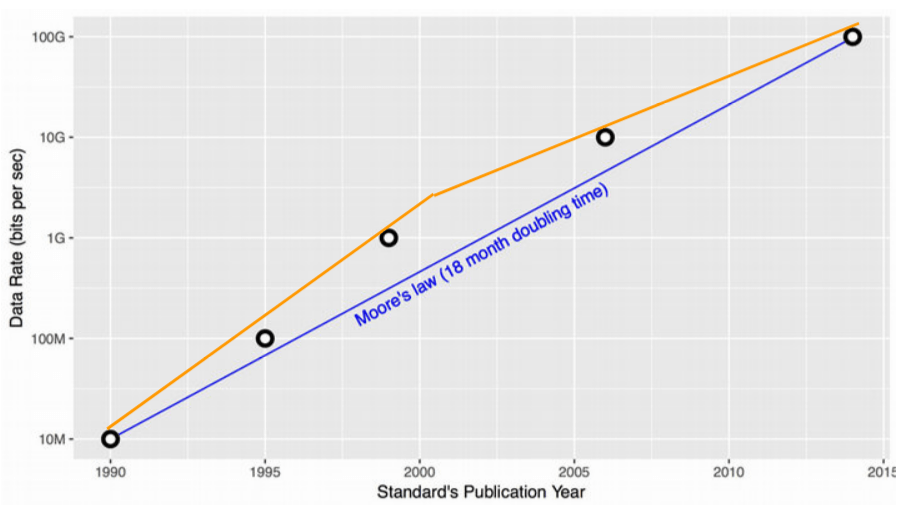

# Earliest Departure Time

## 1. 基于 queue 的流量整形

1. 主机 egress 流量经过分类器（classifier）进行分类；
2. 流量经过分类后分别放入不同的 queue ，各 queue 的发送速率限制可能是不同的；
3. 某个调度器（scheduler）负责统一调度以上所有 queue 的发包，将包从 queue 中取出放到主机网卡的 TX queue 中；
4. 网卡将 TX queue 中包无差别地发送出去。

三个组件：classifier、queue、scheduler

### 1.1. 延迟和丢包

在过去25年内，以太网带宽 从 10Mbps 演进到 100Gbps，发送速率上限取决于主机侧。当希望发送更快时，只需要将网卡及网线从 100Mbps 换成 1000Mbps，非常简单直接。 主机外面的东西不用担心，自然会有人和技术能支撑主机的发送。

摩尔定律说：每18个月带宽就能翻一番。

但到2003年，Intel 突然告诉我们下一代处理器不能快一倍了 ——甚至实际上还会慢一点， 然后通过**多核**来提升整体性能。

带来的影响：

1. 服务器的网卡带宽追平了交换机之间的互联带宽，我们**无法造出速度永远比网卡快一个数量级的交换机**了。
2. 原来单核或单主机能完成的事情，现在只能**分发到多核、多主机**上去。
3. 之前通过升级硬件设施来避免延迟和丢包，现在行不通了。甚至**愿意忍受更大的延迟也无法避免丢包**。

过去，流量管理在中间设备（路由器/交换机），基于缓冲队列（queue）实现，已无法适用当前的网络现状了。

### 1.2. 基于 queue 存在什么问题？

1. CPU开销随 queue 数量 线性增长；
2. 多个CPU共享多个queue，导致CPU之前竞争开销（锁）；

## 2. 基于 time 的流量整形

Google 的解决思路是：**感知网络瓶颈，以瓶颈处的最大发送速率发送数据包**。

依赖的最重要因素不再是 queue，而是**时间（time）**。

引入了 EDT（earliest departure time）模型：

- 给每个包（skb）打上一个 Earliest Departure Time (EDT) 时间戳；；
- 用一个时间轮调度器（timing-wheel scheduler）代替原来缓冲队列（queue），根据时间戳控制 egress 发包。

1. 调度复杂度 O(1)，待发送的包是按时间戳排好序的；
2. 调度器能直接给 socket 反压，控制 socket 发送速率；
3. 每个CPU一个 shaper，无锁；

好处：

- 缓存友好 （没有指针链了）；
- RCU友好（单槽更新）；
- Qdisc 变成了纯计算模块，不需要维护内部队列了；

## 参考

[From Queues to Earliest Departure Time](https://documents.pub/document/oct-2018-david-wetherall-presenter-nandita-dukkipati-talks2018davidwetherall.html?page=32)
