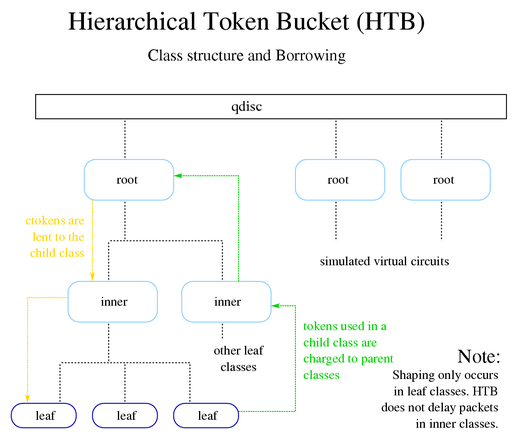
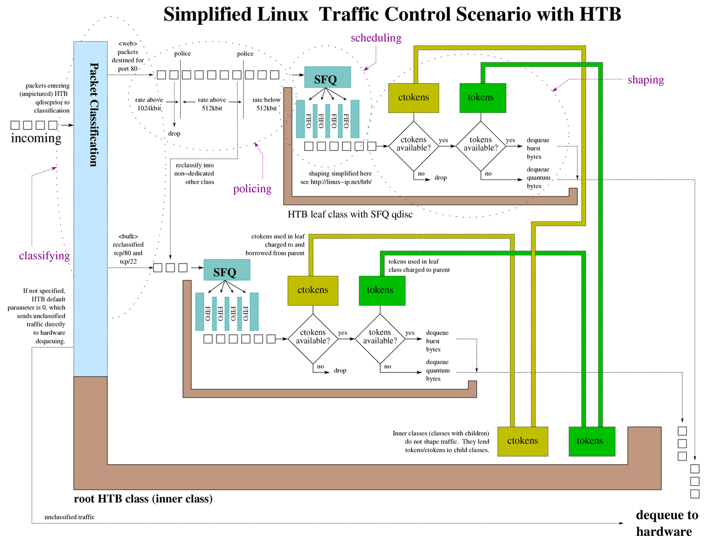

# 流量控制（Traffic Control，tc）

流控提供了一组机制和操作，使得数据包在网络接口上排队（传输/接收）。

这些操作包含了排队、监管、分类、调度、整形、丢弃。

## 一、基本概念

1. 队列（Queues）
	- 两个动作：入队、出队
2. 流量（Flows）
3. 令牌和桶（Tokens and buckets）
	- 桶是按照速率装满令牌的，如果令牌没有被使用，桶可以装满。如果使用令牌，则桶将不会填满
	- 常规流量可以由小桶处理，突发流量可能需要更大的桶
4. 数据包和帧（Packets and frames）
	- 帧实际上是进行流量控制的单位

## 二、传统元素

1. 整形（Shaping）
	- 整形是在输出队列中传输之前延迟数据包以满足所需输出速率的机制
2. 调度（Scheduling）
	- 调度是在特定队列的输入和输出之间排列（或重新排列）数据包的机制
3. 分类（Classifying）
    - 分类是将数据包分开以进行不同处理（可能是不同的输出队列）的机制
4. 监管（Policing）
	- 监管，只是一种可以限制流量的机制
5. 丢弃（Dropping）
	- 丢弃会丢弃整个数据包、流或分类
6. 标记（Marking）
	- 标记是一种改变数据包的机制
	- 这个不是`fwmark`。iptables的MARK是用来改变数据包的元数据，不是数据包本身
	- ❓不太明白区别是啥❓

## 三、组件

### qdisc (queuing discipline)

排队规则

`root qdisc`和`ingress qdisc`

### class

`class`只存在于`classful qdisc`中，可以包含多个子`class`或单个`qdisc`。

任何`class`也可以附加任意数量的`fitler`。

叶子`class`包含了一个`qdisc`，并且永远不会包含子`class`。

`class`和子`class`的类型必须一致。`HTB qdisc`只能将`HTB class`作为子级。

### fitler

过滤器

### classifier

分类器

### policer

监管器

### drop

唯一可以明确丢弃数据包的地方就是监管器。

此外，整形器和调度器可能不得不在突发或过载的情况下丢弃数据包。

### handle

句柄

每个`class`或`classful qdisc`都需要一个唯一标识符。称为句柄。

句柄有两个组成成员，主要编号（`major`）和次要编号（`minor`）。

共享一个父级的所有 `class` 都必须共享一个 主编号，拥有唯一的 次编号。

特殊句柄 `ffff:0` 是为 `ingress qdisc`保留的。

## 四、工具使用

### 内核编译选项

```shell
#
# QoS and/or fair queueing
#
CONFIG_NET_SCHED=y
CONFIG_NET_SCH_CBQ=m
CONFIG_NET_SCH_HTB=m
CONFIG_NET_SCH_CSZ=m
CONFIG_NET_SCH_PRIO=m
CONFIG_NET_SCH_RED=m
CONFIG_NET_SCH_SFQ=m
CONFIG_NET_SCH_TEQL=m
CONFIG_NET_SCH_TBF=m
CONFIG_NET_SCH_GRED=m
CONFIG_NET_SCH_DSMARK=m
CONFIG_NET_SCH_INGRESS=m
CONFIG_NET_QOS=y
CONFIG_NET_ESTIMATOR=y
CONFIG_NET_CLS=y
CONFIG_NET_CLS_TCINDEX=m
CONFIG_NET_CLS_ROUTE4=m
CONFIG_NET_CLS_ROUTE=y
CONFIG_NET_CLS_FW=m
CONFIG_NET_CLS_U32=m
CONFIG_NET_CLS_RSVP=m
CONFIG_NET_CLS_RSVP6=m
CONFIG_NET_CLS_POLICE=y
```

### tc 工具

```bash
[root@localhost]# tc                \   #
>                 qdisc add         \   # 添加一个排队规则，也可以是 del
>                 dev eth0          \   # 指定网口
>                 root              \   # 根
>                 handle 1:0        \   # 句柄
>                 htb                   # qdisc类型

[root@localhost]# tc                \   #
>                 class add         \   # 添加一个类，也可以是 del
>                 dev eth0          \   # 指定网口
>                 parent 1:1        \   # 指定父句柄
>                 classid 1:6       \   # 标识该class的句柄
>                 rate 256kbit      \   # 参数，分配给该class的速率，可借
>                 ceil 512kbit          # 参数，指定该class的上限速率，不可借

[root@localhost]# tc                        \   #
>                 filter add                \   # 添加一个过滤器，也可以是 del
>                 dev eth0                  \   # 指定网口
>                 parent 1:0                \   # 指定父句柄
>                 protocol ip               \   # 指定协议类型
>                 prio 5                    \   # 指定优先级
>                 u32                       \   # 指定分类器
>                 match ip port 22 0xffff   \   # 分类器参数，匹配端口22
>                 match ip tos 0x10 0xff    \   # 分类器参数，tos标志
>                 flowid 1:6                \   # 流ID
>                 police                    \   # 监管器
>                 rate 32000bps             \   # 监管器将根据此速率执行操作
>                 burst 10240               \   # 突发，空闲期间可以累积的最大字节数
>                 mpu 0                     \   # 监管的最小单位。用于统计所有流量
>                 action drop/continue      \   # 监管操作。超出监管时drop，否则continue
```

## 五、无类排队规则（classless qdisc）

这些是Linux下使用的基本调度程序。默认调度程序是`pfifo_fast`

### FIFO ( First-In First-Out )

Linux 实现了两种基本的 FIFO qdisc，
一种是`pfifo`，单位是数据包
一种是`bfifo`，单位是字节


### pfifo_fast

基于传统的 FIFO qdisc ，pfifo_fast 还提供了优先级。它提供了三个不同的频段（单独的FIFO）用于分离流量。


### SFQ ( Stochastic Fair Queuing )

SFQ（随机公平排队）  企图在任意数量的流之间，公平地分配传输数据的机会。通过使用Hash函数将流量分离，以`Round Robin`的方式出队。


### ESFQ ( Extended Stochastic Fair Queuing )

ESFQ（扩展随机公平排队）通过允许用户控制使用哪种哈希算法来分配对网络带宽的访问，达到更公平的真实带宽分配。

### GRED ( Generic Random Early Drop )

...

### TBF ( Token Bucket Filter )

它只是将传输的流量减慢到指定的速率。

仅当有足够的令牌可用时才会传输数据包。否则，数据包将被延迟。


## 六、有类排队规则（classful qdisc）

有类队列规则可以附加过滤器，允许将数据包定向到特定的类和子队列。

附加到`root qdisc`的`class`称为根类，一般也称内部类`inner class`。

指定了`qdisc`的任何终端类`terminal class`都称为叶类`leaf class`。

### HTB ( Hierarchical Token Bucket )

HTB（分层令牌桶），这种排队规则允许用户定义所使用的令牌和桶的特征，并允许用户以任意方式嵌套这些桶。当与`class`结合使用时，可以以非常精细的方式控制流量。

HTB 最常见的应用之一就是将传输的流量整形为特定速率。

所有的整形都发生在叶类中。内部类或根类中不会发生整形，因为它们的存在只是建议` borrowing model`（借贷模型）如何 `分配可用令牌`。

#### Borrowing

子类一旦超出`rate`，就会向父类借令牌，直到达到`ceil`，此时它会将数据包排队等待，直到有更多的令牌可用。

HTB 等级状态和可能采取的行动：

| type of class | class state | HTB internel state | action taken |
| ---- | ---- | ---- | :--- |
| leaf        | < rate         | HTB_CAN_SEND   | 叶类将排队的字节出队 |
| leaf        | > rate, < ceil | HTB_MAY_BORROW | 叶类尝试从父类借用令牌。如果令牌可用，父类会以`quantum`增量的方式借出，并且子类会出队`cburst`字节 |
| leaf        | > ceil         | HTB_CANT_SEND  | 没有数据包会出队 |
| inner, root | < rate         | HTB_CAN_SEND   | 内部类会将令牌借给子类 |
| inner, root | > rate, < ceil | HTB_MAY_BORROW | 内部类尝试从父类借用令牌。父类会以每个请求`quantum`增量的方式借给它们的子类 |
| inner, root | > ceil         | HTB_CANT_SEND  | 内部类不会尝试从其父类借令牌，也不会将令牌借给子类 |

每个类都必须准确计算自己及其所有子类使用的令牌数量。

- 子类从其父类请求令牌，如果它（父类）也超出`rate`，则继续向它的父类借，直到找到令牌或到达根类。
- 在子类或叶类中使用的任何令牌都会向每个父类收费，直到根类。

所以，令牌的借用流向叶类，令牌使用的收费流向根类。



#### 参数

- default
		可选，默认值为0，未分类流量发送到的类
- rate
		限制传输流量的最低所需速度。（叶类的保证带宽）
- ceil
		限制传输流量的最大所需速度。（突发带宽，限制带宽）
- burst
		`rate`桶的大小。HTB在等待更多`tokens`到之前，出队`burst`字节
- cburst
		`ceil`桶的大小。HTB在等待更多`ctokens`到之前，出队`cburst`字节
- quantum
		控制借用的关键参数。一次借给叶子多少字节。
- mtu
		速率计算中使用的最小数据包大小。

#### 规则

- HTB 进行整形仅发生在叶类中。
- 叶类的`rate`之和不应该超过父类的`ceil`。
- `quantum`只用在`rate < x < ceil`。
- `quantum`应该设置为`MTU`或更高。
- 父类以`quantum`为增量将令牌借给子类，因此为获取最大粒度和最均匀分布的带宽，`quantum`应尽可能低，同时仍不小于`MTU`。

### HFSC ( Hierarchical Fair Service Curve )

分层公平服务曲线

### PRIO ( Priority Scheduler )

优先级调度器

### CBQ ( Class Based Queuing )

基于类的排队

## 七、源码分析

这里不分析排队规则的实现，只看下TC在内核中的流程。先对整体流程有个概念。

### 准备工作

前面的文章有分析过，在网卡驱动初始化流程中，调用了`e1000_probe`。队列的初始化也是在这个流程当中。

```c
static const struct net_device_ops e1000_netdev_ops = {
	...
	// 网口发包回调
	.ndo_start_xmit		= e1000_xmit_frame,
	...
};

static int e1000_probe(struct pci_dev *pdev, const struct pci_device_id *ent)
{
	...
	// 申请 net_device 结构
	netdev = alloc_etherdev(sizeof(struct e1000_adapter));
	...
	// 设置网口操作回调
	netdev->netdev_ops = &e1000_netdev_ops;
	...
	// 注册网络设备
	strcpy(netdev->name, "eth%d");
	err = register_netdev(netdev);  // --> register_netdevice
	...
}

#define alloc_etherdev(sizeof_priv) alloc_etherdev_mq(sizeof_priv, 1)
#define alloc_etherdev_mq(sizeof_priv, count) alloc_etherdev_mqs(sizeof_priv, count, count)

struct net_device *alloc_etherdev_mqs(int sizeof_priv, unsigned int txqs, unsigned int rxqs)
{
	return alloc_netdev_mqs(sizeof_priv, "eth%d", NET_NAME_UNKNOWN,
				ether_setup, txqs, rxqs);
}

struct net_device *alloc_netdev_mqs(int sizeof_priv, const char *name,
		unsigned char name_assign_type,
		void (*setup)(struct net_device *),
		unsigned int txqs, unsigned int rxqs)
{
	...
	// 分配发包队列
	dev->num_tx_queues = txqs;
	dev->real_num_tx_queues = txqs;
	if (netif_alloc_netdev_queues(dev))
		goto free_all;

	// 分配收包队列
	dev->num_rx_queues = rxqs;
	dev->real_num_rx_queues = rxqs;
	if (netif_alloc_rx_queues(dev))
		goto free_all;
	...
}

static int netif_alloc_netdev_queues(struct net_device *dev)
{
	unsigned int count = dev->num_tx_queues;
	struct netdev_queue *tx;
	size_t sz = count * sizeof(*tx);

	if (count < 1 || count > 0xffff)
		return -EINVAL;

	tx = kvzalloc(sz, GFP_KERNEL | __GFP_RETRY_MAYFAIL);
	if (!tx)
		return -ENOMEM;

	// 记录分配的发包队列到 _tx 中
	dev->_tx = tx;
	...
}

static int netif_alloc_rx_queues(struct net_device *dev)
{
	unsigned int i, count = dev->num_rx_queues;
	struct netdev_rx_queue *rx;
	size_t sz = count * sizeof(*rx);
	int err = 0;

	BUG_ON(count < 1);

	rx = kvzalloc(sz, GFP_KERNEL | __GFP_RETRY_MAYFAIL);
	if (!rx)
		return -ENOMEM;

	// 记录分配的收包队列到 _rx 中
	dev->_rx = rx;
	...
}

int register_netdevice(struct net_device *dev)
{
	...
	dev_init_scheduler(dev);
	...
}

void dev_init_scheduler(struct net_device *dev)
{
	// 设置网络设备排队规则
	dev->qdisc = &noop_qdisc;
	netdev_for_each_tx_queue(dev, dev_init_scheduler_queue, &noop_qdisc);
	if (dev_ingress_queue(dev))
		dev_init_scheduler_queue(dev, dev_ingress_queue(dev), &noop_qdisc);

	timer_setup(&dev->watchdog_timer, dev_watchdog, 0);
}
```

### 发包流程

netfilter走完`POST_ROUTING`，就是要发包了。我们跟着`ip_finish_output`进去，最后走到`dev_queue_xmit`。在这里我们看到了流控的入口。

```c
static int __dev_queue_xmit(struct sk_buff *skb, struct net_device *sb_dev)
{
	...
	// 获取网口设备发包队列 netdev_queue
	txq = netdev_core_pick_tx(dev, skb, sb_dev);
	// 获取排队规则 Qdisc
	q = rcu_dereference_bh(txq->qdisc);
	if (q->enqueue) {
		// 如果有入队回调，则执行 __dev_xmit_skb
		rc = __dev_xmit_skb(skb, q, dev, txq);
		goto out;
	}
	...
}

struct netdev_queue *netdev_core_pick_tx(struct net_device *dev,
					 struct sk_buff *skb,
					 struct net_device *sb_dev)
{
	int queue_index = 0;
	...
	return netdev_get_tx_queue(dev, queue_index);
}

static inline struct netdev_queue *netdev_get_tx_queue(const struct net_device *dev, unsigned int index)
{
	// _tx 在前面已经设置过
	return &dev->_tx[index];
}

static inline int __dev_xmit_skb(struct sk_buff *skb, struct Qdisc *q,
				 struct net_device *dev,
				 struct netdev_queue *txq)
{
	...
	// 如果队列不为空
	if (unlikely(!nolock_qdisc_is_empty(q))) {
		// 将数据包入队
		rc = dev_qdisc_enqueue(skb, q, &to_free, txq);
		// 执行发包流程（出队）
		__qdisc_run(q);
		qdisc_run_end(q);
		goto no_lock_out;
    }
    ...
    // 直接发包
    if (sch_direct_xmit(skb, q, dev, txq, NULL, true) && !nolock_qdisc_is_empty(q))
    	// 继续发送
		__qdisc_run(q);

	qdisc_run_end(q);
	// 返回成功
	return NET_XMIT_SUCCESS;
}

// 后面发包最终会走到 ndo_start_xmit，
// 前面e1000设置了回调 e1000_xmit_frame。
dev_hard_start_xmit -> xmit_one -> netdev_start_xmit -> ndo_start_xmit
```


## 八、总结

