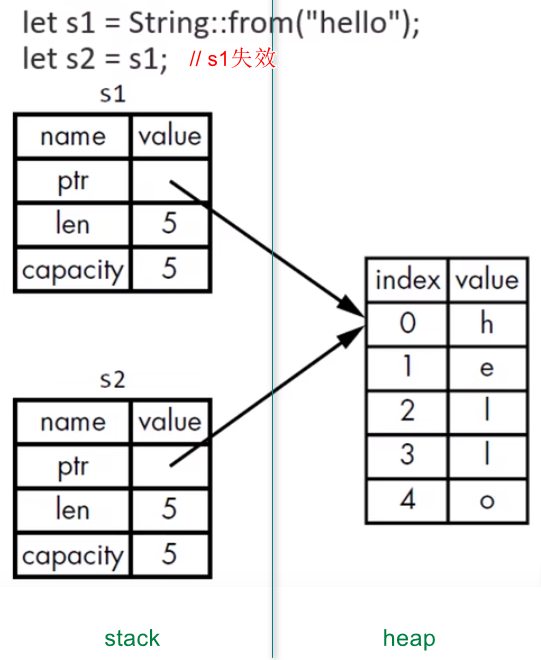

# 语言基础

## 1. 变量、常量、隐藏

- **`let`** 关键字：声明变量。
	1. 变量默认是不可变的 `Immutable`
	2. 加上**`mut`**，使变量可变

- **`const`** 关键字：声明常量。
	1. 不可以用 `mut`
	2. 必须标注类型
	3. 可以声明在任何作用域
	4. 只可以绑定到常量表达式

- **`Shadowing`** ：隐藏。
	1. 可以使用 `let` 声明 同名新变量，新的变量就会 `shadow` 之前声明的变量
	2. 新的变量，类型可以与之前不同

## 2. 数据类型：标量类型、复合类型

- 标量类型：
	1. 整数：`i8、u8、i16、u16、i32、u32、i64、u64、i128、u128、isize、usize`。默认类型是 `i32`
	> 整数溢出：
	> 	- debug编译：程序在运行时，如果发生溢出，会 panic；
	> 	- release编译：程序在运行时，如果发生溢出，会执行 “环绕” 操作，不会panic；
	3. 浮点：`f32、f64`。默认类型是 `f64`
	4. 布尔：`bool`；值为`true、false`；占用一个字节大小
	5. 字符：`char`；使用单引号；占用**4个字节**大小；是**Unicode标量值**

- 复合类型：
	1. 元组：支持多个类型的值放一起；长度是固定的；`let tup: (i32, f64, char) = (1, 2.0, 'a');`
	2. 数组：每个元素的类型必须相同；长度是固定的；存放在 **`stack`** 上；`let arr: [i32; 3] = [1,2,3];`，使用固定值初始化数组时 `let arr = [3; 5];`

## 3. 函数

- 语句（statement）：执行一些动作的指令
- 表达式（expression）：计算产生一个值
- 函数体：由一系列 `statement` 组成，可选的由一个 `expression` 结束；
- 返回值：`->` 符号后声明函数返回值类型；通常是函数体中最后一个表达式的值；提前返回需使用 `return` 关键字

## 4. 控制流

- `if else`：条件必须是 `bool` 类型
- `loop`
- `while`
- `for`：安全、简洁
- `Range`：`rev` 可以反转 `Range`，`for num in (1..4).rev()`
- `match`

## 5. 所有权

所有权是 `Rust 最核心`的特性，它使得 `Rust` 无需 `GC` 就可以保证内存安全。

所有权存在的原因，就是管理 `heap` 数据：

- 跟踪代码的哪些部分正在使用 `heap` 的哪些数据；
- 最小化 `heap` 上的重复数据量；
- 清理 `heap` 上未使用的数据以避免空间不足；

### 5.1. 所有权规则

- 每个值都有一个变量，这个变量是该值的所有者；
- 每个值同时只能有一个所有者；
- 当所有者超出作用域（scope）时，该值将被删除；

### 5.2. 内存和分配

- **当变量走出作用域时，Rust 会自动调用`drop`函数，将内存还给操作系统**；

- **移动（Move）**：


把 s1 赋值给 s2 , 为了保证内存安全：

	Rust只在 `stack` 上复制，没有在 `heap` 上复制；
	Rust让 s1 失效；

如果真的想对 `heap` 上的数据做 `深度拷贝`，可以使用 `clone` 方法。

- **复制**：
	- 如果一个类型实现了 `Copy trait`，那么旧的变量在赋值后仍然可用；
	- 如果一个类型或该类型的一部分实现了 `Drop trait`，那么 Rust 不允许让它再去实现 `Copy trait`；

**简单说，stack上的资源有copy trait，heap上的资源没有copy trait。**

一些拥有 Copy trait 的类型：

- 标量类型
- 元组，前提是所有字段都是copy的

### 5.3. 函数

- 值传递给函数时，将发生 **移动** 或 **复制**；
- 函数在返回值的过程中，同样会发生所有权的转移；

一个变量的所有权，总是遵循同样的模式：

- 把一个值赋给其他变量时，就会发生移动；
- 当一个包含 `heap` 数据的变量离开作用域时，它的值就会被 `drop` 函数清理，除非数据的所有权移动到另一个变量上了；

## 6. 引用和借用

- 引用：`&`符号，允许引用某些值而**不取得其所有权**；默认不可变的；
- 借用：把引用作为函数参数这个行为叫做借用；`fn calc_len(s: & String) -> usize`
- 可变引用：比如`mut & String`；**在特定作用域内，某块数据只能有一个可变引用。（避免竞争）**；
	- 不可以同时拥有一个可变引用和一个不可变引用
	- 可以同时拥有多个不可变引用

## 7. 切片（slice）

切片（slice）：`&str`，也是一种**不持有所有权**的数据类型；

- 字符串切片的范围索引必须发生在有效的 UTF-8 字符边界内；
- 如果对一个**多字节的字符**中创建字符串切片，程序报错并退出；

## 8. 结构体（struct）

- 一旦 struct 的实例是可变的，那么实例中的所有字段都是可变的；

```rust
struct User {
    active: bool,
    username: String,
    email: String,
    sign_in_count: u64,
}

fn build_user(email: String, username: String) -> User {
    User { // 作为函数返回值
        active: true,
        username, // 简写
        email,    // 简写
        sign_in_count: 1,
    }
}

let u1 = build_user(String::from("joe@163.com"), String::from("joe"));

let u2 = User {
    email: String::from("tom@163.com"),
    username: String::from("tom"),
    ..u1   // struct 更新语法
};

// Tuple struct
// struct有名，但里面元素没名
struct Point(i32, i32, i32);
let origin = Point(4, 5, 6);

// Unit-Like struct
// 没有任何字段，适用于需要在某个类型上实现某个 trait，但里面有没有需要存储的数据
struct Solution;
```

- **方法**：在 `impl` 块定义方法；方法的第一个参数可以是 `&self`，也可以获得其所有权 或 可变借用；
- **关联函数**：在 `impl` 块定义，不把 `self` 作为第一个参数的函数；

```rust
#[derive(Debug)]
struct Rectangle {
    width: u32,
    height: u32,
}

impl Rectangle {
    // 方法
    fn area(&self) -> u32 {
        self.width * self.height
    }

    // 关联函数
    fn square(size: u32) -> Rectangle {
        Rectangle {
            width: size,
            height: size
        }
    }
}
```

## 9. 枚举（enum）

- 可以将数据附加到枚举的变体中
- 每个变体可以拥有不同的类型以及关联的数据量
- 使用`impl`为枚举定义方法

```rust
#[derive(Debug)]
enum Message {
    Quit,
    Move { x: i32, y: i32 },
    Write(String),
    ChangeColor(i32, i32, i32),
}

impl Message {
    fn call(&self) {
        println!("{:?}", self);
    }
}
```

Rust 提供了类似 `Null` 概念的枚举：`Option<T>`

- `Option<T>` 和 `T` 是不同的类型；
- 若需要使用`Option<T>`中的`T`，需要先转换；

```rust
enum Option<T> {
    Some(T),
    None,
}
```

## 10. match

- 允许一个值与一系列模式进行匹配，并执行匹配的模式对应的代码
- `模式`可以是字面值、变量名、通配符...
- 模式可以绑定值，比如从 enum 变体中提取值；
- match 匹配**必须穷举所有的可能**；如果不想处理，则使用 `_ 通配符`来替代其余值；

```rust
let x = Some(5);
match x {
    None => None,
    Some(i) => Some(i + 1),
}

let v = 0u8;
match v {
    1 => 1,
    3 => 3,
    5 => 5,
    _ => 999,
}
```

## 11. if let

- 只**关心一种匹配**而忽略其他匹配的情况；
- 放弃了穷举的可能；

```rust
let x = Some(5);
if let Some(5) = x {
    println!("five")
} else {
	println!("others")
}
```
