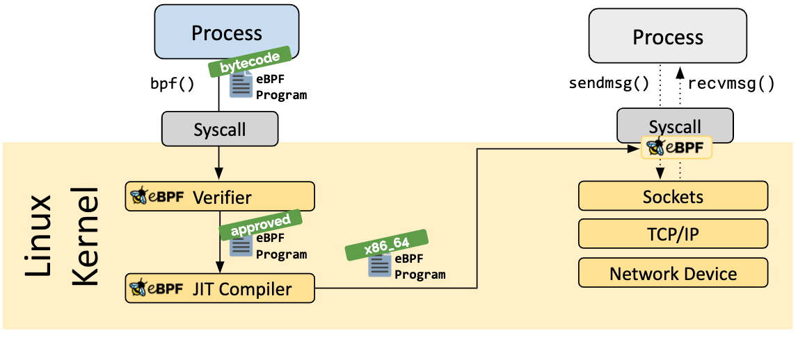
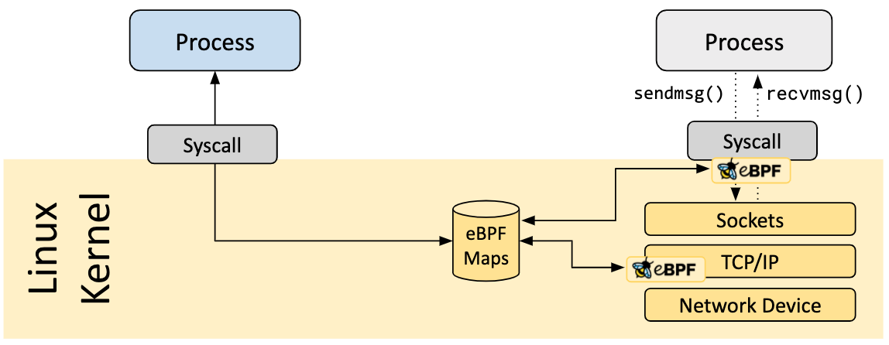

# BPF 和 eBPF

## BPF
BPF（Berkeley Packet Filter）由Steven McCanne 和 Van Jacobson的一篇论文提出，论文中提到：用户级别的数据包捕获功能需要跨内核和用户空间来复制数据包，结果导致性能下降。

于是提出了一种新的框架，直接在内核中进行过滤数据包。BPF根据用户编写的过滤规则对数据包进行匹配，如果符合就放到接收队列。然后用户再把接收队列的数据包从内核空间拷贝到用户空间，这样就减少了无用的数据包拷贝。


机器码可以在物理机上直接执行，伪机器码不能直接执行，需要在虚拟机上执行。

BPF指令集是伪机器码，虚拟机上需要一条条解析为机器码才能够执行，所以执行效率很低，如果有了JIT（Just In Time），就能直接把BPF编译成机器码，能大大加快BPF程序的执行速度。


tcpdump等工具就是基于BPF框架实现的。

## eBPF

从内核3.18版本开始，Linux内核提供了eBPF（extended BPF），除了网络数据包过滤，它还能够用于非网络相关的功能（比如perf_events、kprobes、uprobes、tracepoints）。

传统的BPF，被称为cBPF（classical BPF）。除非特别说明，BPF指的是cBPF和eBPF的统称。

开发工具链：BCC、bpftrace、ebpf-go、libbpf

### 1. eBPF可以做什么？

- 可以执行高性能数据包处理（比如XDP）
- 可以限制进程能否使用一些系统调用（比如seccomp）
- 可以调试内核、性能分析（比如kprobes、perf）

### 2. eBPF 验证

在加载每个BPF程序之前，都会执行一些检查：

- 权限
- 有界循环
- 不得使用未初始化变量
- 越界访问
- eBPF程序大小限制
- 根据程序类型，限制可以调用哪些内核函数、可以访问哪些数据结构、是否可以访问网络数据包内容



### 3. eBPF 系统调用命令

```c
#include <linux/bpf.h>

int bpf(int cmd, union bpf_attr *attr, unsigned int size);
```

```c
enum bpf_cmd {
	BPF_MAP_CREATE,	// 创建一个map，并返回其关联的文件描述符。（会自动打开close-on-exec标志）
	BPF_MAP_LOOKUP_ELEM,
	BPF_MAP_UPDATE_ELEM,
	BPF_MAP_DELETE_ELEM,
	BPF_MAP_GET_NEXT_KEY,
	BPF_PROG_LOAD,	// 验证并加载eBPF程序，返回其关联的文件描述符。（会自动打开close-on-exec标志）
	BPF_OBJ_PIN,	// 将eBPF程序或map固定到指定的文件路径上
	BPF_OBJ_GET,
	BPF_PROG_ATTACH, // 附加eBPF程序到指定附加类型的Hook上
	...
	BPF_PROG_QUERY,	// 获取与指定附加类型的Hook关联的eBPF程序的信息
	BPF_BTF_LOAD,	// 验证并加载 BTF（BPF Type Format）元数据到内核，返回其关联的文件描述符
	...
	BPF_LINK_CREATE, // 附加eBPF程序到指定附加类型的Hook上，并返回一个文件描述符句柄，用于管理link
	...
	BPF_PROG_BIND_MAP, // 绑定map到eBPF程序
};
```

### 4. eBPF 术语

- **加载（Load）**

加载程序指通过系统调用 `bpf（BPF_PROG_LOAD，...）` 将其指令注入到内核。

注入前通过了验证程序，如果启用了 JIT 编译，程序可能会被JIT编译。

注入后，程序位于内核内存中，它有一个引用计数器，内核一直保存它，直到计数器变为零。

- **附加（Attach）**

eBPF程序被附加到指定`附加类型`的Hook上。

**用户将eBPF程序attach到某个事件上，当这个事件触发的时候，就会执行这个eBPF程序。**（所以eBPF是基于事件触发的）

`附加类型`取决于程序类型，只有部分程序类型（cgroup、flow dissector、LIRC、sockmap、sock_ops）有这个概念。

某些附加程序（网络、cgroup）会增加其引用计数，以便应用程序退出而不会从内核删除eBPF程序。

- **固定（Pin）**

固定是保存对eBPF对象（prog、map、link）的引用的方法。只要一个对象被固定，它就保留在内核中。固定程序可以防止被删除，但不会运行。

- **链接（Link）**

首先，不要跟 `ELF目标文件的链接` 混淆，完全是无关的东西。

对于XDP程序，用户应用程序可以附加程序并安全终止，由于增加了引用计数，程序能够一直保持附加和加载状态，而不会从内核删除。

对于跟踪，通常调用`perf_event_open`得到一个文件描述符，进行需要保持运行才能保持此文件描述符打开。当程序退出，文件描述符被关闭，程序被删除。

引入`eBPF链接`来附加程序作为一个解决方法，使其更容器保持附加。当用户应用程序终止时，可以使用`固定链接`来保持持久性。

### 5. eBPF 程序类型

使用BPF_PROG_LOAD加载的程序类型决定了：

- 程序可以附加到哪里
- 程序允许调用哪些内核辅助函数
- 是否可以直接访问网络数据包

```c
enum bpf_prog_type {
	BPF_PROG_TYPE_UNSPEC,
	BPF_PROG_TYPE_SOCKET_FILTER, // 网络数据包过滤器
	BPF_PROG_TYPE_KPROBE,		// 是否触发kprobe
	BPF_PROG_TYPE_SCHED_CLS,	// TC classifier
	BPF_PROG_TYPE_SCHED_ACT,	// TC action
	BPF_PROG_TYPE_TRACEPOINT,	// 是否触发tracepoint
	BPF_PROG_TYPE_XDP,			// XDP
	BPF_PROG_TYPE_PERF_EVENT,	// 是否触发perf事件处理程序
	BPF_PROG_TYPE_CGROUP_SKB,	// cgroup 的网络数据包过滤器
	BPF_PROG_TYPE_CGROUP_SOCK,	// cgroup 的网络数据包过滤器，可修改套接字选项
	BPF_PROG_TYPE_LWT_IN,		// LWT_* 轻量级隧道的网络数据包过滤器
	BPF_PROG_TYPE_LWT_OUT,
	BPF_PROG_TYPE_LWT_XMIT,
	BPF_PROG_TYPE_SOCK_OPS,		// 设置socket参数的程序
	BPF_PROG_TYPE_SK_SKB,		// 套接字之间的数据包过滤器
	BPF_PROG_TYPE_CGROUP_DEVICE,
	BPF_PROG_TYPE_SK_MSG,
	BPF_PROG_TYPE_RAW_TRACEPOINT,
	BPF_PROG_TYPE_CGROUP_SOCK_ADDR,
	BPF_PROG_TYPE_LWT_SEG6LOCAL,
	BPF_PROG_TYPE_LIRC_MODE2,
	BPF_PROG_TYPE_SK_REUSEPORT,
	BPF_PROG_TYPE_FLOW_DISSECTOR,
	BPF_PROG_TYPE_CGROUP_SYSCTL,
	BPF_PROG_TYPE_RAW_TRACEPOINT_WRITABLE,
	BPF_PROG_TYPE_CGROUP_SOCKOPT,
	BPF_PROG_TYPE_TRACING,
	BPF_PROG_TYPE_STRUCT_OPS,
	BPF_PROG_TYPE_EXT,
	BPF_PROG_TYPE_LSM,
	BPF_PROG_TYPE_SK_LOOKUP,
	BPF_PROG_TYPE_SYSCALL, /* a program that can execute syscalls */
};
```

### 6. eBPF Map类型

eBPF程序使用的主要数据结构是map，这是一种通用数据结构，允许数据在内核和用户空间直接来回传递。



```c
enum bpf_map_type {
	BPF_MAP_TYPE_UNSPEC,
	BPF_MAP_TYPE_HASH,	// 哈希表
	BPF_MAP_TYPE_ARRAY,	// 数组
	BPF_MAP_TYPE_PROG_ARRAY,	// eBPF程序对应的文件描述符数组；用于实现跳转表和子程序来处理特定的数据包协议
	BPF_MAP_TYPE_PERF_EVENT_ARRAY,	// 存储指向struct perf_event的指针，用于读取和存储perf事件计数器
	BPF_MAP_TYPE_PERCPU_HASH,	// percpu 哈希表
	BPF_MAP_TYPE_PERCPU_ARRAY,	// percpu 数组
	BPF_MAP_TYPE_STACK_TRACE,	// 存储堆栈跟踪
	BPF_MAP_TYPE_CGROUP_ARRAY,
	BPF_MAP_TYPE_LRU_HASH,			// LRU 哈希表
	BPF_MAP_TYPE_LRU_PERCPU_HASH,	// LRU percpu 哈希表
	BPF_MAP_TYPE_LPM_TRIE,		// 最长前缀匹配树，用于将IP地址匹配到某个范围
	BPF_MAP_TYPE_ARRAY_OF_MAPS,	// array in map
	BPF_MAP_TYPE_HASH_OF_MAPS,	// hash in map
	BPF_MAP_TYPE_DEVMAP,		// 用于存储和查找网络设备
	BPF_MAP_TYPE_SOCKMAP,		// 用于存储和查找套接字
	BPF_MAP_TYPE_CPUMAP,
	BPF_MAP_TYPE_XSKMAP,
	BPF_MAP_TYPE_SOCKHASH,
	BPF_MAP_TYPE_CGROUP_STORAGE,
	BPF_MAP_TYPE_REUSEPORT_SOCKARRAY,
	BPF_MAP_TYPE_PERCPU_CGROUP_STORAGE,
	BPF_MAP_TYPE_QUEUE,
	BPF_MAP_TYPE_STACK,
	BPF_MAP_TYPE_SK_STORAGE,
	BPF_MAP_TYPE_DEVMAP_HASH,
	BPF_MAP_TYPE_STRUCT_OPS,
	BPF_MAP_TYPE_RINGBUF,		// 环形缓冲区
	BPF_MAP_TYPE_INODE_STORAGE,
	BPF_MAP_TYPE_TASK_STORAGE,
};
```

## 参考文档

- [提出BPF的论文](https://www.tcpdump.org/papers/bpf-usenix93.pdf)
- [BPF和XDP参考指南](https://docs.cilium.io/en/stable/bpf/)
- [内核BPF文档](https://www.kernel.org/doc/html/latest/bpf/)
- [BPF设计问答](https://github.com/torvalds/linux/blob/master/Documentation/bpf/bpf_design_QA.rst)
- [eBPF是什么](https://ebpf.io/what-is-ebpf)

