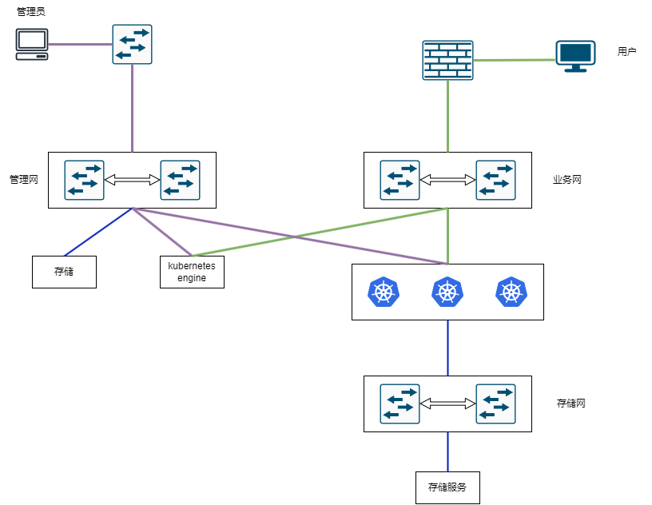
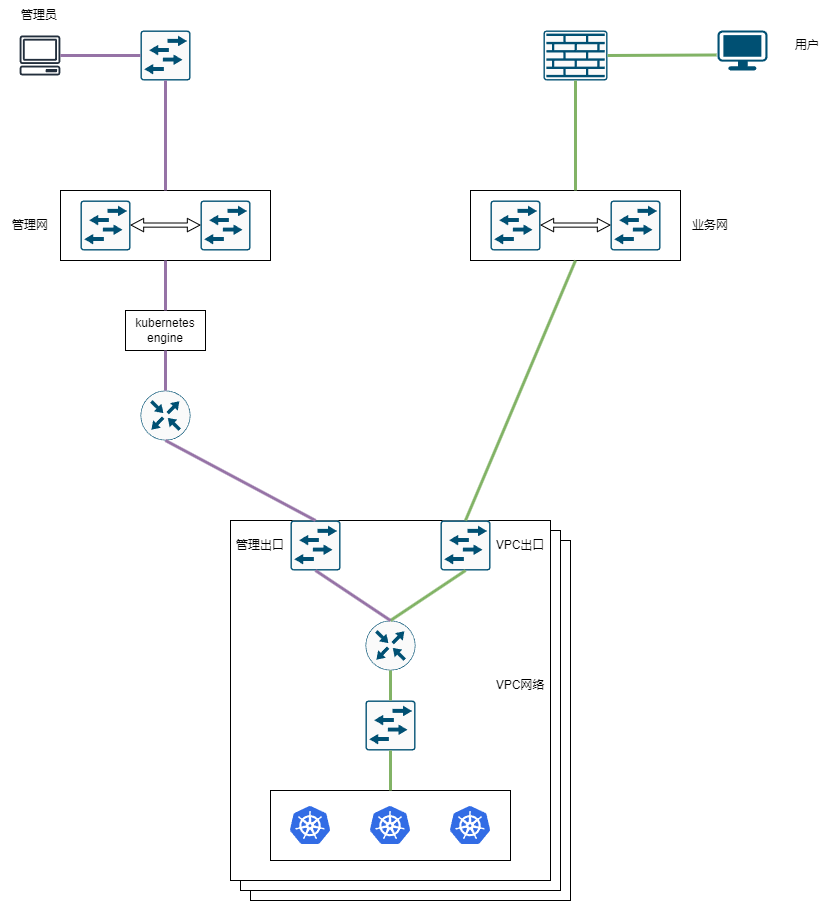
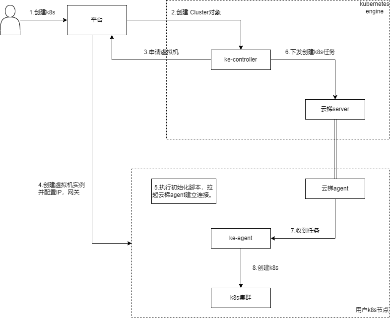

# 项目准备

## 1. 容器云管理平台

背景：kubernetes engine（KE），在超融合平台上提供k8s管理的首个版本。主要负责用户集群的管理。

组网形态：

- 多网分离：（私有云场景），k8s网络分成管理网和业务网。
	- 管理员走管理网访问KE，用户走业务网访问用户K8s集群。
	- 用户k8s存储接存储网络。
	- 如果把管理网与业务网合在一起，就是经典网络模型。

- VPC网络：（VPC场景）
	- k8s东西流量处于VPC网络下。
	- k8s管理流量走管理网络，业务流量走业务网。

部署形态：

- 多master场景：
	- master三节点以上做高可用，etcd组集群。
	- worker节点根据负载调度到不同master进行负载均衡。

其他厂商：

- kubesphere：以联邦的概念管理多个k8s集群。分host、member集群。管理使用自定义CRD，operator等，部署使用ansible来进行编排。
	- 技术：operator、client-go、informer
- TKE：使用Aggregated APIServer方式扩展API。 

### 1.1. k8s集群管理

- ke-controller：负责创建虚拟机实例；
	- 监听到Cluster对象的创建；
	- 向平台申请创建虚拟机；
	- 虚拟机启动后，执行agent_init脚本；
	- 下发创建k8s集群任务到ke-agent。（走云梯）
- ke-agent：负责创建k8s集群；
	- 拉取镜像；
	- k8s部署：执行shell命令，执行k8s节点初始化（kubeadm）、k8s升级（kubeadm update）；
	- 部署CNI/CSI；（helm部署cilium、metallb、ingress）
	- 部署业务服务组件；

- agent_init脚本：
	- 配置IP，掩码，网关；
	- 拉起云梯agent，跟云梯server建立长链接；

### 1.2. cilium、metallb的学习

### 1.3. 云梯

VPC网络场景下，KE处于管理网，用户K8s处于VPC网络，KE无法直接向用户k8s进行通信。

需要用户k8s主动向KE建立一个代理通道（长连接），后续KE向k8s的通信走通道即可。

- apiserver-network-proxy
- frp

### 1.4. 项目复盘

项目模块：k8s集群管理，容器网络管理，云梯
项目技术：operator开发（CRD、Aggregated APIServer）、client-go、informer、cilium、ebpf。
项目收获：operator开发，CNI的学习；

## 2. 云安全中心

## 3. SDWAN

项目难点：流量控制。

## 4. 技术点：

需熟练掌握：

- operator开发：脚手架（kubebuilder、operator-sdk）
- 扩展k8s的两种方式：CRD、Aggregated APIServer
- client-go、informer
- CNI开发流程
- CSI开发流程
- tc
- ovs-meter
