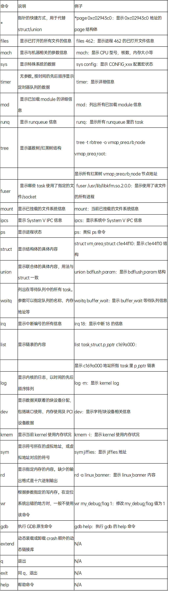

# Kdump

## 1. 使用

```bash
# 1. 安装 kexec
$ dnf install kexec-tools

# 2. 配置 crashkernel
$ kdumpctl reset-crashkernel
$ reboot

# 3. 开启 kdump 服务
$ systemctl enable kdump.service
$ systemctl start kdump.service
$ kdumpctl status

# 4. 触发 panic
$ echo c > /proc/sysrq-trigger

# 5. 查看vmcore
$ ll /var/crash/
```

## 2. 使用 crash 调试 vmcore

```bash
# 依赖
$ dnf install texinfo

# 下载源码，编译工具
# https://github.com/crash-utility/crash
$ cd crash-8.0.2
$ make

# 编译不顺利，就直接安装包吧...
$ dnf install crash.x86_64

# 开始调试
$ crash vmlinux vmcore
```



```bash
# 扩展命令
crash> trace
crash> gcore

# 使用前配置（比如trace）
# git.kernel.org/pub/scm/linux/kernel/git/rostedt/trace-cmd.git
# 编译出trace-cmd，
# 启动crash前，先配置环境变量
# export TRACE_CMD=<path-to>/trace-cmd
# 进入crash后，配置so
# extend <path-to>/trace.so
```