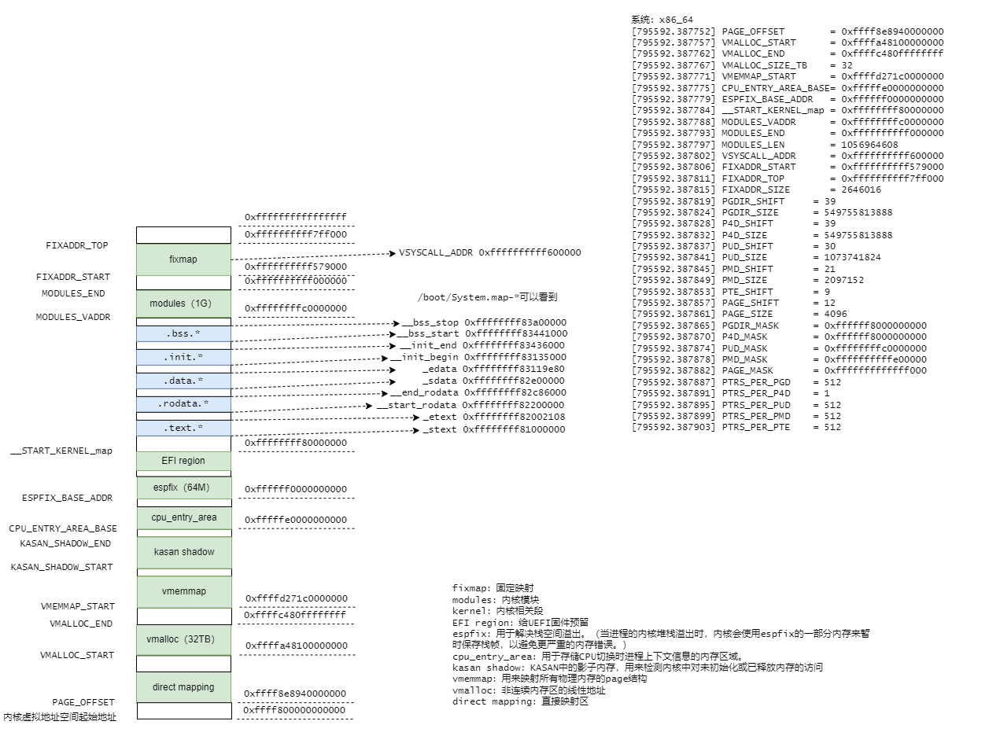
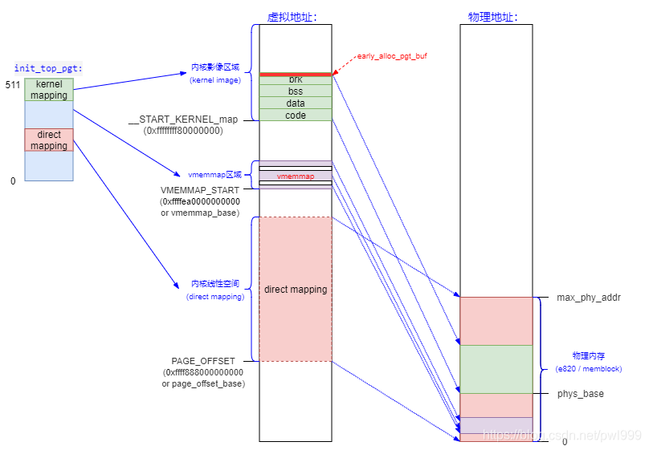
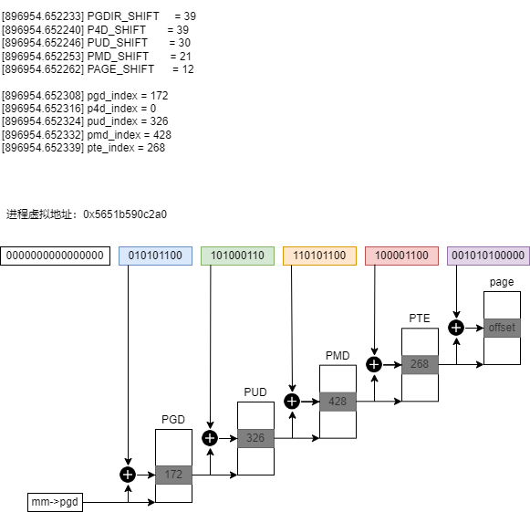

# 将虚拟地址转换为物理地址

先说下背景知识：

虚拟地址空间分为两部分：

- 进程虚拟地址空间（`0x0000000000000000 ~ 0x00007fffffffffff`）（每个进程都有一份）
- 内核虚拟地址空间（`0xffff800000000000 ~ 0xffffffffffffffff`）（整个内核只有一份）

## 1. 内核虚拟内存映射（x86_64、4级页表）



解释几个较为重要的区域：

- **`direct mapping`**：这段虚拟内存区域直接映射了整个物理内存。它比如`kmalloc`、`__get_free_pages`申请的虚拟地址都位该区域。
	- 通常，由于映射到物理地址中也是线性的，就可以根据偏移快速计算出物理地址。

```c
static __always_inline unsigned long __phys_addr_nodebug(unsigned long x)
{
	unsigned long y = x - __START_KERNEL_map;

	/* use the carry flag to determine if x was < __START_KERNEL_map */
	x = y + ((x > y) ? phys_base : (__START_KERNEL_map - PAGE_OFFSET));

	return x;
}
```



- **`vmalloc`**：用来把物理上不连续的内存映射成一段连续的虚拟地址，是内核态利用内存碎片的一个很有效的手段。

- **`vmemmap`**：起始地址是VMEMMAP_START。在`稀疏内存模型`（SPARSMEM）中，vmemmap用于为所有系统中跟踪内存的`struct page`分配一个连续的虚拟地址范围，以便更快地查找，这个大数组称为vmemmap。

更详细的官方文档：

```
========================================================================================================================
    Start addr    |   Offset   |     End addr     |  Size   | VM area description
========================================================================================================================
                  |            |                  |         |
 0000000000000000 |    0       | 00007fffffffffff |  128 TB | user-space virtual memory, different per mm
__________________|____________|__________________|_________|___________________________________________________________
                  |            |                  |         |
 0000800000000000 | +128    TB | ffff7fffffffffff | ~16M TB | ... huge, almost 64 bits wide hole of non-canonical
                  |            |                  |         |     virtual memory addresses up to the -128 TB
                  |            |                  |         |     starting offset of kernel mappings.
__________________|____________|__________________|_________|___________________________________________________________
                                                            |
                                                            | Kernel-space virtual memory, shared between all processes:
____________________________________________________________|___________________________________________________________
                  |            |                  |         |
 ffff800000000000 | -128    TB | ffff87ffffffffff |    8 TB | ... guard hole, also reserved for hypervisor
 ffff880000000000 | -120    TB | ffff887fffffffff |  0.5 TB | LDT remap for PTI
 ffff888000000000 | -119.5  TB | ffffc87fffffffff |   64 TB | direct mapping of all physical memory (page_offset_base)
 ffffc88000000000 |  -55.5  TB | ffffc8ffffffffff |  0.5 TB | ... unused hole
 ffffc90000000000 |  -55    TB | ffffe8ffffffffff |   32 TB | vmalloc/ioremap space (vmalloc_base)
 ffffe90000000000 |  -23    TB | ffffe9ffffffffff |    1 TB | ... unused hole
 ffffea0000000000 |  -22    TB | ffffeaffffffffff |    1 TB | virtual memory map (vmemmap_base)
 ffffeb0000000000 |  -21    TB | ffffebffffffffff |    1 TB | ... unused hole
 ffffec0000000000 |  -20    TB | fffffbffffffffff |   16 TB | KASAN shadow memory
__________________|____________|__________________|_________|____________________________________________________________
                                                            |
                                                            | Identical layout to the 56-bit one from here on:
____________________________________________________________|____________________________________________________________
                  |            |                  |         |
 fffffc0000000000 |   -4    TB | fffffdffffffffff |    2 TB | ... unused hole
                  |            |                  |         | vaddr_end for KASLR
 fffffe0000000000 |   -2    TB | fffffe7fffffffff |  0.5 TB | cpu_entry_area mapping
 fffffe8000000000 |   -1.5  TB | fffffeffffffffff |  0.5 TB | ... unused hole
 ffffff0000000000 |   -1    TB | ffffff7fffffffff |  0.5 TB | %esp fixup stacks
 ffffff8000000000 | -512    GB | ffffffeeffffffff |  444 GB | ... unused hole
 ffffffef00000000 |  -68    GB | fffffffeffffffff |   64 GB | EFI region mapping space
 ffffffff00000000 |   -4    GB | ffffffff7fffffff |    2 GB | ... unused hole
 ffffffff80000000 |   -2    GB | ffffffff9fffffff |  512 MB | kernel text mapping, mapped to physical address 0
 ffffffff80000000 |-2048    MB |                  |         |
 ffffffffa0000000 |-1536    MB | fffffffffeffffff | 1520 MB | module mapping space
 ffffffffff000000 |  -16    MB |                  |         |
    FIXADDR_START | ~-11    MB | ffffffffff5fffff | ~0.5 MB | kernel-internal fixmap range, variable size and offset
 ffffffffff600000 |  -10    MB | ffffffffff600fff |    4 kB | legacy vsyscall ABI
 ffffffffffe00000 |   -2    MB | ffffffffffffffff |    2 MB | ... unused hole
__________________|____________|__________________|_________|___________________________________________________________
```

## 2. 测试代码（内核虚拟地址转物理地址）

```c
static void kernel_test(void) {
    void *kptr = NULL, *vptr = NULL;
    struct page *pg = NULL;

    kptr = kmalloc(PAGE_SIZE, GFP_KERNEL);
    if (kptr == NULL) {
        return;
    }
    printk(KERN_INFO "kmalloc allocated memory at 0x%lx\n", (unsigned long)kptr);
    printk(KERN_INFO "Physical address: 0x%lx\n", (unsigned long)virt_to_phys(kptr)); // 实际上调用的__phys_addr_nodebug函数
    printk(KERN_INFO "Physical address: 0x%lx\n", (unsigned long)kptr - PAGE_OFFSET);

    kfree(kptr);

    vptr = vmalloc(PAGE_SIZE);
    if (vptr == NULL) {
        return;
    }
    printk(KERN_INFO "vmalloc allocated memory at 0x%lx\n", (unsigned long)vptr);
    pg = vmalloc_to_page(vptr); // 根据页表查询，pgd->p4d->pud->pmd->pte
    if (pg == NULL) {
        vfree(vptr);
        return;
    }
    printk(KERN_INFO "Physical address: 0x%llx\n", page_to_phys(pg));
    vfree(vptr);
}
```

```bash
[895289.148373] kmalloc allocated memory at 0xffff8e8b859e2000
[895289.148377] Physical address: 0x2459e2000
[895289.148381] Physical address: 0x2459e2000
[895289.148391] vmalloc allocated memory at 0xffffa481000e6000
[895289.148395] Physical address: 0x26b6e4000
```

看下代码中`virt_to_phys`的注释：（只能用于直接映射的地址，kmalloc也属于直接映射）
```bash
It is only valid to use this function on addresses directly mapped or allocated via kmalloc.
```

## 3. 进程虚拟内存映射


## 4. 测试代码（进程虚拟地址转物理地址）

```c

static int pid;
static unsigned long va;

module_param(pid, int, 0644); // process pid
module_param(va, ulong, 0644); // process virtuall address

static void user_test(void) {
	unsigned long pa = 0; // physics address
    struct task_struct *pcb = NULL; // process task struct
    struct pid *p = NULL;

    pgd_t *pgd = NULL;
    p4d_t *p4d = NULL;
    pud_t *pud = NULL;
    pmd_t *pmd = NULL;
    pte_t *pte = NULL;

    p = find_vpid(pid);
    if (p == NULL)
        return;
    pcb = pid_task(p, PIDTYPE_PID);
    if (pcb == NULL)
        return;
    if (!find_vma(pcb->mm, va)) {
        printk("virtual address 0x%lx is not available\n", va);
        return;
    }

    pgd = pgd_offset(mm, va);
    printk("pgd = 0x%p\n", pgd);
    printk("pgd_val = 0x%lx,   pgd_index = %lu\n", pgd_val(*pgd), pgd_index(va));
    if (pgd_none(*pgd)) {
        printk("not mapped in pgd\n");
        return;
    }

    p4d = p4d_offset(pgd, va);
    printk("p4d = 0x%p\n", p4d);
    printk("p4d_val = 0x%lx,   p4d_index = %lu\n", p4d_val(*p4d), p4d_index(va));
    if (p4d_none(*p4d)) {
        printk("not mapped in p4d\n");
        return;
    }

    pud = pud_offset(p4d, va);
    printk("pud = 0x%p\n", pud);
    printk("pud_val = 0x%lx,   pud_index = %lu\n", pud_val(*pud), pud_index(va));
    if (pud_none(*pud)) {
        printk("not mapped in pud\n");
        return;
    }

    pmd = pmd_offset(pud, va);
    printk("pmd = 0x%p\n", pmd);
    printk("pmd_val = 0x%lx,   pmd_index = %lu\n", pmd_val(*pmd), pmd_index(va));
    if (pmd_none(*pmd)) {
        printk("not mapped in pmd\n");
        return;
    }

    pte = pte_offset_kernel(pmd, va);
    printk("pte = 0x%p\n", pte);
    printk("pte_val = 0x%lx,   pte_index = %lu\n", pte_val(*pte), pte_index(va));
    if (pte_none(*pte)) {
        printk("not mapped in pte\n");
        return;
    }
    if (!pte_present(*pte)) {
        printk("pte not in RAM\n");
        return;
    }

    pa = (pte_val(*pte) & PAGE_MASK);
    printk("virtual address 0x%lx --> physics address 0x%lx\n", va, pa);
}
```

```bash
$ insmod va2pa.ko pid=384052 va=94908938502816 && rmmod va2pa

$ dmesg
[896954.652303] pgd = 0x0000000024800ce5
[896954.652308] pgd_val = 0x8000000107cd4067, pgd_index = 172
[896954.652312] p4d = 0x0000000024800ce5
[896954.652316] p4d_val = 0x8000000107cd4067, p4d_index = 0
[896954.652320] pud = 0x0000000094c9c001
[896954.652324] pud_val = 0x101a71067,        pud_index = 326
[896954.652328] pmd = 0x00000000fca675fa
[896954.652332] pmd_val = 0x106b88067,        pmd_index = 428
[896954.652336] pte = 0x0000000097f147f5
[896954.652339] pte_val = 0x80000001422c5867, pte_index = 268
[896954.652344] virtual address 0x5651b590c2a0 --> physics address 0x80000001422c5000
```



## 参考资料

https://www.kernel.org/doc/html/latest/x86/x86_64/mm.html
