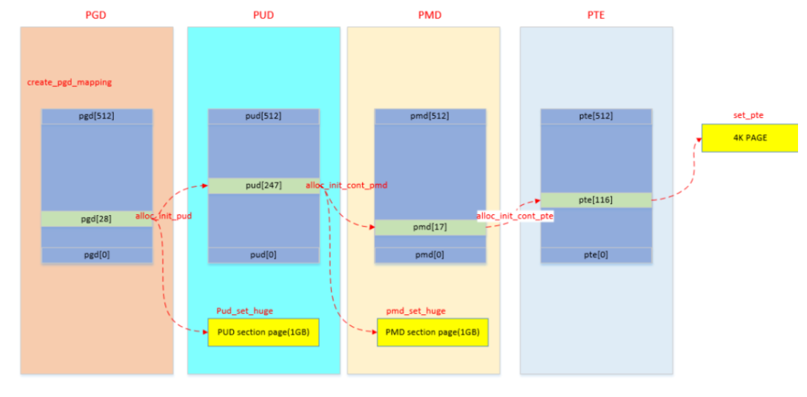

# memblock

内核初始化完成后，系统的内存分配和释放由buddy系统、slab分配器来管理。但在buddy系统可用之前，内存分配和释放由`memblock`分配器来管理`物理内存`。

注：代码相关部分来自arch/arm64目录下

## 1. memblock 初始化

在 `bootloader` 做好初始化工作后，将 `kernel image` 加载到内存后，就会跳到kernel部分继续执行，跑的先是汇编部分代码，进行各种设置和环境初始化后，就会跳到kernel的第一个函数 `start_kernel`：

```bash
start_kernel(void)
  | setup_arch(&command_line);
    | early_fixmap_init();  # fixmap区域页表映射初始化
    | early_ioremap_init(); # IO映射初始化

    # __fdt_pointer指针的赋值在head.S汇编代码中，bootloader传递过来，存放的是 dtb的物理地址
    # 	str_l	x21, __fdt_pointer, x5		// Save FDT pointer
    | setup_machine_fdt(__fdt_pointer);
      | fixmap_remap_fdt(...); # 映射pgd、pud、pte等，建立PTE entry映射才能访问物理地址
      | early_init_dt_scan(...); # 扫描 DTB 中的节点
        | memblock_add(...); # 获取到可用物理内存的地址和大小后，调用API添加一个memblock_region实例，用于管理这个物理内存区域

    # 当所有物理内存都添加进系统后，arm64_memblock_init对整个物理内存进行整理，
    # 主要工作是将一些特殊区域添加进reserved内存中。（比如：elfcorehdr、crashkernel、reserve、initrd）
    | arm64_memblock_init();

	# 完成物理内存到虚拟内存的映射
    | paging_init();
```

## 2. memblock 物理内存映射

memblock初始化后，物理内存已经通过`memblock_add`添加进系统，需要建立物理内存到虚拟内存的映射，CPU才可以去访问memblock内存。

```bash
paging_init(void);
  # swapper_pg_dir页表的物理地址映射到fixmap的FIX_PGD区域，
  # 然后使用swapper_pg_dir页表作为内核的pgd页表
  # pgdp 是分配FIX_PGD的物理内存空间对应的虚拟地址
  | pgdp = pgd_set_fixmap(__pa_symbol(swapper_pg_dir));

  | map_kernel(pgdp); # 将内核各个段（.text .init .data .bss）映射到虚拟内存空间，这样内核就可以正常运行了
  | map_mem(pgdp); # 将memblock子系统添加的物理内存进行映射

  # 将TTBR1寄存器所指向新准备的swapper_pg_dir页表
  # TTBR0寄存器存储第一级页表的基地址，TTBR1寄存器存储第二级页表的基地址。
  | cpu_replace_ttbr1(lm_alias(swapper_pg_dir), init_idmap_pg_dir);
```

map_kernel、map_mem进行页表映射，最终都会调用到`__create_pgd_mapping`，总体上就是逐级页表建立映射关系，同时中间会进行权限的控制。



## 3. debug

开启memblock debug后，可以在/sys/kernel/debug/memblock查看相关布局
