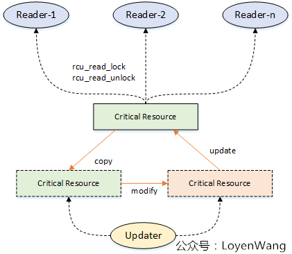
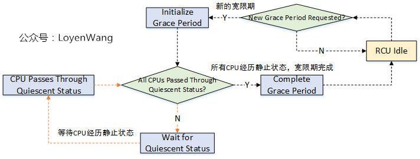
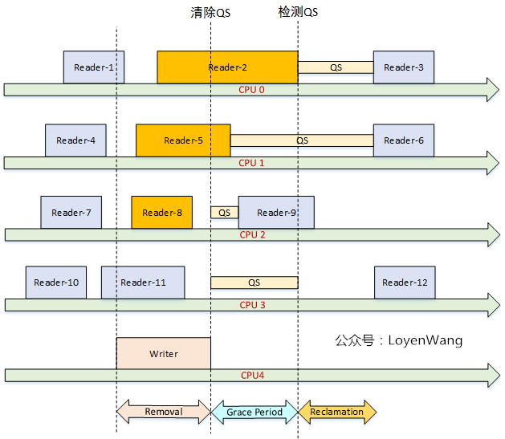

# RCU锁（Read-Copy-Update）

## 1. 简介

内核锁机制：

- **读写锁**：适合读多写少的场景；
- **自旋锁**：获得锁的CPU将会阻塞其他CPU的访问；
- **信号量**：适用于进程长时间占用锁，并且允许上下文切换；

**RCU锁** 思想：**如果能够保证 使用某个公共数据 的线程不再使用它，那么就可以安全删除此公共数据。**

所以，具体操作就是：**先把旧的临界资源移除（修改指针），然后等待所有人都不使用它，再把旧的资源进行回收。**

【原理】：

- （Reader）**多个读可以并发访问临界资源，使用`rcu_read_lock`和`rcu_read_unlock`标定临界区**；
- （Updater）**写的时候，先Copy一份副本作为基础进行修改，当所有读者离开临界区后，更新指针为新的副本，并对旧资源进行回收处理**。
- （Reclaimer）**等待所有读者退出临界区，这个等待时间叫做宽限期（Grace period）**。

【RCU保护的临界资源】通常为：

- 指针
- 链表
- hash链表

内核提供了【三种RCU】：

- **不可抢占RCU**：临界区内不可被抢占，`rcu_read_lock/rcu_read_unlock`，`rcu_read_lock_sched/rcu_read_unlock_sched`；
- **下半部RCU**：临界区内禁止软中断，`rcu_read_lock_bh/rcu_read_unlock_bh`；
- **可抢占的RCU**：临界区内可以睡眠，可以被抢占，Sleepable Read-copy update (SRCU)。`srcu_read_lock/srcu_read_unlock`；

【使用注意事项】：

- 通常需要**禁止内核抢占**。这也是`rcu_read_lock`的功能。
- 比如`rcu_read_lock`，**临界区内不能使用可睡眠的代码**，比如`alloc_pages`。
- 写者更新临界资源（比如指针）时，使用**`rcu_assign_pointer`**来更新；
- 对旧资源进行回收前需要等待**宽限期**结束。比如`synchronize_rcu`（同步等待）；`call_rcu`（异步等待）

**<u> *为什么临界区内不能睡眠？不让被抢占？*</u>**

睡眠意味着上下文切换，进程CPU被抢占，**上下文切换在RCU宽限期检查中被认为是静止状态（QS）的标志，是不允许出现在处于临界区的读者身上的。这个会影响宽限期的检查**。

【优点】：

- 读开销很少，不需要获取任何锁，不需要执行原子指令或内存屏障
- 没有**死锁**问题；
- 没有**优先级反转**问题；

【缺点】：
- 写同步开销很大，写之间需要互斥；
- 使用上比其他同步机制复杂；



## 2. 宽限期（Grace period）


## 3. 如何确定宽限期？

宽限期的结束代表着Reader都已经退出了临界区，这时才能安全的进行回收工作。

判断宽限期的结束，与CPU检测静止状态（Quiescent Status）有关，这也影响着RCU的性能。

Quiescent Status：用于描述CPU的执行状态。当CPU正在访问受RCU保护的临界资源时，认为是活动状态；当它离开临界区后，则认为它是静止状态。

**当所有的CPU都至少经历过一次 QS 后，则认为宽限期结束。**





## 4. rcu_assign_pointer 做了什么？

```c
#define rcu_assign_pointer(p, v)					      \
do {									      \
	uintptr_t _r_a_p__v = (uintptr_t)(v);				      \
	rcu_check_sparse(p, __rcu);					      \
									      \
	if (__builtin_constant_p(v) && (_r_a_p__v) == (uintptr_t)NULL)	      \
		WRITE_ONCE((p), (typeof(p))(_r_a_p__v));		      \
	else								      \
		smp_store_release(&p, RCU_INITIALIZER((typeof(p))_r_a_p__v)); \
} while (0)
```

- 大多数情况下，**插入内存屏障**；
- **关闭编译器在赋值时的非顺序编译优化**，保证赋值时已经被初始化了。

```c
p->a = 1;
p->b = 2;
p->c = 3;
rcu_assign_pointer(gp, p);
// 某些平台的编译器优化可能会重排指令，导致 p 还没被初始化，就被赋值给了 gp 。
```

## 5. call_rcu注册的回调函数在哪里调用？

`RCU_SOFTIRQ` 软中断

## 6. 宽限期的处理工作在哪里？

`rcu_gp_kthread` 内核线程

## 7. SRCU（Sleepable Read-Copy-Update）

## 参考

https://www.cnblogs.com/LoyenWang/p/12681494.html

https://www.cnblogs.com/LoyenWang/p/12770878.html

https://blog.csdn.net/huang987246510/article/details/102762067
