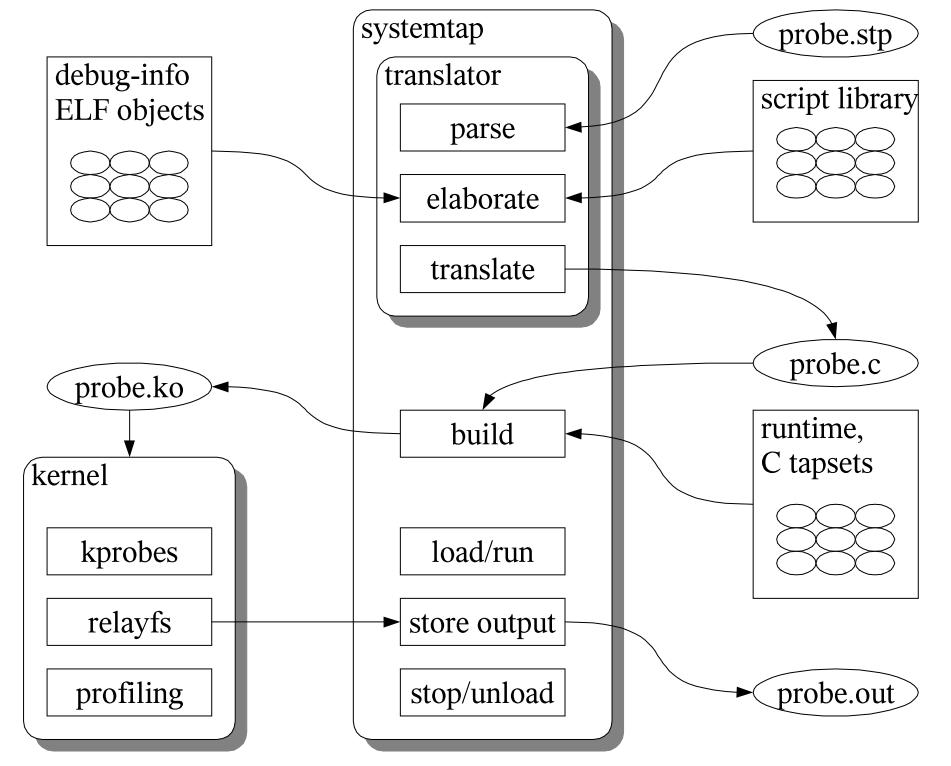

# Systemtap

## 工作原理

```bash
scripts -> parse -> translate -> build -> run
```



## 学习资料

https://sourceware.org/systemtap/documentation.html
https://www.sourceware.org/systemtap/examples/
https://github.com/lichuang/awesome-systemtap-cn
https://github.com/brendangregg/systemtap-lwtools