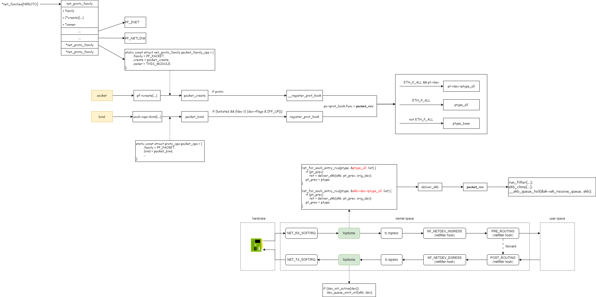

# tcpdump

## 1. strace看下系统调用

```bash
# tcpdump -i enp0s8 -nnev -c 1
socket(AF_PACKET, SOCK_RAW, htons(0 /* ETH_P_??? */)) = 4
bind(4, {sa_family=AF_PACKET, sll_protocol=htons(0 /* ETH_P_??? */), sll_ifindex=if_nametoindex("enp0s8"), sll_hatype=ARPHRD_NETROM, sll_pkttype=PACKET_HOST, sll_halen=0}, 20) = 0

# tcpdump -i any -nnev -c 1
socket(AF_PACKET, SOCK_DGRAM, htons(0 /* ETH_P_??? */)) = 4
bind(4, {sa_family=AF_PACKET, sll_protocol=htons(ETH_P_ALL), sll_ifindex=0, sll_hatype=ARPHRD_NETROM, sll_pkttype=PACKET_HOST, sll_halen=0}, 20) = 0
```

为什么会是这样的呢？libpcap代码中给了解释：

```c
	/*
	 * Open a socket with protocol family packet. If cooked is true,
	 * we open a SOCK_DGRAM socket for the cooked interface, otherwise
	 * we open a SOCK_RAW socket for the raw interface.
	 *
	 * The protocol is set to 0.  This means we will receive no
	 * packets until we "bind" the socket with a non-zero
	 * protocol.  This allows us to setup the ring buffers without
	 * dropping any packets.
	 */
	sock_fd = is_any_device ?
		socket(PF_PACKET, SOCK_DGRAM, 0) :
		socket(PF_PACKET, SOCK_RAW, 0);
```

## 2. 基础知识说明

```c
/* Supported address families. */
#define AF_UNSPEC	0
#define AF_UNIX		1	/* Unix domain sockets 		*/
#define AF_INET		2	/* Internet IP Protocol 	*/
#define AF_PACKET	17	/* Packet family		*/
```

```c
/* Protocol families, same as address families. */
#define PF_UNSPEC	AF_UNSPEC
#define PF_UNIX		AF_UNIX
#define PF_LOCAL	AF_LOCAL
#define PF_INET		AF_INET
#define PF_PACKET	AF_PACKET
```

```c
/**
 * enum sock_type - Socket types
 * @SOCK_STREAM: stream (connection) socket
 * @SOCK_DGRAM: datagram (conn.less) socket
 * @SOCK_RAW: raw socket
 * @SOCK_RDM: reliably-delivered message
 * @SOCK_SEQPACKET: sequential packet socket
 * @SOCK_DCCP: Datagram Congestion Control Protocol socket
 * @SOCK_PACKET: linux specific way of getting packets at the dev level.
 *		  For writing rarp and other similar things on the user level.
 */
enum sock_type {
	SOCK_STREAM	= 1,  
	SOCK_DGRAM	= 2,
	SOCK_RAW	= 3,
	SOCK_RDM	= 4,
	SOCK_SEQPACKET	= 5,
	SOCK_DCCP	= 6,
	SOCK_PACKET	= 10,
};
```

```c
int socket(int domain, int type, int protocol);

int bind(int socket, const struct sockaddr *address, socklen_t address_len);
```

## 3. 实现原理

为了实现抓包，tcpdump使用了`更底层`的地址族 `AF_PACKET`。使用 `socket` 跟内核建立通信，内核在数据包路径上的`固定位置`，将数据包发送到应用层。


