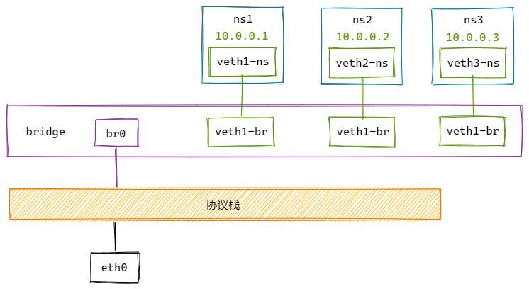

# Bridge

两个netns可以通过`veth pair`连接，两个以上netns相互连接，就需要使用`bridge`了。

Linux bridge有多个端口，数据可以从任何端口进来，进来之后从哪个口出去则取决于目的MAC地址。

**网桥是一种以独立于协议的方式将两个以太网段连接在一起的方式。数据包时基于以太网地址转发的，而不是IP地址。由于转发是在L2完成的，因此所有协议都可以通过网桥透明地传输。**

## 实验



```bash
# 创建bridge并启用
ip link add name br0 type bridge
ip link set br0 up

# 创建netns
ip netns add ns1
ip netns add ns2
ip netns add ns3

# 创建veth-pair
ip link add veth1-ns type veth peer name veth1-br
ip link add veth2-ns type veth peer name veth2-br
ip link add veth3-ns type veth peer name veth3-br

# 将veth的一端移动到netns中
ip link set veth1-ns netns ns1
ip link set veth2-ns netns ns2
ip link set veth3-ns netns ns3

# 给netns中的veth配置IP并启用
ip netns exec ns1 ip addr add 10.0.0.1/24 dev veth1-ns
ip netns exec ns1 ip link set veth1-ns up
ip netns exec ns2 ip addr add 10.0.0.2/24 dev veth2-ns
ip netns exec ns2 ip link set veth2-ns up
ip netns exec ns3 ip addr add 10.0.0.3/24 dev veth3-ns
ip netns exec ns3 ip link set veth3-ns up

# 将veth的另一端启动并挂载到bridge上
ip link set veth1-br up
ip link set veth2-br up
ip link set veth3-br up
ip link set dev veth1-br master br0
ip link set dev veth2-br master br0
ip link set dev veth3-br master br0

# 测试连通性
ip netns exec ns1 ping 10.0.0.2
ip netns exec ns1 ping 10.0.0.3
ip netns exec ns2 ping 10.0.0.3
```

## 源码分析

`bridge`的源码在`net/bridge`下

### 模块初始化

### 创建 bridge
