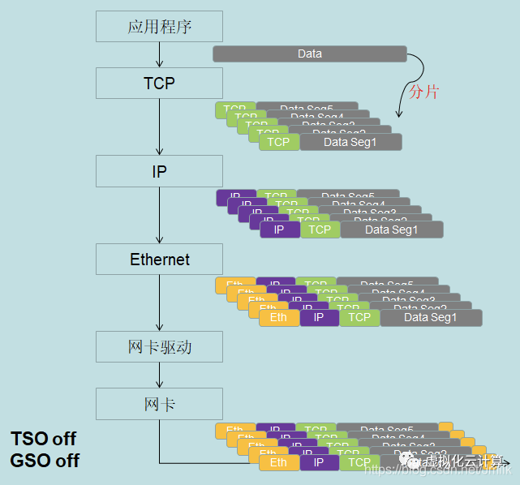
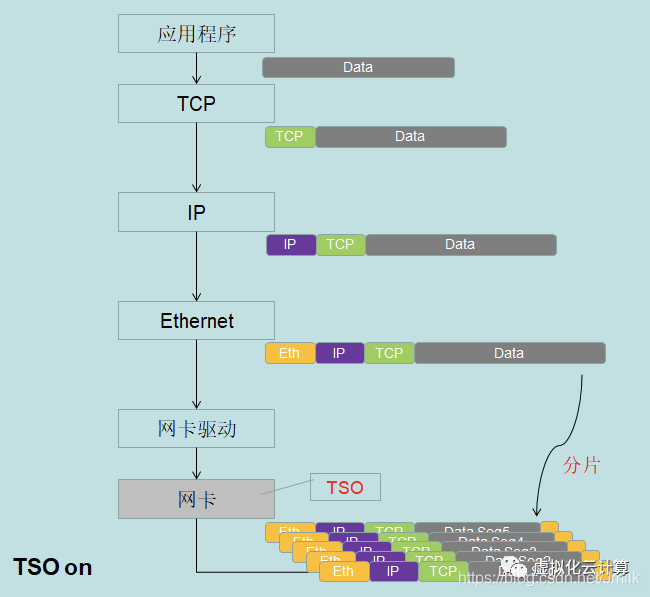
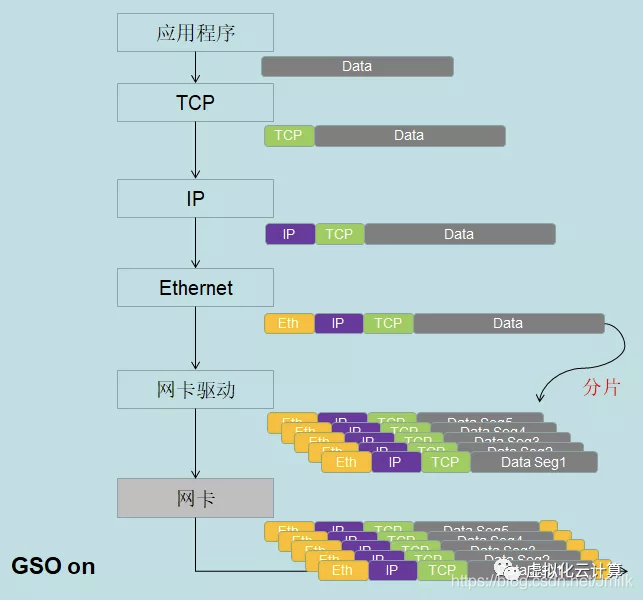
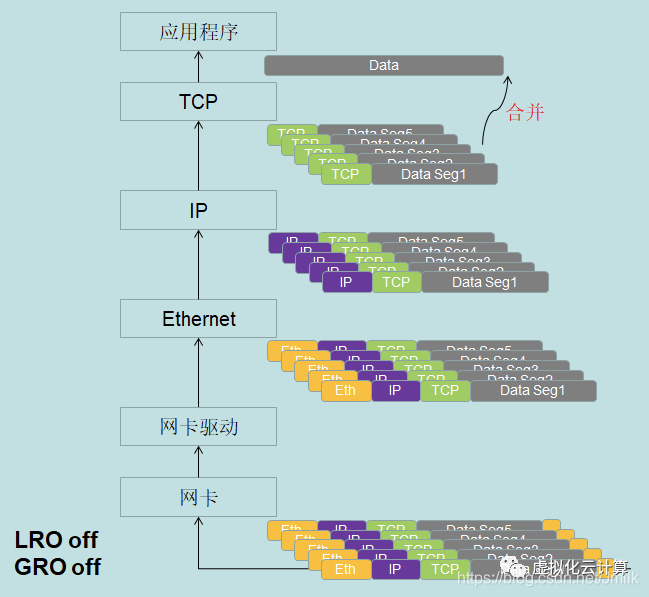
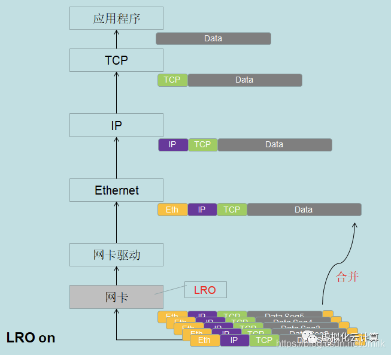
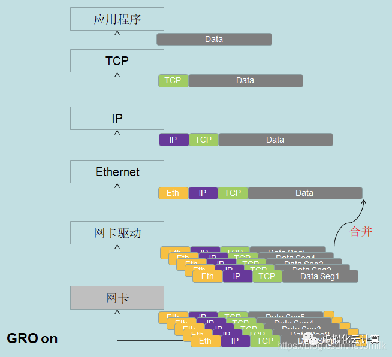

# TSO/LRO、GSO/GRO

## 简介

- TSO（TCP Segmentation Offload）、UFO（UDP Fragmentation Offload）、LSO（Large Segmentation Offload）：利用**网卡**对大数据包进行**分片**，从而减小CPU负载。
- **GSO（Generic Segmentation Offload）**：**无需借助硬件**，在内核层面实现对大数据包进行**分片**。
	- 首先查询网卡是否支持 TSO 功能，如果硬件支持 TSO 则使用网卡的硬件分片能力执行分片；如果网卡不支持 TSO 功能，则将分片的执行延缓到了将数据推送到网卡的前一刻执行。
- LRO（Large Receive Offload）：利用**网卡**（或网卡驱动）对接收到的多个数据包**合并**成一个大的数据包，再传递给网络协议栈处理，从而减小CPU负载。
- **GRO（Generic Receive Offload）**：同LRO，在内核层面实现数据包合并。

通常，我们只需要考虑GSO和GRO即可，

- **RSS（Receive Side Scaling）**：多核服务器中的网卡还推荐考虑 RSS，具备多个RSS队列的网卡，可以将不同的网络流分成不同的队列，再将这些队列分配到多个CPU核心上进行处理，从而将负荷分散。

## 1. TSO & GSO Off

## 2. TSO On

## 3. GSO On

## 4. LRO & GRO Off

## 5. LRO On

## 6. GRO On

