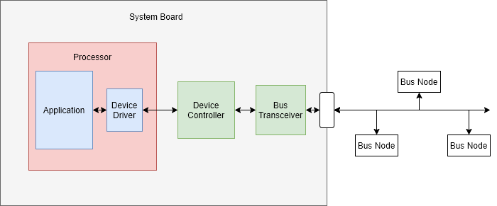
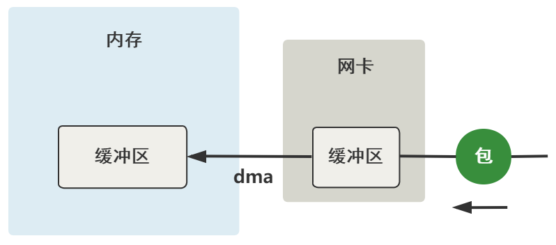

# 内核是如何接收一个网络包的

[TOC]


## 一、准备工作

内核版本`5.14.14`， 以Intel e1000 网卡驱动为例，找到`e1000_main.c`源码：

```c
static struct pci_driver e1000_driver = {
	...
	.name     = e1000_driver_name,	// 驱动名称
	.probe    = e1000_probe,		// 设备插入内核时调用
	.remove   = e1000_remove,		// 设备从内核移除时调用
	.shutdown = e1000_shutdown,		// 设备关闭时调用
	...
};
static int __init e1000_init_module(void)
{
	...
	// 注册网卡驱动
	ret = pci_register_driver(&e1000_driver);
	...
}
static void __exit e1000_exit_module(void)
{
	// 注销网卡驱动
	pci_unregister_driver(&e1000_driver);
}
```

可以看到`probe`是关键，那`probe`什么时候被调用的呢？（很多网上文章说是在`call_driver_probe`里面调用，其实还没说到底，仔细看会发现函数定义类型不一样）

```c
struct pci_driver {
	...
	int  (*probe)(struct pci_dev *dev, const struct pci_device_id *id);	/* New device inserted */
	...
};

struct bus_type {
	...
	int (*probe) (struct device *dev);
	...
};

struct device_driver {
	...
	int (*probe) (struct device *dev);
	...
};
```

那我们继续看`pci_register_driver`的实现
```c
struct bus_type pci_bus_type = {
	...
	.name		= "pci",
	.probe		= pci_device_probe,
	...

};
int __pci_register_driver(struct pci_driver *drv, struct module *owner,
			  const char *mod_name)
{
	/* initialize common driver fields */
	...
	drv->driver.bus = &pci_bus_type; // 这一步会设置总线类型
	...

	spin_lock_init(&drv->dynids.lock);
	INIT_LIST_HEAD(&drv->dynids.list);

	/* register with core */
	return driver_register(&drv->driver);
}
```
在`pci_device_probe -> pci_call_probe -> local_pci_probe -> `中找到了：
```c
static long local_pci_probe(void *_ddi)
{
	...
	pci_dev->driver = pci_drv;
	rc = pci_drv->probe(pci_dev, ddi->id);
	...
}
```

所以，网卡驱动`probe`调用链为：`pci_register_driver -> driver_register -> bus_add_driver -> __driver_attach ->  driver_probe_device -> really_probe -> call_driver_probe -> bus的probe -> pci_device_probe -> pci_call_probe -> local_pci_probe`

> 这里有必要简单说下，`bus`、`driver`、`device`的区别：
> `bus`：总线（Bus）是指计算机组件间规范化的交换数据（data）的方式，即以一种通用的方式为各组件提供数据传送和控制逻辑。如果说主板（Mother Board）是一座城市，那么总线就像是城市里的公共汽车（bus），能按照固定行车路线，传输来回不停运作的比特（bit）。-- wikipedia
> `driver`：驱动程序，提供操作的软件接口。
> `device`：设备就是连接在总线上的物理实体。
> 

那下面接着看`probe`的具体做了些什么：
```c
static const struct net_device_ops e1000_netdev_ops = {
	.ndo_open		= e1000_open,
	.ndo_stop		= e1000_close,
	.ndo_start_xmit		= e1000_xmit_frame,
	.ndo_do_ioctl		= e1000_ioctl,
	...
};
static int e1000_probe(struct pci_dev *pdev, const struct pci_device_id *ent)
{
	...
	// 设置net_device_ops
	netdev->netdev_ops = &e1000_netdev_ops;
	// 注册ethtool实现函数
	e1000_set_ethtool_ops(netdev);
	// NAPI初始化，注册poll函数（e1000_clean）
	netif_napi_add(netdev, &adapter->napi, e1000_clean, 64);
	// 获取MAC地址
	e1000_read_mac_addr(hw);
	// 注册net_device
	strcpy(netdev->name, "eth%d");
	err = register_netdev(netdev);
	...
}
```

上面网卡驱动初始化都完成后，就可以启动网卡了。当启动一个网卡时，`net_device_ops`中的`e1000_open`会被调用。
```c
int e1000_open(struct net_device *netdev)
{
	...
	// 分配RingBuffer，分配RX、TX队列内存，DMA初始化
	err = e1000_setup_all_tx_resources(adapter);
	err = e1000_setup_all_rx_resources(adapter);
	// 注册中断处理函数（e1000_intr）
	err = e1000_request_irq(adapter);
	// 启用NAPI
	napi_enable(&adapter->napi);
	...
}
```
当做好以上准备工作后，就可以开始接收数据包了。

## 二、从网线到网卡


总之这个过程，**实质上就是把网线中的高低电平，转换到网卡上的一个缓冲区中存储着**。

## 三、从网卡到内存

数据到达了网卡这个硬件的缓冲区中，现在要把它弄到**内存中的缓冲区**。


这个过程完全不需要 CPU 参与，只需要 **DMA** 这个硬件设备，**DMA** 等网卡的缓冲区有数据到来时，把它拷贝到内存里。


## 四、硬中断处理

当DMA操作完成后，网卡会向CPU发起一个硬中断，通知CPU有数据到达。