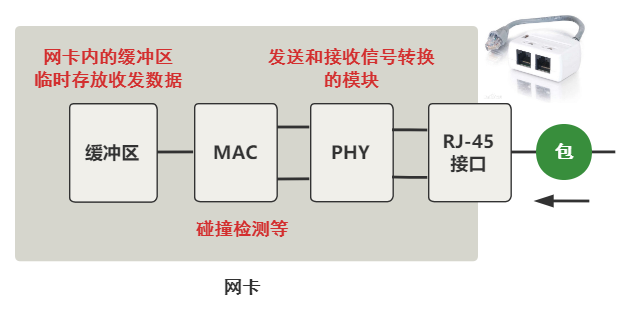

# 内核是如何接收一个网络包的

## 一、准备工作

内核版本`5.14.14`

### 注册硬中断
---

以Intel e1000 网卡驱动为例，找到`e1000_main.c`源码：

```c
static struct pci_driver e1000_driver = {
	...
	.name     = e1000_driver_name,	// 驱动名称
	.probe    = e1000_probe,		// 设备插入内核时调用
	.remove   = e1000_remove,		// 设备从内核移除时调用
	.shutdown = e1000_shutdown,		// 设备关闭时调用
	...
};
static int __init e1000_init_module(void)
{
	...
	// 注册网卡驱动
	ret = pci_register_driver(&e1000_driver);
	...
}
static void __exit e1000_exit_module(void)
{
	// 注销网卡驱动
	pci_unregister_driver(&e1000_driver);
}
```

可以看到`probe`是关键，那`probe`什么时候被调用的呢？（很多网上文章说是在`call_driver_probe`里面调用，其实还没说到底，仔细看会发现函数定义类型不一样）

```c
struct pci_driver {
	...
	int  (*probe)(struct pci_dev *dev, const struct pci_device_id *id);	/* New device inserted */
	...
};

struct bus_type {
	...
	int (*probe) (struct device *dev);
	...
};

struct device_driver {
	...
	int (*probe) (struct device *dev);
	...
};
```

那我们继续看`pci_register_driver`的实现
```c
struct bus_type pci_bus_type = {
	...
	.name		= "pci",
	.probe		= pci_device_probe,
	...

};
int __pci_register_driver(struct pci_driver *drv, struct module *owner,
			  const char *mod_name)
{
	/* initialize common driver fields */
	...
	drv->driver.bus = &pci_bus_type; // 这一步会设置总线类型
	...

	spin_lock_init(&drv->dynids.lock);
	INIT_LIST_HEAD(&drv->dynids.list);

	/* register with core */
	return driver_register(&drv->driver);
}
```
在`pci_device_probe -> pci_call_probe -> local_pci_probe -> `中找到了：
```c
static long local_pci_probe(void *_ddi)
{
	...
	pci_dev->driver = pci_drv;
	rc = pci_drv->probe(pci_dev, ddi->id);
	...
}
```

所以，网卡驱动`probe`调用链为：`pci_register_driver -> driver_register -> bus_add_driver -> __driver_attach ->  driver_probe_device -> really_probe -> call_driver_probe -> bus的probe -> pci_device_probe -> pci_call_probe -> local_pci_probe`

> 这里有必要简单说下，`bus`、`driver`、`device`的区别：
> `bus`：总线（Bus）是指计算机组件间规范化的交换数据（data）的方式，即以一种通用的方式为各组件提供数据传送和控制逻辑。如果说主板（Mother Board）是一座城市，那么总线就像是城市里的公共汽车（bus），能按照固定行车路线，传输来回不停运作的比特（bit）。-- wikipedia
> `driver`：驱动程序，提供操作的软件接口。
> `device`：设备就是连接在总线上的物理实体。
> 

那下面接着看`probe`的具体做了些什么：
```c
static const struct net_device_ops e1000_netdev_ops = {
	.ndo_open			= e1000_open,
	.ndo_stop			= e1000_close,
	.ndo_start_xmit		= e1000_xmit_frame,
	.ndo_do_ioctl		= e1000_ioctl,
	...
};
static int e1000_probe(struct pci_dev *pdev, const struct pci_device_id *ent)
{
	...
	// 设置net_device_ops
	netdev->netdev_ops = &e1000_netdev_ops;
	// 注册ethtool实现函数
	e1000_set_ethtool_ops(netdev);
	// NAPI初始化，注册poll函数（e1000_clean）
	netif_napi_add(netdev, &adapter->napi, e1000_clean, 64);
	// 获取MAC地址
	e1000_read_mac_addr(hw);
	// 注册net_device
	strcpy(netdev->name, "eth%d");
	err = register_netdev(netdev);
	...
}

void netif_napi_add(struct net_device *dev, struct napi_struct *napi,
		    int (*poll)(struct napi_struct *, int), int weight)
{
	...
	// 注册poll函数
	napi->poll = poll;
	...
}
```

上面网卡驱动初始化都完成后，就可以启动网卡了。当启动一个网卡时，`net_device_ops`中的`e1000_open`会被调用。
```c
int e1000_open(struct net_device *netdev)
{
	...
	// 分配RingBuffer，分配RX、TX队列内存，DMA初始化
	err = e1000_setup_all_tx_resources(adapter);
	err = e1000_setup_all_rx_resources(adapter);
	// adapter配置
	e1000_configure(adapter);
	// 注册中断处理函数（e1000_intr）
	err = e1000_request_irq(adapter);
	// 启用NAPI
	napi_enable(&adapter->napi);
	...
}

#define ETH_DATA_LEN	1500		/* Max. octets in payload	 */

static void e1000_configure_rx(struct e1000_adapter *adapter)
{
	u64 rdba;
	struct e1000_hw *hw = &adapter->hw;
	u32 rdlen, rctl, rxcsum;

	// 设置 clean_rx 回调 （后面收包会用到）
	if (adapter->netdev->mtu > ETH_DATA_LEN) {
		rdlen = adapter->rx_ring[0].count *
			sizeof(struct e1000_rx_desc);
		adapter->clean_rx = e1000_clean_jumbo_rx_irq;
		adapter->alloc_rx_buf = e1000_alloc_jumbo_rx_buffers;
	} else {
		rdlen = adapter->rx_ring[0].count *
			sizeof(struct e1000_rx_desc);
		adapter->clean_rx = e1000_clean_rx_irq;
		adapter->alloc_rx_buf = e1000_alloc_rx_buffers;
	}
}
```

### 注册软中断

---

Linux的软中断都是在专门的内核线程`ksoftirqd`中进行的。该进程的数量等于机器的核数。
```shell
root@ubuntu:~# ps aux | grep ksoft
root          12  0.0  0.0      0     0 ?        S    18:16   0:00 [ksoftirqd/0]
root          20  0.0  0.0      0     0 ?        S    18:16   0:00 [ksoftirqd/1]
root          26  0.0  0.0      0     0 ?        S    18:16   0:00 [ksoftirqd/2]
root          32  0.0  0.0      0     0 ?        S    18:16   0:01 [ksoftirqd/3]

```

系统初始化时，调用`spawn_ksoftirqd`来创建出`ksoftirqd`进程。
当`ksoftirqd`被创建出来以后，它就会进入自己的线程循环函数`ksoftirqd`和`ksoftirqd`了。不停地判断有没有软中断需要被处理。

```c
static struct smp_hotplug_thread softirq_threads = {
	.store				= &ksoftirqd,
	.thread_should_run	= ksoftirqd_should_run,
	.thread_fn			= run_ksoftirqd,
	.thread_comm		= "ksoftirqd/%u",
};

static __init int spawn_ksoftirqd(void)
{
	...
	BUG_ON(smpboot_register_percpu_thread(&softirq_threads));

	return 0;
}
early_initcall(spawn_ksoftirqd);

static int smpboot_thread_fn(void *data)
{
	struct smpboot_thread_data *td = data;
	struct smp_hotplug_thread *ht = td->ht;

	while (1) {
		...
		if (!ht->thread_should_run(td->cpu)) {
			preempt_enable_no_resched();
			schedule();
		} else {
			__set_current_state(TASK_RUNNING);
			preempt_enable();
			ht->thread_fn(td->cpu);
		}
	}
}
```

linux内核通过调用`subsys_initcall`来初始化各个子系统。网络子系统的初始化阶段会进行注册软中断处理函数。

```c
/*
 *	The list of packet types we will receive (as opposed to discard)
 *	and the routines to invoke.
 *
 *	Why 16. Because with 16 the only overlap we get on a hash of the
 *	low nibble of the protocol value is RARP/SNAP/X.25.
 *
 *		0800	IP
 *		0001	802.3
 *		0002	AX.25
 *		0004	802.2
 *		8035	RARP
 *		0005	SNAP
 *		0805	X.25
 *		0806	ARP
 *		8137	IPX
 *		0009	Localtalk
 *		86DD	IPv6
 */
#define PTYPE_HASH_SIZE	(16)

struct list_head ptype_base[PTYPE_HASH_SIZE] __read_mostly;
struct list_head ptype_all __read_mostly;	/* Taps */

static int __init net_dev_init(void)
{
	...

	INIT_LIST_HEAD(&ptype_all);
	// 初始化hash表
	for (i = 0; i < PTYPE_HASH_SIZE; i++)
		INIT_LIST_HEAD(&ptype_base[i]);

	...

	// 为每个CPU都申请一个softnet_data数据结构，sd里面的poll_list等待驱动程序将其poll函数注册进来（后面会说到）
	for_each_possible_cpu(i) {
		struct softnet_data *sd = &per_cpu(softnet_data, i);

		skb_queue_head_init(&sd->input_pkt_queue);
		skb_queue_head_init(&sd->process_queue);

		INIT_LIST_HEAD(&sd->poll_list);

		...

		// 后面收包会先收到backlog队列
		init_gro_hash(&sd->backlog);
		// 设置处理队列包的回调（process_backlog）
		sd->backlog.poll = process_backlog;
		sd->backlog.weight = weight_p;
	}
	
	// 注册发包软中断处理函数
	open_softirq(NET_TX_SOFTIRQ, net_tx_action);
	// 注册收包软中断处理函数
	open_softirq(NET_RX_SOFTIRQ, net_rx_action);
	...
}
subsys_initcall(net_dev_init);

// 注册软中断回调函数
void open_softirq(int nr, void (*action)(struct softirq_action *))
{
	// 记录到softirq_vec中
	softirq_vec[nr].action = action;
}
```

上面说了`内核线程的启动`、`注册软中断处理函数`，下面接着说，内核线程如何处理软中断的。

我们接着看`ksoftirqd_should_run`、`run_ksoftirqd`。

```c
#define local_softirq_pending()	(__this_cpu_read(local_softirq_pending_ref))
static int ksoftirqd_should_run(unsigned int cpu)
{
	return local_softirq_pending();
}
```
这里看到，仅仅是读取软中断标记。如果在硬中断处理流程中设置了标记（后面在硬中断处理中可以看到），这里肯定能读到。

```c
static void run_ksoftirqd(unsigned int cpu)
{
	...
	__do_softirq();
	...
}

// 根据当前CPU的软中断类型，调用其注册的action方法。
asmlinkage __visible void __softirq_entry __do_softirq(void)
{
	set_softirq_pending(0);
	
	h = softirq_vec;
	while ((softirq_bit = ffs(pending))) {
		h += softirq_bit - 1;
		...
		h->action(h);
		...
		h++;
		pending >>= softirq_bit;
	}
}
```
这里注意一个细节，硬中断处理中设置软中断标记，和这里判断是否有软中断到达，都是基于当前cpu的。这意味着只要硬中断在哪个CPU上被响应，那么软中断也是在这个CPU上处理的。

如果发现你的linux上软中断CPU消耗都集中在一个核上，做法是调整硬中断的CPU亲和性，来将硬中断打散到不同的CPU核上去。

### 协议层注册
---

系统启动的时候，不同的协议会注册不同的处理函数。

```c
static struct packet_type ip_packet_type __read_mostly = {
	.type = cpu_to_be16(ETH_P_IP),
	.func = ip_rcv,
	.list_func = ip_list_rcv,
};

static int __init inet_init(void)
{
	// ARP模块初始化
	arp_init();
	...
	// 添加所有的基础协议
	if (inet_add_protocol(&icmp_protocol, IPPROTO_ICMP) < 0)
		pr_crit("%s: Cannot add ICMP protocol\n", __func__);
	if (inet_add_protocol(&udp_protocol, IPPROTO_UDP) < 0)
		pr_crit("%s: Cannot add UDP protocol\n", __func__);
	if (inet_add_protocol(&tcp_protocol, IPPROTO_TCP) < 0)
		pr_crit("%s: Cannot add TCP protocol\n", __func__);
	...
	// 添加IP协议处理
	dev_add_pack(&ip_packet_type);
	...
}
fs_initcall(inet_init);

// Add a protocol handler to the networking stack. 
void dev_add_pack(struct packet_type *pt)
{
	struct list_head *head = ptype_head(pt);

	spin_lock(&ptype_lock);
	list_add_rcu(&pt->list, head);
	spin_unlock(&ptype_lock);
}

static inline struct list_head *ptype_head(const struct packet_type *pt)
{
	if (pt->type == htons(ETH_P_ALL))
		return pt->dev ? &pt->dev->ptype_all : &ptype_all;
	else
		return pt->dev ? &pt->dev->ptype_specific :
				 &ptype_base[ntohs(pt->type) & PTYPE_HASH_MASK];
}
```

上面可以看到，`ip_packet_type`被添加到`ptype_base[ETH_P_IP]`里面。上面也有说过`ptype_base`的定义和初始化。

类似的，ARP协议处理也被添加进去
```c
static struct packet_type arp_packet_type __read_mostly = {
	.type =	cpu_to_be16(ETH_P_ARP),
	.func =	arp_rcv,
};

void __init arp_init(void)
{
	...
	dev_add_pack(&arp_packet_type);
	...
}
```

---
当做好以上准备工作后，就可以开始接收数据包了。

## 二、从网线到网卡



总之这个过程，**实质上就是把网线中的高低电平，转换到网卡上的一个缓冲区中存储着**。

## 三、从网卡到内存

数据到达了网卡这个硬件的缓冲区中，现在要把它弄到**内存中的缓冲区**。


这个过程完全不需要 CPU 参与，只需要 **DMA** 这个硬件设备，**DMA** 等网卡的缓冲区有数据到来时，把它拷贝到内存里。


## 四、硬中断处理

当DMA操作完成后，网卡会向CPU发起一个硬中断，通知CPU有数据到达。

上面我们说了，硬中断处理函数是`e1000_intr`

```c
static irqreturn_t e1000_intr(int irq, void *data)
{
	...
	__napi_schedule(&adapter->napi);
	...
}

static inline void ____napi_schedule(struct softnet_data *sd, struct napi_struct *napi)
{
	...
	// 把napi挂到softnet_data链表上
	list_add_tail(&napi->poll_list, &sd->poll_list);
	// 触发收包软中断
	__raise_softirq_irqoff(NET_RX_SOFTIRQ);
	...
}

#define or_softirq_pending(x)	(__this_cpu_or(local_softirq_pending_ref, (x)))
void __raise_softirq_irqoff(unsigned int nr)
{
	...
	// 触发软中断（仅仅对变量的一次或运算）
	or_softirq_pending(1UL << nr);
}
```
上面可以看到，硬中断处理过程真的非常短。只是记录了一个寄存器，修改了CPU的poll_list，然后发出软中断。

## 五、软中断处理

内核线程检测到软中断触发后，会调用注册的`net_rx_action`函数。

```c
static __latent_entropy void net_rx_action(struct softirq_action *h)
{
	// 获取到当前CPU变量 softnet_data
	struct softnet_data *sd = this_cpu_ptr(&softnet_data);
	// time_limit 和 budget 是用来控制 net_rx_action 主动退出的
	// 目的是保证网络包的接收不霸占CPU不放
	unsigned long time_limit = jiffies +
		usecs_to_jiffies(netdev_budget_usecs);
	int budget = netdev_budget;
	LIST_HEAD(list);
	LIST_HEAD(repoll);

	// 更改poll_list前需要把所有硬中断给关了
	local_irq_disable();
	// 把poll_list链到list上，并把poll_list置空
	list_splice_init(&sd->poll_list, &list);
	local_irq_enable();

	for (;;) {
		struct napi_struct *n;

		...

		n = list_first_entry(&list, struct napi_struct, poll_list);
		budget -= napi_poll(n, &repoll);

		// 主动退出逻辑
		/* If softirq window is exhausted then punt.
		 * Allow this to run for 2 jiffies since which will allow
		 * an average latency of 1.5/HZ.
		 */
		if (unlikely(budget <= 0 ||
			     time_after_eq(jiffies, time_limit))) {
			sd->time_squeeze++;
			break;
		}
	}
	...
}
```

`budget` 参数可以通过内核参数调整。
```c
net.core.netdev_budget = 300
```

```c
static int napi_poll(struct napi_struct *n, struct list_head *repoll)
{
	bool do_repoll = false;
	void *have;
	int work;

	list_del_init(&n->poll_list);

	have = netpoll_poll_lock(n);

	work = __napi_poll(n, &do_repoll);

	if (do_repoll)
		list_add_tail(&n->poll_list, repoll);

	netpoll_poll_unlock(have);

	return work;
}

static int __napi_poll(struct napi_struct *n, bool *repoll)
{
	...
	if (test_bit(NAPI_STATE_SCHED, &n->state)) {
		// 执行网卡驱动注册的poll函数
		work = n->poll(n, weight);
		trace_napi_poll(n, work, weight);
	}
	...
}
```

上面我们说过，网卡驱动注册的poll函数是`e1000_clean`
```c
/**
 * e1000_clean - NAPI Rx polling callback
 * @napi: napi struct containing references to driver info
 * @budget: budget given to driver for receive packets
 **/
static int e1000_clean(struct napi_struct *napi, int budget)
{
	struct e1000_adapter *adapter = container_of(napi, struct e1000_adapter,
						     napi);
	int tx_clean_complete = 0, work_done = 0;

	...

	// 上面有说，在e1000_open中有注册e1000_clean_rx_irq函数到clean_rx
	adapter->clean_rx(adapter, &adapter->rx_ring[0], &work_done, budget);

	if (!tx_clean_complete || work_done == budget)
		return budget;

	...

	return work_done;
}
```

```c
static bool e1000_clean_rx_irq(struct e1000_adapter *adapter,
			       struct e1000_rx_ring *rx_ring,
			       int *work_done, int work_to_do)
{
	struct e1000_rx_buffer *buffer_info, *next_buffer;
	unsigned int i;
	
	i = rx_ring->next_to_clean;
	rx_desc = E1000_RX_DESC(*rx_ring, i);
	buffer_info = &rx_ring->buffer_info[i];

	while (rx_desc->status & E1000_RXD_STAT_DD) {
		struct sk_buff *skb;
		
		data = buffer_info->rxbuf.data;
		// 生成skb包
		skb = e1000_copybreak(adapter, buffer_info, length, data);
		if (!skb) {
			skb = build_skb(data - E1000_HEADROOM, frag_len);
			skb_reserve(skb, E1000_HEADROOM);
			buffer_info->rxbuf.data = NULL;
		}
		
process_skb:
		/* Receive Checksum Offload */
		e1000_rx_checksum(adapter,
				  (u32)(status) |
				  ((u32)(rx_desc->errors) << 24),
				  le16_to_cpu(rx_desc->csum), skb);

		e1000_receive_skb(adapter, status, rx_desc->special, skb);
	}
	
	...
}

static void e1000_receive_skb(struct e1000_adapter *adapter, u8 status,
			      __le16 vlan, struct sk_buff *skb)
{
	...
	napi_gro_receive(&adapter->napi, skb);
}

gro_result_t napi_gro_receive(struct napi_struct *napi, struct sk_buff *skb)
{
	...
	ret = napi_skb_finish(napi, skb, dev_gro_receive(napi, skb));
	...
	return ret;
}

static gro_result_t napi_skb_finish(struct napi_struct *napi,
				    struct sk_buff *skb,
				    gro_result_t ret)
{
	switch (ret) {
	case GRO_NORMAL:
		gro_normal_one(napi, skb, 1);
		break;
	...
	}
}

// 省略中间的函数调用。。
gro_normal_one -> gro_normal_list -> netif_receive_skb_list_internal -> 
	enqueue_to_backlog

// 入队到backlog
static int enqueue_to_backlog(struct sk_buff *skb, int cpu, unsigned int *qtail)
{
	...
	qlen = skb_queue_len(&sd->input_pkt_queue);
	if (qlen <= netdev_max_backlog && !skb_flow_limit(skb, qlen)) {
		if (qlen) {
enqueue:
			__skb_queue_tail(&sd->input_pkt_queue, skb);
			...
			// 入队成功，返回收包成功
			return NET_RX_SUCCESS;
		}
		...
	}

drop:
	...
	// 释放掉skb，返回丢包
	kfree_skb(skb);
	return NET_RX_DROP;
}
```

netdev_max_backlog 是可以通过修改内核参数更改的。
```shell
net.core.netdev_max_backlog = 1000
```

上面把生成skb包后，紧接着入队到backlog。下面我们接着数据包出队。

```c
static int process_backlog(struct napi_struct *napi, int quota)
{
	...
	while (again) {
		struct sk_buff *skb;

		// skb包从process_queue队列中出队
		while ((skb = __skb_dequeue(&sd->process_queue))) {
			rcu_read_lock();
			// skb包被送往协议栈（__netif_receive_skb往下传递一直到deliver_skb）
			__netif_receive_skb(skb);
			rcu_read_unlock();
			...
		}

		local_irq_disable();
		...
		if (skb_queue_empty(&sd->input_pkt_queue)) {
			// 如果input_pkt_queue队列为空，则退出流程
			napi->state = 0;
			again = false;
		} else {
			// 将input_pkt_queue队列数据放到process_queue队列，并把input_pkt_queue置空
			skb_queue_splice_tail_init(&sd->input_pkt_queue,
						   &sd->process_queue);
		}
		...
		local_irq_enable();
	}
	
	...
}

static inline int deliver_skb(struct sk_buff *skb,
			      struct packet_type *pt_prev,
			      struct net_device *orig_dev)
{
	if (unlikely(skb_orphan_frags_rx(skb, GFP_ATOMIC)))
		return -ENOMEM;
	refcount_inc(&skb->users);
	// 协议层注册的处理函数
	return pt_prev->func(skb, skb->dev, pt_prev, orig_dev);
}
```
如果是IP协议，上面的func就会进入到ip_rcv。

## 六、协议层处理

`netfilter`框架就不在这里介绍了，可以看相关章节。

我们接着看数据包经过IP协议层，如何被送到`TCP`或`UDP`的

```c
// 调用流程如下：
ip_rcv -> ip_rcv_finish -> dst_input

// 这里涉及路由子系统，netfilter框架中经过路由判决后会决定走local_in还是forward。
static inline int dst_input(struct sk_buff *skb)
{
	return INDIRECT_CALL_INET(skb_dst(skb)->input,
				  ip6_input, ip_local_deliver, skb);
}
```

如果包是送往本机的，那我们接着看`ip_local_deliver`,
```c
// 调用流程如下：
ip_local_deliver -> ip_local_deliver_finish -> ip_protocol_deliver_rcu

void ip_protocol_deliver_rcu(struct net *net, struct sk_buff *skb, int protocol)
{
	...
	// 获取IP协议类型
	ipprot = rcu_dereference(inet_protos[protocol]);
	if (ipprot) {
		...
		// 调用对应的协议处理函数（上面的inet_init函数中已经注册过了）
		ret = INDIRECT_CALL_2(ipprot->handler, tcp_v4_rcv, udp_rcv, skb);
		...
	}
	...
}
```

后面可能会经过socket传到应用层，这里就不展开了。

## 七、总结

