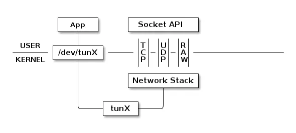
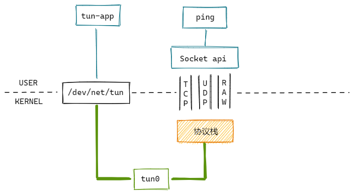

# TUN/TAP

`TUN/TAP`为用户空间程序提供数据包的接收和传输。

`tun`设备的工作模式：


`tun`设备通过一个设备文件收发数据包。用户态的进程可以写这个文件，通过`tun`设备转换成一个数据包传送给内核网络协议栈。当内核发送一个包给`tun`设备时，用户态的进程通过读取这个文件可以拿到包的内容。

`tun`和`tap`设备工作原理完全相同，区别在于：

- `tun`表示虚拟的是点对点设备，收发的是IP包，只能工作在L3，无法与物理网卡做桥接。
- `tap`表示虚拟的是以太网设备，收发的是链路层数据包，可以与物理网卡桥接。

## 实验



使用`ping`命令向`tun`设备发送`ICMP request`包，然后我们实现一个`tun-app`程序，响应`ICMP reply`包。

```c
#include <fcntl.h>
#include <string.h>
#include <stdio.h>
#include <stdlib.h>
#include <unistd.h>
#include <net/if.h>
#include <sys/ioctl.h>
#include <sys/stat.h>
#include <sys/types.h>
#include <linux/if.h>
#include <linux/if_tun.h>

int main(void)
{
    struct ifreq ifr;
    int fd, err, nread, nwrite;
    char buf[1500];

    if((fd = open("/dev/net/tun", O_RDWR)) < 0)
        return fd;

    memset(&ifr, 0, sizeof(ifr));

    ifr.ifr_flags = IFF_TUN | IFF_NO_PI;
    if((err = ioctl(fd, TUNSETIFF, (void *) &ifr)) < 0) {
        perror("ioctl error");
        close(fd);
        return err;
    }

    printf("Tun device name: %s\n", ifr.ifr_name);

    while(1) {
        nread = read(fd, buf, sizeof(buf));
        if (nread < 0) {
            perror("read error");
            close(fd);
            exit(1);
        }
        printf("Read %d bytes from tun device\n", nread);

        // 将源IP和目的IP置换
        unsigned char ip[4];
        memcpy(ip, &buf[12], 4);
        memcpy(&buf[12], &buf[16], 4);
        memcpy(&buf[16], ip, 4);
        // ICMP类型：request改为reply
        buf[20] = 0;
        // 校验和
        *((unsigned short*)&buf[22]) += 8;

        nwrite = write(fd, buf, nread);
        printf("Write %d bytes to tun device\n", nwrite);
    }

    return 0;
}
```

下面开始测试：

```bash
# 编译程序
[root@vm ~] gcc tun-app.c -o tun-app

# 运行程序
[root@vm ~] ./tun-app
Tun device name: tun0

# 启用tun0
ip link set tun0 up

# 添加路由
route add 1.2.3.4 dev tun0

# 执行ping
[root@vm ~] ping 1.2.3.4
PING 1.2.3.4 (1.2.3.4) 56(84) bytes of data.
64 bytes from 1.2.3.4: icmp_seq=1 ttl=64 time=0.145 ms
64 bytes from 1.2.3.4: icmp_seq=2 ttl=64 time=0.081 ms
```

## 源码分析

内核里面`tun`源码在`drivers/net/tun.c`，`tap`源码在`drivers/net/tap.c`。下面看下`tun`设备的实现。

### 模块初始化

```c
static const struct file_operations tun_fops = {
	// 异步I/O回调
	.read_iter  = tun_chr_read_iter,
	.write_iter = tun_chr_write_iter,
	// 命令操作回调
	.unlocked_ioctl	= tun_chr_ioctl,
	// 打开设备文件回调
	.open	= tun_chr_open,
	...
};

static struct miscdevice tun_miscdev = {
	.minor = TUN_MINOR,
	.name = "tun",
	.nodename = "net/tun",
	.fops = &tun_fops,
};

// 模块初始化
static int __init tun_init(void)
{
	// 注册杂项字符设备
	ret = misc_register(&tun_miscdev);
	...
}
```

### 打开设备

首先调用`open`打开设备文件，回调`tun_chr_open`：

```c
static int tun_chr_open(struct inode *inode, struct file * file)
{
	struct tun_file *tfile;
	tfile = (struct tun_file *)sk_alloc(net, AF_UNSPEC, GFP_KERNEL,
						&tun_proto, 0);
	// 初始化ring
	if (ptr_ring_init(&tfile->tx_ring, 0, GFP_KERNEL)) {
		sk_free(&tfile->sk);
		return -ENOMEM;
	}
	RCU_INIT_POINTER(tfile->tun, NULL);

	// 设置sock操作回调
	tfile->socket.file = file;
	tfile->socket.ops = &tun_socket_ops;
}
```

访问`tun`设备有两种方式：文件方式、socket方式。
上面的实现使用的是文件方式。

然后使用`ioctl`打开设备，回调`__tun_chr_ioctl`，函数命令功能很多，我们这里只看下`TUNSETIFF`命令。

```c
static long __tun_chr_ioctl(struct file *file, unsigned int cmd,
			    unsigned long arg, int ifreq_len)
{
	...
	if (cmd == TUNSETIFF) {
		...
		ret = tun_set_iff(net, file, &ifr);
	}
}

static int tun_set_iff(struct net *net, struct file *file, struct ifreq *ifr)
{
	// 根据ifr_name获取网络设备
	dev = __dev_get_by_name(net, ifr->ifr_name);
	
	if (dev) {
		tun = netdev_priv(dev);
		...
	} else {
		// 找不到则创建
		dev = alloc_netdev_mqs(sizeof(struct tun_struct), name,
				NET_NAME_UNKNOWN, tun_setup, queues,
				queues);
		tun = netdev_priv(dev);
		// 初始化tun设备
		tun_net_init(dev);
		rcu_assign_pointer(tfile->tun, tun);
		...
	}
}

static void tun_net_init(struct net_device *dev)
{
	...
    dev->netdev_ops = &tun_netdev_ops;
    dev->header_ops = &ip_tunnel_header_ops;

    /* Point-to-Point TUN Device */
    dev->hard_header_len = 0;
    dev->addr_len = 0;
    dev->mtu = 1500;

    /* Zero header length */
    dev->type = ARPHRD_NONE;
    dev->flags = IFF_POINTOPOINT | IFF_NOARP | IFF_MULTICAST;
	...
}

static const struct net_device_ops tun_netdev_ops = {
	// 设置tun设备发包回调
	.ndo_start_xmit		= tun_net_xmit,
	...
};
```

上面的主要做了申请资源，创建tun设备并初始化。

### 用户空间从tun设备读取

```c
static ssize_t tun_chr_read_iter(struct kiocb *iocb, struct iov_iter *to)
{
	ret = tun_do_read(tun, tfile, to, noblock, NULL);
}

static ssize_t tun_do_read(struct tun_struct *tun, struct tun_file *tfile,
			   struct iov_iter *to,
			   int noblock, void *ptr)
{
	// 从ring里面获取帧
	ptr = tun_ring_recv(tfile, noblock, &err);
	
	struct sk_buff *skb = ptr;
	// 把包写到用户空间
	ret = tun_put_user(tun, tfile, skb, to);
	...
}
```

### 用户空间向tun设备写入

```c
static ssize_t tun_chr_write_iter(struct kiocb *iocb, struct iov_iter *from)
{
	...
	// 从用户空间获取数据包
	result = tun_get_user(tun, tfile, NULL, from, noblock, false);
	...
}

static ssize_t tun_get_user(struct tun_struct *tun, struct tun_file *tfile,
			    void *msg_control, struct iov_iter *from,
			    int noblock, bool more)
{
	// 申请skb
	skb = tun_alloc_skb(tfile, align, copylen, linear, noblock);
	// 将数据拷贝到skb中
	err = skb_copy_datagram_from_iter(skb, 0, from, len);

	// skb一些设置
	skb_reset_mac_header(skb);
	skb->protocol = pi.proto;
	skb->dev = tun->dev;
	skb_reset_network_header(skb);
	skb_probe_transport_header(skb);
	skb_record_rx_queue(skb, tfile->queue_index);

	// 发送skb（会走到收包软中断回调，丢给协议栈处理了）
	netif_rx_ni(skb);
}
```

### tun设备发包

协议栈处理完成后，最终会调用设备注册的发包回调。回调实现里面可以看到，最终把数据包丢给了`socket`。

```c
static netdev_tx_t tun_net_xmit(struct sk_buff *skb, struct net_device *dev)
{
	...
	/* Notify and wake up reader process */
	if (tfile->flags & TUN_FASYNC)
		kill_fasync(&tfile->fasync, SIGIO, POLL_IN);
	tfile->socket.sk->sk_data_ready(tfile->socket.sk);
	...
}
```