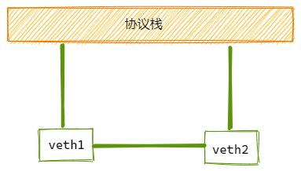
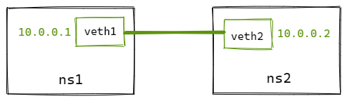

# veth（Virtual Ethernet Device）

`veth` 设备是虚拟以太网设备。
- 可以充当namespace之间的隧道
- 可以作为独立的网络设备

`veth`设备总是创建为一对互联的设备。一端连着协议栈，一端彼此相连着。

其中一台设备发送的报文，另一台设备会立即接收到。当任意一台设备状态为down时，对端链路状态也为down。

## 如何创建 veth-pair
```bash
ip link add <p1-name> type veth peer name <p2-name>
```

## 实验

直接相连是最简单的方式，如下图，一对veth-pair直接将两个namespace连接。


```bash
# 创建netns
ip netns add ns1
ip netns add ns2

# 创建veth-pair
ip link add veth1 type veth peer name veth2

# 将veth移动到netns中
ip link set veth1 netns ns1
ip link set veth2 netns ns2

# 给veth配置IP并启用
ip netns exec ns1 ip addr add 10.0.0.1/24 dev veth1
ip netns exec ns1 ip link set veth1 up
ip netns exec ns2 ip addr add 10.0.0.2/24 dev veth2
ip netns exec ns2 ip link set veth2 up

# 从 veth1 ping veth2
ip netns exec ns1 ping 10.0.0.2

# 可以看到被netns隔离的veth pair是能够正常通信的
PING 10.0.0.2 (10.0.0.2) 56(84) bytes of data.
64 bytes from 10.0.0.2: icmp_seq=1 ttl=64 time=0.056 ms
64 bytes from 10.0.0.2: icmp_seq=2 ttl=64 time=0.053 ms
```

## 源码实现

内核里面veth源码在`drivers/net/veth.c`

数据结构如下：
```c
struct veth_priv {
	struct net_device __rcu	*peer;  // 指向另外一端的设备
	atomic64_t		dropped;
	struct bpf_prog		*_xdp_prog;
	struct veth_rq		*rq;
	unsigned int		requested_headroom;
};
```

### 创建 veth-pair

使用`ip`命令创建`veth-pair`时，会调用`veth_newlink`来完成创建工作：

```c
static int __rtnl_newlink(struct sk_buff *skb, struct nlmsghdr *nlh,
			  struct nlattr **attr, struct netlink_ext_ack *extack)
{
	...
	// 创建本端设备
	dev = rtnl_create_link(link_net ? : dest_net, ifname,
				name_assign_type, ops, tb, extack);
	...
	if (ops->newlink)
		err = ops->newlink(link_net ? : net, dev, tb, data, extack);
	...
}

static int veth_newlink(struct net *src_net, struct net_device *dev,
			struct nlattr *tb[], struct nlattr *data[],
			struct netlink_ext_ack *extack)
{
	// 创建对端设备
	peer = rtnl_create_link(net, ifname, name_assign_type,
				&veth_link_ops, tbp, extack);
	...
	// 设置dev的对端为peer
	priv = netdev_priv(dev);
	rcu_assign_pointer(priv->peer, peer);
	// 设置peer的对端为dev
	priv = netdev_priv(peer);
	rcu_assign_pointer(priv->peer, dev);
	...
}
```

创建`veth-pair`时，还需要进行初始化，初始化过程在`veth_setup`中完成。
```c
// veth_setup 调用过程
rtnl_create_link --> alloc_netdev_mqs --> setup(dev)

static void veth_setup(struct net_device *dev)
{
	ether_setup(dev);
	...
	dev->netdev_ops = &veth_netdev_ops;
	dev->ethtool_ops = &veth_ethtool_ops;
}

static const struct net_device_ops veth_netdev_ops = {
	// 设置发包回调
	.ndo_start_xmit      = veth_xmit,
};

```

### 发送数据

`veth-pair`一端发送数据时，会调用`veth_xmit`来完成发送过程：

```c
static netdev_tx_t veth_xmit(struct sk_buff *skb, struct net_device *dev)
{
	struct veth_priv *rcv_priv, *priv = netdev_priv(dev);
	struct net_device *rcv;
	// 对端为接收方
	rcv = rcu_dereference(priv->peer);
	rcv_priv = netdev_priv(rcv);
	...
	// 将数据包转发给对端
	if (likely(veth_forward_skb(rcv, skb, rq, use_napi) == NET_RX_SUCCESS)) {
		...
	}
	...
}

// 调用流程
veth_forward_skb --> netif_rx --> netif_rx_internal --> enqueue_to_backlog
```
`enqueue_to_backlog`我们在内核收包的文章里面提到过，软中断中会先入队到`backlog`，然后从`backlog`出队后，就进入了协议栈处理了（`ip_rcv`）。看到这里之后，就基本能串起来了，后续流程不再赘述。

有意思的是，我们研究下`veth_forward_skb`看下是数据包怎么转发到对端的？
```c
static int veth_forward_skb(struct net_device *dev, struct sk_buff *skb,
			    struct veth_rq *rq, bool xdp)
{
	return __dev_forward_skb(dev, skb) ?: xdp ?
		veth_xdp_rx(rq, skb) :
		netif_rx(skb);
}

int __dev_forward_skb(struct net_device *dev, struct sk_buff *skb)
{
	return __dev_forward_skb2(dev, skb, true);
}

static int __dev_forward_skb2(struct net_device *dev, struct sk_buff *skb,
			      bool check_mtu)
{
	int ret = ____dev_forward_skb(dev, skb, check_mtu);

	if (likely(!ret)) {
		// 设置新的dev
		skb->protocol = eth_type_trans(skb, dev);
		// 更新校验和
		skb_postpull_rcsum(skb, eth_hdr(skb), ETH_HLEN);
	}

	return ret;
}

static __always_inline int ____dev_forward_skb(struct net_device *dev,
					       struct sk_buff *skb,
					       const bool check_mtu)
{
	...
	
	// 擦洗数据包
	// 当数据包从一个namespace注入到另外一个namespace前, 需要清除skb中可能影响namespace隔离的所有信息
	// dev传进来的是接收方，这里对比了skb当前设备的namespace和对端的namespace
	skb_scrub_packet(skb, !net_eq(dev_net(dev), dev_net(skb->dev)));
	skb->priority = 0;
	return 0;
}

__be16 eth_type_trans(struct sk_buff *skb, struct net_device *dev)
{
	// 将skb的dev设置为接收方的设备
	skb->dev = dev;
}
```

从上面可以看到，数据包从本段转发到对端，只做了如下工作：
1. 跨namespace前，擦洗数据包
2. 给skb->dev设置为对端设备
3. 更新skb校验和

后面就进入到协议栈了。
