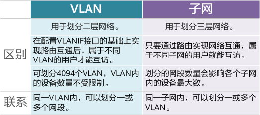
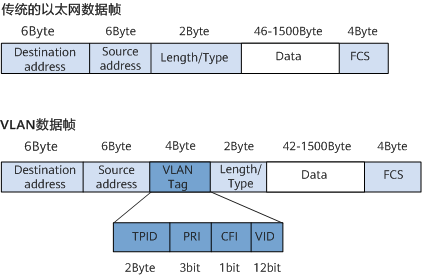
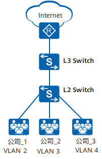
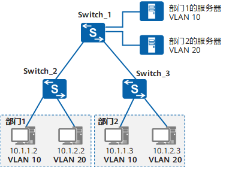
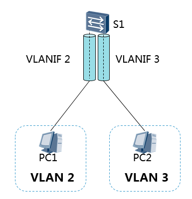
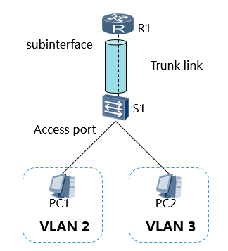

# VLAN

一个 LAN 表示一个广播域。

VLAN 可以把一个LAN划分成多个逻辑的VLAN，每个VLAN是一个广播域。VLAN间则不能直接互通，广播报文就被限制在一个VLAN内。

VLAN的优点：

- 限制广播域：广播域被限制在一个VLAN内，节省了带宽，提高了网络处理能力。
- 增强局域网的安全性：不同VLAN内的报文在传输时相互隔离，即一个VLAN内的用户不能和其它VLAN内的用户直接通信。
- 提高了网络的健壮性：故障被限制在一个VLAN内，本VLAN内的故障不会影响其他VLAN的正常工作。
- 灵活构建虚拟工作组：用VLAN可以划分不同的用户到不同的工作组，同一工作组的用户也不必局限于某一固定的物理范围，网络构建和维护更方便灵活。

## VLAN vs 子网

属于不同VLAN的主机之间不能直接通信，属于不同的子网的主机之间也不能直接通信。

## VLAN Tag

IEEE 802.1Q协议规定，在以太网数据帧中加入4个字节的VLAN标签，用以标识VLAN信息。

VID字段代表VLAN ID，VLAN ID取值范围是0～4095。由于0和4095为协议保留取值，所以VLAN ID的有效取值范围是1～4094。

交换机内部处理的数据帧都带有VLAN标签。而交换机连接的部分设备（如用户主机、服务器）只会收发不带VLAN tag的传统以太网数据帧。因此，要与这些设备交互，就需要交换机的接口能够识别传统以太网数据帧，并在收发时给帧添加、剥除VLAN标签。**添加什么VLAN标签，由接口上的缺省VLAN（Port Default VLAN ID，PVID）决定。**

## VLAN 接口类型

现网中属于同一个VLAN的用户可能会被连接在不同的交换机上，且跨越交换机的VLAN可能不止一个，如果需要用户间的互通，就需要交换机间的接口能够同时识别和发送多个VLAN的数据帧。

### Access 接口

Access接口一般用于和不能识别Tag的用户终端（如用户主机、服务器）相连，或者不需要区分不同VLAN成员时使用。

1. 当它收到一个帧的时候，如果这个帧没有Tag标记，它就用自己的PVID给他打上标记。
2. 它在发出一个帧时如果VID=PVID就去掉标记以保证传送给终端设备的帧没有被变动过。
3. Access端口发出的以太网数据帧中不带有VLAN标记。Access端口的特点是 只允许符合PVID（或者VID）的流量通过。

### Trunk 接口

Trunk接口一般用于连接交换机、路由器、AP以及可同时收发Tagged帧和Untagged帧的语音终端。它可以允许多个VLAN的帧带Tag通过，**但只允许属于缺省VLAN的帧从该类接口上发出时不带Tag（即剥除Tag）。**

1. 特殊情况下，当它收到一个没有VID标记的帧的时候，它就用自己的PVID给他打上标记。之后查询允许通过的VLAN ID的列表，允许通过则接收，否则丢弃。
2. 当它收到一个有VID标记的帧的时候，查询允许通过的VLAN ID的列表，允许通过则接收，否则丢弃。
3. 当它发送一个与自己PVID相等且在允许通过的VLAN ID的列表中的帧的时候，会将帧中的Tag去掉，发送报文。
4. 当它发送一个与自己PVID不相等且在允许通过的VLAN ID的列表中的帧的时候，会将帧中的Tag保持不变，发送报文。

### Hybrid 接口

Access端口一般发送的都是没有Tag的数据帧，而Trunk一般发送的都是带有Tag的数据帧。而Hybrid这个模式的端口集合了Access端口与Trunk端口两者的属性。

1. 当它收到一个没有VID标记的帧的时候，它就用自己的PVID给他打上标记。之后查询允许通过的VLAN ID的列表，允许通过则接收，否则丢弃。
2. 当它收到一个有VID标记的帧的时候，查询允许通过的VLAN ID的列表，允许通过则接收，否则丢弃。
3. 转发数据帧可以通过命令配置发送时是否携带Tag，携带Tag则原Tag不变；不携带Tag则将Tag剥离。

Hybrid接口和Trunk接口在很多应用场景下可以通用，但在某些应用场景下，必须使用Hybrid接口。比如在灵活QinQ中，服务提供商网络的多个VLAN的报文在进入用户网络前，需要剥离外层VLAN Tag，此时Trunk接口不能实现该功能，因为Trunk接口只能使该接口缺省VLAN的报文不带VLAN Tag通过。

## VLAN 划分

### 基于接口的划分

### 基于IP的划分

### 基于MAC的划分

根据主机上的MAC进行VLAN的划分。此方法需要提前配置MAC与VLAN ID的映射关系，网络设备收到不带有Tag的数据帧时，会根据MAC来打上相对应的VLAN标记。若主机连接移位，无需进行重新配置。

### 基于协议的划分

根据不同的协议类型进行VLAN的划分。需要提前定义协议与VLAN ID的映射关系。

### 基于策略的划分

使用不同条件组合进行VLAN的划分。只有当所有条件都匹配时，网络设备才会为数据帧打上VLAN标签。每一条策略都需要进行手动配置。

## VLAN 间通信

### VLANIF 接口

三层交换机通过路由表传输第一个数据包后，会产生一个同时包含MAC地址与IP地址的数据转发映射表。当同样的数据流再次通过时，直接使用二层转发。

为了保证第一次数据流通过路由表正常转发，路由表中必须有正确的路由表项。因此必须在三层交换机上部署三层接口并部署路由协议，实现三层路由可达。

### 单臂路由

## 其他

### QinQ

QinQ（802.1Q-in-802.1Q）协议出自IEEE 802.1ad标准协议，通过在802.1Q标签报文的基础上再增加一层802.1Q的Tag来达到扩展VLAN空间的功能，可以使私网VLAN透传公网。外层tag称为Service Tag，而内层tag则称为Customer Tag。

由于在骨干网中传递的报文有两层802.1Q Tag（一层公网Tag，一层私网Tag），即802.1Q-in-802.1Q，所以称之为QinQ协议。

### 广播

- 255.255.255.255叫本地广播，也叫直播，direct broadcast，不跨路由器。
- 172.16.33.255叫子网广播，广播给172.16.33.0这个子网，可以跨路由器。
- 172.16.255.255叫全子网广播，广播给172.16.0.0这个主网，可以跨路由器。

路由器是三层设备，可以隔离广播，但并不是所有广播都隔离。事实上只有本地广播路由器才不转发，对于子网广播和全子网广播，路由器是转发的。为什么呢？我们来看255.255.255.255的广播，在MAC的封装中，对应的目的MAC是广播，而子网广播和全子网广播，对应的目的MAC是单播，所以路由器会转发。所以路由器隔离的广播是目的MAC为全1的广播，对于目的MAC是单播的上层广播，路由器是不能隔离的。

### 资料

https://cloud.tencent.com/developer/article/2118133