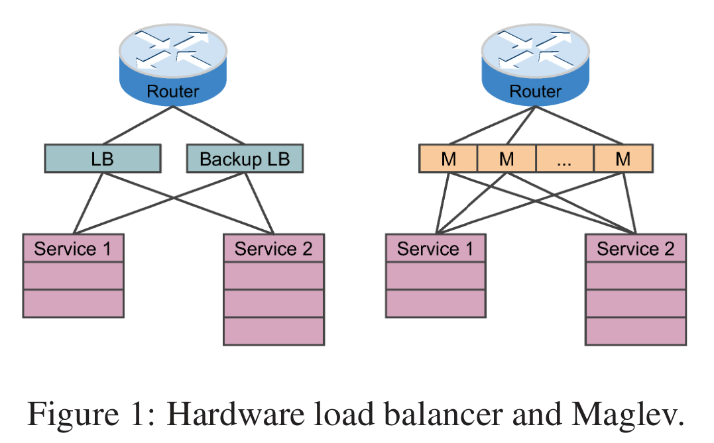
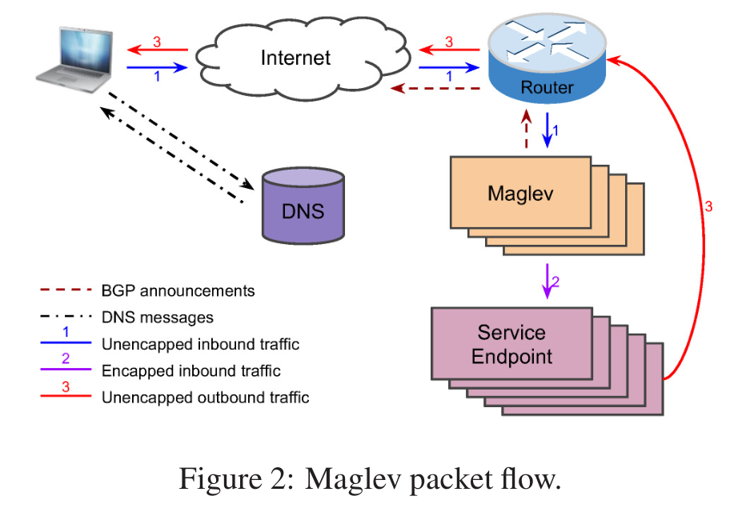
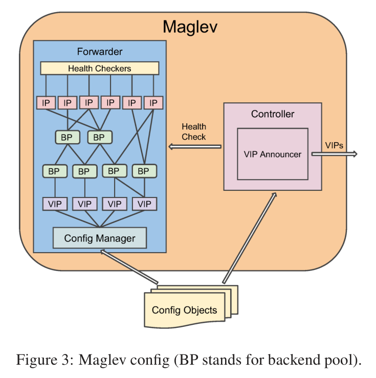
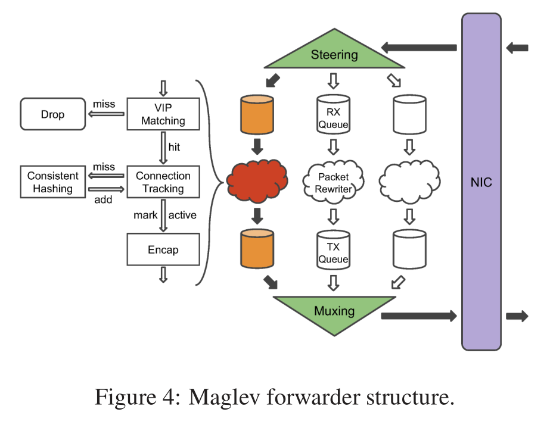
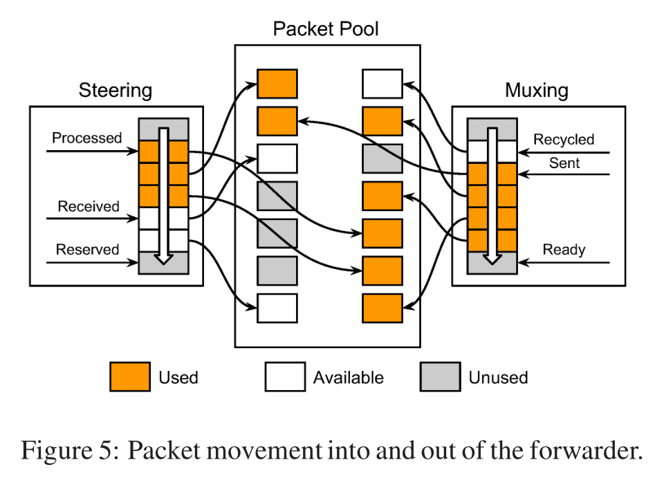
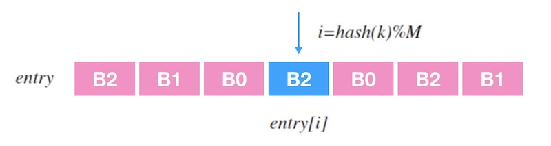
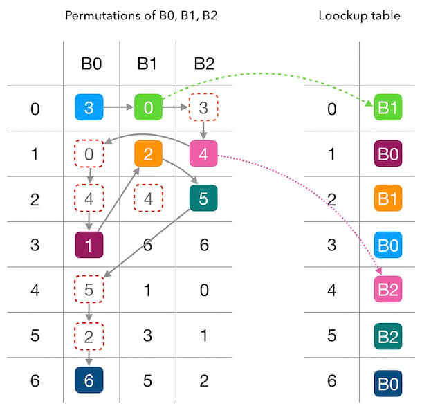
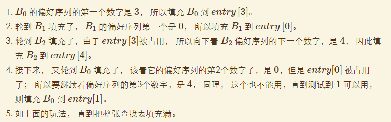

# Maglev

## 1. 背景

传统负载均衡器的缺点：

- **扩展性差**。可扩展性通常受限于单个单元的最大容量，无法跟上流量的增长。
- **高可用性差**。尽管有主备部署避免单点故障，但仅提供1+1冗余。
- **缺乏灵活性和可编程性**。通常修改硬件负载均衡器很困难。
- **升级成本高**。增加整体负载均衡器容量通常需要购买新硬件对其物理部署。

**Maglev** 是通过软件来实现的负载均衡系统。将负载均衡器直接构建在服务器上，形成分布式软件系统。优点：

- 增加服务器数量就能提高负载均衡器的容量；
- 通过ECMP，将流量平均分配到所有机器上；
- 提供N+1冗余；
- 自己控制整个系统，可快速添加、测试、部署新功能；
- 可以在同一集群中的多个负载均衡器分片之间划分服务，以实现性能隔离；

## 2. 架构

1. 当用户敲入[www.google.com]时，DNS服务把对应的VIP返回给用户，浏览器将会使用这个VIP建立一个新的连接。
2. 当路由器接收到这个VIP包后，它把这个包通过ECMP转发到其中的一个Maglev机器上。
3. Maglev机器接收到这个包后，它首先要选择与此VIP相应的一个服务终结点，使用GRE把外部IP头打包进这个数据包里，这样这个包就可以转发到服务终结点。
4. 当数据包到达选好的服务终结点后，会对包进行解封并消费。
5. 响应包会带上VIP和用户IP放进IP包里边，使用DSR把响应直接发送给路由器；Maglev不需要处理返回包，这种包一般都比较大。

### 2.1. 配置

每个Maglev都有一个控制器（Controller）和转发器（Forwarder）。

控制器功能：宣告VIP；检查Forwarder的健康状态。

转发器中：每个VIP配置有一个或多个后端池（BP），一个BP可以包含服务器的物理IP，也可以包含其他BP。每个BP都有健康检查，它需要确保数据包被转发到健康的服务器。

### 2.2. Forwarder

1. steering模块计算数据包5-tuple的hash，根据hash值分配到不同的接收队列。每个接收队列附加到一个数据包重写器线程。
2. 线程首先匹配VIP，匹配不到则丢弃数据包；
3. 然后计算5-tuple的hash在连接跟踪表（CT）查找，如果查到则直接使用后端结果；
4. 如果查不到，则去查询一致性哈希模块，为数据包选择一个新的后端，并添加连接跟踪；
5. 选择新后端后，则使用GRE封装数据包，将其发送到传输队列。
6. muxing模块会轮询所有队列，将数据包传输到NIC。

**注意：内核不参与整个过程**

#### 2.2.1 数据包处理

### 2.3. 一致性哈希

路由器不保证连接的亲近性，无法保证具有相同5-tuple哈希的数据包就可以传递给同一个maglev。比如：maglev机器集变化了，增加、删除操作。

#### 2.3.1. 实现

- 查表

entry是查找表，记录一个槽位序列，查找表长度为M，输入一个k时，查找过程就是`entry[hash(k) % M]`

- 建表

每个后端先生成一个偏好序列。然后每个后端用偏好序列轮流填充查找表，将偏好序列的数字当做查找表中的目标位置，把后端标号填充到目标位置。如果目标位置已被占用，则顺延该序列的下一个值。

#### 2.3.2. 对比

- 增删对Maglev哈希的干扰

1、映射平均性非常好
2、Maglev没有做到最小化干扰，只是查找表越大，Maglev哈希的一致性越好。

- 对比

