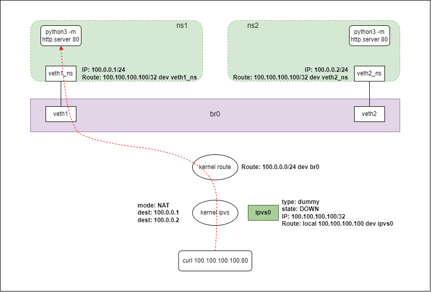
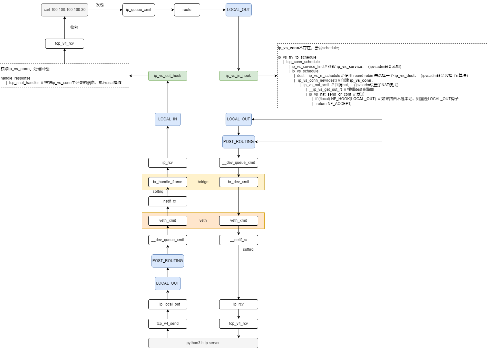

# LVS-实验

## 1. 拓扑图



## 2. 实验脚本

```bash
#!/bin/bash

# clean
killall python3

ip link del dev br0 &> /dev/null

ip link del dev veth1 &> /dev/null
ip netns del ns1 &> /dev/null

ip link del dev veth2 &> /dev/null
ip netns del ns2 &> /dev/null

ip link del dev ipvs0 &> /dev/null

ipvsadm -D -t 100.100.100.100:80

# create
ip l add dev br0 type bridge
ip l set br0 up
ip r add 100.0.0.0/24 dev br0

ip netns add ns1
ip link add dev veth1 type veth peer name veth1_ns
ip link set dev veth1 master br0
ip link set dev veth1 up
ip link set dev veth1_ns netns ns1
ip netns exec ns1 ip a add 100.0.0.1/24 dev veth1_ns
ip netns exec ns1 ip l set dev veth1_ns up
ip netns exec ns1 ip r add 100.100.100.100/32 dev veth1_ns 
ip netns exec ns1 python3 -m http.server 80 &

ip netns add ns2
ip link add dev veth2 type veth peer name veth2_ns
ip link set dev veth2 master br0
ip link set dev veth2 up
ip link set dev veth2_ns netns ns2
ip netns exec ns2 ip a add 100.0.0.2/24 dev veth2_ns
ip netns exec ns2 ip l set dev veth2_ns up
ip netns exec ns2 ip r add 100.100.100.100/32 dev veth2_ns 
ip netns exec ns2 python3 -m http.server 80 &

ip link add dev ipvs0 type dummy
ip a add 100.100.100.100/32 dev ipvs0

ipvsadm --add-service --tcp-service 100.100.100.100:80 --scheduler rr
ipvsadm --add-server --tcp-service 100.100.100.100:80 --real-server 100.0.0.1:80 --masquerading
ipvsadm --add-server --tcp-service 100.100.100.100:80 --real-server 100.0.0.2:80 --masquerading
```

## 3. 实现分析

**`ipvs0`** 是一个 **DOWN** 状态的 **dummy** 设备，<u>它不用来转发流量</u>。


