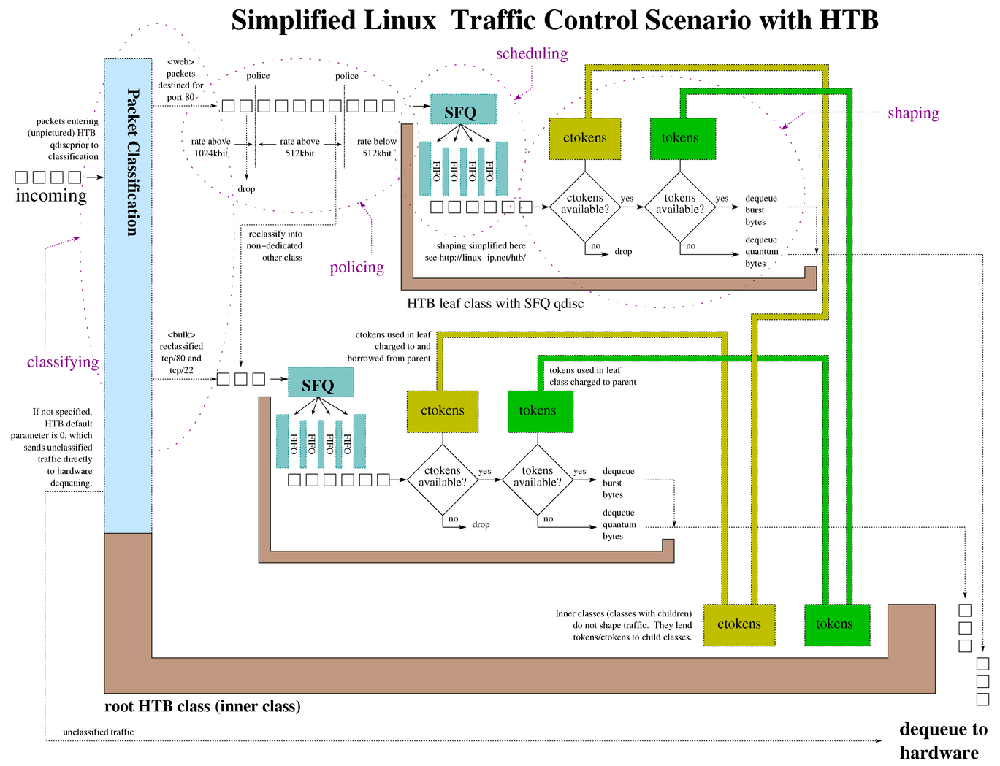

# 流量控制（Traffic Control，tc）

流控提供了一组机制和操作，使得数据包在网络接口上排队（传输/接收）。

这些操作包含了排队、监管、分类、调度、整形、丢弃。

## 一、基本概念

1. 队列（Queues）
	- 两个动作：入队、出队
2. 流量（Flows）
3. 令牌和桶（Tokens and buckets）
	- 桶是按照速率装满令牌的，如果令牌没有被使用，桶可以装满。如果使用令牌，则桶将不会填满
	- 常规流量可以由小桶处理，突发流量可能需要更大的桶
4. 数据包和帧（Packets and frames）
	- 帧实际上是进行流量控制的单位

## 二、传统元素

1. 整形（Shaping）
	- 整形是在输出队列中传输之前延迟数据包以满足所需输出速率的机制
2. 调度（Scheduling）
	- 调度是在特定队列的输入和输出之间排列（或重新排列）数据包的机制
3. 分类（Classifying）
    - 分类是将数据包分开以进行不同处理（可能是不同的输出队列）的机制
4. 监管（Policing）
	- 监管，只是一种可以限制流量的机制
5. 丢弃（Dropping）
	- 丢弃会丢弃整个数据包、流或分类
6. 标记（Marking）
	- 标记是一种改变数据包的机制
	- 这个不是`fwmark`。iptables的MARK是用来改变数据包的元数据，不是数据包本身
	- ❓不太明白区别是啥❓

## 三、组件

### qdisc (queuing discipline)

排队规则

`root qdisc`和`ingress qdisc`

### class

`class`只存在于`classful qdisc`中，可以包含多个子`class`或单个`qdisc`。

任何`class`也可以附加任意数量的`fitler`。

叶子`class`包含了一个`qdisc`，并且永远不会包含子`class`。

`class`和子`class`的类型必须一致。`HTB qdisc`只能将`HTB class`作为子级。

### fitler

过滤器

### classifier

分类器

### policer

监管器

### drop

唯一可以明确丢弃数据包的地方就是监管器。

此外，整形器和调度器可能不得不在突发或过载的情况下丢弃数据包。

### handle

句柄

每个`class`或`classful qdisc`都需要一个唯一标识符。称为句柄。

句柄有两个组成成员，主要编号（`major`）和次要编号（`minor`）。

共享一个父级的所有 `class` 都必须共享一个 主编号，拥有唯一的 次编号。

特殊句柄 `ffff:0` 是为 `ingress qdisc`保留的。

## 四、工具使用

### 内核编译选项

```shell
#
# QoS and/or fair queueing
#
CONFIG_NET_SCHED=y
CONFIG_NET_SCH_CBQ=m
CONFIG_NET_SCH_HTB=m
CONFIG_NET_SCH_CSZ=m
CONFIG_NET_SCH_PRIO=m
CONFIG_NET_SCH_RED=m
CONFIG_NET_SCH_SFQ=m
CONFIG_NET_SCH_TEQL=m
CONFIG_NET_SCH_TBF=m
CONFIG_NET_SCH_GRED=m
CONFIG_NET_SCH_DSMARK=m
CONFIG_NET_SCH_INGRESS=m
CONFIG_NET_QOS=y
CONFIG_NET_ESTIMATOR=y
CONFIG_NET_CLS=y
CONFIG_NET_CLS_TCINDEX=m
CONFIG_NET_CLS_ROUTE4=m
CONFIG_NET_CLS_ROUTE=y
CONFIG_NET_CLS_FW=m
CONFIG_NET_CLS_U32=m
CONFIG_NET_CLS_RSVP=m
CONFIG_NET_CLS_RSVP6=m
CONFIG_NET_CLS_POLICE=y
```

### tc 工具

```bash
[root@localhost]# tc                \   #
>                 qdisc add         \   # 添加一个排队规则，也可以是 del
>                 dev eth0          \   # 指定网口
>                 root              \   # 根
>                 handle 1:0        \   # 句柄
>                 htb                   # qdisc类型

[root@localhost]# tc                \   #
>                 class add         \   # 添加一个类，也可以是 del
>                 dev eth0          \   # 指定网口
>                 parent 1:1        \   # 指定父句柄
>                 classid 1:6       \   # 标识该class的句柄
>                 rate 256kbit      \   # 参数，分配给该class的速率，可借
>                 ceil 512kbit          # 参数，指定该class的上限速率，不可借

[root@localhost]# tc                        \   #
>                 filter add                \   # 添加一个过滤器，也可以是 del
>                 dev eth0                  \   # 指定网口
>                 parent 1:0                \   # 指定父句柄
>                 protocol ip               \   # 指定协议类型
>                 prio 5                    \   # 指定优先级
>                 u32                       \   # 指定分类器
>                 match ip port 22 0xffff   \   # 分类器参数，匹配端口22
>                 match ip tos 0x10 0xff    \   # 分类器参数，tos标志
>                 flowid 1:6                \   # 流ID
>                 police                    \   # 监管器
>                 rate 32000bps             \   # 监管器将根据此速率执行操作
>                 burst 10240               \   # 突发，空闲期间可以累积的最大字节数
>                 mpu 0                     \   # 监管的最小单位。用于统计所有流量
>                 action drop/continue      \   # 监管操作。超出监管时drop，否则continue
```

## 五、无类排队规则（classless qdisc）

这些是Linux下使用的基本调度程序。默认调度程序是`pfifo_fast`

### FIFO ( First-In First-Out )

### pfifo_fast

### SFQ ( Stochastic Fair Queuing )

### ESFQ ( Extended Stochastic Fair Queuing )

### GRED ( Generic Random Early Drop )

### TBF ( Token Bucket Filter )


## 六、有类排队规则（classful qdisc）

### HTB ( Hierarchical Token Bucket )

### HFSC ( Hierarchical Fair Service Curve )

### PRIO ( Priority Scheduler )

### CBQ ( Class Based Queuing )

## 七、源码分析

## 八、总结

