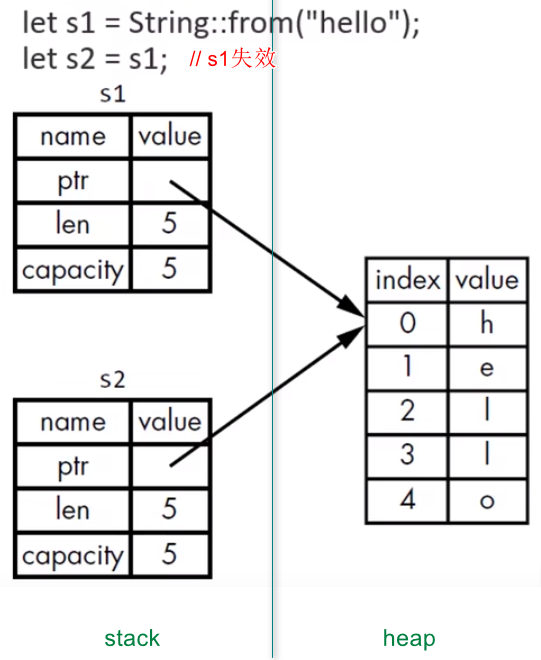
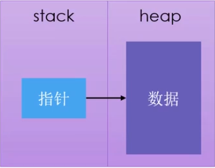

# 语言基础

## 1. 变量、常量、隐藏

- **`let`** 关键字：声明变量。
	1. 变量默认是不可变的 `Immutable`
	2. 加上**`mut`**，使变量可变

- **`const`** 关键字：声明常量。
	1. 不可以用 `mut`
	2. 必须标注类型
	3. 可以声明在任何作用域
	4. 只可以绑定到常量表达式

- **`Shadowing`** ：隐藏。
	1. 可以使用 `let` 声明 同名新变量，新的变量就会 `shadow` 之前声明的变量
	2. 新的变量，类型可以与之前不同

## 2. 数据类型：标量类型、复合类型

- 标量类型：
	1. 整数：`i8、u8、i16、u16、i32、u32、i64、u64、i128、u128、isize、usize`。默认类型是 `i32`
	> 整数溢出：
	> 	- debug编译：程序在运行时，如果发生溢出，会 panic；
	> 	- release编译：程序在运行时，如果发生溢出，会执行 “环绕” 操作，不会panic；
	3. 浮点：`f32、f64`。默认类型是 `f64`
	4. 布尔：`bool`；值为`true、false`；占用一个字节大小
	5. 字符：`char`；使用单引号；占用**4个字节**大小；是**Unicode标量值**

- 复合类型：
	1. 元组：支持多个类型的值放一起；长度是固定的；`let tup: (i32, f64, char) = (1, 2.0, 'a');`
	2. 数组：每个元素的类型必须相同；长度是固定的；存放在 **`stack`** 上；`let arr: [i32; 3] = [1,2,3];`，使用固定值初始化数组时 `let arr = [3; 5];`

## 3. 函数

- 语句（statement）：执行一些动作的指令
- 表达式（expression）：计算产生一个值
- 函数体：由一系列 `statement` 组成，可选的由一个 `expression` 结束；
- 返回值：`->` 符号后声明函数返回值类型；通常是函数体中最后一个表达式的值；提前返回需使用 `return` 关键字

## 4. 控制流

- `if else`：条件必须是 `bool` 类型
- `loop`
- `while`
- `for`：安全、简洁
- `Range`：`rev` 可以反转 `Range`，`for num in (1..4).rev()`
- `match`

## 5. 所有权

所有权是 `Rust 最核心`的特性，它使得 `Rust` 无需 `GC` 就可以保证内存安全。

所有权存在的原因，就是管理 `heap` 数据：

- 跟踪代码的哪些部分正在使用 `heap` 的哪些数据；
- 最小化 `heap` 上的重复数据量；
- 清理 `heap` 上未使用的数据以避免空间不足；

### 5.1. 所有权规则

- 每个值都有一个变量，这个变量是该值的所有者；
- 每个值同时只能有一个所有者；
- 当所有者超出作用域（scope）时，该值将被删除；

### 5.2. 内存和分配

- **当变量走出作用域时，Rust 会自动调用`drop`函数，将内存还给操作系统**；

- **移动（Move）**：


把 s1 赋值给 s2 , 为了保证内存安全：

	Rust只在 `stack` 上复制，没有在 `heap` 上复制；
	Rust让 s1 失效；

如果真的想对 `heap` 上的数据做 `深度拷贝`，可以使用 `clone` 方法。

- **复制**：
	- 如果一个类型实现了 `Copy trait`，那么旧的变量在赋值后仍然可用；
	- 如果一个类型或该类型的一部分实现了 `Drop trait`，那么 Rust 不允许让它再去实现 `Copy trait`；

**简单说，stack上的资源有copy trait，heap上的资源没有copy trait。**

一些拥有 Copy trait 的类型：

- 标量类型
- 元组，前提是所有字段都是copy的

### 5.3. 函数

- 值传递给函数时，将发生 **移动** 或 **复制**；
- 函数在返回值的过程中，同样会发生所有权的转移；

一个变量的所有权，总是遵循同样的模式：

- 把一个值赋给其他变量时，就会发生移动；
- 当一个包含 `heap` 数据的变量离开作用域时，它的值就会被 `drop` 函数清理，除非数据的所有权移动到另一个变量上了；

## 6. 引用和借用

- 引用：`&`符号，允许引用某些值而**不取得其所有权**；默认不可变的；
- 借用：把引用作为函数参数这个行为叫做借用；`fn calc_len(s: & String) -> usize`
- 可变引用：比如`mut & String`；**在特定作用域内，某块数据只能有一个可变引用。（避免竞争）**；
- **借用规则**：
	- 不可以同时拥有一个可变引用和一个不可变引用
	- 可以同时拥有多个不可变引用

## 7. 切片（slice）

切片（slice）：`&str`，也是一种**不持有所有权**的数据类型；

- 字符串切片的范围索引必须发生在有效的 UTF-8 字符边界内；
- 如果对一个**多字节的字符**中创建字符串切片，程序报错并退出；

## 8. 结构体（struct）

- 一旦 struct 的实例是可变的，那么实例中的所有字段都是可变的；

```rust
struct User {
    active: bool,
    username: String,
    email: String,
    sign_in_count: u64,
}

fn build_user(email: String, username: String) -> User {
    User { // 作为函数返回值
        active: true,
        username, // 简写
        email,    // 简写
        sign_in_count: 1,
    }
}

let u1 = build_user(String::from("joe@163.com"), String::from("joe"));

let u2 = User {
    email: String::from("tom@163.com"),
    username: String::from("tom"),
    ..u1   // struct 更新语法
};

// Tuple struct
// struct有名，但里面元素没名
struct Point(i32, i32, i32);
let origin = Point(4, 5, 6);

// Unit-Like struct
// 没有任何字段，适用于需要在某个类型上实现某个 trait，但里面有没有需要存储的数据
struct Solution;
```

- **方法**：在 `impl` 块定义方法；方法的第一个参数可以是 `&self`，也可以获得其所有权 或 可变借用；
- **关联函数**：在 `impl` 块定义，不把 `self` 作为第一个参数的函数；

```rust
#[derive(Debug)]
struct Rectangle {
    width: u32,
    height: u32,
}

impl Rectangle {
    // 方法
    fn area(&self) -> u32 {
        self.width * self.height
    }

    // 关联函数
    fn square(size: u32) -> Rectangle {
        Rectangle {
            width: size,
            height: size
        }
    }
}
```

## 9. 枚举（enum）

- 可以将数据附加到枚举的变体中
- 每个变体可以拥有不同的类型以及关联的数据量
- 使用`impl`为枚举定义方法

```rust
#[derive(Debug)]
enum Message {
    Quit,
    Move { x: i32, y: i32 },
    Write(String),
    ChangeColor(i32, i32, i32),
}

impl Message {
    fn call(&self) {
        println!("{:?}", self);
    }
}
```

Rust 提供了类似 `Null` 概念的枚举：`Option<T>`

- `Option<T>` 和 `T` 是不同的类型；
- 若需要使用`Option<T>`中的`T`，需要先转换；

```rust
enum Option<T> {
    Some(T),
    None,
}
```

## 10. match

- 允许一个值与一系列模式进行匹配，并执行匹配的模式对应的代码
- `模式`可以是字面值、变量名、通配符...
- 模式可以绑定值，比如从 enum 变体中提取值；
- match 匹配**必须穷举所有的可能**；如果不想处理，则使用 `_ 通配符`来替代其余值；

```rust
let x = Some(5);
match x {
    None => None,
    Some(i) => Some(i + 1),
}

let v = 0u8;
match v {
    1 => 1,
    3 => 3,
    5 => 5,
    _ => 999,
}
```

## 11. if let

- 只**关心一种匹配**而忽略其他匹配的情况；
- 放弃了穷举的可能；

```rust
let x = Some(5);
if let Some(5) = x {
    println!("five")
} else {
	println!("others")
}
```

## 12. Package、Crate、Module、Path

- `Crate`：
	- 两种类型：`binary`、`library`
	- `Crate Root`：指源代码入口文件
		- `src/main.rs`  ( binary )
		- `src/lib.rs`  ( library )

- `Package`：
	- `Cargo.toml`：描述了如果构建 `Crates`
	- 只能包含 `0-1` 个 `library crate`
	- 可以包含 `任意数量` 的 `binary crate`
	- 但必须至少包含一个 `crate`

- `Module`：在一个 `crate` 内，将代码进行分组
	- 控制作用域和私有性（public、private）
	- **`mod`** 关键字，可嵌套

- `Path`：
	- 两种形式：绝对路径（推荐）、相对路径
	- 标识符 `::`
	- **`super`** 关键字，用来访问父级模块路径中的内容，类似文件系统中的`..`

- `privacy boundary`：私有边界
	- Rust中所有条目（函数、方法、struct、enum、模块、常量）**默认是私有的**。
	- 父模块无法访问子模块的私有条目
	- 子模块可以使用所有祖先模块中的条目
	- **`pub`** 关键字标记条目为公共的

- **`pub struct`**：
	- `struct` 是公共的，但**里面的字段默认是私有的**
	- 里面的字段需要单独设置 `pub` 来变成公有的

- **`pub enum`**：
	- `enum` 是公共的，
	- **`enum` 的变体也都是公共的**

- **`use`**：将 `path` 导入到作用域内，（作用域内**私有**）
	- 函数：惯用做法是将函数的父级模块引入作用域（指定父级）
	- `struct、enum`：惯用做法指定完整路径（指定本省）（除非两个模块中的结构体名称相同）
	- **`as`** 关键字：可以给引入路径指定（本地）别名
	- **`pub use`**：重新导出名称
	- 可以使用 **嵌套路径** 清理大量的 `use` 语句
	- 支持通配符 `*`

```rust
// 嵌套路径
use std::{cmp::Ordering, io}
use std::io::{self, Write}
```

- **将模块内容移动到其他文件**
	- 模块名后面是 `;`
	- Rust 会从与模块同名的文件中加载内容

## 13. Vector、String、HashMap

- Vector

```rust
// Vector
let mut v: Vec<i32> = Vec::new();
let mut v1 = vec![1,2,3];
v.push(99);
v.get(0);
for item in  v {}
for (i, item) in v.iter().enumerate() {}

enum Cell {
    Int(i32),
    Float(f64),
    Text(String),
}
let row = vec![
    Cell::Int(1),
    Cell::Float(2.34),
    Cell::Text(String::from("red")),
]
```

- String：**字符串在Rust中使用 `UTF-8` 编码**
	- `String`  来自标准库
	- `&str` 字符串切片，来自Rust核心语言
	- 其他字符串类型：`OsString、OsStr、CString、CStr`
	- **Rust中字符串不支持索引语法访问**。原因：
		- 1. 不安全，越界问题；
		- 2. 索引操作应消耗O(1)，但String无法保证这个时间，因为需要遍历所有内容才能确定有多少合法字符；
	- `String` 是对 `Vec<u8>` 的包装
	- Rust中看待字符串有三种方式：
		- 字节（Bytes）
		- 标量值（Scalar Values）
		- 字形簇（Grapheme Clusters）
	- Rust中，**字符串中的字符所占的字节数是变化的**（**`1-4`个字节**）
	- 切割字符串，必须谨慎使用，**如果跨越了字符边界，程序就会panic**。

```rust
let blue = "Blue".to_string();
let mut red = String::from("Red");
red.push_str("black");
red.push_str(&blue);  // 附加字符串切片
red.push('😂');      // 附加单个字符

let color = red + &blue; // fn add(self, s: &str) -> String
// 注意：red发生了移动，所有权进行了转移，后续无法继续使用

let s = format!("{}-{}", "foo", "bar");

// 字符串是 UTF-8 编码
println!("{}", "a".len());  // 打印 1
println!("{}", "д".len());  // 打印 2
println!("{}", "व".len());  // 打印 3
println!("{}", "😂".len()); // 打印 4

// 遍历
for i in color.chars() {}  // 想得到 标量值
for i in color.bytes() {}  // 想得到 字节
```

- HashMap
	- 在元素类型为 `Tuple`（两个值） 的 `Vector` 上使用 `collect`方法，可以组建一个 `HashMap` 
	- **所有权**：
		- **对于实现了 `Copy trait` 的类型，值会被复制到 `HashMap` 。**比如 `i32` 
		- **对于拥有所有权的值，值会被移动，所有权会转移给 `HashMap` 。**比如 `String` 
		- 如果将**值的引用**插入到 `HashMap` ，值本身不会移动；但这期间必须保持引用的值有效
	- **Hash函数**：
		- 默认情况下的hash函数，可以抵抗Dos攻击，安全性更好，但不是最快的算法；
		- 可以指定不同的 `hasher` （指实现了 `BuildHasher trait` 的类型）来切换；

```rust
let mut map: HashMap<i32, String> = HashMap::new();
map.insert(10, String::from("red"));
let v = map.get(&10);
match v {
    None => println!("not exist"),
    Some(s) => println!("{}", s),
}

let color = vec![String::from("red"), String::from("blue")];
let nums = vec![100, 200];
let mut map: HashMap<_, _> = color.iter().zip(nums.iter()).collect();
for (k,v) in &map {
    println!("{}: {}", k, v)
}
map.entry(&String::from("black")).or_insert(&300); // key不存在，则插入

let text = "hello world wonderful world";
let mut map = HashMap::new();
for word in text.split_whitespace() {
    let count = map.entry(word).or_insert(0);
    *count += 1;
}
println!("{:#?}", map);
// entry方法：返回 enum Entry，代表值是否存在
// or_insert方法：
//        如果 key 存在，返回 value 的可变引用；
//        如果 key 不存在，将新键值(k,v)插进去，返回 value 的可变引用；
```

## 14. 错误处理

- 可恢复：`Result<T, E>`
- 不可恢复：`panic!` 宏

**panic：**

- 默认情况下，当 panic 发生时，程序会 **展开（unwind）** 调用栈；（Rust沿调用栈往回走，清理每一个遇到的数据）
- 想让二进制文件更小，可以把这一行为改为 **立即中止（abort）** 调用栈；（由OS进行清理）
	- 在Cargo.toml中设置：
```toml
[profile.release]
panic = 'abort'
```
- 回溯信息：设置环境变量 `RUST_BACKTRACE`；debug模式；

**Result枚举：**

```rust
enum Result<T, E> {
    Ok(T),
    Err(E),
}
```

**错误处理：**

- **`match`**
- **`unwrap`**：match表达式的一个快捷方式；
- **`expect`**：可指定错误信息

```rust
let f = File::open("hello.ext").unwrap();
let f = File::open("hello.ext").expect("cannot open file");
```

**传播错误：**

- **`?` 运算法**：传播错误的快捷方式
- **`from` 函数**：用于错误之间的转换；场景：针对不同的错误原因，返回同一种错误类型；
	- 要求：每个错误类型都实现了转换为所返回的错误类型的from函数；
- **`main` 函数**的返回类型是 `()`，`main` 函数的返回类型也可以是 `Result<T, E>`
	- main 返回类型写：`Result<(), Box<dyn Error>>`
	- `Box<dyn Error>` 是 trait 对象，表示任何可能的错误类型；

```rust
fn open_file() -> Result<String, io::Error> {
    let f = File::open("hello.ext")?;
    Ok(String::from("ok"))
}

fn read_file() -> Result<String, io::Error> {
    let mut s = String::new();
    File::open("hello.ext")?.read_to_string(&mut s)?;
    Ok(s)
}
```

## 15. 泛型

- 使用泛型的代码和使用具体类型的代码运行速度是一样的。
- 单态化（monomorphization）：在编译时将泛型替换为具体类型

```rust
// 函数
fn largest<T>(list: &[T]) -> T {}

// 结构体
struct Point<T, U> {
    x: T,
    y: U,
}

// 枚举
enum Result<T, E> {
    Ok(T),
    Err(E),
}

// 方法
impl<T, U> Point<T, U> {
    fn mixup<V, W>(self, other: Point<V, W>) -> Point<T, W> {}
}
```

## 16. Trait

- 类似`Interface`，抽象的定义共享行为
- `Trait bounds`：泛型类型参数指定为实现了特定行为的类型
- `trait` 可以有多个方法，每个方法签名占一行；
- 实现该 `trait` 的类型必须提供具体的方法实现；
- 实现 `trait` 的约束：**这个类型 或 这个 trait 是在本地 `crate` 里定义的**，所以**无法为外部类型来实现外部的 trait**；
- 可以在 `trait` 里面定义**默认实现的方法**；**默认实现的方法可以调用 trait 中其他的方法，即使这个方法没有默认实现**；
- **无法从方法的重写实现里面调用默认的实现**；
- `trait` 可以**作为参数**，三种写法：1. impl、2. trait bound、3. trait bound where
- `trait` 可以**作为返回类型**；
	- **`impl Trait` 只能返回一种确定的类型**，返回可能不同的类型会报错；
- 可以使用`Trait bound` **有条件的实现方法**
- **覆盖实现（blanket implementations）**：可以为满足`Trait bounds`的所有类型上实现`trait`

```rust
// 定义 trait
pub trait Summary {
    fn summarize(&self) -> string;

    fn summarize_default(&self) -> string {
        format!("default {}", self.summarize())
    }
}

pub struct NewsArticle {...}

// 实现 trait
impl Summary for NewsArticle {
    fn summarize(&self) -> string {
        format!("{}", "article")
    }
}

// trait 作为参数
pub fn notify(item: impl Summary) {
    println!("news {}", item.summarize())
}
// 要求 item 实现了多个 trait
pub fn notify1(item: impl Summary + Display) {
    println!("news {}", item.summarize())
}

// Trait bound 写法
pub fn notify<T: Summary + Display>(item1: T, item2: T) {
    println!("news {}", item.summarize())
}

// Trait bound 使用 where
pub fn notify<T, U>(a: T, b: U) -> string
where
    T: Summary + Display,
    U: Clone + Debug,
{
    println!("news {}", item.summarize())
}

// trait 作为返回类型
pub fn notify(s: &str) -> impl Summary {
    NewsArticle {...}
}

// Trait bound 有条件的实现方法
struct Pair<T> {
    x: T,
    y: T,
}
impl<T> Pair<T> {
    // 所有的Pair类型，都有new函数
    fn new(x: T, y: T) -> self{
        Self { x, y }
    }
}
impl<T: Display + PartialOrd> Pair<T> {
    // 只有实现了(Display+PartialOrd)这两个trait的Pair类型，才拥有cmp函数
    fn cmp(&self) {...}
}

// 标准库 string.rs 中，使用了覆盖实现
// 为所有实现了Display这个trait的类型T，实现ToString这个trait
impl<T: Display> ToString for T {
    default fn to_string(&self) -> string {}
}
```

## 17. 生命周期

- Rust 的每个引用都有自己的生命周期
- 生命周期：引用保持有效的作用域
- 大多数情况下，生命周期是隐式的、可被推断的；当无法被编译器推断时，需要手动标注生命周期
- 生命周期存在的主要目标：避免悬垂引用（dangling reference）
- 借用检查器：比较作用域来判断所有的借用是否合法
- 生命周期的标注不会改变引用的生命周期长度
- 当指定了泛型生命周期参数，函数可以接收带有任何生命周期的引用
- 生命周期的标注：描述了多个引用的生命周期的关系，但不影响生命周期
- 静态生命周期：整个程序的持续时间。`let s: &'static str = "hello";`

```rust
fn longest<'a>(x: &'a str, y: &'a str) -> &'a str {
	if x > y {
		x
	} else {
		y
	}
}

struct ImportantExcerpt<'a> {
	part: &'a str,
}

impl<'a> ImportantExcerpt<'a> {
	fn level(&self) -> i32 {
		3
	}
}

fn longest_with_an_annoucement<'a, T>
    (x: &'a str, y: &'a str, ann: T) -> &'a str
where
    T: Display,
{
	println!("Announcement! {}", ann)
	if x > y {
		x
	} else {
		y
	}
}
```

生命周期省略规则：

- 编译器考虑的一些特殊情况，无需显示标注
- 如果编译器无法推断，则编译错误
- 输入生命周期：函数/方法的参数
- 输出生命周期：函数/方法的返回值
- 规则适用于 fn 定义和 impl 块

三个省略规则：

1. 每个引用类型的参数都有自己的生命周期；
2. 如果只有 1 个输入生命周期参数，那么该生命周期被赋给所有的输出生命周期参数；
3. 如果有多个输入生命周期参数，但其中一个是 &self 或 &mut self（方法），那么 self 的生命周期会被赋给所有的输出生命周期参数；


## 18. 测试

- 测试：`#[cfg(test)]`、`#[test]`
- 断言：`assert!`、`assert_eq!`、`assert_ne!`
- 恐慌：`#[should_panic]`
- 可使用 `Result<T, E>` 作为返回类型
- 默认 `cargo test` 并行运行测试，控制线程数量 `--test-threads`
- 测试通过，不会看到打印到标准输出的内容；否则可以看到
- 指定测试名称运行测试：`cargo test test-name`
- 忽略测试：`#[ignore]`
- 只运行被忽略的测试：`cargo test -- --ignored`
- 集成测试：`tests`目录
- 环境变量：`env::var("xx")`
- 标准输出：`println!`
- 标准错误：`eprintln!`

## 19. 闭包

- 匿名函数，可以保存为变量、作为参数
- 闭包不要求标注参数和返回值的类型，编译器通常能推断出类型；但也可以手动添加类型标注
- 记忆化（memoization）：创建一个 struct，**它持有闭包及其调用结果**
	- struct 中需要指明闭包的类型
	- **每个闭包实例都有自己唯一的匿名类型**，即使两个闭包签名完全一样
	- 需要使用：**泛型和 Trait Bound**
- **所有的闭包都至少实现了以下 trait 之一**：
	- Fn
	- FnMut
	- FnOnce
- **闭包可以访问定义它的作用域内的变量，而普通函数则不能**
	- 会产生内存开销
	- 闭包从所在环境中捕获值的方式：
		- 取得所有权：FnOnce
		- 可变借用：FnMut
		- 不可变借用：Fn
	- Rust如何推断具体使用哪个 trait：
		- 所有的闭包都实现了 FnOnce
		- 没有移动捕获变量的实现了 FnMut
		- 无需可变访问捕获变量的闭包实现了 Fn
- `move` 关键字：**可以强制闭包取得它所使用的环境值的所有权**
	场景：当将闭包传递给新线程以移动数据使其归新线程所有时
- 最佳实践：当指定 Fn trait bound 之一时，首先用 Fn，基于闭包体里的情况，编译器会再告诉你需要使用 FnOnce 或 FnMut

```rust
let c1 = |x: u32| -> u32 { x + 1 };
let c2 = |x| { x + 1 };
let c3 = |x| x + 1;

let x = vec![1,2,3];
let eq_x = move |z| z == x;
// x 已发生移动，这后面无法再使用x
```

```rust
struct Cacher<T>
where
    T: Fn(u32) -> u32,
{
    calculation: T,
    map: HashMap<u32, u32>,
}

impl<T> Cacher<T>
where
    T: Fn(u32) -> u32,
{
    fn new(calculation: T) -> Cacher<T> {
        Cacher {
            calculation,
            map: HashMap::new(),
        }
    }

    fn value(&mut self, key: u32) -> u32 {
        let v = self.map.get(&key);
        match v {
            Some(i) => *i,
            None => {
                let calc = (self.calculation)(key);
                self.map.insert(key, calc);
                calc
            }
        }
    }
}

fn main() {
    let mut closure = Cacher::new(|num| {
        println!("calculation slowly...");
        thread::sleep(Duration::from_secs(2));
        num
    });

    println!("one {}", closure.value(99));
    println!("two {}", closure.value(99));
    println!("three {}", closure.value(99));
    println!("one {}", closure.value(100));
    println!("two {}", closure.value(100));
}
```

## 20. 迭代器

- 所有的迭代器都实现了 `Iterator trait`
	- 实现 `Iterator trait` 需要定义个 Item 类型，它用于 next 方法的返回类型
	- next 每次返回迭代器中的一项，返回结果包裹在 Some 里，迭代结束则返回 None
- `iter` 方法：在不可变引用上创建迭代器
- `into_iter` 方法：创建的迭代器会获得所有权
- `iter_mut` 方法：迭代可变的引用
- 消耗迭代器的方法：next、sum等
- 迭代器适配器：把迭代器转换为不同种类的迭代器；比如 map、filter

```rust
pub trait Iterator {
	type Item;
	fn next(&mut self) -> Option<Self::Item>;
}

let v1 = vec![1, 3, 4, 6, 7, 9, 10];
let it = v1.iter().filter(|x| *x % 2 == 0);
```

```rust
struct Counter {
    count: u32,
}

impl Counter {
    fn new() -> Counter {
        Counter { count: 0 }
    }
}

impl Iterator for Counter {
    type Item = u32;

    fn next(&mut self) -> Option<Self::Item> {
        if self.count < 5 {
            self.count += 1;
            Some(self.count)
        } else {
            None
        }
    }
}

fn main() {
    let s: u32 = Counter::new()
        .zip(Counter::new().skip(1))
        .map(|(a, b)| a * b)
        .filter(|x| x % 3 == 0)
        .sum();

    println!("{}", s);
}
```

## 21. 发布

Cargo 主要有两个 profile：

- dev profile：适用于开发，cargo build
- release profile：适用于发布，cargo build --release

自定义 profile时，在 `Cargo.toml` 里添加 `[profile.xxx]` 区域，覆盖默认配置的子集。

crate 官方注册表：`https://crates.io` 

- 登录账号：cargo login [token]
- 发布：cargo publish （一旦发布，该版本代码无法覆盖，无法删除）
- 撤回一个版本：cargo yank --vers 1.0.1 
- 取消撤回：cargo yank --vers 1.0.1 --undo
- 安装二进制 crate：cargo install

文档注释：生成HTML文档；使用 `///` ；支持 Markdown

- `cargo doc`、`cargo dock --open`：生成在 `target/doc` 目录下
- 常用章节：
	- `# Examples`：cargo test 可以把文档注释中的示例代码作为测试来运行
	- `# Panics`：函数可能发生 panic 
	- `# Errors`：如果函数返回 Result，描述可能的错误种类，以及可导致错误的条件
	- `# Safety`：如果函数处于 unsafe 调用，就应该解释函数 unsafe 的原因，以及调用者确保的使用前提

如果是描述 crate 和模块的注释，或记录一个模块整体，使用 `//!`

使用 `pub use` 导出方便使用的公共 API

工作空间：

- 管理多个关联且需协同开发的crate
- 就是一套共享同一个 Cargo.lock 和输出文件夹的包
- 工作空间内所有crate使用的依赖的版本都是相同的

自定义命令扩展 cargo：

- cargo install
- 二进制 cargo-abc；运行命令`cargo abc`
- cargo --list

## 22. 智能指针

- 智能指针：行为跟指针类似；有额外的元数据和功能；
- 引用计数智能指针：
	1. 通过记录所有者的数量，使一份数据被多个所有者同时持有
	2. 在没有任何所有者时自动清理数据
- 实现智能指针：
	1. 通常使用 struct 实现，且实现了 `Deref` 和 `Drop` 这两个 trait
	2. `Deref trait`：允许智能指针 struct 的实例像引用一样使用
	3. `Drop trait`：允许你自定义当智能指针实例走出作用域时的代码

比如：`String` 和 `Vec<T>` 就是智能指针。

### 22.1. `Box<T>`

`Box<T>`是最简单的智能指针：

- 在heap上存储数据
- 在stack上存储指向heap数据的指针
- 没有性能开销和其他额外功能
- 实现了`Deref` 和 `Drop` 两个 trait



使用场景：

- 在编译时，某类型的大小无法确定。但使用该类型时，上下文却需要知道它的确切大小。
- 当有大量数据，想移交所有权，但需要确保在操作时数据不会被复制。
- 使用某个值时，你只关心它是否实现了特定的 trait，而不关心它的具体类型。

```rust
let b = Box::new(5);
println!("b = {}", b);

enum List {
    Cons(i32, Box<List>),
    Nil,
}
let list = Cons(1, Box::new(Cons(2, Box::new(Cons(3, Box::new(Nil))))));
```

### 22.2. Deref Trait

实现 Deref Trait：

- 使我们可以**自定义解引用运算符 `*` 的行为**
- 使得智能指针可像常规引用一样来处理
- 要求：**实现一个 `deref` 方法**
	1. **该方法借用 `self`**
	2. **返回一个指向内部数据的引用**

`Box<T>` 被定义成拥有一个元素的 `tuple struct`

```rust
use std::ops::Deref;

struct MyBox<T>(T);

impl<T> MyBox<T> {
    fn new(x: T) -> MyBox<T> {
        MyBox(x)
    }
}

impl<T> Deref for MyBox<T> {
    type Target = T;
    fn deref(&self) -> &Self::Target {
        &self.0
    }
}

fn main() {
    let x = 5;
    let y = MyBox::new(x);

    assert_eq!(5, x);
    assert_eq!(5, *y); // 相当于 *(y.deref())
}
```

函数和方法的**隐式解引用转化（Deref Coercion）**：

- Deref Coercion 是为函数和方法提供的一种便捷特性；
- 假设 T 实现了Deref Trait，那么Deref Coercion 可以把 **T 的引用** 转化为** T 经过 Deref 操作后生成的引用**；
- 当把某类型的引用传递给函数或方法时，但它的类型和定义的参数类型不匹配，**Deref Coercion 就会自动发生**；**编译器会对 deref 进行一系列调用，来把它转为所需的参数类型**；（没有额外性能开销）

```rust
fn hello(name: &str) {
    println!("Hello, {}", name)
}

let name = MyBox::new(String::from("Rust"));
hello(&name);
```

解引用与可变性，下面三种情况发生时，Rust 会执行 Deref Coercion：

- 当 `T: Dreft<Target=U>`，允许 `&T` 转换为 `&U`
- 当 `T: DreftMut<Target=U>`，允许 `&mut T` 转换为 `&mut U`
- 当 `T: Dreft<Target=U>`，允许 `&mut T` 转换为 `&U`

### 22.3. Drop Trait

- 自定义** 当值将要离开作用域时发生的动作**；
- 任何类型都可以实现 Drop Trait；
- 要求：实现 `drop` 方法，参数为对 `self` 的**可变引用**；
- **不允许显示的调用 `drop` 方法**；但可以调用标准库中的 **`std::mem::drop` 函数**，来提前 drop 值；

```rust
struct SmartPointer {
    data: String,
}

impl Drop for SmartPointer {
    fn drop(&mut self) {
        println!("Dropping data {}", self.data);
    }
}

let p1 = SmartPointer {
    data: String::from("one"),
};
std::mem::drop(p1);
let p2 = SmartPointer {
    data: String::from("two"),
};
```

### 22.4. `Rc<T>`

- 为了支持多重所有权，引入`Rc<T>`
- `Rc<T>` 通过**不可变引用**，使得在程序不同地方可以共享只读数据
- reference couting（引用计数）
- 追踪所有到值的引用
- 当0个引用时，该值可以被清理掉
- `Rc::clone(&a)` 增加引用计数，不会执行数据的深度拷贝
- `Rc::strong_count(&a)` 获得引用计数（强引用）
- `Rc::weak_count(&a)` 获得引用计数（弱引用）
- 使用场景：
	1. 需要在heap上分配数据，数据被程序的多个地方读取（只读），但在编译时无法确定哪个部分最后使用完这些数据；
	2. 只能用于**单线程**场景

```rust
enum List {
    Cons(i32, Rc<List>),
    Nil,
}

fn main() {
    let a = Rc::new(Cons(5, Rc::new(Cons(10, Rc::new(Nil)))));
    println!("count after creating a = {}", Rc::strong_count(&a));

    let b = Cons(3, Rc::clone(&a));
    println!("count after creating b = {}", Rc::strong_count(&a));

    {
        let c = Cons(4, Rc::clone(&a));
        println!("count after creating c = {}", Rc::strong_count(&a));
    }
    println!("count after c goes out of scope = {}", Rc::strong_count(&a));
}
```

### 22.5. `RefCell<T>`

内部可变性（interior mutability）：**可变的借用一个不可变的值**。Rust设计模式之一，它**允许你在只持有不可变引用的前提下对数据进行修改**。（数据结构中使用了 unsafe 代码来绕过 Rust 正常的可变性和借用规则）

- `RefCell<T>` 类型代表了其持有数据的唯一所有权
- 只能用于**单线程**场景
- `RefCell<T>` 会记录当前存在多少个活跃的`Ref<T>`和`RefMut<T>`智能指针
- `borrow`方法：返回智能指针 `Ref<T>`，它实现了Deref
	- 每次调用，不可变借用计数加 1；
	- 任何一个`Ref<T>`的值离开作用域时，不可变借用计数减 1；
- `borrow_mut`方法：返回智能指针 `RefMut<T>`，它实现了Deref
	- 每次调用，可变借用计数加 1；
	- 任何一个`RefMut<T>`的值离开作用域时，可变借用计数减 1；
- 其他可实现内部可变性的类型：
	- `Cell<T>`：通过复制来访问数据
	- `Mutex<T>`：用于实现跨线程情形下的内部可变性模式

```rust
#[derive(Debug)]
enum List {
    Cons(Rc<RefCell<i32>>, Rc<List>),
    Nil,
}

fn main() {
    let value = Rc::new(RefCell::new(5));
    let a = Rc::new(Cons(Rc::clone(&value), Rc::new(Nil)));
    let b = Cons(Rc::new(RefCell::new(6)), Rc::clone(&a));
    let c = Cons(Rc::new(RefCell::new(10)), Rc::clone(&a));

    *value.borrow_mut() += 10;

    println!("a = {:?}", a);
    println!("b = {:?}", b);
    println!("c = {:?}", c);
}
```

### 22.6. `Box<T> vs Rc<T> vs RefCell<T>`


### 22.7. 循环引用导致内存泄漏

使用`Rc<T>`和`RefCell<T>`可以创造出循环引用，从而发生内存泄漏；（每个项的引用数量不会变成0，值不会被清理掉）

防止内存泄漏的解决方法：

- 依靠开发者保证；
- 重新组织数据结构：一些引用来表达所有权，一些引用不表达所有权
- **把`Rc<T>`换成`Weak<T>`**
	- `Rc<T>`的实例只有在 strong_count 为 0 时才会被清理；
	- `Rc<T>`使用 weak_count 来追踪存在多少`Weak<T>`，**weak_count不为0并不影响`Rc<T>`实例的清理**；

强弱引用：

- Stong Reference（强引用）是关于如何分享 `Rc<T>`实例的所有权；
- Weak Reference（弱引用）并不会创建循环引用，当Stong Reference数量为0时，Weak Reference会自动断开；
- 在使用`Weak<T>`前，需要保证它指向的值仍然存在；（在`Weak<T>`实例上调用 upgrade 方法，返回`Option<Rc<T>>`）

```rust
#[derive(Debug)]
struct Node {
    value: i32,
    parent: RefCell<Weak<Node>>,
    children: RefCell<Vec<Rc<Node>>>,
}

fn main() {
    let leaf = Rc::new(Node {
        value: 3,
        parent: RefCell::new(Weak::new()),
        children: RefCell::new(vec![]),
    });

    println!("leaf parent = {:?}", leaf.parent.borrow().upgrade());
    println!(
        "leaf:   strong = {}, weak = {}",
        Rc::strong_count(&leaf),
        Rc::weak_count(&leaf)
    );

    {
        let branch = Rc::new(Node {
            value: 5,
            parent: RefCell::new(Weak::new()),
            children: RefCell::new(vec![Rc::clone(&leaf)]),
        });

        *leaf.parent.borrow_mut() = Rc::downgrade(&branch);
        println!("leaf parent = {:?}", leaf.parent.borrow().upgrade());

        println!(
            "leaf:   strong = {}, weak = {}",
            Rc::strong_count(&leaf),
            Rc::weak_count(&leaf)
        );
        println!(
            "branch: strong = {}, weak = {}",
            Rc::strong_count(&branch),
            Rc::weak_count(&branch)
        );
    }

    println!("leaf parent = {:?}", leaf.parent.borrow().upgrade());
    println!(
        "leaf:   strong = {}, weak = {}",
        Rc::strong_count(&leaf),
        Rc::weak_count(&leaf)
    );
}
```

## 23. 并发

线程模型：

- 调用OS的API来创建线程：1:1模型
- 语言自己实现的线程（绿色线程）：M:N模型

Rust 标准库仅提供 1:1 模型的线程。（第三方包会有M:N模型）

创建新线程：

- **`thread::spawn`**，参数为一个闭包
- **`move`** 闭包，把值的所有权从一个线程转移到另一个线程

```rust
let v = vec![1, 2, 3];
let handle = thread::spawn(move || {
    println!("vector {:?}", v);
});
handle.join().unwrap();
```

**消息传递：**

- **`channel`**：包含发送端和接收端；
- 如果发送端、接收端中任意一端被丢弃了，那么 channel 就 关闭 了；
- **`mpsc::channel`**，创建 channel，返回一个 tuple，里面元素分别是发送端和接收端；
	- `mpsc`表示 multiple producer, single consumer（多个生产者，一个消费者）
- **`recv`**：阻塞当前线程，直到 channel 有数据到来；
	- 返回 `Result<T, E>`，当发送端关闭，就会收到一个错误；
- **`try_recv`**：不会阻塞，立即返回 `Result<T, E>`
	- 有数据到来，返回 Ok，里面包含着数据；
	- 否则，返回错误
- **`mpsc::Sender::clone(&tx)`**：可以通过 clone 创建多个发送者

```rust
let (tx, rx) = mpsc::channel();

thread::spawn(move || {
    tx.send(String::from("one")).unwrap();
    tx.send(String::from("two")).unwrap();
    tx.send(String::from("three")).unwrap();
});

for received in rx {
    println!("Got {}", received);
}
```

**共享状态：**

- Rust 支持通过共享状态来实现并发；
- channel 类似单所有权，一旦将值的所有权转移至 channel，就无法使用它了；
- 共享内存并发类似多所有权，多个线程可以同时访问同一块内存；
- **`mutex`：通过锁定系统来保护它所持有的数据。**`mutual exclusion`（互斥锁）
	- `Mutex::new`：返回`Mutex<T>`;
	- `lock`：会阻塞当前线程，返回`MutexGuard`（实现了Deref和Drop）;
	- `Mutex<T>`提供了内部可变性，和 Cell 家族一样；
- **`Arc<T>`**：与`Rc<T>`不同的是，`Arc<T>`用于并发场景，可进行原子引用计数；
	- 可以使用`RefCell<T>`来改变`Rc<T>`里面的内容；
	- 可以使用`Mutex<T>`来改变`Arc<T>`里面的内容；
- 风险：
	- `Rc<T>`和`RefCell<T>`使用可能有内存泄漏的风险；
	- `Mutex<T>`也有死锁的风险；

```rust
let c = Arc::new(Mutex::new(0));
let mut handles = vec![];

for _ in 0..10 {
    let cc = Arc::clone(&c);
    let handle = thread::spawn(move || {
        let mut num = cc.lock().unwrap();
        *num += 1;
    });
    handles.push(handle);
}

for handle in handles {
    handle.join().unwrap();
}

println!("Result: {}", *c.lock().unwrap());
```

**扩展并发**：

- 两个 Trait：`std::marker::Sync`和`std::marker::Send`；
- **`Send`：实现了`Send` trait的类型可在线程间转移所有权；**
	- `Rc<T>`没有实现 Send，所以只用于单线程场景；
- **`Sync`：实现了`Sync` trait的类型可以安全的被多个线程引用；**
	- 基础类型都是 Sync 的；
	- 完全由 Sync 类型组成的类型也是 Sync 的；
	- `Rc<T>`、`RefCell<T>`、`Cell<T>`不是Sync的；
	- `Mutex<T>` 是 Sync的；
- **手动实现`Send`和`Sync`是不安全的；**

## 24. 面向对象

- Rust是面向对象的；
	- struct、enum包含数据；impl块为之提供方法；
- 封装：Rust里提供 **pub 关键字** 来决定代码是否公开；
- 继承：Rust没有继承；
	- 代码复用：Rust通过 **默认 trait 方法** 来进行代码共享；
	- 多态：Rust通过 **泛型和trait约束** 来实现多态；
- 使用 trait 对象，执行的是动态派发（dynamic dispatch），会产生运行时开销；
- trait 对象必须保证对象安全，Rust有一系列规则来判定对象是否安全：
	- 方法的返回类型不是 Self
	- 方法中不包含任何泛型类型参数

## 25. 模式

Rust中的一种特殊语法，用于匹配复杂和简单类型的结构。模式由以下元素组成：字面值、enum、struct、tuple、变量、通配符、占位符。**想要使用模式，需要将其与某个值进行比较。**

举例：`match`、`if let`、`while let`、`for (k, v)`、`let (x, y, z)`、函数参数等

模式有两种形式：

- **无可辩驳的**：能匹配任何可能传递的值的模式；比如`let x = 5`。
- **可辩驳的（rufutable）**；某些情况，无法进行匹配的模式；比如`if let Some(x) = a`（a可能为空）。

- `函数参数`、`let 语句`、`for 循环` 只接受无可辩驳的模式；
- `if let`、`while let` 接受可辩驳和无可辩驳的模式；

模式使用语法：

1. 匹配字面值
2. 匹配命名变量
3. 多重模式
4. 使用..=匹配某个范围的值
5. 解构struct、enum、tuple，来得到值
6. 在模式中忽略值
7. 在模式中使用match guard（match守卫）
8. 使用@绑定，可以在测试某个值是否与模式匹配的同时，保存值到变量中

```rust
fn main() {
    // 1. 匹配字面值
    let x = 1;

    match x {
        1 => println!("one"),
        _ => println!("any"),
    }

    // 2. 匹配命名变量
    let x = Some(5);
    let y = 10;

    match x {
        Some(50) => println!("Got 50"),
        Some(y) => println!("Matched, y = {}", y), // 这里表示匹配任何值，y是一个新的变量，绑定到被Some包裹的任何值
        _ => println!("any"),
    }

    // 3. 多重模式
    let x = 1;

    match x {
        1 | 2 => println!("one or two"),
        _ => println!("anything"),
    }

    // 4. 使用..=匹配某个范围的值
    let x = 5;

    match x {
        1..=5 => println!("one through five"),
        _ => println!("something else"),
    }

    // 5. 解构struct、enum、tuple，来得到值
    struct Point {
        x: i32,
        y: i32,
    }
    let p = Point { x: 0, y: 7 };
    let Point { x, y } = p;
    assert_eq!(0, x);
    assert_eq!(7, y);

    match p {
        Point { x, y: 0 } => println!("On the x axis at {x}"),
        Point { x: 0, y } => println!("On the y axis at {y}"),
        Point { x, y } => println!("On neither axis: ({x}, {y})"),
    }

    enum Message {
        Quit,
        Move { x: i32, y: i32 },
        Write(String),
        ChangeColor(i32, i32, i32),
    }
    let msg = Message::ChangeColor(0, 160, 255);
    match msg {
        Message::Quit => {
            println!("The Quit variant has no data to destructure.");
        }
        Message::Move { x, y } => {
            println!("Move in the x direction {x} and in the y direction {y}");
        }
        Message::Write(text) => {
            println!("Text message: {text}");
        }
        Message::ChangeColor(r, g, b) => {
            println!("Change the color to red {r}, green {g}, and blue {b}",)
        }
    }

    enum Color {
        Rgb(i32, i32, i32),
        Hsv(i32, i32, i32),
    }
    enum Message2 {
        Quit,
        Move { x: i32, y: i32 },
        Write(String),
        ChangeColor(Color),
    }
    let msg = Message2::ChangeColor(Color::Hsv(0, 160, 255));
    match msg {
        Message2::ChangeColor(Color::Rgb(r, g, b)) => {
            println!("Change color to red {r}, green {g}, and blue {b}");
        }
        Message2::ChangeColor(Color::Hsv(h, s, v)) => {
            println!("Change color to hue {h}, saturation {s}, value {v}")
        }
        _ => (),
    }

    let ((feet, inches), Point { x, y }) = ((3, 10), Point { x: 3, y: -10 });

    // 6. 在模式中忽略值
    fn foo(_: i32, y: i32) {
        println!("This code only uses the y parameter: {}", y);
    }
    foo(3, 4);

    let mut setting_value = Some(5);
    let new_setting_value = Some(10);
    match (setting_value, new_setting_value) {
        (Some(_), Some(_)) => {
            println!("Can't overwrite an existing customized value");
        }
        _ => {
            setting_value = new_setting_value;
        }
    }
    println!("setting is {:?}", setting_value);

    let _x = 5; // 忽略未使用的变量
    let y = 10;

    struct Point2 {
        x: i32,
        y: i32,
        z: i32,
    }
    let origin = Point2 { x: 0, y: 0, z: 0 };
    match origin {
        // 使用 .. 来忽略值的剩余部分
        Point2 { x, .. } => println!("x is {}", x),
    }

    let numbers = (2, 4, 8, 16, 32);
    match numbers {
        (first, .., last) => {
            println!("Some numbers: {first}, {last}");
        }
    }

    // 7. 在模式中使用match guard（match守卫）
    let num = Some(4);
    match num {
        Some(x) if x % 2 == 0 => println!("The number {} is even", x),
        Some(x) => println!("The number {} is odd", x),
        None => (),
    }

    // 8. 使用@绑定，可以在测试某个值是否与模式匹配的同时，保存值到变量中
    enum Message3 {
        Hello { id: i32 },
    }
    let msg = Message3::Hello { id: 5 };
    match msg {
        Message3::Hello {
            id: id_variable @ 3..=7,
        } => println!("Found an id in range: {}", id_variable),
        Message3::Hello { id: 10..=12 } => {
            println!("Found an id in another range")
        }
        Message3::Hello { id } => println!("Found some other id: {}", id),
    }
}
```

## 26. 高级特性

### 26.1. Unsafe

- `unsafe` 关键字
- unsafe里可以执行四个动作：
	1. 解引用原始指针
	2. 调用 unsafe 函数或方法
	3. 访问或修改可变的静态变量
	4. 实现 unsafe trait
- 注意：
	- unsafe 并没有关闭借用检查或停用其他安全检查
	- 任何内存安全相关的错误必须留在 unsafe 块里
	- 尽可能隔离 unsafe 代码，最好将其封装在安全的抽象里，提供安全的API

原始指针：

- **可变的：`*mut T`**
- **不可变的：`*const T`**。解引用后不能直接对其进行赋值；
- 这里 `*` 不是解引用符号，它是类型名的一部分；
- 与引用不同的是，原始指针：
	- 允许通过同时具有不可变和可变指针或多个指向同一位置的可变指针来忽略借用规则；
	- 无法保证能指向合理的内存；
	- 允许为null；
	- 不实现任何自动清理；

```rust
fn main() {
    let mut num = 5;
    let r1 = &num as *const i32;
    let r2 = &mut num as *mut i32;
    unsafe {
        println!("r1 is: {}", *r1);
        println!("r2 is: {}", *r2);
    }

    unsafe fn dangerous() {}
    unsafe {
        dangerous();
    }

    let address = 0x01234usize;
    let r = address as *mut i32;
    let values: &[i32] = unsafe { slice::from_raw_parts_mut(r, 10000) };
```

调用C语言代码：

```rust
extern "C" {
    fn abs(input: i32) -> i32;
}

unsafe {
    println!("Absolute value of -3 according to C: {}", abs(-3));
}
```

从其他语言调用Rust函数：

```rust
// #[no_mangle] 用来避免Rust在编译时改变它的名称
#[no_mangle]
pub extern "C" fn call_from_c() {
    println!("Just called a Rust function from C!");
}
```

访问或修改可变的静态变量：

- 常量：允许使用它们的时候对数据进行复制；
- 静态变量：有固定的内存地址，使用时总会访问同样的数据；**静态变量是可变的，访问和修改静态变量是不安全的；**

```rust
static mut COUNTER: u32 = 0;

fn add_to_count(inc: u32) {
    unsafe {
        COUNTER += inc;
    }
}

add_to_count(3);
unsafe {
    println!("COUNTER: {}", COUNTER);
}
```

实现 Unsafe Trait：

```rust
unsafe trait Foo {
    // methods go here
}
unsafe impl Foo for i32 {
    // method implementations go here
}
```

访问union字段是不安全的：

```rust
#[repr(C)]
union MyUnion {
    f1: u32,
    f2: f32,
}

let u = MyUnion { f1: 1 };
unsafe {
    let f = u.f1;
}
```

### 26.2. 高级 Trait

#### 26.2.1. 使用关联类型来指定占位类型

关联类型（associated types）相比泛型的区别：

1. 关联类型无需标注类型；
2. 关联类型只能实现一次Trait；

```rust
pub trait Iterator {
    type Item;

    fn next(&mut self) -> Option<Self::Item>;
}
```

#### 26.2.2. 默认泛型参数和运算符重载

`Rhs`（right hand side）：默认泛型参数。

```rust
// 当实现Add trait时，我们不指定一个实际的参数给到Rhs，那么Rhs会被默认设置为 Self。
trait Add<Rhs=Self> {
    type Output;

    fn add(self, rhs: Rhs) -> Self::Output;
}
```

```rust
use std::ops::Add;

#[derive(Debug, Copy, Clone, PartialEq)]
struct Point {
    x: i32,
    y: i32,
}

impl Add for Point {
    type Output = Point;

    fn add(self, other: Point) -> Point {
        Point {
            x: self.x + other.x,
            y: self.y + other.y,
        }
    }
}

fn main() {
    assert_eq!(
        Point { x: 1, y: 0 } + Point { x: 2, y: 3 },
        Point { x: 3, y: 3 }
    );
}
```

```rust
use std::ops::Add;

struct Millimeters(u32);
struct Meters(u32);

impl Add<Meters> for Millimeters {
    type Output = Millimeters;

    fn add(self, other: Meters) -> Millimeters {
        Millimeters(self.0 + (other.0 * 1000))
    }
}
```

#### 26.2.3. 完全限定语法（Fully Qualified Syntax）

```rust
<Type as Trait>::function(receiver_if_method, next_arg, ...);
```

- 可以在任何调用函数或方法的地方使用
- 允许忽略那些从其他上下文能推导出来的部分
- 仅当Rust无法区分你期望调用哪个具体实现时，才需要使用这种语法

```rust
trait Animal {
    fn baby_name() -> String;
}

struct Dog;

impl Dog {
    fn baby_name() -> String {
        String::from("Spot")
    }
}

impl Animal for Dog {
    fn baby_name() -> String {
        String::from("puppy")
    }
}

fn main() {
    println!("A baby dog is called a {}", Dog::baby_name());
    println!("A baby dog is called a {}", <Dog as Animal>::baby_name());
}
```

#### 26.2.4. supertrait

需要在一个trait中使用其他trait的功能

```rust
trait OutlinePrint: fmt::Display {
    fn outline_print(&self) {}
}

impl OutlinePrint for Point {}

impl fmt::Display for Point {
    fn fmt(&self, f: &mut fmt::Formatter) -> fmt::Result {
        write!(f, "({}, {})", self.x, self.y)
    }
}
```

#### 26.2.5. 使用 newtype 模式在外部类型上实现外部 trait

```rust
struct Wrapper(Vec<String>);

impl fmt::Display for Wrapper {
    fn fmt(&self, f: &mut fmt::Formatter) -> fmt::Result {
        write!(f, "[{}]", self.0.join(", "))
    }
}
```

### 26.3. 高级类型

- 类型别名：`type`
- Never类型：`!`。不返回值。
- 动态大小的类型（Dynamically Sized Types，DST）：运行时确定大小。str 是动态大小的类型。
- Rust 提供了一个 Sized trait 来确定一个类型的大小在编译时是否已知；
	- 编译时可计算出大小的类型会自动实现这一 trait；
	- Rust还会为每一个泛型函数隐式的添加Sized约束；
- `?Sized`：默认情况下，泛型函数只能被用于编译时已经知道大小的类型，可以通过特殊语法解除这一限制；

```rust
type Kilometers = i32;

type Thunk = Box<dyn Fn() + Send + 'static>;

fn generic<T>(t: T) {}
// 被隐式转换成如下：
fn generic<T: Sized>(t: T) {}
// ?Sized 表示 T 可能是Sized，也可能不是Sized
fn generic<T: ?Sized>(t: &T) {}
```

### 26.4. 高级函数和闭包

- `fn` 是一个类型，不是一个 trait
- 函数指针实现了全部 3 种闭包 trait（Fn、FnMut、FnOnce）
	- 总是可以把函数指针用作参数传递给一个接收闭包的函数；
	- 所以，倾向于搭配闭包trait的泛型来编写函数：可以同时接收闭包和普通函数
- 某些情况下，只想接收 fn 而不接收闭包：比如与外部不支持闭包的代码交互的 C 函数
- 返回闭包：无法在函数中直接返回一个闭包，可以将一个实现了trait的具体类型作为返回值；

```rust
fn do_twice(f: fn(i32) -> i32, arg: i32) -> i32 {
    f(arg) + f(arg)
}

enum Status {
    Value(u32),
    Stop,
}
let list_of_statuses: Vec<Status> = (0u32..20).map(Status::Value).collect();

fn returns_closure() -> Box<dyn Fn(i32) -> i32> {
    Box::new(|x| x + 1)
}
```

### 26.5. 宏

- 使用 `macro_rules!` 构建的声明宏
- 3 种过程宏：
	- 自定义派生宏；
	- 属性宏，在任何条目上添加自定义属性；
	- 函数宏，看起来像函数调用；

```rust
#[macro_export]
macro_rules! vec {
    ( $( $x:expr ),* ) => {
        {
            let mut temp_vec = Vec::new();
            $(
                temp_vec.push($x);
            )*
            temp_vec
        }
    };
}

// 1. 自定义派生宏
#[proc_macro_derive(HelloMacro)]
pub fn hello_macro_derive(input: TokenStream) -> TokenStream {}

// 2. 属性宏
#[route(GET, "/")]
fn index() {}
#[proc_macro_attribute]
pub fn route(attr: TokenStream, item: TokenStream) -> TokenStream {}

// 3. 函数宏
let sql = sql!(SELECT * FROM posts WHERE id=1);
#[proc_macro]
pub fn sql(input: TokenStream) -> TokenStream {}
```
