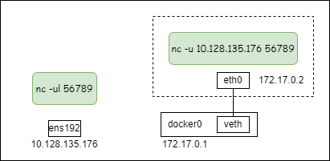
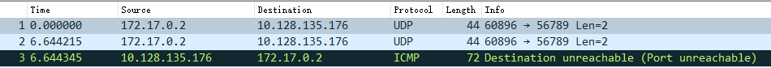
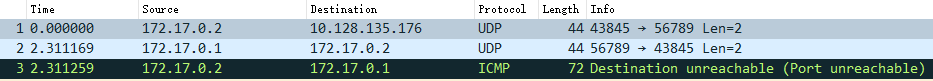

# netcat udp模式无法通讯

## 1. 实验



```bash
# 宿主机（服务端）
$ nc -ul 56789

# 容器（客户端）
$ docker run -it apline sh
/ $ nc -u 10.128.135.176 56789
```

结果：

1. 客户端可以成功发送第一个数据包；
2. 客户端第二个数据包发送失败；
3. 服务端向客户端发送数据包失败；
4. 后续无法通讯；

## 2. 抓包

在 docker0 处的抓包结果：

客户端发送第一个包成功，客户端发送第二个包失败：


客户端发送第一个包成功，服务端发送第一个包失败：


## 3. 分析

这里产生了三个问题：

- 为什么服务端发送第一个包的源IP地址是docker0的IP？
- 为什么服务端回包会端口不可达？
- 为什么客户端第一个包能成功，发第二个包就失败？

### 3.1 为什么服务端发送第一个包的源IP地址是docker0的IP？

使用strace命令看下服务端系统调用，发现nc在收到包后，立即调用了 connect 函数：

```bash
recvfrom(3, "abcd\n", 2048, MSG_PEEK, {sa_family=AF_INET, sin_port=htons(57190), sin_addr=inet_addr("172.17.0.2")}, [128->16]) = 5
connect(3, {sa_family=AF_INET, sin_port=htons(57190), sin_addr=inet_addr("172.17.0.2")}, 16) = 0
```

看下udp协议的connect函数实现：

```c
__ip4_datagram_connect
  | ip_route_connect(...) // 根据"172.17.0.2"查路由
  | inet->inet_saddr = fl4->saddr;	/* Update source address */
  | inet->inet_daddr = fl4->daddr;
  | inet->inet_dport = usin->sin_port;
  | sk->sk_state = TCP_ESTABLISHED;
```

从代码可以看到：查路由，设置sock的源IP地址，设置状态为TCP_ESTABLISHED。

这个变化从netstat命令也可以观察到：

```bash
# 未发包
udp        0      0 0.0.0.0:56789           0.0.0.0:*                           3467509/nc

# 客户端发送第一个包后
udp        0      0 172.17.0.1:56789        172.17.0.2:45609        ESTABLISHED 3467509/nc
```

所以，第一个问题，源IP的修改是由于调用了connect函数，查路由对sock信息进行了更改。

### 3.2 为什么服务端回包会端口不可达？

客户端收到服务端回包后，走udp_rcv处理逻辑：

```c
__udp4_lib_rcv
  | sk = __udp4_lib_lookup
     | udp4_lib_lookup2  /* Lookup connected or non-wildcard socket */
     | udp4_lib_lookup2  /* Lookup wildcard sockets */
  | if (sk) return udp_unicast_rcv_skb(sk, skb, uh);
  | icmp_send(skb, ICMP_DEST_UNREACH, ICMP_PORT_UNREACH, 0);
```

从上面看，找不到sock，才会发送icmp端口不可达消息。

经历了两次查找，第一次根据 daddr 查套接字，第二次根据 INADDR_ANY 查套接字。

回想第一个问题，用strace可以看到客户端也调用了connect函数来修改了sock信息，所以这才是导致收包时匹配不到套接字的原因。

### 3.3 为什么客户端第一个包能成功，发第二个包就失败？

nc 服务端是先recvmsg，才调用connect函数，从第二个包开始就无法匹配到正确的sock了。

### 3.4 nc udp为什么要使用connect函数？

以下是我猜测：

udp是无连接的，netcat udp模式下，客户端和服务端都只接受一个对端。避免在测试中，其他数据包的干扰。
